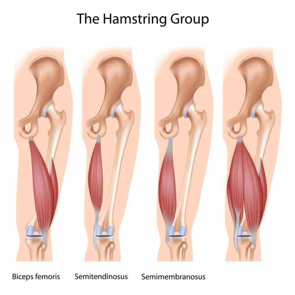
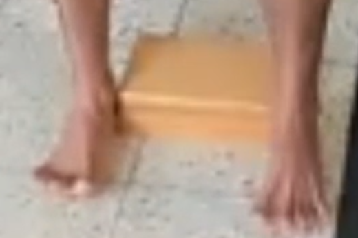
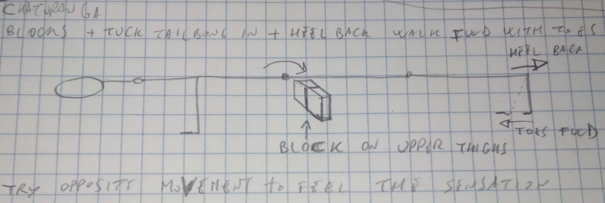
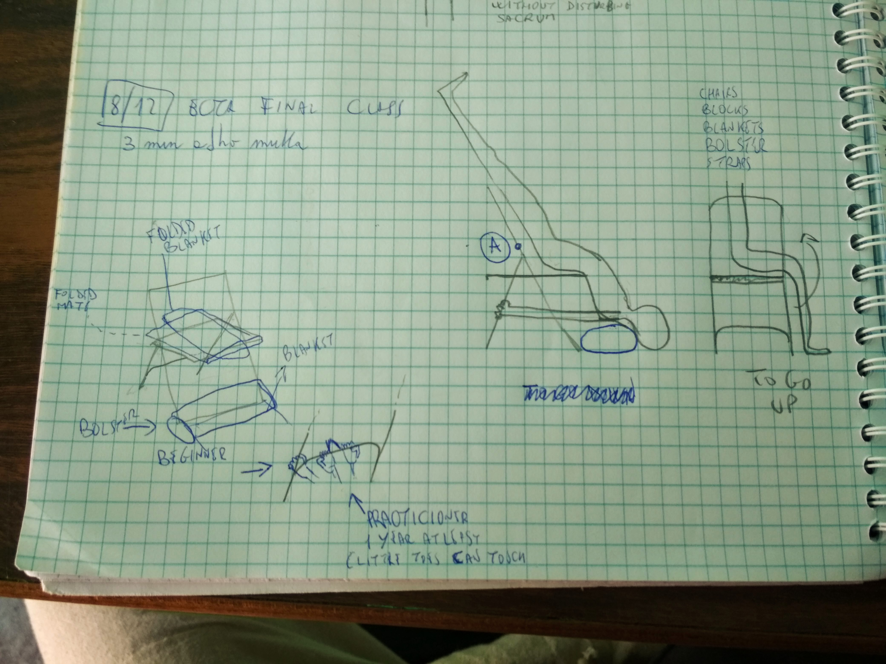
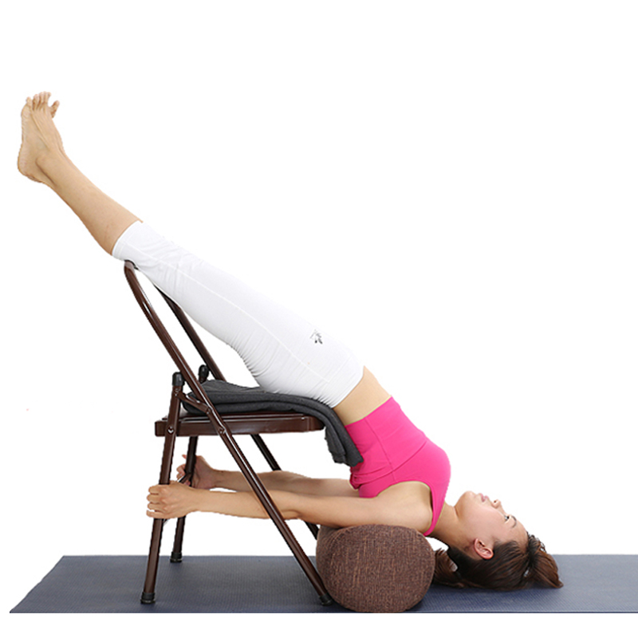

:encoding: UTF-8
:lang: en
:doctype: book
:toc: left
//:imagesdir: images_yoga

= Resources

Books:

* Yoga mat companion series by Ray Long of BandhaYoga:
** https://www.amazon.com/s/ref=nb_sb_noss?url=search-alias%3Dstripbooks&field-keywords=%22Yoga+Mat+Companion%22
** http://www.bandhayoga.com/MC3_inside.html?page=12

"Anatomy for Arm Balances and Inversions: Yoga Mat Companion 4" l'ho comprato su Amazon in formato Kindle -> VEDI RIASSUNTO a fine degli appunti

My Notes (Hugo)

* A LOT of Ecta Sequences: ~/SRC/nicola_yoga_hugo/content/sequences
* ~/SRC/nicola_yoga_hugo/content/asanas

= Yoga intro

== Asana

“The third limb of yoga is asana or posture. Asana brings steadiness, health and lightness of limb. A steady and pleasent posture produces mental equilibrium and prevents fickleness of mind. Asanas are not merely gymnastic exercises; they are postures … By practicing them one develops agility, balance, endurance and great vitality.

Asanas have evolved over the centuries so as to exercise every muscle, nerve and gland in the body. They secure a fine physique, which is strong and elastic without being muscle bound and they keep the body free from disease. They reduce fatigue and soothe the nerves. But their real importance lies in the way they train and discipline the mind… The yogi frees himself from physical disabilities and mental distractions by practicing Asana…. The yogi conquers the body by the practice of asanas and makes it a fit vehicle for the spirit.”

(B.K.S Iyengar, Light On Yoga, 1965, pg 42)

= Mula Bandha

https://www.youtube.com/watch?v=psnEVmQN2tc

= Scientific Keys

== Reciprocal Inhibition

http://www.bandhayoga.com/keys_recip.html

there are a number of physiological feedback loops that balance the flow of energy in the body. One of these is the primitive spinal cord reflex known as reciprocal inhibition.  This reflex causes the antagonist muscle to relax when the synergist contracts.

= Styles Intro

== Hatha Yoga

=== Iyengar Yoga

Iyengar yoga is still Hata

http://bksiyengar.com

Yogacharya BKS Iyengar (Guruji)

== Vinyasa Yoga

= Vocabulary and anatomy

* forearm = avambraccio
* groin = inguine
* tailbone = coccige
* shinbone = tibia (stinco)
* waist = girovita
* diaphragm = diaframma
* Move the flesh of each buttock = carne di ciascun gluteo
* sag = cedere
* Hamstring muscles = 3 muscoli del retro della coscia
* Calf Muscles = muscoli del polpaccio
* Quadriceps
* kneecap = rotula

== Sacroiliac joint

Nice images:
https://www.slideshare.net/venus88/biomechanics-of-si-joint-33235656

== Hamstring

ref: https://en.wikipedia.org/wiki/Hamstring

A hamstring is one of the three posterior thigh muscles in between the hip and the knee (from medial to lateral: semimembranosus, semitendinosus and biceps femoris).
They

They are unique in the body because they *cross two joints*, the hip and the knee. Muscles that cross more than one joint have the privilege of improved leverage and can be very powerful.

NOTE: all major joints of the body - the shoulders, elbows, hips, knees, and ankles - are governed by at least one TJM

== Quadriceps

Muscles that are in the front of your thigh.

== Calf Muscles

https://en.wikipedia.org/wiki/Calf_(leg)

The calf (Latin: sura) is the back portion of the lower leg in human anatomy. The muscles within the calf correspond to the posterior compartment of the leg. The two largest muscles within this compartment are known together as the calf muscle and attach to the heel via the Achilles tendon. Several other, smaller muscles attach to the knee, the ankle, and via long tendons to the toes.

== Two Joint Muscles

https://breakingmuscle.com/fitness/two-jointed-muscles-of-the-lower-body-what-they-are-and-how-to-train

Here are three *lower-body two-jointed muscles*, the joints they function at, and their actions:

* Muscle: Semitendinosus, semimembranosus, and biceps femoris (long head)
** Joints: Hip and knee
**  Action: Hip extension and knee flexion

* Muscle: Rectus femoris (one of the quadriceps)
** Joints: Hip and knee
** Action: Hip flexion and knee extension

* Muscle: Gastrocnemius (calf)
** Joints: Knee and ankle
** Action: Knee flexion and ankle plantar flexion

TODO: finire con le altre parti del corpo https://breakingmuscle.com/fitness/two-jointed-muscles-of-the-lower-body-what-they-are-and-how-to-train

== Groins

https://www.yogajournal.com/practice/locating-the-groin-muscles

*Medically*, the groin is the junction between the abdomen and thigh. When you lift your thigh toward your chest, a crease forms at this junction. Technically, the groin runs along the entire length of the crease, and it's still the groin after the thigh descends and the crease goes away.

When a teacher talks about moving the groin, they often mean to move the very uppermost part of the thigh immediately below the groin. The plural "groins" simply refers to the groin of the left leg and that of the right leg, taken together.

However, when some teachers say "groin," they are referring only to the part of the groin nearest the inner thigh. Other teachers call this area the "inner groin" and its counterpart near the outer end of the hip crease the "outer groin." In this case, they sometime use the plural "groins" to refer to the inner and outer parts of the groin of the same leg, as in, "lift the inner and outer groins equally."

 *B.K.S. Iyengar* definition
 * of *groin* : the whole junction of the thigh and pelvis, around the entire circumference of the thigh.
 * *back groin* the crease below the buttock where it joins the back of the thigh.
 * *inner back groin* and the *outer back groin*. It's enough to make you groan!

But, in fact, when you understand what the teacher is saying, and you learn to make the various parts of the groin move as directed, it can really enhance your asana practice. As you can see, different teachers use the word "groins" differently. It's good teaching practice to define a confusing word like this to the class before using it, so you might consider asking your yoga teacher to do so for your class next time the term is used.

=== The 3 arches of the foot

https://www.ekhartyoga.com/articles/practice/safe-knees-and-feet-in-yoga

=== Groins 30 november Ashish

* 1 Block
* 1 Strap

Make a Loop

= Mantra

== Invocation to Sage Patanjali by Iyengar (Ashish class)

Text: http://bksiyengar.com/modules/IYoga/sage.htm
Audio: http://bksiyengar.com/audio/invocation.mp3

|=======
| Sanskrit																	| English
|	Yogena cittasya padena vacam malam				| Let us bow before the noblest of sages Patanjali, who gave yoga for
| sarirasya ca vaidyakena yopakarottam			| serenity and sanctity of mind, grammar for clarity and purity of
| pravaram muninam patanjalim						  	| speech and medicine for perfection of health. Let us prostrate before
| pranajaliranato'smi abahu purusakaram		  | Patanjali, an incarnation of Adisesa, whose upper body has a human
| sankha cakrasi dharinamsahasra sirasam    | form, whose arms hold a conch and a disc, and who is crowned by a
| svetam pranamami patanjalim.							| thousand-headed cobra.
|=======

Sage Patanjali has penned the ancient Indian heritage of Yoga through his treatise the Yoga Sutras of Patanjali, which is an encompassing study of the subject which consists of just 196 sutras (aphorisms).
In the present century, Yogacharya B.K.S. Iyengar has made it possible for ordinary human beings to experience the wisdom of these sutras in the midst of living a life.

Click here to know about Sage Patanjali Temple at Bellur.

= Poses naming tricks

Adho = downward

== Salamba

Salamba is a Sanskrit word meaning “to support.” Its opposite is niralamba, which means “unsupported” or “without support.”

Salamba describes a pose in which the yogi uses the hands, arms or other type of support for balance or to otherwise aid in exercise of the posture.

NOTE: Salamba yoga poses should be mastered before the yogi attempts the more challenging niralamba versions. Some common salamba poses include:

* Salamba kapotasana (supported pigeon) - a half split with the hands placed on the ground for support
* Salamba sarvangasana (supported shoulder stand) - the upper arms rest on the ground and the hands rest on the lower back
* Salamba bhujangasana (supported cobra, or sphinx) - the forearms provide support for the backbend
* Salamba sirsasana (supported headstand) - the forearms and interlocked hands form a sort of basket to support the head and provide balance
* Salamba balasana (supported child's pose) - the torso and head rest on a prop, typically a rolled-up blanket or several blankets

= Poses
include::yoga_poses/ardha_matsyendrasana.adoc[]

include::yoga_poses/ardha_matsyendrasana.adoc[]

include::yoga_poses/adho_mukha_svanasana.adoc[]

include::yoga_poses/adho_mukha_vrksasana.adoc[]

include::yoga_poses/adho_mukha_virasana.adoc[]

include::yoga_poses/dandasana.adoc[]

include::yoga_poses/dhanurasana.adoc[]

include::yoga_poses/janu_sirsasana.adoc[]

include::yoga_poses/muktasana.adoc[]

include::yoga_poses/paschimottanasana.adoc[]

include::yoga_poses/salamba_shirshasana.adoc[]

include::yoga_poses/savasana_or_mrtasana.adoc[]

include::yoga_poses/shirshasana.adoc[]

include::yoga_poses/swastikasana.adoc[]

include::yoga_poses/tadasana.adoc[]

include::yoga_poses/trikonasana.adoc[]

include::yoga_poses/urdhva_dhanurasana.adoc[]

include::yoga_poses/urdhva_mukha_svanasana.adoc[]

include::yoga_poses/uttanasana.adoc[]

include::yoga_poses/virasana.adoc[]

TODO:

* Viparita Karani or Legs-Up-The-Wall Pose https://www.yogajournal.com/poses/legs-up-the-wall-pose

== Trikonasana

Trikon means triangolo

== Sukhasana - Easy pose
https://yoga.com/pose/easy-pose

== Pavanamuktasana

https://yoga.com/pose/knee-press-both-legs
Note: usare i polsi per tenere unite le ginocchia
Pavanamuktasana left/right  https://yoga.com/pose/left-leg-wind-freeing-pose
Note: tenere allineato il ginocchio a centro (si tende ad andare a dx o sx)
In tutte le versioni quando si afferra il ginocchio inspirare e toccare la gamba con la pancia gonfia, quando si espira portare al petto le gambe

== Salamba Prasarita Padasana
 https://yoga.com/pose/upward-extended-feet-pose-with-support
Upward extended feet pose with support

== Purvottanasana - Upward plank pose

https://yoga.com/pose/upward-plank-pose

== Dhanurasana - Bow pose
https://yoga.com/pose/bow-pose

== Purvottanasana
 https://yoga.com/pose/upward-plank-pose

== Gomukhasana
 https://yoga.com/pose/cow-face-pose-left-leg-and-right-arm-up
Cow face pose, left leg and right arm up

== Shashankasana

https://yoga.com/pose/hare-pose

== Hare pose
Ardha Matsyendrasana right
Sitting right twist
https://yoga.com/pose/sitting-right-twist

== Mayurasana
https://www.youtube.com/watch?v=qZszBHRSaKo
https://www.youtube.com/watch?v=8Gfjj8FMORo

== Posizione Distesa su un fianco (Parsva Uttanasana)
http://www.yogajournal.it/posizione-distesa-su-un-fianco-parsva-uttanasana/

== Supta virasana
Eroe coricato http://www.yogajournal.it/leroe-silente/

== Anantasana
http://www.yogaweb.it/asana/anantasana/

== Salambhasana - Locust pose
https://yoga.com/pose/locust-pose

= Sequences

== YEHUDA

=== 2021-03-02 tuesday 

- 8 min padmasana or svastikasana
- 2 min adho mukha padmasana or svastikasana. Each vertebra into the body and for that you have to understand the abdomen (front body) and the spine (back body). 
- 1 min per side, padmasana or svastikasan arms up, inhale, exhale and turn right; (elbows back, look forward, don't lift the knees, lift the chest upwards ) inhale and come to the center. Same to the left
- 1 min adho mukha padmasana or svastikasana. At the end press the buttock and with straight arms come up.
- (at min 5) brick setubanda with straight legs. Keep the heel open (outer ankle inline with the hips), or, only if it's easy for you, feet together. 

Utthita Parsvakonasana

=== 2021-01-06 - Intro to Virabhadrasana 3

* 5 min - sit in svastikasana
* 1 min Virasana 
* 1 min adho mukha svanasana 
* 1 min Uttanasana ()
* 1 min adho mukha svanasana 
* 1 min tadasana
* 1 min urdhva hastasana
* 30 sec utkatasana

(Preparation VB 3)
* 1 min Virabhadrasana 2 left leg. 
* 1 min from VB2 put you abdoment on the right tight, elbow straight, chest forward keep the head in line with arms (look at the floor neck long) (both sides)
* 30s  Namaste 
* 3 min Pashi namaskar (occasione per farlo vedere bene)
* REPEAT 1 min from VB2 put you abdoment on the right tight, elbow straight, chest forward keep the head in line with arms (look at the floor neck long) (both sides)
* 30s  Namaste 
* 3 min Pashi namaskar 
* 1 min (at min 35:00) from VB2 put you abdoment on the right tight, chest forward, look forward and from your hands go to VB3. Keep the left and the right leg straight, elbow straigh, chest forward. At the end go back to VB2 (+10 s)and then tadasana (+10 s). (BOTH sides)
*  REPEAT the above
NOTE: at min 44:20 Yehuda fa vedere VB3
*  REPEAT the above for the 3rd time

* 1min Dhanurasana 
* 10min (at min 50:00) various tentative to do Urdhva Dhanurasana (if intermidiate do 2/3 time 30 sec each)
* Urdhva Dhanurasana with 2 bricks at min 55:00. 1 brick between you heel and one between your knees.

* svastikasana hands up, inhale exale and turn right, hook the left hand. For each exhalation turn more (1 min per side)
* adho mukha svastikasansa (1 min)
* svastikasana and turn (1 min per side)
* adho mukha svastikasansa. Come up with your from your arms/hands ( 1min)

NOTE: at min 8 fa vedere bene come aprire la *pianta dei piedi* in tadasana, anche al min 24:00
NOTE: at min 20:30 fa vedere bene *Pashi namarkar*

=== 2020-12-28 - Intro to Virasana

TODO Mettere il link al video di yehuda 

* Virasana (3 min):
  * 1 Kneel on the floor (use a folded blanket or bolster to wedge between your calves and thighs if necessary), with your thighs perpendicular to the floor, and touch your inner knees together. Slide your feet apart, slightly wider than your hips, with the tops of the feet flat on the floor. Angle your big toes slightly in toward each other and press the top of each foot evenly on the floor.  See that you are sitting on both the buttock evenly.
  * 2 Exhale and sit back halfway, with your torso leaning slightly forward. Wedge your thumbs into the backs of your knees and draw the skin and flesh of the calf muscles toward the heels. Then sit down between your feet.
  * 3 If your buttocks don’t comfortably rest on the floor, raise them on a block or thick book placed between the feet. Make sure both sitting bones are evenly supported. Allow a thumb’s-width space between the inner heels and the outer hips. Turn your thighs inward and press the heads of the thigh bones into the floor with the bases of your palms. Then lay your hands in your lap, one on the other, palms up, or on your thighs, palms down.
  * 4 Firm your shoulder blades against the back ribs and lift the top of your sternum like a proud warrior. Widen the collarbones and release the shoulder blades away from the ears. Lengthen the tailbone into the floor to anchor the back torso.
  * 5 At first stay in this pose from 30 seconds to 1 minute. Gradually extend your stay up to 5 minutes. To come out, press your hands against the floor and lift your buttocks up, slightly higher than the heels. Cross your ankles underneath your buttocks, sit back over the feet and onto the floor, then stretch your legs out in front of you. It may feel good to bounce your knees up and down a few times on the floor.
  * NOTA: nel video di Yehuda spiega al min 13:00

* svastikasana (5 min)
* adho mukha svastikasana (2 min). Turn your feet from you ankel, your metatarso sul be on the floor. At the end go on the buttock, with an inhalation come up from the arms.
* adho mukha svastikasana (1 min). Change the cross of the legs. At the end go on the buttock, with an inhalation come up from the arms. 
* Virasana (at min 12:50)  

Gomukhasana

Virasana - Hero Pose:  https://www.yogajournal.com/poses/hero-pose/

=== 2020-12-10

https://drive.google.com/file/d/1DHlgRvHY5DiHI9la5RxY_d3yaJR2CMWo/view?usp=sharing

* at min 11:40 - (1min pose) padangusthasana hold the external part of the ankles from the back with 5 fingers; inhale sternum up and concave the back.
* tadasana 1min
* urdha baddhanguliyasana  1min
*  Ardha Chandrasana
* Trikonasana
* IMPORTANT SHOULDER NOTE: at min 19:40 -> movement and also resistance
* at min 33:00 Virabhadrasana I right
* tadasan
* Pashima Namaskar 
* Virabhadrasana I left
* adho mukha svanasana (good pose to reallingn after )
* at min 43 chaturanga dandasana IMPORTANT SHOULDER NOTE. If shoulder doesn't come use bricks under the hands.
* at min 50 dhanurasana. (30 sec) 3 times. IMPORTANT SHOULDER NOTE: Feel if you can breath from the chest or the abdomen... it's better to breath from the chest becuse the abdomen is compressed. 
* at min 01:02:00 urdhva dhanurasana (60 sec) 3 times 
* svastikasana hands up, inhale exale and turn right, hook the left hand. For each exhalation turn more (1 min per side)
* adho mukha svastikasansa (1 min)
* svastikasana and turn (1 min per side)
* adho mukha svastikasansa. Come up with your from your arms/hands ( 1min)
* sarvangasana
* NOTE: SARVANGASANA with the CHAIR at min 01:14:36

Viraba

=== 2020-12-08

In meditation, it's not important just to sit. Meditation is not separate from life, from living, we have to be very humble, without direction, without motive, humble, not wanting, not seeking, not demanding. To be very humble, with no motive. Be so humble, without the past, so you can see something new. If we are seeking, demanding, it means that we already know what we are going to find and there is a motive to find that. 
The beginning of meditation is to make order, which means not wanting, not seeking, not demanding, trying to fulfill, trying to escape. Be so humble, so empty, so that we can discover something that is new. You discover something that is new if you don't have the motive to discover something new. Motive is effort... can we live in this world without motive, without effort, so that we can live free, simple, honest.

=== 2020-09-06 Begginer Leg Class - baddhanguliyasana - Ardha Chandrasana 

Recording: https://drive.google.com/file/d/12njHl6OEmYLgxmRyUgku1oSs3OAT2QPu/view?usp=sharing

NOTES:
- this is a beginner lesson

* 8 min - sit in svastikasana
* (at min 10:45) 1 min  baddhanguliyasana: change the cross of the legs. Make a fingerlock, straighten your arms, inhale and go to baddhanguliyasana in svastikasana. Elbows are straight, behind the ears. And lift up the baddhanguliyasana, extend the side of the trunk. Don't lean back or forward. Look Stright forward.
* + 1 min(change the fingerlock)
* + 1 min(change the fingerlock, change the cross of the legs) Focus on the inner arm. Straighten your arms, your elbow, that's the first thing, then lift up your wrist, your inner arm. 
* urdhva namaskar 1 min https://www.tummee.com/yoga-poses/urdhva-namaskarasana
* adho mukha virasana (3 min). Take your calf muscles away from the knees, open the palms, straighten your elbows, your arms, roll the shoulder away from the neck, and the elbow away from the floor. Extend the size of the trunk. The buttok should press the heels down. Expecially the abdominal region should walk forward, if it's not coming look forward(min 14:10), you should feel that is very extended. Even here the elbow, the inner arms should be long. This is yoga, everything should be open, feel one with the space. Extend walk forward, maximum. Take the spine into the body, why do I see so many cammel back?
* (1min) tak your toes and go up to adho muka svanasana
* ( 15 sec per leg ) eka pada adho mukha svanasana: legs together 
* (2 min) walk forward to uttanasana 
* ( 30 sec per leg ) eka pada adho mukha svanasana: legs together, don't tilt the trunk.
* (1 min) adho mukha virasana 
* ( 30 sec per leg ) eka pada adho mukha svanasana: legs together, don't tilt the trunk. Left leg up, right hip back.
* (30 sec) adho muka svanasana
* (90 sec) Uttanasana, at the end put your hands on the hips and stand in tadasana
* (90 sec) tadasana
* (60 sec) Urdhva Hastasana
* (60 sec) tadasana
* (60 sec) Urdhva Hastasana
* (30 sec) Urdhva namaskar. Extend the inner arm up. At the end open the arms to Urdhva Hastasana and come back to tadasana
* (60 sec) tadasana
* (60 sec per side) trikonasana, take the brick to your right, left leg back, right buttack forward, 
* Ardha Chandrasana (at 33:00) (2 min each side): trikonasana right -> walk half way -> left leg up -> right leg stright -> trikonasana 
https://www.yogajournal.com/poses/half-moon-pose
  * 3-4 min to explain
* uttanasana
* (2 min each side) parivritta Ardha Chandrasana 
* (2 min ) Shirsasana 
* chatushpadasana at 1:19:30
* alasana/sarvangasana - brick setubanda

NOTES:
* at 48:34 Ardha Chandrasana yehuda correcting me in ardha chandrasana  and warking wiht the wall

== Ecta

=== 2018-12-15 shirshasana

HUGO DONE

3 mins of Adho Mukha Svanansana:

* Knees straight
* Focus on the inner groin
* At the

5 mins of Quick Sequence cicling between:
* tadasana,
* Urdhva astasana,
* Uttanansana,
* adho mukha svanasana,
* udrhva mukha svanasana,
* chaturanga dandasana,
* adho mukha svanasana,
* Uttanansana,
* Urdhva astasana,
* tadasana

First 2 minutes keep 5 seconds each pose, then for 1min 3 seconds, then 1min 1 second. Then change the pattern and see how many get lost, ask them to focus on what you say. Another quick minute

18:55

Shirshasana with one blanket on next to the wall

* NOTE: ci possono volere 15-20 minuti per fare tutto bene
* NOTE: 5 min to explain, 2-3 min to organise.
* NOTE: for 3 days before we practiced half shirshasana. Yeasterday we tried to lift your bottom leg 5-10 inch up. Today we will go up with both legs.
* fold your blanket and fold the mate over it, bring it close to the wall
* interlock the finger, touch them on the wall, crane of the head in between your hands
* keep pressing you elbow, bend your knee and walk toward the wall. Straight your knees.
* Lift up your right leg. Lift it higher and higher. Try to touch the wall with your right heel. Your bottom leg will lift, keep it down and straight; for every inch you lift the right leg, your left leg will rise one inch. Then come down. Make 5 times per leg, stay 5-10 seconds up each time.
* NOTE: if not both knee straigh, your shirshasana is a fake shirshasana
* NOTE: if you learn here your shirshasana it will become very easy to make it without the wall. Don't try from the beginning to go up with both legs at the same time or from the center of your mate.

* head down rest for 1 min
* change the interlock, walk, right up, left up. Left leg go down and when you touch the floor or your maximum extension go up again (it a quick conscious movement 1-2 secondos). 5 time the left leg, 5 time the right.
* Both legs up, push you formarm, raise your head. Down and up 2 times.
* head down rest for 1 min

Nicola's note: for me is very hard to bring the pelvis in line over the head, for other is easier. When I straight the leg it's not perpendicular to the floor and make really hard to go up. What to do ?!?

NOTE: menstruation girl cannot do it. Sit in subtha batakonasana.

NOTE: you can slowly move a little bit away from the wall

NOTE: no chaturanga dandasana for menstruation, only adho mukha

Shishasana to the wall, pull your head up

* 2 min to explain
* keep the blanket from prev asana
* interlock finger strongly, we are going to get strenght for your elbow, your arms. Go up with both legs, heel on the wall, feet 90°.
* Lift your self up pushing on the elbow and for arms

=== Luisa

Rolled Blancket in between your legs (similar to Ashish with)

=== 2018-12-11 virabhadrasana 1 and chaturanga connection

HUGO

Adho mucka svanasana errors:

* armpit falling down:
** When this happen the spine is a reverse arc; the energy is going down; your back is pushing your armpit down;
** usually you don't roll in your armpit
** you need to rise your body from your armpit, not from your back
** See tadasana tips to learn how to feel your armpit

* back ribs (Nicola problem) too high
**

virabhadranasa 1 for beginner:

* keep the back feet alligned with the front one ()

virabhadrasana 1 and chaturanga connection

cycle between virabhadrasana and half moon pose and feel

half moon pose:

*
* Go

Personal practice today experiments:

* back feet in virabhadrasana

Halasana

2 blankets folded once for the shoulder
1 bolster for the elbow

=== 2018-12-10 Trikonasana intro and chaturanga

HUGO

* Adho mukha vrksasana with a block under your head
** push your buttock toward your heels, if you cannot use a bolster
** press your palm down and you forearm
* Adho mukha svanasana

=== 2018-12-08 Full power up and resting class

HUGO

* 3 min adho mukha svanasana

* 2 min uttanasana
** Feet on the edge, catch your ankles

* straigh to handstand, full power, stay as much as you can
* than rest 3-4 min in batakonasana
* repeat handstand with the other leg

* Chair....  (??? name of the pose ??? )
** 1 bolster
** 2 blanket
** 1 chair
** mate
** Stay 10 minute: start with straight legs, when you are tired then change svastikasana, baddha konasana. Stay on each pose and feel how is it, don't change after few seconds.
** go down putting the hand on point A and slide down
** tune the position of the bolster put it under your buttock
** keep the calf muscles on the chair; stay 5 minutes.

Rest on the chest vs rest on the head

=== 2018-12-07 Working on the shoulders and handstand
HUGO

Before hand stand

L-Shape:

* https://www.yogiapproved.com/wp-content/uploads/2017/04/L-Shape-Handstand.jpg
* To take the proper distance of the palm from the wall, do the L shape with the back on the wall and put the heel of your head where the heel of your feet are.

buttok

Hand stand

=== 2018-12-06 Working on the shoulders and legs
HUGO

00:00 - 0:05: Start with one block and chanting

00:05 - 0:15: Cycle between:

* Adho mukha svanasana with blocks under the hands
* Navasana - Boat Pose
* Uttanasana

TIPS: change a litte bit the order of the sequence

Show how some are doing wrong:
* back ribs that go out
* sacrum that don't go in

NOTE: when you cannot manage the pose make a step back. Use the wall, the

00:15 - 0:20 Cycle between Navasana and posizione del contadino che si riposa

* Fist cycles Don't say anything to beginners
* Then try to bring the sacrum-in
* Then try to open the chest

00:20 - 0:25 Jump from Adho mukha svanasana with blocks under the hands to Uttanasana and viceversa. Do some cycle:
* Beginner: bended knees
* Practitioner: straight legs

00:25 - 0:35:
Jump from Adho mukha svanasana with blocks under the hands to Navasana and viceversa.

Purvottanasana - Upward Plank Pose https://www.yogajournal.com/poses/upward-plank-pose
Variations

Cycle: Urdhva Mukha Svanasana - Upward Facing Dog

Cycle:

* Alasana -

=== 2018-12-05 Working on the shoulders

HUGO

Plank pose with the wall

* https://www.yogiapproved.com/wp-content/uploads/2017/04/Wall-Plank.jpg

See notes on paper

== Ashish

Camel pose
https://www.yogajournal.com/poses/camel-pose
ustra = camel
Ustrasana

=== 2018-11-30

HUGO

Uttanasana with block and strap (5 min):

* stand
* 1 Strap on the outer part of your calf muscles
* 1 block in between your thighs, long side perpendicular to the floor, medium side touch on the thights and completely touch on the perineum.
* stretch your toes forward, pressurise your heels.
* Pull the block with your inner upper thighs, turn the front thighs. So you can touch the in the front inner thighs on the block. Don't pull the block from the back of your thigh.
* Separate your back legs
* work on the back of your legs
* stretch your knees, don't bend them
* Don't push your abdomen forward but toward your (it happens when you pull the block from the back of your thigh.)
* Q: è quindi vero che devo controllare l'addome dalle thigh????
* frontal pelvis go back but not up.
* from the front you need to roll in
* you need to spread and lift the pubes (Mi sembra un po' in contrasto con quello che dice Sara... )

SARA suggerisce: lavora tanto sulle gambe; dice che ho la tailbone tanto indietro per via della mia postura. dovrei sollegare le upper thigh, almeno visualizzarlo.... Esistono Upper, central and bottom frontal thigh

Nicola: ho osservato che premere il little toes ha un effetto prima sull'interno del calf muscles e poi sugli sugli inner groins.

From Uttanasana with block and strap to

== Sequenza iniziale Lorena

Si può fare in due varianti, da seduti o da in piedi

. Rotazione delle spalle in avanti
. Rotazione delle spalle indietro
. Braccia distese lungo i fianchi, sollevarle facendo un semicerchio laterale e inspirando, allungare verso l’alto e con uno scatto espirare e incrociarle al petto.
https://photos.google.com/photo/AF1QipOF2SaBRCt7a8eNBi6NtqnT8ooFU974B4oEpMcf   minuto 1:00
. Braccia distese lungo i fianchi, sollevare solo la DX facendo un semicerchio laterale inspirando, prendere la guancia SX, tirare leggermente a lato espirando.
https://photos.google.com/photo/AF1QipOF2SaBRCt7a8eNBi6NtqnT8ooFU974B4oEpMcf    minuto 3:00
. Braccia distese e sollevate all’altezza delle spalle; rotazioni con 2 espiri e 2 inspiri veloci
https://photos.google.com/photo/AF1QipM8wCLUMg6557_QJG_3uYxlurnkpN6v220UtT8e minuto 5:00
Se a terra mi allungo in avanti con le braccia
. Braccia distese e sollevate 30 gradi più su delle spalle; rotazioni con 2 espiri e 2 inspiri veloci
Se a terra mi allungo in avanti con le braccia
. Clap clap con le mani continuo.  Mentre lo faccio le braccia sono distese lungo i fianchi, le sollevo fino all’altezza delle spalle, le porto in avanti, le porto in alto sopra le spalle.Rilasso le mani.
https://photos.google.com/photo/AF1QipM8wCLUMg6557_QJG_3uYxlurnkpN6v220UtT8e  minuto 7:40
. Pugnetti sulle spalle e sulle braccia
https://photos.google.com/photo/AF1QipM8wCLUMg6557_QJG_3uYxlurnkpN6v220UtT8e  minuto 8:43
. Massaggio testa, fossette dietro la nuca
https://photos.google.com/photo/AF1QipM8wCLUMg6557_QJG_3uYxlurnkpN6v220UtT8e  minuto 10:00
. Gambe incrociate, mano DX sul ginocchio SX, mano SX dientro il gluteo SX; inspiro allungo la schiena e ruoto il dorso a SX; espiro e rilasso la testa in avanti. Dall’altra parte.
https://photos.google.com/photo/AF1QipM8wCLUMg6557_QJG_3uYxlurnkpN6v220UtT8e minuto 11:44
TODO
NOTA: Respiro solo dal naso.
https://photos.google.com/photo/AF1QipM8wCLUMg6557_QJG_3uYxlurnkpN6v220UtT8e  minuto 14:00

== Sequenza 2 Farm

. <<Janu Sirsasana left - Bend to left leg, Janu Sirsasana left - Bend to left leg>>
. <<Janu Sirsasana left - Bend to right leg>>
. <<Paschimottanasana - Seated forward bend>>
. <<Purvottanasana - Upward plank pose>>

Ardha Matsyendrasana right - Sitting right twist

Salambhasana - Locust pose Right
Salambhasana - Locust pose Left
Salambhasana - Locust pose

== Sequenza 25 giugno con Sara

Posizioni in piedi:

* Swastikasana seduti sul blocco con le tibie (shin bones) incrociate

= BOOK Yoga Mat Companion

== Book - Anatomy for Arm Balances and Inversions: Yoga Mat Companion 4 

=== Intro

In our bipedal form, the hips and lower extremities are the weight-bearing construct. The more mobile shoulders and upper extremities allow us to interact with the world.

In arm balances:

* we invert this construct, thereby strengthening the muscles, bones, and ligaments of the upper extremities.
* From an energetic perspective, arm balances stimulate the nerve plexuses associated with the fourth and fifth chakras.

From an energetic perspective:

* arm balances stimulate the nerve plexuses associated with the fourth and fifth chakras.
* Practicing these poses with precision moves nerve impulses upwards through the subtle body.

=== Every

Let’s deconstruct the story of Downward Facing Dog: contracting the psoas and its synergists flexes the hips and trunk.

Long MD FRCSC, Ray. Anatomy for Arm Balances and Inversions: Yoga Mat Companion 4 . BookBaby. Kindle Edition. 
