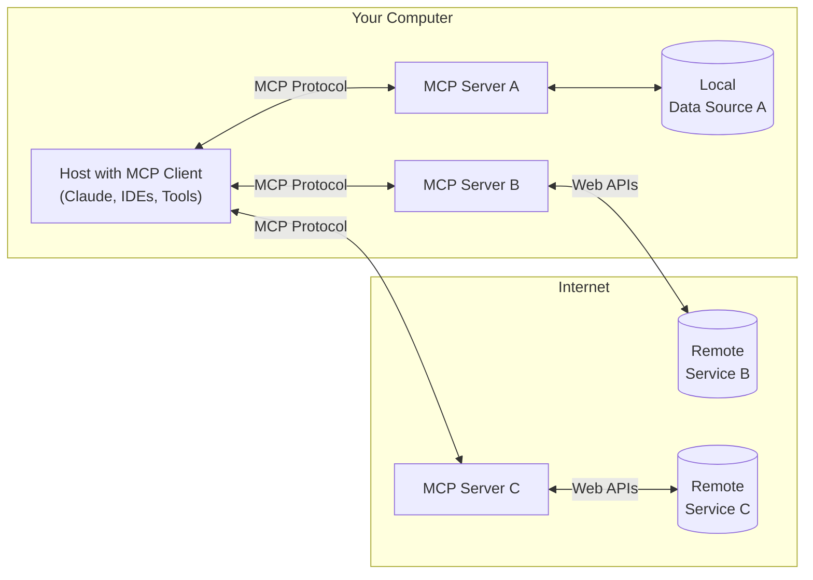
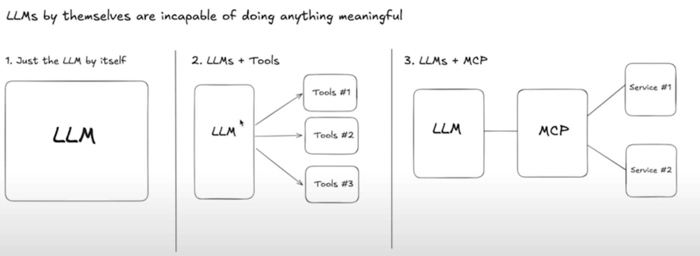

### 🧭 Learning Plan: Model Context Protocol (MCP)

- Nicolas's learning plan on ChatGPT:  
https://chatgpt.com/g/g-p-68694a5bd58c8191bfae0424ef19e1ee-learning/c/68694ba3-e3d0-8004-ae23-112ad01b0d0a

- [📚 MCP Specification Reference](https://github.com/modelcontextprotocol)

- [📚 MCP Specification Reference](https://modelcontextprotocol.io/introduction)

#### ✅ Phase 1: Foundation – Understand MCP

- What MCP is and the problem it solves
- Key components: client, server, context, models
- JSON-RPC structure and how the protocol is used in practice
- Comparison with other context-handling methods

#### ✅ Phase 2: Usage – Using MCP Clients

- How **Cursor** uses MCP (structure, capabilities, config)
- How **Claude Desktop** uses MCP (if documented/available)
- Tools, extensions, and plugins that work with MCP

#### ✅ Phase 3: Implementation – Build an MCP Server

- The MCP server spec (API shape, messages, context sync)
- Open source implementations (e.g. [llm-middleware](https://github.com/moyix/llm-middleware))
- Create a minimal MCP server in Python/Node

#### ✅ Phase 4: Practical – Integrate and Use

- Make Cursor or Claude Desktop connect to your custom MCP server
- Debugging and inspecting messages
- Build your own agents/plugins powered by MCP

### Intro video 2025-03 by Greg Isenberg

[Model Context Protocol (MCP), clearly explained (why it matters)](https://www.youtube.com/watch?v=7j_NE6Pjv-E)

| **Topic** | **Covered?** | **Notes** | **Timestamp** |
| --- | --- | --- | --- |
| What MCP is | ✅ | Standard protocol for LLM–tool integration | [7:41](https://youtu.be/VIDEO_ID?t=461) |
| Why MCP matters | ✅ | Solves tool integration; makes LLMs more useful | [6:01](https://youtu.be/VIDEO_ID?t=361) |
| MCP architecture | ✅ | Explains client, server, protocol, service | [10:59](https://youtu.be/VIDEO_ID?t=659) |
| Cursor/Claude usage | ❌ | No setup or integration examples shown | – |
| JSON-RPC structure | ❌ | No message format details | – |
| MCP server implementation | ❌ | No code or setup guide | – |
| Startup/dev ideas | ✅ | Mentions "MCP App Store" & ecosystem plays | [15:48](https://youtu.be/VIDEO_ID?t=948) |
| Technical challenges | ✅ | Notes local setup issues, early stage | [13:48](https://youtu.be/VIDEO_ID?t=828) |

### Update video 2025-07-05 by Anthropic

I suggest to watch this video published in June 2025 by Anthropic: [https://www.youtube.com/watch?v=CQywdSdi5iA](https://www.youtube.com/watch?v=CQywdSdi5iA).  
The content provides a clear and practical overview of the **Model Context Protocol (MCP)**, including its origins, core components, and how it’s used in tools like Claude Desktop. It features key members of the Anthropic team discussing both foundational concepts and advanced use cases.

Here’s a breakdown of what the video covers:

| Timestamp | Topic | Relevance |
| --- | --- | --- |
| `0:28–2:20` | What is MCP? Tools, resources, and prompts | Explains the protocol’s building blocks and structure |
| `2:20–3:12` | How it differs from APIs | Clarifies why MCP is more than just an API integration |
| `3:14–6:20` | Origin story (Claude Desktop + IDE workflows) | Gives real-world motivation behind MCP |
| `6:24–9:20` | Launch, open source, and adoption curve | Context for understanding ecosystem growth and maturity |
| `9:56–11:12` | Remote MCP and cloud-hosted servers | Relevant for using MCP with Claude or web-based clients |
| `13:23–14:55` | Developer tips: getting started with MCP | Practical advice for building your first MCP server |
| `14:58–16:21` | Examples: music gear, Blender, door control, etc. | Inspiring demos showing MCP’s creative potential |
| `16:24–18:17` | Claude 4 and future of agents and long-running tasks | Sets the stage for next-gen agent use cases with MCP |
| `18:18–19:30` | What’s next: registry API, elicitation, cloud servers | Insight into the roadmap and evolution of the protocol |

This video is **highly recommended** if you want to:

*   Understand the motivation and design of MCP
*   Use it in tools like **Cursor** or **Claude Desktop**
*   Build and connect your own **MCP servers**
*   Follow the emerging **industry standards** for LLM integrations

### 💡 Why Was MCP Created?

Before MCP, clients typically:

*   Embedded context logic directly (hard to maintain)
*   Had limited or brittle plugin mechanisms
*   Were not interoperable

MCP standardizes this through a JSON-RPC 2.0 interface, so clients and context providers can evolve separately.

It Separates LLM clients from context logic, standardizes communication, and allows for interoperability. It Lets clients like Cursor fetch relevant code/files for prompt injection.

### ? What is the MCP Protocol?

Is an Open protocol for context-aware LLM interactions, it uses a JSON-RPC 2.0 interface that describes how to ask for and return context.

### 🔧 Key Concepts

| Term | Description |
| --- | --- |
| **Models** | The AI models that use MCP (e.g., Claude, GPT-4) |
| **MCP Hosts** | A tool like Cursor that queries a context server |
| **MCP Clients** | Protocol clients that maintain 1:1 connections with servers |
| **MCP Servers** | Lightweight programs that each expose specific capabilities through the standardized Model Context Protocol and provides model context (e.g., relevant files, code snippets) via MCP |
| **Context Provider** | The logic that determines what to return given a user action |
| **MCP Protocol** | A JSON-RPC interface that describes how to ask for and return context |
| **Query** | A request for context, based on things like the user’s file, cursor location, intent |
| **Context Items** | Pieces of information to inject into the LLM prompt (e.g., code, metadata) |
| **Local Data Sources** | Your computer's files, databases, and services that MCP servers can securely access |
| **Remote Services** | External systems available over the internet (e.g., through APIs) that MCP servers can connect to |



### 📈 LLM Evolution: from Tools to MCP



Stage 1: LLMs Alone (2022)

*   LLMs can only predict text.
*   Example: Ask for a poem or a summary.
*   They can't take actions (e.g. send email).

Stage 2: LLMs + Tools (2023)

*   Developers attach tools to LLMs (e.g. APIs, search).
*   Adds capability (e.g. read inbox, update spreadsheets).
*   Problem: Every tool has its own API. Glue logic is fragile.

Stage 3: LLMs + Tools + MCP and Services (2024-2025)

*   MCP defines a standard way to access tools via a protocol.
*   The LLM client uses one interface to access many services.
*   Tools are wrapped in MCP servers that speak the protocol.
*   This enables modular, scalable assistants.

ref: [https://www.youtube.com/watch?v=7j_NE6Pjv-E&t=51s](https://www.youtube.com/watch?v=7j_NE6Pjv-E&t=51s)

**MCP shifts responsibility** from integrators to service providers — much like **REST did for APIs**.

#### 🧠 **Manus as the Stage 2 Ideal**

📍 [Watch at 14:48](https://www.youtube.com/watch?v=7j_NE6Pjv-E&t=888s)

**Manus** is highlighted in the video as a **well-engineered example** of the  
**LLM + tools** architecture (Stage 2). The speaker praises Manus for:

*   Orchestrating multiple external tools seamlessly
*   Handling complex edge cases and tool failures
*   Creating a reliable user experience despite the fragmented backend
*   Building an assistant that _feels cohesive_, even though it's powered by many APIs behind the scenes

> 🧠 _"Manus has tons of tools and they’ve engineered it well in a way where_  
> _they work well cohesively."_

**But…** this came at a steep cost:

*   Custom logic for each tool
*   Constant maintenance when APIs change
*   High engineering complexity
*   Difficult to scale or extend quickly

---

#### ⚙️ **How MCP Changes the Game**

📍 [Watch from 10:59](https://www.youtube.com/watch?v=7j_NE6Pjv-E&t=659s)

> “MCP is like REST for LLM tools.”

#### 🧱 Pre-MCP:

*   Each assistant/tool combo was a **custom integration**
*   Example: Manus had to manually stitch APIs into the LLM context logic
*   Developers/integrators had to carry the full load

#### 🧩 With MCP:

*   Tool makers (not assistant builders) must now expose their capabilities through a standardized **MCP server**
*   MCP clients (like Cursor or Claude) only need to speak the **MCP protocol**
*   The assistant doesn't need to know _how_ the tool works — just _what it can do_

🎯 **The key shift:**

> **MCP pushes the tool integration effort onto the service provider**, just like  
> how **REST turned every tool into a standardized API** other developers could  
> consume easily.


---

#### 🔄 REST vs MCP Analogy

| **Before REST** | **Before MCP** |
| --- | --- |
| Every service had a custom interface | Every tool had a custom integration |
| Integrators had to learn each API | LLM builders had to custom-plumb tools |
| No shared language for APIs | No shared language for context/tools |
| REST standardized API design | MCP standardizes LLM–tool interaction |

🚀 Summary:

*   **Manus** built a best-in-class Stage 2 assistant by doing all the hard work.
*   **MCP** now offers a way to do the same thing faster, cleaner, and at scale.

With MCP:

*   Developers build once, not per-client
*   Clients can mix and match tools modularly
*   Ecosystem collaboration becomes feasible
*   The assistant builder is finally **unburdened** of constant tool maintenance

### 📡 MCP Protocol: JSON-RPC Shape

A typical interaction looks like this:

```
{
  "jsonrpc": "2.0",
  "id": 1,
  "method": "get_context",
  "params": {
    "input": {
      "intent": "edit_code",
      "file_path": "src/utils.py",
      "cursor_position": 127
    }
  }
}
```

The server replies with:

```
{
  "jsonrpc": "2.0",
  "id": 1,
  "result": {
    "context": [
      {
        "type": "code",
        "content": "def helper(): ..."
      },
      {
        "type": "metadata",
        "source": "git",
        "branch": "main"
      }
    ]
  }
}
```

This lets the client feed highly relevant data to the LLM.

#### 🪢 Core Methods in MCP

The protocol is still evolving, but the reference spec is in:

*   [📚 MCP Specification Reference](https://github.com/modelcontextprotocol)
*   Current implementations use JSON-RPC 2.0 over HTTP or Unix domain sockets

| Method | Description |
| --- | --- |
| `get_context` | Returns context items based on the user's intent, file, and cursor position |
| `get_context_items` | Returns a list of context items that can be injected into the LLM prompt |
| `get_context_item` | Returns a single context item based on its type and source |

Here’s the extracted point of view (POV) on **Remote MCP** from the video:

### 🛰️ _Remote MCP_

Remote MCP represents a shift from **local-only context servers** (running on the same machine as the client, like Claude Desktop or Cursor) to **cloud-hosted MCP servers** that can serve multiple users or connect from anywhere.

This shift enables:

*   **Web-based workflows**, where a user can connect Claude to an online context server (e.g., via a URL)
*   The possibility of **shared, persistent, or collaborative context** across devices or teams
*   **Easier onboarding**, since users no longer need to set up local infrastructure

[The Anthropic video of june 2025](https://www.youtube.com/watch?v=CQywdSdi5iA) calls this a **pivotal moment**, suggesting Remote MCP could become:

> “a true standard for the web — for how LLMs interact with real-world context.”

**Claude AI’s Remote MCP integration** is cited as the first major real-world deployment of this model, marking the beginning of more seamless, cloud-connected context provisioning for AI systems.

### 🧠 Claude 4 and MCP

With the release of **Claude 4** — which includes the models **Opus** and **Sonnet** — Anthropic significantly expanded what’s possible with MCP, especially in agentic and multi-step workflows.

The video highlights that as models become more capable, **previously underused MCP primitives** (like sampling, elicitation, and state) are now becoming valuable. Claude 4 can manage **more MCP servers**, distinguish between overlapping tools, and carry out **longer-running tasks** thanks to improved reasoning and memory.

Quote from the video:

> “Some of the primitives we built early on are only now becoming useful thanks to more capable models like Claude 4.”

This shift positions MCP not just as a context-passing layer, but as a **foundation for AI agent architectures**.

#### 🆚 Opus vs. Sonnet

| Feature | **Claude 4 Opus** | **Claude 4 Sonnet** |
| --- | --- | --- |
| 💡 Intelligence / Reasoning | 🥇 Best-in-class reasoning, memory, and tool use | Good general-purpose performance |
| ⚡ Speed | Slower (heavier model) | Faster and more responsive |
| 💾 Context window | 200K+ tokens | 200K+ tokens |
| 💰 Cost | Higher | Lower |
| 🧠 Ideal use cases | Agent loops, complex workflows, multi-MCP servers | Lightweight context, fast iterations |

**Recommendation**:

*   Use **Opus** if you’re working with **agent-style behavior**, chaining multiple MCP servers, or doing long, context-heavy tasks.
*   Use **Sonnet** if you need fast feedback, are building UI integrations, or exploring lighter workflows.

**Takeaway**: Opus is **more powerful** and better suited for advanced MCP-based applications — especially when working with agents or multi-modal tool orchestration.

### 🔐 Security and Authentication in MCP ( WIP as of 2025-07-05 )

As MCP adoption grows — especially in enterprise and cloud-hosted environments — **security and access control** are becoming increasingly important.

The video notes that:

**Security primitives** are an active area of development in the protocol.

The team is working with large partners to understand **enterprise deployment needs**, especially around:

*   **Identity** – Knowing who is making the request
*   **Authorization** – Controlling what context or tools they are allowed to access

These features are expected to be critical for:

*   **Remote MCP** deployments (e.g. context servers hosted in the cloud)
*   **Multi-user or team-based environments**
*   Future **agent systems** where the model may access many sensitive resources

The roadmap includes better **protocol-level support** for secure authentication and access control, making MCP more suitable for professional and production use cases.

## Next Step

Would you like to begin with:

1.  **An overview of MCP (Phase 1)**?
2.  **Start from Cursor/Claude examples (Phase 2)**?
3.  **Jump into building your own server (Phase 3)?**

Let me know, and I’ll guide you step-by-step and take notes for later summarization.