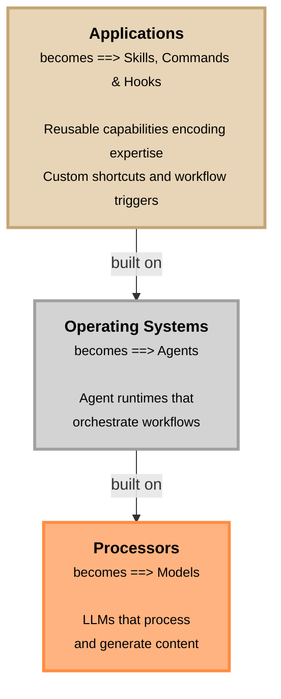

## Claude Agents SDK

[claude_agents_sdk](claude_agents_sdk.md)

## Claude Code

### Slash commands

* [Official documentation: Reference Slash commands](https://code.claude.com/docs/en/slash-commands)
* [Official documentation: Create custom slash commands howto](https://code.claude.com/docs/en/common-workflows#create-custom-slash-commands)

#### Built-in slash commands

* For full list of built-in slash commands, see [Official documentation: Built-in slash commands](https://code.claude.com/docs/en/slash-commands#built-in-slash-commands)


#### Custom slash commands

**Problem that they solve:** you have a bunch of prompts that you constantly use using copy/paste but you want to be able to use them with a single command. So you can use them with a single command.

Custom slash commands:
* allow you to define frequently used prompts as Markdown files that Claude Code can execute.
* Commands are organized by scope (project-specific `<PROJECT_ROOT>/.claude/commands/` or personal `<HOME>/.claude/commands/`). Use /help slash-commands to see the list of commands in your scope (cycle to the "custom commands" section).
* and support namespacing through directory structures.
* can installed by plugins

##### Namespacing

[Official documentation: Namespacing](https://code.claude.com/docs/en/slash-commands#namespacing)

To namespace a command, create a subdirectory with the command name and put the command file inside it:

* `<PROJECT_ROOT>/.claude/commands/frontend/component.md` creates `/component` with description `(project:frontend)`
* `<HOME>/.claude/commands/frontend/component.md` creates `/component` with description `(user:frontend)`

As you can check with the `/help slash-commands` command:

```bash
 Claude Code v2.0.76  general   commands   custom-commands  (tab to cycle)

 Browse custom commands:

 ❯ /command           Review this code for security vulnerabilities: (user)
   /frontend:command  Review this code for security vulnerabilities: (project)
```

> [!WARNING]
> If a project command and user command share the same name, the project command takes precedence and the user command is silently ignored. For example, if both `<PROJECT_ROOT>/.claude/commands/deploy.md` and `<HOME>/.claude/commands/deploy.md` exist, `/deploy` runs the project version.

##### Templating in Claude Command Markdown Definitions

Claude Code slash commands use a lightweight templating system to construct the final prompt before it is sent to the model.

Templating happens at command invocation time, before the model runs, and consists of static text expansion plus optional shell output injection. There is no runtime logic, branching, or execution model beyond this expansion step.

At a high level, three templating mechanisms are available:

- Argument substitution ($ARGUMENTS)
- Bash output injection (!-prefixed shell commands)
- File references (@<file-path>)

Both are resolved before Claude processes the command.


###### Templating Command Example

```bash
# Command definition
cat > .claude/commands/inspect.md <<'EOF'
---
description: Inspect repository state with optional focus text
allowed-tools: Bash(git status:*)
---

## Focus (from args)

$ARGUMENTS

## Repository status (from bash)

!`git status --short`
EOF
```

If you invoke the command from claude code terminal with the arguments: `/inspect Authentication refactor`

The result will be similar to:


```markdown
## Focus (from args)

Authentication refactor

## Repository status (from bash)

M src/auth/login.ts
A src/auth/token.ts
```

Explanation:

* `$ARGUMENTS` is replaced with the text passed to the command
* !`git status --short` executes the `git status --short` bash command and injects its stdout into the prompt
* The model only sees the fully expanded text above, no runtime logic is applied.

###### Arguments

Syntax: `/<command-name> [arguments]`

The `$ARGUMENTS` placeholder captures all arguments passed to the command. In the example below markdown command file, the `$ARGUMENTS` becomes: `123 high-priority`.

```
> /fix-issue 123 high-priority
```

Individual arguments with `$1`, `$2`, etc. are also supported, example:

```bash
# Command definition  
echo 'Review PR #$1 with priority $2 and assign to $3' > .claude/commands/review-pr.md

# Usage
> /review-pr 456 high alice
# $1 becomes "456", $2 becomes "high", $3 becomes "alice"
```

###### Bash commands execution

https://code.claude.com/docs/en/slash-commands#bash-command-execution

As you can see in the [Templating example](#templating-example), you can use "!`<bash-command>`" shell commands to inject the output of the command into the prompt.

It's important that allowed tools are set in the command definition file, example:

```yaml
---
allowed-tools: Bash(git add:*), Bash(git status:*), Bash(git commit:*)
description: Create a git commit
---
```

###### File References

In the command definition file, you can reference files using the `@<file-path>` syntax:

```md
Compare @src/old-version.js with @src/new-version.js
```

###### Thinking mode
Slash commands can trigger extended thinking by including extended thinking keywords.

To learn more, see [Official documentation: Use extended thinking (thinking mode)](https://code.claude.com/docs/en/common-workflows#use-extended-thinking-thinking-mode)

### Agents Skills

Some concepts are explained in the [Agent Skills](#agent-skills) section because agents skills are a concept that is related not only to cloud code. In this section, we will focus on the concepts that are specific to Claude Code.

## Agent Skills

[Official documentation](https://platform.claude.com/docs/en/agents-and-tools/agent-skills/overview)


#### Agent Skill State of the art and positioning dec-2025

Key points of the Anthropic Agent Skills video ("Don't Build Agents, Build Skills Instead – Barry Zhang & Mahesh Murag, Anthropic"):

1. **Framing the problem**
   Agents are now widely used, but they still fall short for real work because they lack consistent domain expertise. The talk introduces a shift from building agents to building skills.
   [https://www.youtube.com/watch?v=CEvIs9y1uog&t=16](https://www.youtube.com/watch?v=CEvIs9y1uog&t=16)

2. **Agents vs domain expertise**
   Today’s agents are very intelligent but resemble a “300-IQ generalist”: brilliant, yet unreliable for tasks that require established professional practice (e.g. tax law).
   [https://www.youtube.com/watch?v=CEvIs9y1uog&t=20](https://www.youtube.com/watch?v=CEvIs9y1uog&t=20)

3. **Code as the universal interface**
   Code is not just a use case; it is the universal interface to the digital world. A single general-purpose agent can operate across domains through code execution.
   [https://www.youtube.com/watch?v=CEvIs9y1uog&t=70](https://www.youtube.com/watch?v=CEvIs9y1uog&t=70)

4. **From specialized agents to general agents**
   What looked like many domain-specific agents turns out to be one largely universal agent paired with a runtime environment (filesystem, shell, code execution).
   [https://www.youtube.com/watch?v=CEvIs9y1uog&t=90](https://www.youtube.com/watch?v=CEvIs9y1uog&t=90)

5. **Definition of skills**
   Skills are organized collections of files—essentially folders—that package composable procedural knowledge for agents.
   [https://www.youtube.com/watch?v=CEvIs9y1uog&t=120](https://www.youtube.com/watch?v=CEvIs9y1uog&t=120)

6. **Why skills are file-based**
   Files are human- and agent-friendly, versionable, shareable, and already embedded in existing workflows (Git, Drive, ZIP).
   [https://www.youtube.com/watch?v=CEvIs9y1uog&t=160](https://www.youtube.com/watch?v=CEvIs9y1uog&t=160)

7. **Scripts as tools inside skills**
   Skills can include scripts that act as reusable tools, improving consistency and avoiding repeated regeneration of the same logic.
   [https://www.youtube.com/watch?v=CEvIs9y1uog&t=240](https://www.youtube.com/watch?v=CEvIs9y1uog&t=240)

8. **Progressive disclosure and context efficiency**
   Only lightweight metadata is shown initially; full contents are loaded on demand, protecting the context window.
   [https://www.youtube.com/watch?v=CEvIs9y1uog&t=270](https://www.youtube.com/watch?v=CEvIs9y1uog&t=270)

9. **Rapid ecosystem growth**
   Thousands of skills emerged within weeks, spanning foundational, partner, and enterprise skills.
   [https://www.youtube.com/watch?v=CEvIs9y1uog&t=300](https://www.youtube.com/watch?v=CEvIs9y1uog&t=300)

10. **Foundational and partner skills**
    Examples include document editing, scientific research, browser automation, and workspace-specific integrations.
    [https://www.youtube.com/watch?v=CEvIs9y1uog&t=330](https://www.youtube.com/watch?v=CEvIs9y1uog&t=330)

11. **Enterprise adoption**
    Large organizations use skills to encode internal best practices, bespoke tooling, and developer workflows.
    [https://www.youtube.com/watch?v=CEvIs9y1uog&t=390](https://www.youtube.com/watch?v=CEvIs9y1uog&t=390)

12. **Skills becoming more complex**
    Skills are evolving into maintained software artifacts containing binaries, assets, and workflows.
    [https://www.youtube.com/watch?v=CEvIs9y1uog&t=420](https://www.youtube.com/watch?v=CEvIs9y1uog&t=420)

13. **Skills and MCP complement each other**
    MCP servers provide connectivity; skills provide expertise. Together they enable complex workflows.
    [https://www.youtube.com/watch?v=CEvIs9y1uog&t=510](https://www.youtube.com/watch?v=CEvIs9y1uog&t=510)

14. **Emerging agent architecture**
    A general agent consists of a runtime, MCP connections, and a large on-demand library of skills.
    [https://www.youtube.com/watch?v=CEvIs9y1uog&t=560](https://www.youtube.com/watch?v=CEvIs9y1uog&t=560)

15. **Treating skills like software**
    Future focus includes testing, evaluation, versioning, dependency management, and quality measurement.
    [https://www.youtube.com/watch?v=CEvIs9y1uog&t=630](https://www.youtube.com/watch?v=CEvIs9y1uog&t=630)

16. **Skills as transferable memory**
    Skills act as persistent procedural memory that improves agent performance over time.
    [https://www.youtube.com/watch?v=CEvIs9y1uog&t=800](https://www.youtube.com/watch?v=CEvIs9y1uog&t=800)

17. **Continuous learning and evolution**
    Agents can acquire, evolve, and discard skills, making later performance meaningfully better than day one.
    [https://www.youtube.com/watch?v=CEvIs9y1uog&t=820](https://www.youtube.com/watch?v=CEvIs9y1uog&t=820)

18. **Computing analogy**
    Models are processors, agent runtimes are operating systems, and skills are applications encoding expertise.
    [https://www.youtube.com/watch?v=CEvIs9y1uog&t=860](https://www.youtube.com/watch?v=CEvIs9y1uog&t=860)

    **Moving up the stack:**



    

19. **Final conclusion**
    The future is general agents + MCP servers + skills. Stop rebuilding agents; start building skills.
    [https://www.youtube.com/watch?v=CEvIs9y1uog&t=960](https://www.youtube.com/watch?v=CEvIs9y1uog&t=960)

If you want, I can compress this into a **single-screen summary**, or map it directly to **MCP + skills design notes** for your own stack.


### Howto create a skill 

SEE [Claude - create a skill - howto](claude-create-skill-howto.md)


## Intergrations with other tools

### Google Workspace

SEE [Claude - Google Workspace integration](claude/claude-google-workspace-integration.md)