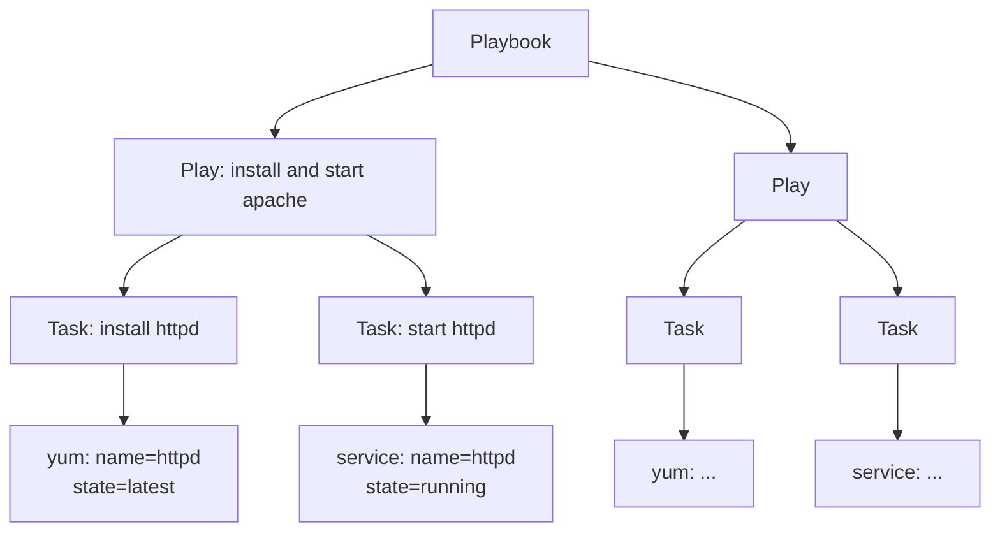

# ANSIBLE

## Table of Contents

### Getting Started
- [Install](#install)
  - [Using Devenv.sh and Nix](#using-devenvsh-and-nix)
- [Tutorial](#tutorial)
  - [AWS and Ansible](#aws-and-ansible)

### Resources and References
- [Link and Tutorials, Roles and Collections](#link-and-tutorials-roles-and-collections)
- [Tech Station Tutorials](#tech-station-tutorials)
- [ASDF Role](#asdf-role)

### Core Concepts
- [Configuration VS Orchestration and Terraform VS Ansible](#configuration-vs-orchestration-and-terraform-vs-ansible)
- [Intro](#intro)
- [Ansible concepts](#ansible-concepts)
  - [Nodes: Control nodes, Managed Nodes (or Hosts)](#nodes-control-nodes-managed-nodes-or-hosts)
  - [Playbooks, Plays, Tasks, Modules, Roles](#playbooks-plays-tasks-modules-roles)
  - [Remote Connection](#remote-connection)
  - [Play Configuration](#play-configuration)
  - [Inventories](#inventories)
  - [Variables](#variables)
  - [Modules (basic unit of execution of Ansible)](#modules-basic-unit-of-execution-of-ansible)

### Practical Guides
- [CheatSheet for Local workstation](#cheatsheet-for-local-workstation)
- [Docker Setup on EC2 (Pulumi + Ansible)](#docker-setup-on-ec2-pulumi--ansible)

### Best Practices
- [DRAFT BEST PRACTICES](#draft-best-practices)

### Hands-on Tasks
- [Execute a Module within a Task](#execute-a-module-within-a-task)
- [Run a system command with the "command" module](#run-a-system-command-with-the-command-module)
- [Access Module documentation from command line](#access-module-documentation-from-command-line)
- [Install Packages](#install-packages)
- [Execute modules without having a playbook](#execute-modules-without-having-a-playbook)
- [Running playbooks](#running-playbooks)
- [Run a single task in an ansible playbook](#run-a-single-task-in-an-ansible-playbook)
- [Running Modules from command line on specific hosts](#running-modules-from-command-line-on-specific-hosts)

### Advanced Topics
- [Re-using Ansible artifacts](#re-using-ansible-artifacts)
- [What's the difference between include_* and import_*?](#whats-the-difference-between-include_-and-import_)
- [Roles (Reusable Playbooks)](#roles-reusable-playbooks)
  - [Role LookUp Rules](#role-lookup-rules)
  - [Role example: Redis](#role-example-redis)
- [Handlers and notify](#handlers-and-notify)
- [Ansible Pull -> Git](#ansible-pull--git)
- [Playbook Roles: Creating Reusable Playbooks](#playbook-roles-creating-reusable-playbooks)

### Working with Playbooks [ADVANCED]
- [Host and Users](#host-and-users)
- [Task List](#task-list)
- [Handlers](#handlers)
- [Listen to Topics](#listen-to-topics)
- [Using variables](#using-variables)
  - [Defining Variables in Inventory](#defining-variables-in-inventory)
  - [Variables discovered from systems: Facts](#variables-discovered-from-systems-facts)
  - [Registering Variables from modules return values](#registering-variables-from-modules-return-values)
  - [Special Variables](#special-variables)
  - [Variables in files](#variables-in-files)
  - [Variables via command line](#variables-via-command-line)
  - [Variable Precedence: where should I put a variable?](#variable-precedence-where-should-i-put-a-variable)

### Testing and Development
- [Testing Playbook and Roles](#testing-playbook-and-roles)
- [Testing with Molecule and Docker](#testing-with-molecule-and-docker)
- [Docker](#docker)

### Additional Resources
- [Create and share a role](#create-and-share-a-role)
- [Automatically install Ansible Galaxy roles from galaxy](#automatically-install-ansible-galaxy-roles-from-galaxy)
- [Debug info](#debug-info)
- [Privilege Escalation](#privilege-escalation)

---

## Install

### Using Devenv.sh and Nix

This the `devenv.nix` to install Ansible 2.17

```nix
{ pkgs, ... }:

{
  # ──────────────────────────────────────────────────────────────────────────────
  # Overlay to patch Python 3.12's `mocket` package
  #
  # Context:
  # - We're using devenv with Python 3.12 and Ansible (`ansible_2_17`).
  # - `ansible_2_17` depends on Python packages, some of which require `mocket`.
  # - The `mocket` package includes a flaky test:
  #     - `test_httprettish_httpx_session`
  #     - It fails due to `httpx.ConnectTimeout` during the build phase.
  #
  # Problem:
  # - Since tests are run during package build, the whole `nix` evaluation fails.
  #
  # Solution:
  # - Use an overlay to override `mocket` by disabling just that one test via `disabledTests`.
  # - Keeps the rest of the tests intact, avoids `doCheck = false`.
  #
  # Why overlays?
  # - Clean and localized fix
  # - Recommended by https://devenv.sh/overlays/
  # ──────────────────────────────────────────────────────────────────────────────

  overlays = [
    (final: prev: {
      python312 = prev.python312.override {
        packageOverrides = pyFinal: pyPrev: {
          mocket = pyPrev.mocket.overridePythonAttrs (oldAttrs: {
            disabledTests = (oldAttrs.disabledTests or []) ++ [
              "test_httprettish_httpx_session"
            ];
          });
        };
      };
      python312Packages = final.python312.pkgs;
    })
  ];

  # ─────────────────────────────────────────────
  # Shell environment definition
  # ─────────────────────────────────────────────

  packages = [
    pkgs.python312Packages.mocket        # Explicitly include patched mocket
    pkgs.python312                       # Patched interpreter
    pkgs.ansible_2_17                    # Required version of Ansible
  ];

  languages.python.enable = true;

  # Optional: additional config (env, scripts, etc.)
  # env.MY_VAR = "value";
  # scripts.my-task.exec = "ansible-playbook site.yml";
}

```

## Tutorials

- [Ansible Tutorials](ansible_tutorials.md)
  - [Use Ansible Agentless to Get Uptime from Remote Machines](ansible_tutorials.md#use-ansible-agentless-to-get-uptime-from-remote-machines) - Learn how to use Ansible in agentless mode to connect to remote machines and retrieve system information
  - [AWS and Ansible](ansible_tutorials.md#aws-and-ansible) - Use AWS Systems Manager to execute complex Ansible playbooks

# Link and Tutorials, Roles and Collections {#link-and-tutorials-roles-and-collections}

Very good Hands-On Labs:  
[https://linuxacademy.com/library/search/ansible/](https://linuxacademy.com/library/search/ansible/)

Ansible introduction:  
[https://linuxacademy.com/course/ansible-quick-start/](https://linuxacademy.com/course/ansible-quick-start/)

## ASDF Role {#asdf-role}

[https://github.com/markosamuli/ansible-asdf](https://github.com/markosamuli/ansible-asdf)

# Configuration VS Orchestration and Terraform VS Ansible {#configuration-vs-orchestration-and-terraform-vs-ansible}

[https://linuxacademy.com/blog/devops/ansible-vs-terraform-fight/](https://linuxacademy.com/blog/devops/ansible-vs-terraform-fight/)

# CheatSheet for Local workstation {#cheatsheet-for-local-workstation}

Create this "host" file:   
localhost         ansible\_connection=local

This will allow to run your pla

And kickoff the playbook with:  
ansible-playbook playbook.yml \-i hosts \--ask-sudo-pass \-vvvv

## Docker Setup on EC2 (Pulumi \+ Ansible) {#docker-setup-on-ec2-(pulumi-+-ansible)}

pt\_devops/pulumi/ec2-docker

# Getting started {#getting-started}

sudo apt install ansible

ansible-playbook \--ask-sudo-pass developer-setup.yml

# Intro {#intro}

Ref: [https://docs.ansible.com/ansible/latest/index.html](https://docs.ansible.com/ansible/latest/index.html)

Ansible is an IT automation tool. It can:

* configure systems,  
* deploy software,  
* and orchestrate more advanced IT tasks such as continuous deployments or zero downtime rolling updates.

For example to configure your local machine:

* your write a playbook  
  * For each configuration file you need \-\> write a task  
  * if you want to keep samething parametric \-\> use variables  
  * if you look for a set of task for a common service like Redis \-\> use Roles

**Variables** can be used in combination with **loops** and **conditionals** to create playbooks that can adapt themself to different OS and variable fleet of hosts.

Ansible manages machines in an **agent-less manner:** it uses SSH to connect to an host.

Ansible is decentralized–it relies on your existing OS credentials to control access to remote machines. If needed, Ansible can easily connect with Kerberos, LDAP, and other centralized authentication management systems.

WATCH this short video to understand how  Ansible works : [https://www.ansible.com/resources/videos/quick-start-video](https://www.ansible.com/resources/videos/quick-start-video)

Playbook example:

* Server: [https://github.com/ansible/ansible-examples](https://github.com/ansible/ansible-examples)  
* Workstations: [https://github.com/siyelo/laptop/blob/master/playbook.yml](https://github.com/siyelo/laptop/blob/master/playbook.yml)

## Ansible concepts {#ansible-concepts}

Doc: [https://docs.ansible.com/ansible/latest/user\_guide/basic\_concepts.html](https://docs.ansible.com/ansible/latest/user_guide/basic_concepts.html)

DIAGRAMMA FATTO BENE: [https://interactive.linuxacademy.com/diagrams/ThePlaybookPapers.html](https://interactive.linuxacademy.com/diagrams/ThePlaybookPapers.html)

### Nodes: Control nodes, Managed Nodes (or Hosts) {#nodes:-control-nodes,-managed-nodes-(or-hosts)}

* **Control node**  
  * Any machine with Python and Ansible installed.  
* **Managed Nodes (called also Hosts)**  
  * The network devices (and/or servers) you manage with Ansible.  
  *  Ansible is not installed on managed nodes.  
* 

### Playbooks, Plays, Tasks, Modules, Roles {#playbooks,-plays,-tasks,-modules,-roles}

Todo: capire se  ansible play può essere definito anche come il collante tra task definiti in locale  e quello negli ansible roles con gli hosts.   
INCLUDE   
https://linuxacademy.com/blog/linux-academy/ansible-roles-explained/

Exempio semplice di playbook per desktop: [https://github.com/siyelo/laptop/blob/master/playbook.yml](https://github.com/siyelo/laptop/blob/master/playbook.yml)

 

[http://docs.ansible.com/ansible/playbooks.html](http://docs.ansible.com/ansible/playbooks.html)   
Playbooks are Ansible's configuration, deployment, and orchestration language.  



Each **playbook** is yaml document, its root element is a list composed of 'plays'.

A "play" maps a group of hosts to some well defined roles, represented by things ansible calls tasks. It's yaml map with this keys:

* tasks list  
* hosts list

A **task** is nothing more than a yaml list of invokation to an ansible module (see About [Modules](http://docs.ansible.com/ansible/modules.html)).  
A **module** is the basic units of execution of Ansible, the basic build block that perform a configuration.

In the example "yum" and "service" are Modules:

[http://docs.ansible.com/ansible/playbooks\_intro.html\#tasks-list](http://docs.ansible.com/ansible/playbooks_intro.html#tasks-list)

The goal of each task is to execute a module, with very specific arguments. Variables, as mentioned above, can be used in arguments to modules.

There are many modules, they can:

* run a service  
* fetch files  
* add users  
* ....

Modules should be idempotent, if you run the playbook multiple time it should not affect the configuration.

We will see how to configure a module within a task here : [https://docs.google.com/document/d/1X0vlw2W1KqxLgxkQMQkSTDoWnvew6tWjeJACjLzM94U/edit\#heading=h.loolv5m0kyah](https://docs.google.com/document/d/1X0vlw2W1KqxLgxkQMQkSTDoWnvew6tWjeJACjLzM94U/edit#heading=h.loolv5m0kyah)

### Remote Connection {#remote-connection}

What happens when ansible try to connect to a remote host? 

Example with the "ping" module [https://docs.ansible.com/ansible/latest/modules/ping\_module.html?highlight=ping](https://docs.ansible.com/ansible/latest/modules/ping_module.html?highlight=ping) 

### Play Configuration {#play-configuration}

Ref: [http://docs.ansible.com/ansible/playbooks\_intro.html\#hosts-and-users](http://docs.ansible.com/ansible/playbooks_intro.html#hosts-and-users)   
For each play in a playbook, you get to choose:

* "hosts":  which machines in your infrastructure to target.   
  * Is a list of one or more groups or host patterns, separated by colons  
  * Host configuration and hosts groups are specified in the inventory  
* "remote\_user": the name of the user account on the remote host used to complete the tasks   
  * Remote users can also be defined at the task level  
* "become" and "become\_user":   
  * Doc: [https://docs.ansible.com/ansible/latest/user\_guide/become.html](https://docs.ansible.com/ansible/latest/user_guide/become.html)

For example, to manage a system service (which requires root privileges) when connected as a non-root user:

| \- name: Ensure the httpd service is running  service:    name: httpd    state: started  become: yes  become\_user: root |
| :---- |

### Inventories {#inventories}

The Ansible inventory file defines the hosts and groups of hosts upon which commands, modules, and tasks in a playbook operate. 

For each host you can define many variables:

* **ansible\_connection**: connection type (SSH, local, etc)  
* **ansible\_user**:  
* connection port

See here for details: [https://docs.ansible.com/ansible/latest/user\_guide/intro\_inventory.html](https://docs.ansible.com/ansible/latest/user_guide/intro_inventory.html) 

Why do you need **groups**?  
For example, if you are managing one or more data centers, you can create Ansible groups for those hosts that require the same set of operations.

NOTE: [**Hosts can be in multiple groups**](https://docs.ansible.com/ansible/latest/user_guide/intro_inventory.html#id4)

The **inventory file** can be in one of many formats depending on your Ansible environment and plugins. The default location for the inventory file is /etc/ansible/hosts. If necessary, you can also create project-specific inventory files in alternate locations.  
You can specify a different inventory file using the **\-i \<path\>** option on the command line.

Not only is this inventory configurable, but you can also use multiple inventory files at the same time and pull inventory from dynamic or cloud sources or different formats (YAML, ini, etc),

### Variables {#variables}

![][image2]

Also as result of a task

### Modules (basic unit of execution of Ansible) {#modules-(basic-unit-of-execution-of-ansible)}

[https://docs.ansible.com/ansible/latest/user\_guide/modules\_intro.html](https://docs.ansible.com/ansible/latest/user_guide/modules_intro.html) 

* A module is the basic units of execution of Ansible, the basic build block that perform a configuration.  
* You can **invoke** a single module with a **task**.  
* Each module has a particular use:  
  * from administering users on a specific type of database  
  * to managing VLAN interfaces on a specific type of network device.  
* It's implemented in python and exposes its interface to "tasks" and "ansible command line tools". It hides the procedural part of the Ansible architecture.  
* NOTE: usually you just use modules, you don't need to implement them  
* \[ADVANCED\] Module development guide: [https://docs.ansible.com/ansible/latest/dev\_guide/developing\_modules\_general.html](https://docs.ansible.com/ansible/latest/dev_guide/developing_modules_general.html)

#### DRAFT BEST PRACTICES {#draft-best-practices}

[https://www.jeffgeerling.com/blog/yaml-best-practices-ansible-playbooks-tasks](https://www.jeffgeerling.com/blog/yaml-best-practices-ansible-playbooks-tasks) 

#### \[JOB\] Execute a Module within a Task {#[job]-execute-a-module-within-a-task}

"name", is more of a description than a name. You can call this whatever you would like.

| \--- \- hosts: droplets   tasks:     \- name: Installs nginx web server       apt: pkg=nginx state=installed update\_cache=true       notify:         \- start nginx |
| :---- |

The next key is "apt". This is a reference to an Ansible module, just like when we use the ansible command and type something like:

ansible \-m apt \-a 'whatever' all

Format: "module: options"

| \- name: Ensure python-ryu is installed  yum:      name: python-ryu      state: present |
| :---- |

In the above example we use yum module to install a package named 'python-ryu'. The state is the action we are using on this package. so 'present' tells Ansible to make sure python-ryu installed in the system. There are additional states, as 'latest' which means 'make sure latest package is installed', so if you have python-ryu-1.0 installed in your system, but there is python-ryu-2.0 available, it will be updated. This is not the case for 'state: present', which simply cares on whether the package is installed or not.

TIP: to see what states and other options available for yum module, use this command: **ansible-doc yum**

#### \[JOB\] Run a system command with the "command" module {#[job]-run-a-system-command-with-the-"command"-module}

DOC: [https://docs.ansible.com/ansible/latest/modules/command\_module.html\#command-module](https://docs.ansible.com/ansible/latest/modules/command_module.html#command-module)   
ansible localhost \-m command \-a ls

#### \[JOB\] Access Module documentation from command line {#[job]-access-module-documentation-from-command-line}

ansible-doc \<module\_name\>

For a list of all available modules, see [Module Index](https://docs.ansible.com/ansible/latest/modules/modules_by_category.html), or run the following at a command prompt:

ansible-doc \-l

#### \[JOB\] Install Packages {#[job]-install-packages}

You can make many things with Ansible modules, for example you can install package, see the List of all packaging module  
[https://docs.ansible.com/ansible/latest/modules/list\_of\_packaging\_modules.html](https://docs.ansible.com/ansible/latest/modules/list_of_packaging_modules.html)

[https://docs.ansible.com/ansible/latest/modules/apt\_module.html\#apt-module](https://docs.ansible.com/ansible/latest/modules/apt_module.html#apt-module) 

#### \[JOB\] execute modules without having a playbook {#[job]-execute-modules-without-having-a-playbook}

Why would you use ad-hoc tasks versus playbooks?

* to test a module without writing a playbook  
* if you wanted to power off all of your lab for Christmas vacation, you could execute a quick one-liner in Ansible without writing a playbook.

ansible  \<host-pattern\> \-m \<module-name\> \-a \<arguments\>

Each module supports taking arguments in this formats:

* key=value arguments, space delimited  ( Nearly all modules take): \-a "key=value key=value ..."   
* Some modules take no arguments  
* the command/shell modules simply take the string of the command you want to run.

Arguments are documented at the "Parametes" section of the documentation (ex: [https://docs.ansible.com/ansible/latest/modules/apt\_module.html\#apt-module](https://docs.ansible.com/ansible/latest/modules/apt_module.html#apt-module) )

ansible localhost \-m command \-a ls

[https://docs.ansible.com/ansible/latest/user\_guide/intro\_adhoc.html](https://docs.ansible.com/ansible/latest/user_guide/intro_adhoc.html) 

### Re-using Ansible artifacts {#re-using-ansible-artifacts}

Breaking tasks up into different files is an excellent way to organize complex sets of tasks and reuse them. 

Ansible offers four distributed, re-usable artifacts: variables files, task files, playbooks, and roles.

* A variables file contains only variables.  
* A task file contains only tasks.  
* A playbook contains at least one play, and may contain variables, tasks, and other content. You can re-use tightly focused playbooks, but you can only re-use them statically, not dynamically.  
* A role contains a set of related tasks, variables, defaults, handlers, and even modules or other plugins in a defined file-tree. Unlike variables files, task files, or playbooks, roles can be easily uploaded and shared via Ansible Galaxy. See Roles for details about creating and using roles.

At Addictive we are using **import\_roles** and **include\_roles** to:

* better organize related task  
* easily manage tag (role can be tagged when you use them)

At Addictive we are import\_task to:

* create platform specific list of tasks ([example](https://github.com/sloria/dotfiles/blob/c9e3241ce5041d0817b50f5dbd61d6644b10f4da/roles/tmux/tasks/main.yml))

| \- import\_tasks: mac.yml   when: ansible\_os\_family \== "Darwin" \- import\_tasks: debian.yml   when: ansible\_os\_family \== "Debian" |
| :---- |

#### What's the difference between include\_\* and import\_\*? {#what's-the-difference-between-include_*-and-import_*?}

Ref:

* [https://serverfault.com/questions/875247/whats-the-difference-between-include-tasks-and-import-tasks](https://serverfault.com/questions/875247/whats-the-difference-between-include-tasks-and-import-tasks)  
* [https://docs.ansible.com/ansible/latest/user\_guide/playbooks\_reuse.html\#re-using-files-and-roles](https://docs.ansible.com/ansible/latest/user_guide/playbooks_reuse.html#re-using-files-and-roles) 

Ansible offers two ways to re-use files and roles in a playbook: **dynamic** and **static**.

* For **dynamic** re-use, add an **include\_\*** task in the tasks section of a play:  
  * [include\_role](https://docs.ansible.com/ansible/latest/collections/ansible/builtin/include_role_module.html#include-role-module)  
  * [include\_tasks](https://docs.ansible.com/ansible/latest/collections/ansible/builtin/include_tasks_module.html#include-tasks-module)  
  * [include\_vars](https://docs.ansible.com/ansible/latest/collections/ansible/builtin/include_vars_module.html#include-vars-module)  
* For static re-use, add an **import\_\*** task in the tasks section of a play:  
  * [import\_role](https://docs.ansible.com/ansible/latest/collections/ansible/builtin/import_role_module.html#import-role-module)  
  * [import\_tasks](https://docs.ansible.com/ansible/latest/collections/ansible/builtin/import_tasks_module.html#import-tasks-module)

The main difference is:

* All import\* statements are pre-processed at the time playbooks are parsed.  
* All include\* statements are processed as they encountered during the execution of the playbook.

From my experience, you should use import when you deal with logical "units". For example, separate long list of tasks into subtask files, main.yml:

| \- import\_tasks: prepare\_filesystem.yml \- import\_tasks: install\_prerequisites.yml \- import\_tasks: install\_application.yml |
| :---- |

But you would use include to deal with different workflows and take decisions based on some dynamically gathered facts, install\_prerequisites:

| \- include\_tasks: prerequisites\_{{ ansible\_os\_family | lower }}.yml |
| :---- |

#### Roles (Reusable Playbooks) {#roles-(reusable-playbooks)}

Doc:

* [https://linuxacademy.com/blog/linux-academy/ansible-roles-explained/](https://linuxacademy.com/blog/linux-academy/ansible-roles-explained/).  Intro semplice ed efficace.  
* [https://docs.ansible.com/ansible/latest/user\_guide/playbooks\_reuse.html\#playbooks-reuse](https://docs.ansible.com/ansible/latest/user_guide/playbooks_reuse.html#playbooks-reuse)

Roles are conceptually really similar to a playbook, they allow you to:

* Split large playbooks in separate files  
* Reuse portion of your playbook and make them generic  
* Example: to configure a Redis cluster you have to setup multiple services, files, packages, you can group all these tasks in a role and reuse them.

Roles provide a way of automatically loading a group of:

* var\_files,  
* tasks,  
* handlers,  
* templates

from a known file structure. Most directories contain a **main.yml** file; Ansible uses each of those files as the entry point for reading the contents of the directory (except for files, templates, and test).

You can use roles in three ways:

* at the play level with the **roles** option: This is the classic way of using roles in a play (Ansible treats the roles as **static** imports).   
  * Runned before your playbook tasks.  
* at the tasks level with **include\_role**: You can reuse roles **dynamically** anywhere in the tasks section of a play using include\_role.  
  * While roles added in a roles section run before any other tasks in a playbook, included roles run in the order they are defined. If there are other tasks before an include\_role task, the other tasks will run first.  
* at the tasks level with **import\_role**: You can reuse roles **statically** anywhere in the tasks section of a play using import\_role.

| \-- \- \- hosts: webservers   tasks:   \- name: Include common role with variables    \- include\_role:        name: common      vars:        common\_dist: centos        common\_size: medium    \- name: Include webserver role from non-standard path      include\_role:        name: /opt/roles/webserver  |
| :---- |
| \-- \- \- hosts: webservers   roles:     \- common     \- role: foo\_app\_instance vars:       dir: '/opt/a' app\_port: 5000     \- role: foo\_app\_instance vars:       dir: '/opt/b' app\_port: 5001  |
|  |

Role definitions must contain at least one of the noted directories:

* **tasks** \- Contains the main list of tasks to be executed by the role.  
* **handlers** \- Contains handlers, which may be used by this role or even anywhere outside this role.  
* **defaults** \- Default variables for the role (see Variables for more information).  
* **vars** \- Other variables for the role (see Variables for more information).  
* **files** \- Contains files which can be deployed via this role. templates \- Contains templates which can be deployed via this role.  
* **meta** \- Defines some meta data for this role. See below for more details.


##### Role LookUp Rules {#role-lookup-rules}

* When a role is called in a playbook, Ansible looks for the role definition in ${PWD}/roles/\<role\_name\>		  
* If ${PWD}/roles does not contain the sought role, then /etc/ansible/roles is checked.  
* The "roles\_path" configuration in ansible.cfg contains a colon delimited list of paths where roles are searched for by ansible.					  
* The full path to a role may also be specified with the role keyword to use a non-default path.   
  * role: '/path/to/my/roles/common'

##### Role example: Redis {#role-example:-redis}

[https://github.com/DavidWittman/ansible-redis](https://github.com/DavidWittman/ansible-redis)

### \[JOB\] Running playbooks {#[job]-running-playbooks}

The command for running playbooks is pretty straightforward: ansible-playbook \<playbook name\>. In our case:

ansible-playbook first\_playbook.yml

Now we need to add the hosts you would like to manage and configure to '/etc/ansible/hosts'.  
Let's say you have two nodes, named hostA and hostB. You can  simply add these two lines to '/etc/ansible/hosts':  
hostA  
hostB

but to easily refer the two nodes in one word, you should use 'group' name for both of them:  
\[my\_hosts\]  
hostA  
hostB

This way, to run tasks on both nodes, you can simply use 'my\_hosts' group name.

### \[JOB\] Run a single task in an ansible playbook {#[job]-run-a-single-task-in-an-ansible-playbook}

[https://stackoverflow.com/questions/23945201/how-to-run-only-one-task-in-ansible-playbook](https://stackoverflow.com/questions/23945201/how-to-run-only-one-task-in-ansible-playbook)

Add tag "debug"  
   \- name: Add OBS repository  
     become: yes  
     become\_user: root  
     apt\_repository:  
       repo: ppa:obsproject/obs-studio  
     tags:  
       \- debug

Run with \--tags "debug"  
ansible-playbook \--ask-become-pass developer-setup.yml \--tags "debug" 

### \[JOB\] Running Modules from command line on specific hosts {#[job]-running-modules-from-command-line-on-specific-hosts}

A really simple way of testing with ansible modules is using the "ansible" command

ansible \<HOSTS\_PATTERN\> \-m \<MODULE\>

Ex: ansible localhost \-m ping

This approach can be useful also to 

## Handlers and notify {#handlers-and-notify}

[http://docs.ansible.com/ansible/playbooks\_intro.html\#handlers-running-operations-on-change](http://docs.ansible.com/ansible/playbooks_intro.html#handlers-running-operations-on-change) 

Handlers are lists of tasks, not really any different from regular tasks, that are referenced by a globally unique name, and are notified by notifiers. 

If nothing notifies a handler, it will not run. Regardless of how many tasks notify a handler, it will run only once, after all of the tasks complete in a particular play.

As of Ansible 2.2, handlers can also "listen" to generic topics, and tasks can notify those topics as follows:

## Ansible Pull \-\> Git {#ansible-pull-->-git}

[http://docs.ansible.com/ansible/playbooks\_intro.html\#ansible-pull](http://docs.ansible.com/ansible/playbooks_intro.html#ansible-pull) 

The ansible-pull is a small script that will checkout a repo of configuration instructions from git, and then run ansible-playbook against that content.

## Playbook Roles: Creating Reusable Playbooks {#playbook-roles:-creating-reusable-playbooks}

Roles make code in playbooks reusable by putting the functionality into generalized "libraries" that can be then used in any playbook as needed.  
Role is a set of tasks and additional files to configure host to serve for a certain role.

They are defined inside roles/\* directories. Roles are defined mostly using YAML files, but can also contain resources of any types (files/, templates/). According to [documentation](http://docs.ansible.com/ansible/latest/playbooks_reuse_roles.html#using-roles) role definition is structured this way:

* If roles/x/tasks/main.yml exists, tasks listed therein will be added to the play  
* If roles/x/handlers/main.yml exists, handlers listed therein will be added to the play  
* If roles/x/vars/main.yml exists, variables listed therein will be added to the play  
* If roles/x/meta/main.yml exists, any role dependencies listed therein will be added to the list of roles (1.3 and later)  
* Any copy tasks can reference files in roles/x/files/ without having to path them relatively or absolutely  
* Any script tasks can reference scripts in roles/x/files/ without having to path them relatively or absolutely  
* Any template tasks can reference files in roles/x/templates/ without having to path them relatively or absolutely  
* Any include tasks can reference files in roles/x/tasks/ without having to path them relatively or absolutely

Roles are ways of:

* automatically loading certain vars\_files,  
* Tasks,  
* and handlers based on a known file structure.

A Playbook is also used as a mapping between hosts and roles.

Grouping content by roles also allows easy sharing of roles with other users (on Galaxy for example).

[https://docs.ansible.com/ansible/latest/user\_guide/playbooks\_roles.html\#roles](https://docs.ansible.com/ansible/latest/user_guide/playbooks_roles.html#roles)

[http://docs.ansible.com/ansible/latest/playbooks\_reuse.html](http://docs.ansible.com/ansible/latest/playbooks_reuse.html)

[https://galaxy.ansible.com/](https://galaxy.ansible.com/) 

Includes: [http://docs.ansible.com/ansible/playbooks\_roles.html\#introduction](http://docs.ansible.com/ansible/playbooks_roles.html#introduction)

To reuse ansible configuration and start to organize things there are three ways to do this: 

* includes,   
* Imports,  
* roles.

tasks/main.yml file list all the task that are executed by default when you use the role.

Roles are just automation around 'include' directives as described above, and really don't contain much additional magic beyond some improvements to search path handling for referenced files. 

Roles can be installed from file:

* File format [http://docs.ansible.com/ansible/galaxy.html\#installing-multiple-roles-from-a-file](http://docs.ansible.com/ansible/galaxy.html#installing-multiple-roles-from-a-file)  
* From Galaxy:   
  ansible-galaxy install \-r requirements.yml

# Working with Playbooks [ADVANCED] {#working-with-playbooks-[advanced]}

[https://docs.ansible.com/ansible/latest/user\_guide/playbooks.html](https://docs.ansible.com/ansible/latest/user_guide/playbooks.html)

playbooks can:

* At a basic level  
  * manage configurations of and deployments to remote machines.  
* At a more advanced level  
  * they can sequence multi-tier rollouts involving rolling updates, and can delegate actions to other hosts,  
  * interacting with monitoring servers and load balancers along the way.

NOTE:  there's no need to learn everything at once. You can start small and pick up more features over time as you need them.

## Host and Users {#host-and-users}

[https://docs.ansible.com/ansible/latest/user\_guide/playbooks\_intro.html\#hosts-and-users](https://docs.ansible.com/ansible/latest/user_guide/playbooks_intro.html#hosts-and-users)

## Task List {#task-list}

[https://docs.ansible.com/ansible/latest/user\_guide/playbooks\_intro.html\#tasks-list](https://docs.ansible.com/ansible/latest/user_guide/playbooks_intro.html#tasks-list)

Task: how to invoke a module

* module: options format.   
  * options is usually a map  
  * some module accept a string  
    * command:**:** /sbin/setenforce 1  
    * shell:**:** /usr/bin/somecommand || /bin/true  
    *   
*  legacy action: module options format  
  * DO NOT USE

## Handlers {#handlers}

[https://docs.ansible.com/ansible/latest/user\_guide/playbooks\_intro.html\#handlers-running-operations-on-change](https://docs.ansible.com/ansible/latest/user_guide/playbooks_intro.html#handlers-running-operations-on-change)

Playbooks have a basic event system based on "notify actions" and "handlers":

* module are idempotent  
* ONLY when they have made a change on the remote system they will trigger a "notify action"

These 'notify' actions are **DEBOUNCED**:

* are triggered at the end of each block of tasks in a play,   
* and will only be triggered once even if notified by multiple different tasks.

Here's an example of restarting two services when the contents of a file change, but only if the file changes:

**\-** name:**:** template configuration file  
  template:**:**  
    src:**:** template.j2  
    dest:**:** /etc/foo.conf  
  notify:**:**  
     **\-** restart memcached

     **\-** restart apache

### Listen to Topics {#listen-to-topics}

As of Ansible 2.2, handlers can also "listen" to generic topics, and tasks can notify those topics as follows:

handlers:**:**  
    **\-** name:**:** restart memcached  
      service:**:**  
        name:**:** memcached  
        state:**:** restarted  
      **listen:**:** "restart web services"  
    **\-** name:**:** restart apache  
      service:**:**  
        name:**:** apache  
        state:**:** restarted  
      listen:**:** "restart web services"

tasks:**:**  
    **\-** name:**:** restart everything  
      command:**:** echo "this task will restart the web services"  
      notify:**:** "restart web services"

This use makes it much easier to trigger multiple handlers. It also decouples handlers from their names, making it easier to share handlers among playbooks and roles (especially when using 3rd party roles from a shared source like Galaxy).

## Using variables {#using-variables}

[https://docs.ansible.com/ansible/latest/user\_guide/playbooks\_variables.html](https://docs.ansible.com/ansible/latest/user_guide/playbooks_variables.html)

WHY Variables? Ansible uses variables to help deal with differences between systems (Ip, OS, etc).

Where can a variables be defined?

* Inventory (hosts and group of hosts)  
* In task  
* Discovered by ansible (Facts)

In a playbook you can use the Jinja2 templating system

For example:

template:**:** src=foo.cfg.j2 dest={{ **remote\_install\_path** }}/foo.cfg

Here the variable defines the location of a file, which can vary from one system to another.

WARNING: YAML syntax requires that if you start a value with {{ foo }} you quote the whole line, since it wants to be sure you aren't trying to start a YAML dictionary.

This won't work:

**\-** hosts:**:** app\_servers  
  vars:**:**  
      app\_path:**:** {{ **base\_path** }}/22

Do it like this and you'll be fine:

**\-** hosts:**:** app\_servers  
  vars:**:**

       app\_path:**:** "{{ **base\_path** }}/22"

Variable names should be letters, numbers, and underscores. 

YAML also supports dictionaries which map keys to values. For instance:

foo:**:**  
  field1:**:** one  
  field2:**:** two

You can then reference a specific field in the dictionary using either bracket notation foo\['field1'\]

Also the dot notation is valid but don't use it, it can create issues because they collide with attributes and methods of python dictionaries.

### Defining Variables in Inventory {#defining-variables-in-inventory}

Variables can be **assigned to hosts in the inventory**  
[https://docs.ansible.com/ansible/latest/user\_guide/intro\_inventory.html\#adding-variables-to-inventory](https://docs.ansible.com/ansible/latest/user_guide/intro_inventory.html#adding-variables-to-inventory) 

For example http\_port and maxRequestsPerChild are variables:

In INI:  
\[atlanta\]  
host1 http\_port=80 maxRequestsPerChild=808  
host2 http\_port=303 maxRequestsPerChild=909

In YAML:  
atlanta:**:**  
  host1:**:**  
    http\_port:**:** 80  
    maxRequestsPerChild:**:** 808  
  host2:**:**  
    http\_port:**:** 303

    maxRequestsPerChild:**:** 909

 or group of hosts:

In INI:  
\[atlanta\]  
host1  
host2

\[atlanta:vars\]  
ntp\_server=ntp.atlanta.example.com  
proxy=proxy.atlanta.example.com

In YAML:  
atlanta:**:**  
  hosts:**:**  
    host1:**:**  
    host2:**:**  
  vars:**:**  
    ntp\_server:**:** ntp.atlanta.example.com

    proxy:**:** proxy.atlanta.example.com

### Variables discovered from systems: Facts {#variables-discovered-from-systems-facts}

[https://docs.ansible.com/ansible/latest/user\_guide/playbooks\_variables.html\#variables-discovered-from-systems-facts](https://docs.ansible.com/ansible/latest/user_guide/playbooks_variables.html#variables-discovered-from-systems-facts)

### Registering Variables from modules return values {#registering-variables-from-modules-return-values}

[https://docs.ansible.com/ansible/latest/user\_guide/playbooks\_variables.html\#registering-variables](https://docs.ansible.com/ansible/latest/user_guide/playbooks_variables.html#registering-variables)

When you execute a task and save the return value in a variable for use in later tasks, you create a registered variable.

For example:

**\-** hosts:**:** web\_servers

  tasks:**:**

     **\-** shell:**:** /usr/bin/foo  
       register:**:** foo\_result  
       ignore\_errors:**:** True

     **\-** shell:**:** /usr/bin/bar  
       when:**:** foo\_result.rc \== 5

Results will vary from module to module. Each module's documentation includes a RETURN section describing that module's return values. To see the values for a particular task, run your playbook with \-v.

### Special Variables {#special-variables}

[https://docs.ansible.com/ansible/latest/reference\_appendices/special\_variables.html](https://docs.ansible.com/ansible/latest/reference_appendices/special_variables.html)

### Variables in files {#variables-in-files}

[https://docs.ansible.com/ansible/latest/user\_guide/playbooks\_variables.html\#defining-variables-in-files](https://docs.ansible.com/ansible/latest/user_guide/playbooks_variables.html#defining-variables-in-files)

### Variables via command line {#variables-via-command-line}

[https://docs.ansible.com/ansible/latest/user\_guide/playbooks\_variables.html\#passing-variables-on-the-command-line](https://docs.ansible.com/ansible/latest/user_guide/playbooks_variables.html#passing-variables-on-the-command-line)

### Variable Precedence: where should I put a variable? {#variable-precedence-where-should-i-put-a-variable}

[https://docs.ansible.com/ansible/latest/user\_guide/playbooks\_variables.html\#variable-precedence-where-should-i-put-a-variable](https://docs.ansible.com/ansible/latest/user_guide/playbooks_variables.html#variable-precedence-where-should-i-put-a-variable)

Here is the order of precedence from least to greatest (the last listed variables winning prioritization):

1. command line values (eg "-u user") or \-e   
2. role defaults [\[1\]](https://docs.ansible.com/ansible/latest/user_guide/playbooks_variables.html#id15)  
3. inventory file or script group vars [\[2\]](https://docs.ansible.com/ansible/latest/user_guide/playbooks_variables.html#id16)  
4. inventory group\_vars/all [\[3\]](https://docs.ansible.com/ansible/latest/user_guide/playbooks_variables.html#id17)  
5. playbook group\_vars/all [\[3\]](https://docs.ansible.com/ansible/latest/user_guide/playbooks_variables.html#id17)  
6. inventory group\_vars/\* [\[3\]](https://docs.ansible.com/ansible/latest/user_guide/playbooks_variables.html#id17)  
7. playbook group\_vars/\* [\[3\]](https://docs.ansible.com/ansible/latest/user_guide/playbooks_variables.html#id17)  
8. inventory file or script host vars [\[2\]](https://docs.ansible.com/ansible/latest/user_guide/playbooks_variables.html#id16)  
9. inventory host\_vars/\* [\[3\]](https://docs.ansible.com/ansible/latest/user_guide/playbooks_variables.html#id17)  
10. playbook host\_vars/\* [\[3\]](https://docs.ansible.com/ansible/latest/user_guide/playbooks_variables.html#id17)  
11. host facts / cached set\_facts [\[4\]](https://docs.ansible.com/ansible/latest/user_guide/playbooks_variables.html#id18)  
12. play vars  
13. play vars\_prompt  
14. play vars\_files  
15. role vars (defined in role/vars/main.yml)  
16. block vars (only for tasks in block)  
17. task vars (only for the task)  
18. include\_vars  
19. set\_facts / registered vars  
20. role (and include\_role) params  
21. include params  
22. extra vars (always win precedence)

# Testing Playbook and Roles {#testing-playbook-and-roles}

## Testing with Molecule and Docker {#testing-with-molecule-and-docker}

ref: [https://www.toptechskills.com/ansible-tutorials-courses/rapidly-build-test-ansible-roles-molecule-docker/](https://www.toptechskills.com/ansible-tutorials-courses/rapidly-build-test-ansible-roles-molecule-docker/)  
Getting Started: [https://molecule.readthedocs.io/en/latest/getting-started.html](https://molecule.readthedocs.io/en/latest/getting-started.html)

pip install molecule  
molecule init role \--driver-name docker  ansible-docker

## Docker {#docker}

Qua ci sono due link a una modalità molto easy da usare

* [https://geektechstuff.com/2020/02/10/ansible-in-a-docker-container/](https://geektechstuff.com/2020/02/10/ansible-in-a-docker-container/)  
* [https://hub.docker.com/r/philm/ansible\_playbook/dockerfile/](https://hub.docker.com/r/philm/ansible_playbook/dockerfile/)  
  * dockerfile che inizializza

[https://medium.com/@ayeshasilvia/testing-ansible-playbook-in-a-docker-container-21628e9ee256](https://medium.com/@ayeshasilvia/testing-ansible-playbook-in-a-docker-container-21628e9ee256)  
Ansible project structure looks like this:

| ├── ansible │   ├── env │   │   └── local\_docker │   ├── roles │   │   └── role1 │   │       └── tasks │   │           └── main.yml │   ├── myplaybook.yml ├── container-start-and-playbook-run.sh └── docker    ├── Dockerfile |
| :---- |

local\_docker is an inventory file

# JOBS {#jobs}

## Create and share a role {#create-and-share-a-role}

[https://galaxy.ansible.com/intro\#share](https://galaxy.ansible.com/intro#share) 

## Automatically install Ansible Galaxy roles from galaxy {#automatically-install-ansible-galaxy-roles-from-galaxy}

You should use a requirements.yml file for this use-case. Describe the roles you require, using any of a variety of install methods:

\# Install a role from the Ansible Galaxy  
\- src: dfarrell07.opendaylight

\# Install a role from GitHub  
\- name: opendaylight  
  src: https://github.com/dfarrell07/ansible-opendaylight

\# Install a role from a specific git branch  
\- name: opendaylight  
  src: https://github.com/dfarrell07/ansible-opendaylight  
  version: origin/master

\# Install a role at a specific tag from GitHub  
\- name: opendaylight  
  src: https://github.com/dfarrell07/ansible-opendaylight  
  version: 1.0.0

\# Install a role at a specific commit from GitHub  
\- name: opendaylight  
  src: https://github.com/dfarrell07/ansible-opendaylight  
  version: \<commit hash\>  
Then install them:

**ansible-galaxy install \-r requirements.yml**

## Debug info {#debug-info}

Increase the debug level with \-vvv... :  
ansible-playbook \--ask-sudo-pass developer-setup.yml \-vvvv

Add a task to display all variables:

    \- name: Display all variables/facts known for a host  
      debug:  
        var: hostvars\[inventory\_hostname\]  
        verbosity: 4

## Privilege Escalation {#privilege-escalation}

[http://docs.ansible.com/ansible/latest/become.html](http://docs.ansible.com/ansible/latest/become.html) 

# Ansible Bender

[https://github.com/ansible-community/ansible-bender](https://github.com/ansible-community/ansible-bender)

 it is up to you to pick the tool which will be used to construct your container image. Right now the only supported builder is [buildah](https://github.com/containers/buildah).

Feature very cool:

* You can do volume mounts during build.  
* if an image build fails, it's committed and named with a suffix \[TIMESTAMP\]-failed (so you can take a look inside and resolve the issue).