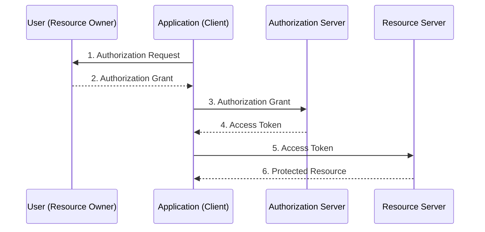
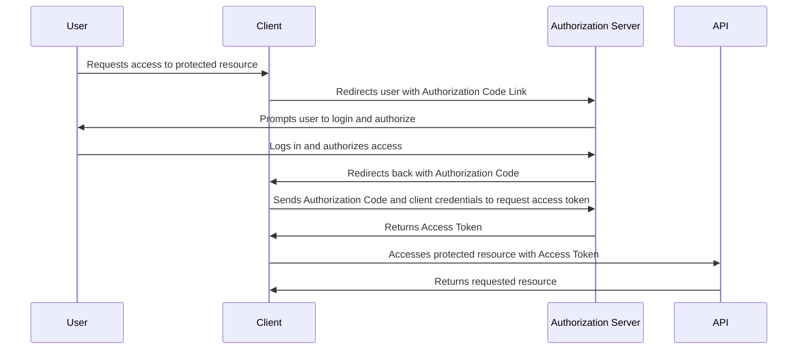
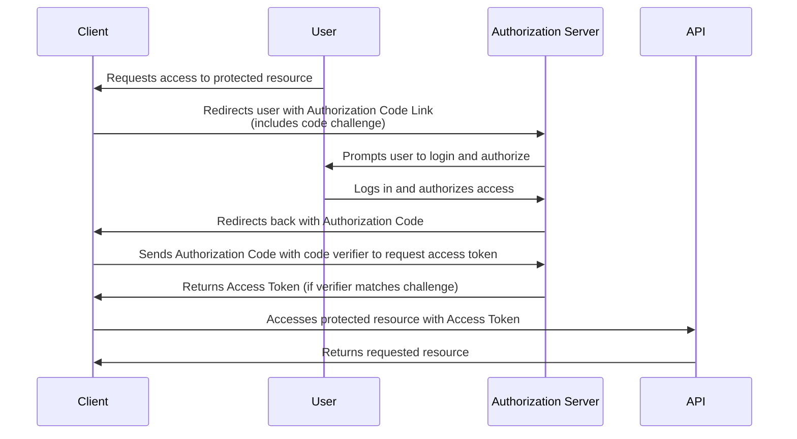
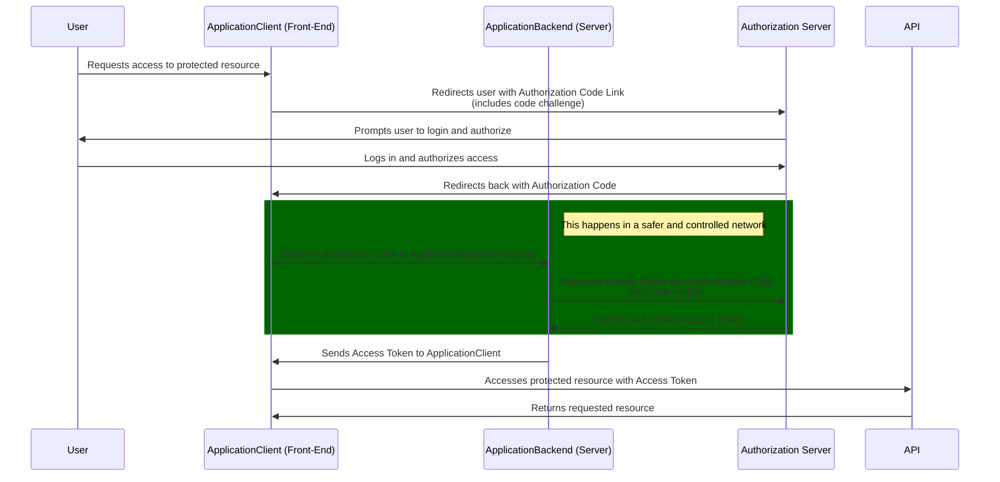

## What is OAuth 2.0?

OAuth 2.0 is an **authorization framework** that enables applications to obtain limited access to user accounts on an HTTP service without sharing user credentials. It allows users to grant third-party applications access to their resources on other services, like social media or cloud storage, while maintaining control over their data. OAuth 2.0 operates through the issuance of access tokens by an authorization server, which the client application can use to access protected resources from a resource server

Refs: [Ory](https://www.ory.sh/docs/oauth2-oidc/overview/oauth2-concepts), [Wikipedia](https://en.wikipedia.org/wiki/OAuth), [Postman](https://blog.postman.com/what-is-oauth-2-0/).


## Key Features of OAuth 2.0

-   **Delegated Access**: Users can authorize applications to access their data without sharing passwords.
-   **Access Tokens**: Applications receive tokens that represent granted permissions, allowing them to perform actions on behalf of the user.
-   **Scopes**: OAuth defines scopes that specify the level of access granted, enabling fine-grained control over what resources can be accessed.

Refs: [Ory](https://www.ory.sh/docs/oauth2-oidc/overview/oauth2-concepts), [DigitalOcean](https://www.digitalocean.com/community/tutorials/an-introduction-to-oauth-2), [Postman](https://blog.postman.com/what-is-oauth-2-0/).


## Main Differences Between OAuth 2.0 and OIDC

| Feature | OAuth 2.0 | OpenID Connect |
| --- |  --- |  --- |
| **Purpose** | Authorization (access control) | Authentication (identity verification) |
| --- |  --- |  --- |
| **Token Types** | Issues access tokens for resource access | Issues ID tokens for user identity |
| **User Info Endpoint** | Not defined | Provides a standard endpoint for user info |
| **Scope Definition** | Customizable scopes for resource access | Predefined scopes like `openid` for authentication[1](https://www.ory.sh/docs/oauth2-oidc/overview/oauth2-concepts)[3](https://www.digitalocean.com/community/tutorials/an-introduction-to-oauth-2)[4](https://blog.postman.com/what-is-oauth-2-0/) |

In summary, OAuth 2.0 focuses on granting access to resources securely without exposing user credentials, while OpenID Connect extends this functionality by adding authentication features that allow applications to confirm user identities securely.

Refs: [Ory](https://www.ory.sh/docs/oauth2-oidc/overview/oauth2-concepts), [DigitalOcean](https://www.digitalocean.com/community/tutorials/an-introduction-to-oauth-2), [Postman](https://blog.postman.com/what-is-oauth-2-0/).


## The OAuth 2.0 Protocol Flow

Refs: [DigitalOcean](https://www.digitalocean.com/community/tutorials/an-introduction-to-oauth-2#application-registration)

### OAuth Roles

OAuth defines four roles:

-   **Resource Owner**: The resource owner is the *user* who authorizes an *application* to access their account. The application's access to the user's account is limited to the scope of the authorization granted (e.g. read or write access)
-   **Client**: The client is the *application* that wants to access the *user*'s account. Before it may do so, it must be authorized by the user, and the authorization must be validated by the API.
-   **Resource Server**: The resource server hosts the protected user accounts.
-   **Authorization Server**: The authorization server verifies the identity of the *user* then issues access tokens to the *application*.

### Abstract Protocol Flow

Now that you have an idea of what the OAuth roles are, let’s look at a diagram of how they generally interact with each other in high-level abstract way:



> [!Note]: The actual flow of this process will differ depending on the authorization grant type in use, but this is the general idea. We will explore different grant types in a later section.

Refs: [DigitalOcean](https://www.digitalocean.com/community/tutorials/an-introduction-to-oauth-2#application-registration)

Here is a more detailed explanation of the steps in the diagram:

1.  The *application* requests authorization to access service resources from the *user*
2.  If the *user* authorized the request, the *application* receives an authorization grant
3.  The *application* requests an access token from the *authorization server* (API) by presenting authentication of its own identity, and the authorization grant
4.  If the application identity is authenticated and the authorization grant is valid, the *authorization server* (API) issues an access token to the application. Authorization is complete.
5.  The *application* requests the resource from the *resource server* (API) and presents the access token for authentication
6.  If the access token is valid, the *resource server* (API) serves the resource to the *application*

The actual flow of this process will differ depending on the authorization grant type in use, but this is the general idea. We will explore different grant types in a later section.

### Difference Between OAuth 2.0 Flow and Grant

In OAuth 2.0, the terms **"flow"** and **"grant"** are related but distinct concepts that describe different aspects of the authorization process.

A **grant** refers to the type or method of authorization that the client application is allowed to use to obtain an access token from the authorization server. Grants define the permissions and the scope of access that the client application can request. OAuth 2.0 specifies several [types of grants](https://oauth.net/2/grant-types/), including **Authorization Code Grant**, **Client Credentials Grant**, **Device Code Grant**, etc. Each grant type determines what information the client needs to provide to receive an access token and what level of access the token will represent.

A **flow**, on the other hand, refers to the entire process or sequence of steps that the client application follows to obtain an access token and interact with the authorization server. The flow includes redirecting the user, requesting authorization, exchanging tokens, and managing responses. For example, the **Authorization Code Flow** describes the series of interactions required to obtain an authorization code from the authorization server, which the client then exchanges for an access token. 

In essence, a **grant** is the permission or method of authorization, while a **flow** describes the specific sequence of interactions to obtain and use that grant. Although these terms are sometimes used interchangeably, technically, the grant is just one component of the larger flow.

### Application Registration

Before using OAuth with your application, you must register your application with the service. This is done through a registration form in the **developer** or **API** portion of the service's website, where you will provide the following information (and probably details about your application):

-   Application Name
-   Application Website
-   Redirect URI or Callback URL

The redirect URI is where the service will redirect the user after they authorize (or deny) your application, and therefore the part of your application that will handle authorization codes or access tokens.

### Client ID and Client Secret

Once your application is registered, the service will issue *client credentials* in the form of a *client identifier* and a *client secret*. The Client ID is a publicly exposed string that is used by the service API to identify the application, and is also used to build authorization URLs that are presented to users. The Client Secret is used to authenticate the identity of the application to the service API when the application requests to access a user's account, and must be kept private between the application and the API.

### Authorization Grant

In the Abstract Protocol Flow [outlined previously](#abstract-protocol-flow), the first four steps cover obtaining an authorization grant and access token. The **authorization grant type** depends on the method used by the application to request authorization, and the grant types supported by the API. OAuth 2 defines three primary grant types, each of which is useful in different cases:

-   **Authorization Code**: used with server-side Applications
-   **Client Credentials**: used with Applications that have API access
-   **Device Code**: used for devices that lack browsers or have input limitations

> [!Warning]: The OAuth framework specifies two additional grant types: the [**Implicit Flow**](https://oauth.net/2/grant-types/implicit/) type and the [**Password Grant**](https://oauth.net/2/grant-types/password/) type. However, these grant types are both considered insecure, and are no longer recommended for use.

Now we will describe grant types in more detail, their use cases and flows, in the following sections.

#### Grant Type: Authorization Code

The **authorization code** grant type is the most commonly used because it is optimized for *server-side applications*, where source code is not publicly exposed, and *Client Secret* confidentiality can be maintained. 

This is a **redirection-based flow**, which means that the application must be capable of interacting with the *user-agent* (i.e. the user's web browser) and receiving API authorization codes that are routed through the user-agent.

Example:

-   Google uses the Authorization Code Grant to enable third-party applications to access services like Gmail, Google Drive, and Google Calendar on behalf of users.
-   If you want to connect a productivity app to Google Calendar, the app will redirect you to a Google authorization page where you log in and grant access. Google then issues an authorization code to the app, which it exchanges for an access token to interact with your Google Calendar data.

##### Authorization Code Flow

Now we will describe the authorization code flow:



##### Step 1: Authorization Code Link

In the Authorization Code Grant flow, the **Authorization Code Link** (e.g., https://cloud.digitalocean.com/v1/oauth/authorize?response_type=code&client_id=CLIENT_ID&redirect_uri=CALLBACK_URL&scope=read) is loaded by the user when the client application redirects them to the Authorization Server to initiate the authorization process.

Here’s when and why it happens:

1.	User Tries to Access a Protected Resource: The user attempts to access a protected resource or service within the client application (example: a productivity app wants to access the user's Google Calendar), and the client recognizes that the user needs to be authenticated.
2.	Client Application Redirects the User to the Authorization Server: The client application generates the **Authorization Code Link** and redirects the user’s browser to this link. This redirection initiates the authorization process.

The **Authorization Code Link** looks like the following:

```
https://cloud.digitalocean.com/v1/oauth/authorize?response_type=code&client_id=CLIENT_ID&redirect_uri=CALLBACK_URL&scope=read
```

Here is an explanation of this example link's components:

-   [https://cloud.digitalocean.com/v1/oauth/authorize](https://cloud.digitalocean.com/v1/oauth/authorize): the API authorization endpoint
-   **client\_id=CLIENT_ID**: the application's *client ID* (how the API identifies the application)
-   **redirect\_uri=CALLBACK_URL**: where the service redirects the user-agent after an authorization code is granted
-   **response\_type=code**: specifies that your application is requesting an authorization code grant
-   **scope=read**: specifies the level of access that the application is requesting

More resources:

-   [What is the OAuth 2.0 Authorization Code Grant?](https://developer.okta.com/blog/2018/04/10/oauth-authorization-code-grant-type) (developer.okta.com)
-   [Authorization Code](https://www.oauth.com/oauth2-servers/access-tokens/authorization-code-request/) (oauth.com)
-   [Web Server Apps](https://aaronparecki.com/oauth-2-simplified/#web-server-apps) (aaronparecki.com)
-   [Authorization Code Grant on the OAuth 2.0 Playground](https://www.oauth.com/playground/authorization-code.html)


##### Step 2: User Authorizes Client Application Access

When the user clicks the link, they must first log in to the service to authenticate their identity (unless they are already logged in). Then they will be prompted by the service to *authorize* or *deny* the application access to their account. Here is an example authorize application prompt:


This particular screenshot is of DigitalOcean's authorization screen, and it indicates that **Thedropletbook App** is requesting authorization for **read** access to the account of `manicas@digitalocean.com`.

##### Step 3 — Application Receives Authorization Code

If the user clicks **Authorize Application** the service redirects the user-agent to the application **redirect URI**, which was specified during the client registration, along with an *authorization code*. The redirect would look something like this (assuming the application is `dropletbook.com`):

```
https://dropletbook.com/callback?code=AUTHORIZATION_CODE
```

##### Step 4 — Application Requests Access Token

The application requests an access token from the API by passing the authorization code along with authentication details, including the *client secret*, to the API token endpoint. Here is an example `POST` request to DigitalOcean's token endpoint:

```
https://cloud.digitalocean.com/v1/oauth/token?client_id=CLIENT_ID&client_secret=CLIENT_SECRET&grant_type=authorization_code&code=AUTHORIZATION_CODE&redirect_uri=CALLBACK_URL

```

##### Step 5 — Application Receives Access Token

If the authorization is valid, the API will send a response containing the access token (and optionally, a refresh token) to the application. The entire response will look something like this:

```json
{
    "access_token":"ACCESS_TOKEN",
    "token_type":"bearer",
    "expires_in":2592000,
    "refresh_token":"REFRESH_TOKEN",
    "scope":"read",
    "uid":100101,
    "info":{"name":"Mark E. Mark","email":"mark@thefunkybunch.com"}
}
```

Now the application is authorized. It may use the token to access the user's account via the service API, limited to the scope of access, until the token expires or is revoked. 

If a **refresh token** was issued, it may be used to request new access tokens if the original token has expired.


##### PKCE - Note Regarding Proof Key for Code Exchange

If a public client is using the Authorization Code grant type, there's a chance that the authorization code could be intercepted. The *Proof Key for Code Exchange* (or *PKCE*, pronounced like "pixie") is an extension to the Authorization Code flow that helps to mitigate this kind of attack.

The PKCE extension involves the client creating and recording a secret key — known as a *code verifier* — for every authorization request. The client then transforms the code verifier into a *code challenge* **using a hashing mechanism (usually SHA-256)**. This transformation provides an added layer of security by ensuring that even if the code challenge is exposed, it cannot be reverse-engineered to reveal the original code verifier. The client sends the hashed *code challenge* (not the code verifier) and the transformation method to the authorization endpoint in the same authorization request.

The authorization endpoint records the code challenge and the transformation method, and responds with the authorization code as outlined previously. The client then sends in the access token request, **which includes the original, unmodified code verifier**.

Upon receiving the code verifier, the authorization server **hashes it with the specified algorithm (e.g., SHA-256) to recreate the code challenge**. It compares this recreated code challenge with the one initially sent by the client. **If they don’t match, the authorization server denies access,** preventing the completion of the authorization flow.

In short, PKCE protects against authorization code interception by requiring a *code verifier*, which only the original client possesses. When a client sends an authorization request, it includes a **hashed version of the code verifier (the *code challenge*)**. Later, to complete the exchange, the client provides **the original code verifier (without hashing it again)**, allowing the authorization server to hash it and verify its authenticity. This verification ensures that

> [!Note]: It's recommended that every client use the PKCE extension for improved security.


###### PKCE Example in attack scenario

You’re absolutely right; in practice, if an attacker is capable of intercepting one request (the authorization code), they’d likely be able to intercept the second request (the token exchange) as well. Here’s a breakdown of why PKCE is still valuable despite this:

1. **Different Attack Vectors**:  
   In most scenarios, an attacker might exploit weaknesses specifically at one point in the flow, rather than across the whole flow. Here are a few cases where interception of only the authorization code could happen:
   - **Browser-Based Redirect Attacks**: An attacker might intercept the authorization code by tricking the browser into redirecting to a malicious URI, capturing the authorization code without being able to monitor the token exchange, which usually takes place over a backend-to-backend communication.
   - **Open Redirect Vulnerabilities**: If the client application is vulnerable to open redirects, an attacker could exploit this vulnerability to capture the authorization code by having the user redirect to a malicious URL during the authorization flow. But they would still lack access to the secure backend where the token exchange occurs.

2. **Network and Device Vulnerabilities**:  
   In cases of **network vulnerabilities** (e.g., open Wi-Fi networks) or **device vulnerabilities** (e.g., compromised browser extensions), an attacker could intercept front-channel communication in the browser (which is how the authorization code is typically sent back to the client) without having access to the backend-to-backend channel where the token request is securely sent.

3. **Intercepting Only the Code Is Useless with PKCE**:  
   PKCE protects the authorization code by making it useless on its own. Without PKCE, an attacker intercepting the authorization code could directly exchange it for an access token. With PKCE, however, even if an attacker intercepts the authorization code, they still need the code verifier, which was generated by the original client and never sent in the initial authorization request.



###### Why PKCE and Backend Security Together Are Powerful
The PKCE flow is highly effective for public clients, especially those that perform part of the OAuth flow in a front channel (e.g., a mobile app or single-page app). By using PKCE and HTTPS together, it’s challenging for attackers to intercept both the authorization code and the code verifier, particularly since the verifier is only sent in the backend-to-backend request where intercepting it is even harder.




#### Grant Type: Client Credentials
The **client credentials** grant type provides an application a way to access its own service account. Examples of when this might be useful include if an application wants to update its registered description or redirect URI, or access other data stored in its service account via the API.

##### Client Credentials Flow

The application requests an access token by sending its credentials, its client ID and client secret, to the authorization server. An example `POST` request might look like the following:

```
https://oauth.example.com/token?grant_type=client_credentials&client_id=CLIENT_ID&client_secret=CLIENT_SECRET

```

If the application credentials check out, the authorization server returns an access token to the application. Now the application is authorized to use its own account.

> [!Note]: DigitalOcean does not currently support the client credentials grant type, so the link points to an imaginary authorization server at `oauth.example.com`.

#### Grant Type: Device Code

The **device code** grant type provides a means for devices that lack a browser or have limited inputs to obtain an access token and access a user's account. The purpose of this grant type is to make it easier for users to more easily authorize applications on such devices to access their accounts. Examples of when this might be useful include if a user wants to sign into a video streaming application on a device that doesn't have a typical keyboard input, such as a smart television or a video game console.

##### Example of an application using the device code flow

This grant type is employed by applications on devices with limited input capabilities or without a browser. Examples include:

-   Smart TVs and Media Consoles: Applications on platforms like Apple TV or Roku use the Device Code flow to allow users to authenticate via a secondary device, such as a smartphone or computer. (OAuth)
-   IoT Devices: Devices like printers or smart home gadgets utilize this flow to enable user authentication through another device with a browser. (Melman M)
-   Command-Line Interface (CLI) Applications: Tools running in terminal environments, such as certain Azure CLI commands, implement the Device Code flow to facilitate user authentication without launching a browser. (Microsoft Learn)

These applications prompt users to **visit a specific URL on a secondary device and enter a code displayed on the primary device**, enabling authentication without direct input on the device itself.

For example in this tutorial, when you run the application on your terminal, it will prompt you to visit a URL and enter a code displayed on your terminal ([A Node headless application using MSAL Node to authenticate users with the device code flow against Microsoft Entra External ID](https://learn.microsoft.com/en-us/samples/azure-samples/ms-identity-ciam-javascript-tutorial/ms-identity-ciam-javascript-tutorial-4-sign-in-device-code/) )

This the application prompts you to when you run it:

1.  Copy the suggested URL `https://microsoft.com/devicelogin` from the message in the terminal and open it in the browser. Then copy the device code from the message in the terminal. 
2.  Past the code in the Enter code prompt to sign in.
    
3.  Head back to the terminal to see your authentication information.


##### Device Code Flow

First, watch this video for a more interactive explanation of the device code flow: [https://www.youtube.com/watch?v=QdFjaOb-KTs](https://www.youtube.com/watch?v=QdFjaOb-KTs)


The user starts an application on their browserless or input-limited device, such as a television or a set-top box. The application submits a `POST` request to a *device authorization endpoint*.


An example device code `POST` request might look like the following:

```
POST https://oauth.example.com/device

client_id=CLIENT_id

```


The device authorization endpoint is different from the authentication server, as the device authorization endpoint doesn't actually authenticate the device. Instead, it returns a unique *device code*, which is used to identify the device; a *user code*, which the user can enter on a machine on which it's easier to authenticate, such as a laptop or mobile device; and the URL the user should visit to enter the user code and authenticate their device.

Here's what an example response from the device authorization endpoint might look like:

```
{
  "device_code": "IO2RUI3SAH0IQuESHAEBAeYOO8UPAI",
  "user_code": "RSIK-KRAM",
  "verification_uri": "https://example.okta.com/device",
  "interval": 10,
  "expires_in": 1600
}

```

Note that the device code could also be a QR code which the reader can scan on a mobile device.

The user then enters the user code at the specified URL and signs into their account. They are then presented with a consent screen where they can authorize the device to access their account.

While the user visits the verification URL and enters their code, the device will poll the access endpoint until it returns an error or an authentication token. The access endpoint will return errors if the device is polling too frequently (the `slow_down` error), if the user hasn't yet approved or denied the request (the `authorization_pending` error), if the user has denied the request (the `access_denied` error), or if the token has expired (the `expired_token` error).

If the user approves the request, though, the access endpoint will return an authentication token.

**Note**: Again, DigitalOcean does not currently support the device code grant type, so the link in this example points to an imaginary authorization server at `oauth.example.com`.

## Example Access Token Usage

Once the application has an access token, it may use the token to access the user's account via the API, limited to the scope of access, until the token expires or is revoked.

Here is an example of an API request, using `curl`. Note that it includes the access token:

```
curl -X POST -H "Authorization: Bearer ACCESS_TOKEN""https://api.digitalocean.com/v2/$OBJECT"

```

Assuming the access token is valid, the API will process the request according to its API specifications. If the access token is expired or otherwise invalid, the API will return an `invalid_request` error.

## Refresh Token Flow

After an access token expires, using it to make a request from the API will result in an `Invalid Token Error`. At this point, if a refresh token was included when the original access token was issued, it can be used to request a fresh access token from the authorization server.

Here is an example `POST` request, using a refresh token to obtain a new access token:

```
https://cloud.digitalocean.com/v1/oauth/token?grant_type=refresh_token&client_id=CLIENT_ID&client_secret=CLIENT_SECRET&refresh_token=REFRESH_TOKEN

```

## Conclusion

By following this guide, you will have gained an understanding of how OAuth 2 works, and when a particular authorization flow should be used.

If you want to learn more about OAuth 2, check out these valuable resources:

-   [How To Use OAuth Authentication with DigitalOcean as a User or Developer](https://www.digitalocean.com/community/tutorials/how-to-use-oauth-authentication-with-digitalocean-as-a-user-or-developer)
-   [How To Use the DigitalOcean API v2](https://www.digitalocean.com/community/tutorials/how-to-use-the-digitalocean-api-v2)
-   [DigitalOcean OAuth API Reference Documentation](https://docs.digitalocean.com/reference/api/oauth-api/)
-   [The OAuth 2.0 Authorization Framework](https://datatracker.ietf.org/doc/html/rfc6749)