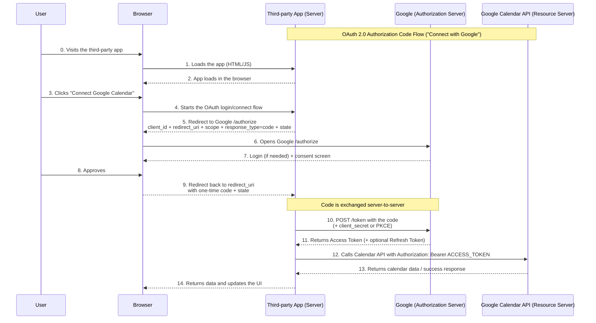
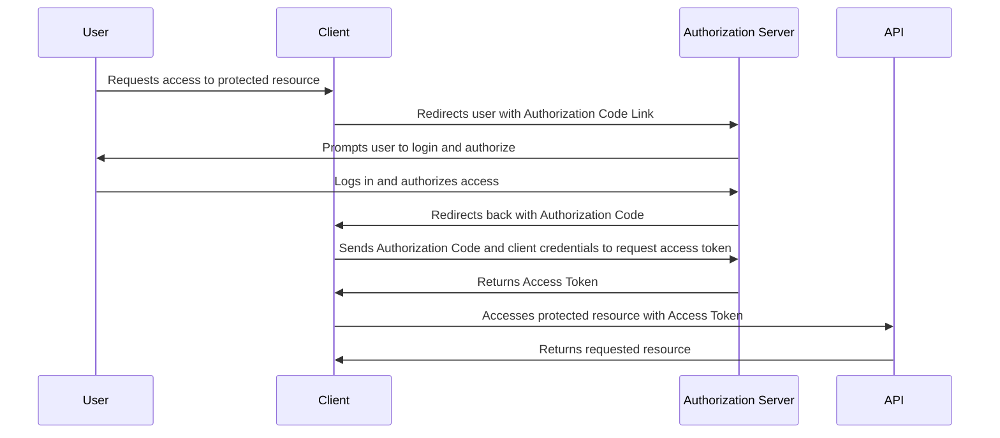
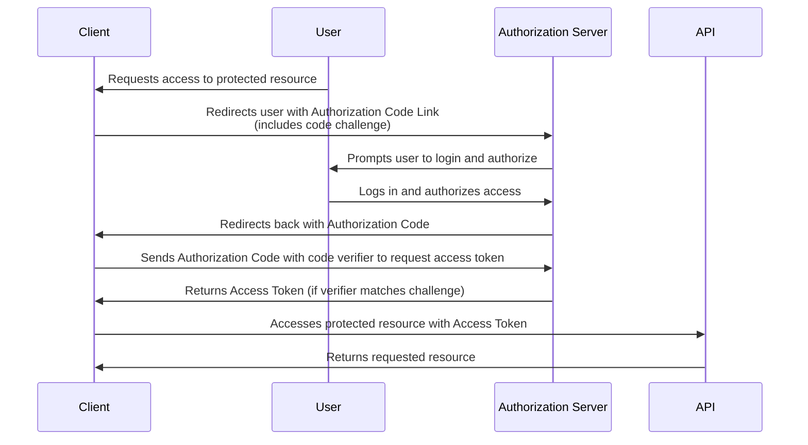
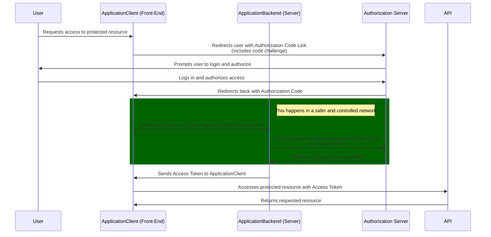

# OAuth 2.0

*A Practical Beginner's Guide (2026)*

This guide is written for developers, product teams, and anyone who wants to **understand OAuth 2.0 from zero** using modern, secure practices. It proposes a practical mental model + a few concrete rules of thumb you can use while reading any OAuth RFC or vendor docs.
From here are linked some valuable resources that you can use to learn more about OAuth 2.0 (ex: OIDC, some legacy flows, some vendor-specific documentation and examples).

### What you will learn
- Why OAuth 2.0 exists and how it protects user passwords
- The essential concepts (roles, scopes, tokens, grants, and flows)
- In 2026, **Authorization Code + PKCE** is the default and recommended OAuth flow for almost all user-facing apps — but other scenarios (machine-to-machine communication, input-limited devices) call for different grant types, and this guide covers those too
- How consent screen and token exchange actually work the real-world with concrete examples that you can easily test (some tutorials are linked here)

### What this guide is *not*
It is **not** a rewrite of the RFCs (but technical specification language is used) nor an implementation manual.
We focus only on the core ideas and the most common real-world patterns.
More advanced or niche topics (such as token introspection, DPoP, or legacy flows) are mentioned briefly and/or linked for further reading.

By the end of this guide you'll have a clear mental model of OAuth 2.x and feel confident reading, discussing, and working with it in modern applications.

## What is OAuth 2.x?

**OAuth 2.0** and it's extensions (ex: OAuth 2.1 draft, ... ) are a secure **authorization framework** that lets third-party applications access a user's data on another service **without ever needing the user's credentials** (typically username and password). 

Imagine you want to let a time-management app automatically add focus-time blocks to your Google Calendar —  **but without ever giving it your Google password.**

**OAuth 2.x** is the secure, modern way to make that possible.

Instead of sharing your username and password (the old, risky way), OAuth lets you safely grant an app **limited and temporary access** to your data. You decide exactly what the app can do, how long it can do it, and you can revoke that permission at any time.

### How the Google Calendar example works (user perspective)
The following steps are the user perspective of the flow in one of the most common user experience:

1. You’re on a third‑party website (not Google), and you see a button like “Connect Google Calendar”. You click it to let that app access your calendar.
2. The browser **redirects** to the service that store the resources (The Google Calendar, in the example) using a **special authorization URL**.
   This URL contains all the details the Google Calendar service needs to identify the app. We will explain them in detail later in this document the meaning of each parameter. These are the more common ones:
   - `client_id` → identifies the app
   - `redirect_uri` → where to send you back after approval
   - `scope` → exactly which resources/permissions the app wants (e.g. `calendar.events.read calendar.events.create`)
  
3. If you are not already logged in, you log into the service (Google in this example), then see a **consent form/screen** that clearly lists the exact permissions the app is requesting.  
   **Typical consent form looks like this:**
   - App name + logo  
   - “This app would like to:”  
     • View your calendar events  
     • Create and edit events in your calendar  
     • See your email address  
   - “Do you want to allow this app to do these things?”  
   - **[Allow]** **[Cancel]** buttons  
   After you click **Allow**, Google redirects your browser back to the app with all the information that the app needs to get gain accesss the your Calendar.
4. The app’s backend swaps the above information for an **access_token**, then uses the token to call the **Resource Server** (the API interface for the Google Calendar).

Behind the scenes, the flow, called **Authorization Code Flow**, is more complex and we will explain it in detail later in this document. Here is a high-level overview of the flow:


```mermaid
sequenceDiagram
    participant User as User
    participant Browser as Browser
    participant App as Third-party App (Server)
    participant Auth as Google (Authorization Server)
    participant API as Google Calendar API (Resource Server)

    Note over App,API: OAuth 2.0 Authorization Code Flow ("Connect with Google")

    User->>Browser: 0. Visits the third-party app
    Browser->>App: 1. Loads the app (HTML/JS)
    App-->>Browser: 2. App loads in the browser

    User->>Browser: 3. Clicks "Connect Google Calendar"
    Browser->>App: 4. Starts the OAuth login/connect flow
    App-->>Browser: 5. Redirect to Google /authorize<br/>client_id + redirect_uri + scope + response_type=code + state
    Browser->>Auth: 6. Opens Google /authorize
    Auth-->>Browser: 7. Login (if needed) + consent screen
    User->>Browser: 8. Approves
    Browser-->>App: 9. Redirect back to redirect_uri<br/>with one-time code + state

    Note over App,Auth: Code is exchanged server-to-server
    App->>Auth: 10. POST /token with the code<br/>(+ client_secret or PKCE)
    Auth-->>App: 11. Returns Access Token (+ optional Refresh Token)

    App->>API: 12. Calls Calendar API with Authorization: Bearer ACCESS_TOKEN
    API-->>App: 13. Returns calendar data / success response
    App-->>Browser: 14. Returns data and updates the UI
```

## Key Benefits of OAuth 2.0

- **No password sharing**: The app gets permission without ever seeing your password.
- **Limited access**: Users can limit what the app can do (scopes) and revoke access later.
- **Standard approach**: It’s widely used across major services.

## WARNING Recent Changes in OAuth 2.1 (Draft)

> [!WARNING] 
> There are some changes in OAuth 2.1 (Draft) that are not yet implemented by all major OAuth 2.0 providers.

This section is placed here to warn you about the changes in OAuth 2.1 (Draft) that are not yet implemented by all major OAuth 2.0 providers. If it's the first time you are reading this guide focus on the main concepts and come back here later to read the details.

The bottom line: it doesn't introduce new functionality — **it removes risky patterns** and makes previously optional best practices mandatory [WorkOS](https://workos.com/blog/oauth-2-1-vs-oauth-2-0).

- **PKCE is required** for Authorization Code flow (not optional anymore).
- **Implicit flow is removed** (no more `response_type=token`).
- **Password flow (ROPC) is removed** (apps should not collect user passwords).
- **Redirect URIs must match exactly** (no wildcards).
- **Access tokens must not be put in URLs** (for example, not in query strings).
- **Refresh tokens must be safer** (rotation or sender-constrained tokens).

Notable: Anthropic adopted OAuth 2.1 as the foundation for MCP’s authorization spec ([WorkOS](https://workos.com/blog/oauth-2-1-vs-oauth-2-0)).

Sources:

* https://oauth.net/2.1/
* https://datatracker.ietf.org/doc/draft-ietf-oauth-v2-1/ (draft-15)
* https://stytch.com/blog/oauth-2-1-vs-2-0/

## Main Concepts

Now let’s quickly understand more formally the **key building blocks** of OAuth 2.0. Think of these as the basic “ingredients” you’ll see in every OAuth interaction.

### The Four Roles

OAuth always involves four different **actors**:

- **Resource Owner**: An entity capable of granting access to a protected resource, tipically the end-user.
- **Client**: An application making protected resource requests on behalf of the resource owner and with its authorization.  
- **Resource Server**: The server hosting the protected resources, capable of accepting and responding to protected resource requests using access tokens.
- **Authorization Server**: The server issuing access tokens to the client after successfully authenticating the resource owner and obtaining authorization.

### Authorization Grant – The user’s “yes”

When the user clicks **Allow** on the consent screen, they are giving the app an **authorization grant**.  

In simple terms:  
The grant is the **temporary permission** the user just approved.  
In the most common flow, this permission is first delivered as a short-lived **authorization code** that the app can later exchange for a real access token.

### Scopes – “What exactly are you allowed to do?”

Usually, users don’t give the app **full** access to their account.  
Instead, users choose **specific permissions** called **scopes**.

Examples:
- `calendar.read` → only read the user's events
- `calendar.events.create` → can create new events in the user's calendar
- `email.read` → can read the user's email address

Users see these listed clearly on the consent screen. They can always revoke or change them later.

### Access Token – The “temporary key”

After the user clicks **Allow**, the app receives a special key called an **access token**.  
This token acts like a temporary digital key that lets the app talk to the API **on your behalf**.

- It is **short-lived** (usually 1 hour or less)
- It only works for the scopes you approved
- The app must send this token with every API request

### Refresh Token – The “long-term spare key”

When the access token expires, the app can use a **refresh token** to get a brand-new access token **without asking the user to log in again**.

- Stored securely on the app’s server
- Much longer-lived (days, weeks, or months)
- Can be revoked by the user at any time

### Client ID and Client Secret

Every app must register with the service (Google, GitHub, etc.) first.  
After registration, the service gives the app two pieces of information:
- **Client ID** → like a public username for the app (safe to show in browser)
- **Client Secret** → like a password for the app (must stay secret on the server)
These are used to prove the app is legitimate.

### Flows – The different ways OAuth happens

A **flow** is the complete step-by-step recipe that shows how all the pieces above work together.

There are several possible flows, but they are **not** all equally safe. In 2026 the **most modern and secure flow** for most applications is: **Authorization Code Flow + PKCE**

This is the modern, secure standard used by Google, GitHub, Microsoft, and almost every major service.

The other older flows (like Implicit or Password) are now considered insecure and have been removed from the latest OAuth 2.1 rules.

## A more formal definition of what OAuth is from the RFC

OAuth introduces an authorization layer by **separating the role of the client from that of the resource owner**. In OAuth, the client requests access to resources controlled by the resource owner and hosted by the resource server, and is issued a **different set of credentials* than those of the resource owner**.

Instead of using the resource owner's credentials to access protected resources, the client obtains an **access token** -- a string denoting a specific scope, lifetime, and other access attributes. Access tokens are issued to third-party clients by an authorization server with the approval of the resource owner. The client uses the access token to access the protected resources hosted by the resource server.

[RFC 6749](https://datatracker.ietf.org/doc/html/rfc6749)

## The OAuth 2.0 Protocol Flows
A **flow** is a formally defined interaction pattern **between actors (client, authorization server, resource owner, resource server)**, consisting of ordered protocol steps, each bound to specific endpoints, parameters, and security guarantees, involving:

1. HTTP requests to specific endpoints
2. HTTP responses carrying protocol artifacts (codes, tokens)
3. User interactions when required (authentication, consent)
4. A set of **state transitions and security constraints**.

### What composes a flow

* **Endpoints (protocol surface)**, typical ones:

* `/authorize` → front-channel (browser redirect)
* `/token` → back-channel (server-to-server)
* `/introspect`, `/revocation` (optional)
* `/userinfo` → identity retrieval (in the case of OIDC extensions)

* **Messages (requests/responses)**, each step has:
  * required parameters (`client_id`, `redirect_uri`, `scope`, etc.)
  * response artifacts (`code`, `access_token`, `id_token`)

* **User interactions (optional but critical)**, only present in **user-centric flows**:
  * login (authentication)
  * consent (authorization)

* **State & correlation**, flows are not just “calls”—they maintain integrity via:
  * `state` (CSRF protection)
  * `nonce` (OIDC replay protection)
  * `code_verifier` / `code_challenge` (PKCE)

* **Channel separation (very important)**, a modern flow explicitly separates:
  * **Front-channel** (via browser)
    * redirects
    * user interaction
    * less trusted
  * **Back-channel** (direct HTTP)
    * token exchange
    * trusted server communication
  * NOTE: This distinction is core to why Authorization Code flow is secure.


To make it concrete, a simplified overview of the “Authorization Code Flow + PKCE” flow is this sequence:

1. Browser → `/authorize` (front-channel)
2. User logs in (interaction)
3. Redirect → client with `code`
4. Client → `/token` (back-channel)
5. Receive tokens

What a flow is **not**:

* Not just “a diagram”
* Not just “a grant type”
* Not just “a set of endpoints”.

A **grant type** defines *how a token is obtained*, while a **flow** defines *the full interaction pattern to achieve it*.

A **grant type** defines *how a token is obtained*, while a **flow** defines *the full interaction pattern to achieve it*.

When you design or review a system, treat a flow as:

* a **state machine**
* executed over HTTP
* involving both:

  * user agent (browser)
  * backend channels
* with explicit **security invariants**

---

If you want, I can formalize one flow (e.g., Auth Code + PKCE) as a strict step-by-step state machine with inputs/outputs per step.


### Difference Between OAuth 2.0 Flow and Grant

In OAuth 2.0, the terms **"flow"** and **"grant"** are related but distinct concepts that describe different aspects of the authorization process.

A **grant** refers to the type or method of authorization that the client application is allowed to use to obtain an access token from the authorization server. Grants define the permissions and the scope of access that the client application can request. OAuth 2.0 specifies several [types of grants](https://oauth.net/2/grant-types/), including **Authorization Code Grant**, **Client Credentials Grant**, **Device Code Grant**, etc. Each grant type determines what information the client needs to provide to receive an access token and what level of access the token will represent.

A **flow**, on the other hand, refers to the entire process or sequence of steps that the client application follows to obtain an access token and interact with the authorization server. The flow includes redirecting the user, requesting authorization, exchanging tokens, and managing responses. For example, the **Authorization Code Flow** describes the series of interactions required to obtain an authorization code from the authorization server, which the client then exchanges for an access token. 

In essence, a **grant** is the permission or method of authorization, while a **flow** describes the specific sequence of interactions to obtain and use that grant. Although these terms are sometimes used interchangeably, technically, the grant is just one component of the larger flow.

## Application Registration

Before using OAuth with your application, you must register your application with the service. This is done through a registration form in the **developer** or **API** portion of the service's website, where you will provide the following information (and probably details about your application):

-   Application Name
-   Application Website
-   Redirect URI or Callback URL

The redirect URI is where the service will redirect the user after they authorize (or deny) your application, and therefore the part of your application that will handle authorization codes or access tokens.

## Client ID and Client Secret

Once your application is registered, the service will issue *client credentials* in the form of a **client identifier** and a **client secret**. The Client ID is a publicly exposed string that is used by the service API to identify the application, and is also used to build authorization URLs that are presented to users. The Client Secret is used to authenticate the identity of the application to the service API when the application requests to access a user's account, and must be kept private between the application and the API.

## Authorization Grant

In the Abstract Protocol Flow [outlined previously](#abstract-protocol-flow), the first four steps cover obtaining an authorization grant and access token. The **authorization grant type** depends on the method used by the application to request authorization, and the grant types supported by the API. OAuth 2 defines three primary grant types, each of which is useful in different cases:

-   **Authorization Code**: used with server-side Applications
-   **Client Credentials**: used with Applications that have API access
-   **Device Code**: used for devices that lack browsers or have input limitations

> [!Warning]: The OAuth framework specifies two additional grant types: the [**Implicit Flow**](https://oauth.net/2/grant-types/implicit/) type and the [**Password Grant**](https://oauth.net/2/grant-types/password/) type. However, these grant types are both considered insecure, and are no longer recommended for use.

Now we will describe grant types in more detail, their use cases and flows, in the following sections.

#### Grant Type: Authorization Code

The **authorization code** grant type is the most commonly used because it is optimized for *server-side applications*, where source code is not publicly exposed, and *Client Secret* confidentiality can be maintained. 

This is a **redirection-based flow**, which means that the application must be capable of interacting with the *user-agent* (i.e. the user's web browser) and receiving API authorization codes that are routed through the user-agent.

Example:

-   Google uses the Authorization Code Grant to enable third-party applications to access services like Gmail, Google Drive, and Google Calendar on behalf of users.
-   If you want to connect a productivity app to Google Calendar, the app will redirect you to a Google authorization page where you log in and grant access. Google then issues an authorization code to the app, which it exchanges for an access token to interact with your Google Calendar data.

##### Authorization Code Flow

Now we will describe the authorization code flow:


```mermaid
sequenceDiagram
    participant User
    participant Client
    participant AuthServer as Authorization Server
    participant API

    User->>Client: Requests access to protected resource
    Client->>AuthServer: Redirects user with Authorization Code Link
    AuthServer->>User: Prompts user to login and authorize
    User->>AuthServer: Logs in and authorizes access
    AuthServer->>Client: Redirects back with Authorization Code
    Client->>AuthServer: Sends Authorization Code and client credentials to request access token
    AuthServer->>Client: Returns Access Token
    Client->>API: Accesses protected resource with Access Token
    API->>Client: Returns requested resource
```

> [!TIP] 🌟⏩
> Experiment with Google's OAuth 2.0 playground to see how the flow works in practice: [OAuth 2.0 Playground](https://developers.google.com/oauthplayground).


##### Step 1: Authorization Code Link

In the Authorization Code Grant flow, the **Authorization Code Link** (e.g., https://cloud.digitalocean.com/v1/oauth/authorize?response_type=code&client_id=CLIENT_ID&redirect_uri=CALLBACK_URL&scope=read) is loaded by the user when the client application redirects them to the Authorization Server to initiate the authorization process.

Here’s when and why it happens:

1.	User Tries to Access a Protected Resource: The user attempts to access a protected resource or service within the client application (example: a productivity app wants to access the user's Google Calendar), and the client recognizes that the user needs to be authenticated.
2.	Client Application Redirects the User to the Authorization Server: The client application generates the **Authorization Code Link** and redirects the user’s browser to this link. This redirection initiates the authorization process.

The **Authorization Code Link** looks like the following:

```
https://cloud.digitalocean.com/v1/oauth/authorize?response_type=code&client_id=CLIENT_ID&redirect_uri=CALLBACK_URL&scope=read
```

Here is an explanation of this example link's components:

-   [https://cloud.digitalocean.com/v1/oauth/authorize](https://cloud.digitalocean.com/v1/oauth/authorize): the API authorization endpoint
-   **client\_id=CLIENT_ID**: the application's *client ID* (how the API identifies the application)
-   **redirect\_uri=CALLBACK_URL**: where the service redirects the user-agent after an authorization code is granted
-   **response\_type=code**: specifies that your application is requesting an authorization code grant
-   **scope=read**: specifies the level of access that the application is requesting

More resources:

-   [What is the OAuth 2.0 Authorization Code Grant?](https://developer.okta.com/blog/2018/04/10/oauth-authorization-code-grant-type) (developer.okta.com)
-   [Authorization Code](https://www.oauth.com/oauth2-servers/access-tokens/authorization-code-request/) (oauth.com)
-   [Web Server Apps](https://aaronparecki.com/oauth-2-simplified/#web-server-apps) (aaronparecki.com)
-   [Authorization Code Grant on the OAuth 2.0 Playground](https://www.oauth.com/playground/authorization-code.html)


##### Step 2: User Authorizes Client Application Access

When the user clicks the link, they must first log in to the service to authenticate their identity (unless they are already logged in). Then they will be prompted by the service to *authorize* or *deny* the application access to their account. Here is an example authorize application prompt:


This particular screenshot is of DigitalOcean's authorization screen, and it indicates that **Thedropletbook App** is requesting authorization for **read** access to the account of `manicas@digitalocean.com`.

##### Step 3 — Application Receives Authorization Code

If the user clicks **Authorize Application** the service redirects the user-agent to the application **redirect URI**, which was specified during the client registration, along with an *authorization code*. The redirect would look something like this (assuming the application is `dropletbook.com`):

```
https://dropletbook.com/callback?code=AUTHORIZATION_CODE
```

##### Step 4 — Application Requests Access Token

The application requests an access token from the API by passing the authorization code along with authentication details, including the *client secret*, to the API token endpoint. Here is an example `POST` request to DigitalOcean's token endpoint:

```
https://cloud.digitalocean.com/v1/oauth/token?client_id=CLIENT_ID&client_secret=CLIENT_SECRET&grant_type=authorization_code&code=AUTHORIZATION_CODE&redirect_uri=CALLBACK_URL

```

##### Step 5 — Application Receives Access Token

If the authorization is valid, the API will send a response containing the access token (and optionally, a refresh token) to the application. The entire response will look something like this:

```json
{
    "access_token":"ACCESS_TOKEN",
    "token_type":"bearer",
    "expires_in":2592000,
    "refresh_token":"REFRESH_TOKEN",
    "scope":"read",
    "uid":100101,
    "info":{"name":"Mark E. Mark","email":"mark@thefunkybunch.com"}
}
```

Now the application is authorized. It may use the token to access the user's account via the service API, limited to the scope of access, until the token expires or is revoked. 

If a **refresh token** was issued, it may be used to request new access tokens if the original token has expired.


##### PKCE - Note Regarding Proof Key for Code Exchange

If a public client is using the Authorization Code grant type, there's a chance that the authorization code could be intercepted. The *Proof Key for Code Exchange* (or *PKCE*, pronounced like "pixie") is an extension to the Authorization Code flow that helps to mitigate this kind of attack.

The PKCE extension involves the client creating and recording a secret key — known as a *code verifier* — for every authorization request. The client then transforms the code verifier into a *code challenge* **using a hashing mechanism (usually SHA-256)**. This transformation provides an added layer of security by ensuring that even if the code challenge is exposed, it cannot be reverse-engineered to reveal the original code verifier. The client sends the hashed *code challenge* (not the code verifier) and the transformation method to the authorization endpoint in the same authorization request.

The authorization endpoint records the code challenge and the transformation method, and responds with the authorization code as outlined previously. The client then sends in the access token request, **which includes the original, unmodified code verifier**.

Upon receiving the code verifier, the authorization server **hashes it with the specified algorithm (e.g., SHA-256) to recreate the code challenge**. It compares this recreated code challenge with the one initially sent by the client. **If they don’t match, the authorization server denies access,** preventing the completion of the authorization flow.

In short, PKCE protects against authorization code interception by requiring a *code verifier*, which only the original client possesses. When a client sends an authorization request, it includes a **hashed version of the code verifier (the *code challenge*)**. Later, to complete the exchange, the client provides **the original code verifier (without hashing it again)**, allowing the authorization server to hash it and verify its authenticity. This verification ensures that only the original client that initiated the authorization request can exchange the code for an access token, effectively preventing authorization code interception attacks.

> [!Note]: It's recommended that every client use the PKCE extension for improved security.


###### PKCE Example in attack scenario

You’re absolutely right; in practice, if an attacker is capable of intercepting one request (the authorization code), they’d likely be able to intercept the second request (the token exchange) as well. Here’s a breakdown of why PKCE is still valuable despite this:

1. **Different Attack Vectors**:  
   In most scenarios, an attacker might exploit weaknesses specifically at one point in the flow, rather than across the whole flow. Here are a few cases where interception of only the authorization code could happen:
   - **Browser-Based Redirect Attacks**: An attacker might intercept the authorization code by tricking the browser into redirecting to a malicious URI, capturing the authorization code without being able to monitor the token exchange, which usually takes place over a backend-to-backend communication.
   - **Open Redirect Vulnerabilities**: If the client application is vulnerable to open redirects, an attacker could exploit this vulnerability to capture the authorization code by having the user redirect to a malicious URL during the authorization flow. But they would still lack access to the secure backend where the token exchange occurs.

2. **Network and Device Vulnerabilities**:  
   In cases of **network vulnerabilities** (e.g., open Wi-Fi networks) or **device vulnerabilities** (e.g., compromised browser extensions), an attacker could intercept front-channel communication in the browser (which is how the authorization code is typically sent back to the client) without having access to the backend-to-backend channel where the token request is securely sent.

3. **Intercepting Only the Code Is Useless with PKCE**:  
   PKCE protects the authorization code by making it useless on its own. Without PKCE, an attacker intercepting the authorization code could directly exchange it for an access token. With PKCE, however, even if an attacker intercepts the authorization code, they still need the code verifier, which was generated by the original client and never sent in the initial authorization request.


```mermaid
sequenceDiagram
    participant Client
    participant User
    participant AuthServer as Authorization Server
    participant API

    User->>Client: Requests access to protected resource
    Client->>AuthServer: Redirects user with Authorization Code Link<br/>(includes code challenge)
    AuthServer->>User: Prompts user to login and authorize
    User->>AuthServer: Logs in and authorizes access
    AuthServer->>Client: Redirects back with Authorization Code
    Client->>AuthServer: Sends Authorization Code with code verifier to request access token
    AuthServer->>Client: Returns Access Token (if verifier matches challenge)
    Client->>API: Accesses protected resource with Access Token
    API->>Client: Returns requested resource
```

###### Why PKCE and Backend Security Together Are Powerful
The PKCE flow is highly effective for public clients, especially those that perform part of the OAuth flow in a front channel (e.g., a mobile app or single-page app). By using PKCE and HTTPS together, it’s challenging for attackers to intercept both the authorization code and the code verifier, particularly since the verifier is only sent in the backend-to-backend request where intercepting it is even harder.


```mermaid
sequenceDiagram
    participant User
    participant ApplicationClient as ApplicationClient (Front-End)
    participant ApplicationBackend as ApplicationBackend (Server)
    participant AuthServer as Authorization Server
    participant API

    User->>ApplicationClient: Requests access to protected resource
    ApplicationClient->>AuthServer: Redirects user with Authorization Code Link<br/>(includes code challenge)
    AuthServer->>User: Prompts user to login and authorize
    User->>AuthServer: Logs in and authorizes access
    AuthServer->>ApplicationClient: Redirects back with Authorization Code

    rect rgb(0, 100, 0)
    note right of ApplicationBackend: This happens in a safer and controlled network
    ApplicationClient->>ApplicationBackend: Sends Authorization Code to ApplicationBackend securely
    ApplicationBackend->>AuthServer: Requests Access Token with Authorization Code<br/>and code verifier
    AuthServer->>ApplicationBackend: Verifies and returns Access Token
    end

    ApplicationBackend->>ApplicationClient: Sends Access Token to ApplicationClient
    ApplicationClient->>API: Accesses protected resource with Access Token
    API->>ApplicationClient: Returns requested resource
```


#### Grant Type: Client Credentials
The **client credentials** grant type provides an application a way to access its own service account. Examples of when this might be useful include if an application wants to update its registered description or redirect URI, or access other data stored in its service account via the API.

##### Client Credentials Flow

The application requests an access token by sending its credentials, its client ID and client secret, to the authorization server. An example `POST` request might look like the following:

```
https://oauth.example.com/token?grant_type=client_credentials&client_id=CLIENT_ID&client_secret=CLIENT_SECRET

```

If the application credentials check out, the authorization server returns an access token to the application. Now the application is authorized to use its own account.

> [!Note]: DigitalOcean does not currently support the client credentials grant type, so the link points to an imaginary authorization server at `oauth.example.com`.

#### Grant Type: Device Code

The **device code** grant type provides a means for devices that lack a browser or have limited inputs to obtain an access token and access a user's account. The purpose of this grant type is to make it easier for users to more easily authorize applications on such devices to access their accounts. Examples of when this might be useful include if a user wants to sign into a video streaming application on a device that doesn't have a typical keyboard input, such as a smart television or a video game console.

##### Example of an application using the device code flow

This grant type is employed by applications on devices with limited input capabilities or without a browser. Examples include:

-   Smart TVs and Media Consoles: Applications on platforms like Apple TV or Roku use the Device Code flow to allow users to authenticate via a secondary device, such as a smartphone or computer. (OAuth)
-   IoT Devices: Devices like printers or smart home gadgets utilize this flow to enable user authentication through another device with a browser. (Melman M)
-   Command-Line Interface (CLI) Applications: Tools running in terminal environments, such as certain Azure CLI commands, implement the Device Code flow to facilitate user authentication without launching a browser. (Microsoft Learn)

These applications prompt users to **visit a specific URL on a secondary device and enter a code displayed on the primary device**, enabling authentication without direct input on the device itself.

For example in this tutorial, when you run the application on your terminal, it will prompt you to visit a URL and enter a code displayed on your terminal ([A Node headless application using MSAL Node to authenticate users with the device code flow against Microsoft Entra External ID](https://learn.microsoft.com/en-us/samples/azure-samples/ms-identity-ciam-javascript-tutorial/ms-identity-ciam-javascript-tutorial-4-sign-in-device-code/) )

This the application prompts you to when you run it:

1.  Copy the suggested URL `https://microsoft.com/devicelogin` from the message in the terminal and open it in the browser. Then copy the device code from the message in the terminal. 
2.  Past the code in the Enter code prompt to sign in.
    
3.  Head back to the terminal to see your authentication information.


##### Device Code Flow

First, watch this video for a more interactive explanation of the device code flow: [https://www.youtube.com/watch?v=QdFjaOb-KTs](https://www.youtube.com/watch?v=QdFjaOb-KTs)


The user starts an application on their browserless or input-limited device, such as a television or a set-top box. The application submits a `POST` request to a *device authorization endpoint*.


An example device code `POST` request might look like the following:

```
POST https://oauth.example.com/device

client_id=CLIENT_id

```


The device authorization endpoint is different from the authentication server, as the device authorization endpoint doesn't actually authenticate the device. Instead, it returns a unique *device code*, which is used to identify the device; a *user code*, which the user can enter on a machine on which it's easier to authenticate, such as a laptop or mobile device; and the URL the user should visit to enter the user code and authenticate their device.

Here's what an example response from the device authorization endpoint might look like:

```
{
  "device_code": "IO2RUI3SAH0IQuESHAEBAeYOO8UPAI",
  "user_code": "RSIK-KRAM",
  "verification_uri": "https://example.okta.com/device",
  "interval": 10,
  "expires_in": 1600
}

```

Note that the device code could also be a QR code which the reader can scan on a mobile device.

The user then enters the user code at the specified URL and signs into their account. They are then presented with a consent screen where they can authorize the device to access their account.

While the user visits the verification URL and enters their code, the device will poll the access endpoint until it returns an error or an authentication token. The access endpoint will return errors if the device is polling too frequently (the `slow_down` error), if the user hasn't yet approved or denied the request (the `authorization_pending` error), if the user has denied the request (the `access_denied` error), or if the token has expired (the `expired_token` error).

If the user approves the request, though, the access endpoint will return an authentication token.

**Note**: Again, DigitalOcean does not currently support the device code grant type, so the link in this example points to an imaginary authorization server at `oauth.example.com`.

## Claims in OAuth 2.0

In OAuth 2.0, **claims** are used to provide additional context within tokens, though they are not a core part of the original specification. OAuth 2.0 primarily focuses on **authorization** rather than **authentication**, so claims are implemented in a flexible, often implementation-specific way.

In the context of identity and access management (like OAuth 2.0 and OpenID Connect), a **claim** is a statement about an entity (usually the user or token holder), typically expressed as a **key-value pair**. Claims are **embedded within tokens** (e.g., JSON Web Tokens) and provide structured information that can be used by applications and APIs to make authorization and authentication decisions.

### Claims in OAuth 2.0 Access Tokens

Access tokens in OAuth 2.0 **may contain claims**, particularly when they are formatted as **JSON Web Tokens (JWTs)**. Claims within these tokens provide structured information that allows APIs to make authorization decisions about users or systems. Typically you get access tokens with a response in the following format:

```json
{
  "access_token":"ya29a0AeDClZCPG8d_0nbikLgl08fbbAYGi_7yhrc3BmX74lrw-Su7XCK1-AWPF4t8xxJ_8K4nYyLvZ3jpMjgUaDXHOtlGM0s259S9GSn5BqLfDt0EAFUeNOzygv3ZNNleONqRFjLqVmyLxxKsY8dA39p3D0wNWuV14CYFQNKEpqLmaCgYKAQ0SARESFQHGX2Mi31dp1pdg2fcOwhxrBMfVSw0175", 
  "scope":"https://www.googleapis.com/auth/youtubepartner https://www.googleapis.com/auth/sitemaps", 
  "token_type":"Bearer", 
  "expires_in":3599, 
  "refresh_token": "1//04XqEBsQXBrydCgYIARAAGAQSNwF-L9Ir5p1jAE6jSfKf3zqUADFY4R6ben3hcF-RxijRSz1YmMlVpqJNUDl_3XASLY9p53ljDwk"
}
```

In the case above the `access_token` is NOT a JWT access token. But if it was, it would contain claims like the following:

- **Standard Claims in JWT Access Tokens**: JWT access tokens often include common claims like:
  - `sub` (subject): The unique identifier for the user or entity the token represents.
  - `iss` (issuer): The entity that issued the token.
  - `exp` (expiration): The token’s expiration time, after which it becomes invalid.
  - `aud` (audience): The intended audience of the token, often an API or service.
  - `scope`: The permissions granted, often represented as a list of authorized actions.

These claims help the API receiving the token to verify its validity and understand the context around the access request.

### Custom Claims in OAuth 2.0

OAuth 2.0 allows for **custom claims** to be included in JWT access tokens. These custom claims can be tailored to the needs of the specific application or API being accessed. For example, an access token for an API dealing with user data could include a `role` claim to specify the user’s authorization level within the application.

- **Adding Custom Claims**: Custom claims are flexible but should be designed thoughtfully to avoid conflicts with standard claims. Using a namespaced format for custom claims can help prevent such collisions, especially when tokens may be used across multiple systems.

### Purpose of Claims in OAuth 2.0

In OAuth 2.0, claims support **authorization decisions** by conveying essential information about the token holder and token validity. While claims are not required by the OAuth 2.0 protocol itself, they are widely used when access tokens are structured as JWTs, providing a convenient and secure way to pass metadata within the token.

### Summary

In summary, while OAuth 2.0 does not explicitly define claims, they are a useful tool for enhancing the context within access tokens, particularly when JWTs are used. Claims enable APIs to make informed decisions on access control, supporting flexible, granular authorization.


## Example Access Token Usage

Once the application has an access token, it may use the token to access the user's account via the API, limited to the scope of access, until the token expires or is revoked.

Here is an example of an API request, using `curl`. Note that it includes the access token:

```
curl -X POST -H "Authorization: Bearer ACCESS_TOKEN""https://api.digitalocean.com/v2/$OBJECT"

```

Assuming the access token is valid, the API will process the request according to its API specifications. If the access token is expired or otherwise invalid, the API will return an `invalid_request` error.

## Refresh Token Flow

After an access token expires, using it to make a request from the API will result in an `Invalid Token Error`. At this point, if a refresh token was included when the original access token was issued, it can be used to request a fresh access token from the authorization server.

Here is an example `POST` request, using a refresh token to obtain a new access token:

```
https://cloud.digitalocean.com/v1/oauth/token?grant_type=refresh_token&client_id=CLIENT_ID&client_secret=CLIENT_SECRET&refresh_token=REFRESH_TOKEN

```

## Conclusion

By following this guide, you will have gained an understanding of how OAuth 2 works, and when a particular authorization flow should be used.

If you want to learn more about OAuth 2, check out these valuable resources:

-   [How To Use OAuth Authentication with DigitalOcean as a User or Developer](https://www.digitalocean.com/community/tutorials/how-to-use-oauth-authentication-with-digitalocean-as-a-user-or-developer)
-   [How To Use the DigitalOcean API v2](https://www.digitalocean.com/community/tutorials/how-to-use-the-digitalocean-api-v2)
-   [DigitalOcean OAuth API Reference Documentation](https://docs.digitalocean.com/reference/api/oauth-api/)
-   [The OAuth 2.0 Authorization Framework](https://datatracker.ietf.org/doc/html/rfc6749)


## OIDC

OpenID Connect extends OAuth 2.0 by adding identity information in a standardized way, see [OIDC Protocol Explanation](oidc-protocol-explanation.md).
