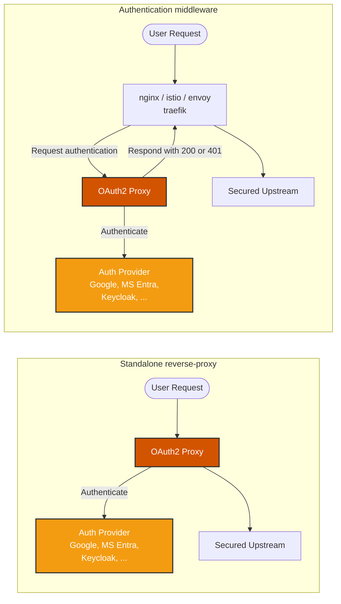

https://github.com/oauth2-proxy/oauth2-proxy

## What is OAuth2 Proxy?

What: manage OAuth2 / OIDC authentication.
How: 
  * act as either a standalone **reverse proxy**: it intercepts requests to your application and redirects users to an OAuth2 provider for authentication.
  * or a **middleware component** integrated into existing reverse proxy or load balancer setups: can be seamlessly integrated into your existing infrastructure to handle authentication for multiple applications.

## Get Started

OAuth2-Proxy's [Installation Docs](https://oauth2-proxy.github.io/oauth2-proxy/installation) cover how to install and configure your setup. Additionally you can take a further look at the [example setup files](https://github.com/oauth2-proxy/oauth2-proxy/tree/master/contrib/local-environment).