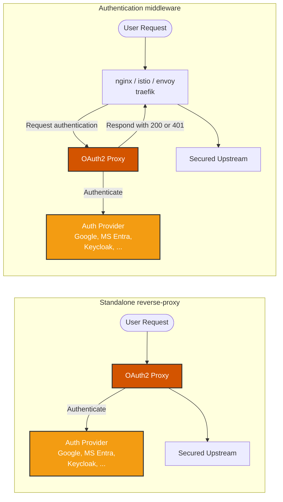

https://github.com/oauth2-proxy/oauth2-proxy

## What is OAuth2 Proxy?

What: manage OAuth2 / OIDC authentication.
How: 
  * act as either a standalone **reverse proxy**: it intercepts requests to your application and redirects users to an OAuth2 provider for authentication.
  * or a **middleware component** integrated into existing reverse proxy or load balancer setups: can be seamlessly integrated into your existing infrastructure to handle authentication for multiple applications.



```mermaid
%% OAuth2 Proxy Configuration Diagram

flowchart LR
  subgraph "Standalone reverse-proxy"
    user1([User Request]) --> oAuth2Proxy1[OAuth2 Proxy]
    oAuth2Proxy1 -- Authenticate --> authProvider1[Auth Provider<br> Google, MS Entra, Keycloak, ...]
    oAuth2Proxy1 --> securedUpstream1[Secured Upstream]
  end

  subgraph "Authentication middleware"
    user2([User Request]) --> nginxIstio[nginx / istio / envoy<br>traefik]
    nginxIstio -- Request authentication --> oAuth2Proxy2[OAuth2 Proxy]
    oAuth2Proxy2 -- Authenticate --> authProvider2[Auth Provider<br> Google, MS Entra, Keycloak, ...]
    oAuth2Proxy2 -- Respond with 200 or 401 --> nginxIstio
    nginxIstio --> securedUpstream2[Secured Upstream]
  end

  style oAuth2Proxy1 fill:#d35400,stroke:#333,stroke-width:2px,color:#fff
  style oAuth2Proxy2 fill:#d35400,stroke:#333,stroke-width:2px,color:#fff
  style authProvider1 fill:#f39c12,stroke:#333,stroke-width:2px,color:#fff
  style authProvider2 fill:#f39c12,stroke:#333,stroke-width:2px,color:#fff
```


## Getting Started


OAuth2-Proxy's [Installation Docs](https://oauth2-proxy.github.io/oauth2-proxy/installation) cover how to install and configure your setup. Additionally you can take a further look at the [example setup files](https://github.com/oauth2-proxy/oauth2-proxy/tree/master/contrib/local-environment).

Use the docker image

## HOWTOs

### Debug 

Set `OAUTH2_PROXY_SHOW_DEBUG_ON_ERROR=true` to get more details in case of error: it shows detailed error information on error pages (WARNING: this may contain sensitive information - do not use in production)

ref: https://oauth2-proxy.github.io/oauth2-proxy/configuration/overview?_highlight=debug#page-template-options

## OAuth2 Proxy Environment Variable Cheat Sheet
Ref [Environment Variables Official Docs](https://oauth2-proxy.github.io/oauth2-proxy/configuration/overview?_highlight=log#environment-variables) for a list of available environment variables.

### Environment Variable Naming Convention
- **Prefix**: Start each environment variable with `OAUTH2_PROXY_`.
- **Capitalization**: Capitalize the argument name.
- **Hyphens to Underscores**: Replace hyphens (`-`) with underscores (`_`).
- **Pluralization**: If the argument can be specified multiple times, use the plural form (add an `S` at the end).

### Examples
| Command-Line Argument      | Environment Variable             |
|----------------------------|----------------------------------|
| `--cookie-secret`          | `OAUTH2_PROXY_COOKIE_SECRET`     |
| `--email-domain`           | `OAUTH2_PROXY_EMAIL_DOMAINS`     |

### String | List Arguments
- For options that accept lists (e.g., `--email-domain`, `--skip-auth-route`), use a plural form environment variable.
- **Separate multiple values with commas**. Example:

```bash
OAUTH2_PROXY_EMAIL_DOMAINS="example.com,anotherdomain.com"
OAUTH2_PROXY_SKIP_AUTH_ROUTES="GET=^/api/status,POST=^/api/saved_objects/_import"
```


