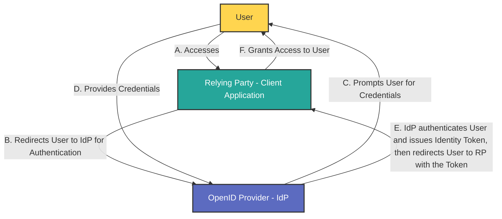

**OpenID Connect (OIDC)** is an authentication protocol that builds on the OAuth 2.0 framework, enabling secure and standardized user authentication across various applications and services: it utilizes the authorization and authentication mechanisms of OAuth 2.0.

While [OAuth 2.0 is an authorization protocol](oauth2-explanation.md), OIDC is an identity authentication protocol and may be used to verify the identity of a user to a client service, also called **Relying Party**. In addition, users' claims like, for example, name, email address, etc., may also be shared on request.

An OIDC provider (often referred to as an **OpenID Provider** or **Identity Provider**, **IdP**) is the entity responsible for authenticating users and issuing identity tokens that confirm their identity to client applications, also known as **Relying Parties** (**RPs**).

## Main Differences Between OAuth 2.0 and OIDC - Usage Scenarios

| Feature | OAuth 2.0 | OpenID Connect |
| --- |  --- |  --- |
| **Purpose** | Authorization (access control) | Authentication (identity verification) |
| --- |  --- |  --- |
| **Token Types** | Issues access tokens for resource access | Issues ID tokens for user identity |
| **User Info Endpoint** | Not defined | Provides a standard endpoint for user info |
| **Scope Definition** | Customizable scopes for resource access | Predefined scopes like `openid` for authentication[1](https://www.ory.sh/docs/oauth2-oidc/overview/oauth2-concepts)[3](https://www.digitalocean.com/community/tutorials/an-introduction-to-oauth-2)[4](https://blog.postman.com/what-is-oauth-2-0/) |

**OpenID Connect (OIDC)** can serve as both an alternative and an extension to OAuth 2.0 in scenarios where user authentication and profile information are needed, in addition to secure access delegation. Built on top of OAuth 2.0, OIDC provides an added identity layer, which makes it ideal for cases where user authentication is required alongside authorization.

#### OAuth 2.0: Authorization Only
OAuth 2.0 is primarily an **authorization protocol** designed for **secure access delegation**. It allows applications to obtain limited access to user resources without handling user credentials directly, by using access tokens. However, OAuth 2.0 by itself only handles resource access (authorization) and does not inherently support user authentication or identity verification.

#### OpenID Connect: Adding Identity and Authentication
OIDC adds an **identity layer** on top of OAuth 2.0, enabling applications to authenticate users and access basic profile information through standardized tokens. OIDC achieves this by introducing the **ID token**, a JSON Web Token (JWT) that contains verified information about the user, such as their user ID, name, and email address. The ID token allows client applications to trust that the user’s identity has been authenticated by the authorization server.

With OIDC, client applications can:
- Confirm **user identity** securely.
- Retrieve **user profile information** (e.g., username, email) in a standardized format within the ID token.
- Enable **Single Sign-On (SSO)** capabilities, where users authenticate once and can access multiple applications.

#### When to Use OIDC Instead of Plain OAuth 2.0

OpenID Connect is recommended when:
1. **Authentication is required**: If the application needs to know the identity of the user, OIDC is more appropriate because it includes an ID token that verifies user identity.
2. **Standardized user information is needed**: OIDC provides basic profile information, making it easier to retrieve consistent user details (such as name and email) across applications.
3. **Single Sign-On (SSO) implementation**: OIDC enables SSO, allowing users to authenticate once and gain access to multiple applications or resources, simplifying the login experience across services.

#### OIDC in Combination with OAuth 2.0

Many applications combine OIDC with OAuth 2.0 when both **authorization** and **authentication** are required. For instance, a web or mobile application often needs both:
- **Identity verification** (knowing who the user is)
- **Resource access control** (defining what the user can access)

OIDC extends OAuth 2.0 without modifying its core authorization framework, making it a robust choice for handling user authentication, profile management, and resource authorization in a single flow. This compatibility allows developers to implement both user verification and access delegation securely and efficiently in modern applications.

#### Summary

OAuth 2.0 focuses on granting access to resources securely without exposing user credentials, while OpenID Connect extends this functionality by adding authentication features that allow applications to confirm user identities securely.

Refs: [Ory](https://www.ory.sh/docs/oauth2-oidc/overview/oauth2-concepts), [DigitalOcean](https://www.digitalocean.com/community/tutorials/an-introduction-to-oauth-2), [Postman](https://blog.postman.com/what-is-oauth-2-0/).

## Key Functions of an OIDC Provider

1.  **User Authentication**: The OIDC provider verifies the identity of users by handling their login credentials and performing the necessary authentication steps.
2.  **Token Issuance**: After successful authentication, the provider generates and sends back an ID token (in JSON Web Token format) to the Relying Party. This token contains claims about the user's identity, such as their name and email address
3.  **User Consent Management**: The OIDC provider often includes a consent mechanism, allowing users to control which personal information they share with Relying Parties during the authentication process.

[ref](https://auth0.com/intro-to-iam/what-is-openid-connect-oidc)

## Understanding Claims in OAuth 2.0 and OpenID Connect (OIDC)

The concept of **claims** is central to both the **OpenID Connect (OIDC)** and **OAuth 2.0** standards, though they are used in distinct ways depending on the context. This guide explores how claims function in each framework.

In the context of identity and access management (like OAuth 2.0 and OpenID Connect), a **claim** is a statement about an entity (usually the user or token holder), typically expressed as a **key-value pair**. Claims are **embedded within tokens** (e.g., JSON Web Tokens) and provide structured information that can be used by applications and APIs to make authorization and authentication decisions.

### Claims in OAuth 2.0

In OAuth 2.0, claims are not a core part of the original specification. OAuth 2.0 primarily focuses on **authorization** rather than **authentication**, and claims are not explicitly defined within the protocol. However, claims often appear in OAuth 2.0 implementations as metadata in access tokens, especially when **JSON Web Token (JWT)** format is used for tokens.

- **Use of Claims in Access Tokens**: In OAuth 2.0, claims in access tokens are used to describe token content or user attributes, enabling APIs to make authorization decisions. Common claims include `sub` (subject identifier) and `exp` (expiration time).
- **Custom Claims**: In practice, developers can add custom claims to JWT-based access tokens in OAuth 2.0 to tailor information for the API receiving the token.

### Claims in OpenID Connect (OIDC)

OIDC, an identity layer built on top of OAuth 2.0, standardizes the use of **claims** as a way to convey **identity information** about the authenticated user. Claims in OIDC are a core feature, allowing applications to access structured attributes about users.

- **Standard Claims**: The OIDC specification defines standard claims, such as `name`, `email`, and `picture`, which provide essential user information. These claims are typically included in **ID tokens** or in the response from the `/userinfo` endpoint, ensuring consistency across applications.
- **Custom Claims**: OIDC also allows custom claims, which can be added to ID tokens and access tokens. Custom claims should follow a namespaced format to avoid conflicts with standard claims.
  
### Summary

In OAuth 2.0, claims are used more loosely, typically within JWT access tokens to support authorization decisions. OIDC, however, formalizes claims as a structured set of user attributes essential for identity verification and user authentication. While OAuth 2.0 enables claims for flexible use cases, OIDC provides a standardized approach to ensure interoperability across identity systems.

## OIDC Flow

TODO

## Access Tokens with OIDC

With an OIDC-conformant authentication pipeline, `ApplicationClient` instances and APIs (resources) are defined as separate entities, allowing access tokens to be obtained specifically for APIs. Consequently, all APIs should be secured using access tokens rather than ID tokens.

### Claims
The OIDC-conformant pipeline standardizes claims that can be included in both ID tokens and access tokens.

#### Standard Claims
The OIDC specification defines a set of standard claims about users (such as profile and email) that can be included in ID tokens or in the response from the `/userinfo` endpoint. For details on the standard claim specification, see Section 5.1 of the OpenID Specification.

#### Custom Claims
Custom claims can still be added to ID tokens or access tokens in an OIDC-conformant pipeline but must follow a namespaced format to prevent collisions with standard OIDC claims.

### Scopes
In the OIDC-conformant pipeline, `ApplicationClient` instances can use scopes to request specific claims or permissions:

- **Standard OIDC Claims**: Scopes such as `profile` and `email` can be requested to include these claims in the ID token (if the user consents to share this information).
- **API Permissions**: Scopes can be configured for APIs to control access to different operations. Defining an API’s audience and required scopes enables granular access control within the API.