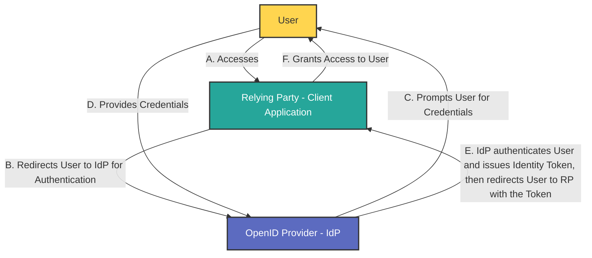

**OpenID Connect (OIDC)** is an authentication protocol that builds on the OAuth 2.0 framework, enabling secure and standardized user authentication across various applications and services: it utilizes the authorization and authentication mechanisms of OAuth 2.0.

While [OAuth 2.0 is an authorization protocol](oauth2-explanation.md), OIDC is an identity authentication protocol and may be used to verify the identity of a user to a client service, also called **Relying Party**. In addition, users' claims like, for example, name, email address, etc., may also be shared on request.

An OIDC provider (often referred to as an **OpenID Provider** or **Identity Provider**, **IdP**) is the entity responsible for authenticating users and issuing identity tokens that confirm their identity to client applications, also known as **Relying Parties** (**RPs**).

## Main Differences Between OAuth 2.0 and OIDC - Usage Scenarios

| Feature | OAuth 2.0 | OpenID Connect |
| --- |  --- |  --- |
| **Purpose** | Authorization (access control) | Authentication (identity verification) |
| --- |  --- |  --- |
| **Token Types** | Issues access tokens for resource access | Issues ID tokens for user identity |
| **User Info Endpoint** | Not defined | Provides a standard endpoint for user info |
| **Scope Definition** | Customizable scopes for resource access | Predefined scopes like `openid` for authentication[1](https://www.ory.sh/docs/oauth2-oidc/overview/oauth2-concepts)[3](https://www.digitalocean.com/community/tutorials/an-introduction-to-oauth-2)[4](https://blog.postman.com/what-is-oauth-2-0/) |

**OpenID Connect (OIDC)** can serve as both an alternative and an extension to OAuth 2.0 in scenarios where user authentication and profile information are needed, in addition to secure access delegation. Built on top of OAuth 2.0, OIDC provides an added identity layer, which makes it ideal for cases where user authentication is required alongside authorization.

#### OAuth 2.0: Authorization Only
OAuth 2.0 is primarily an **authorization protocol** designed for **secure access delegation**. It allows applications to obtain limited access to user resources without handling user credentials directly, by using access tokens. However, OAuth 2.0 by itself only handles resource access (authorization) and does not inherently support user authentication or identity verification.

#### OpenID Connect: Adding Identity and Authentication
OIDC adds an **identity layer** on top of OAuth 2.0, enabling applications to authenticate users and access basic profile information through standardized tokens. OIDC achieves this by introducing the **ID token**, a JSON Web Token (JWT) that contains verified information about the user, such as their user ID, name, and email address. The ID token allows client applications to trust that the user’s identity has been authenticated by the authorization server.

With OIDC, client applications can:
- Confirm **user identity** securely.
- Retrieve **user profile information** (e.g., username, email) in a standardized format within the ID token.
- Enable **Single Sign-On (SSO)** capabilities, where users authenticate once and can access multiple applications.

#### When to Use OIDC Instead of Plain OAuth 2.0

OpenID Connect is recommended when:
1. **Authentication is required**: If the application needs to know the identity of the user, OIDC is more appropriate because it includes an ID token that verifies user identity.
2. **Standardized user information is needed**: OIDC provides basic profile information, making it easier to retrieve consistent user details (such as name and email) across applications.
3. **Single Sign-On (SSO) implementation**: OIDC enables SSO, allowing users to authenticate once and gain access to multiple applications or resources, simplifying the login experience across services.

#### OIDC in Combination with OAuth 2.0

Many applications combine OIDC with OAuth 2.0 when both **authorization** and **authentication** are required. For instance, a web or mobile application often needs both:
- **Identity verification** (knowing who the user is)
- **Resource access control** (defining what the user can access)

OIDC extends OAuth 2.0 without modifying its core authorization framework, making it a robust choice for handling user authentication, profile management, and resource authorization in a single flow. This compatibility allows developers to implement both user verification and access delegation securely and efficiently in modern applications.

#### Summary

OAuth 2.0 focuses on granting access to resources securely without exposing user credentials, while OpenID Connect extends this functionality by adding authentication features that allow applications to confirm user identities securely.

Refs: [Ory](https://www.ory.sh/docs/oauth2-oidc/overview/oauth2-concepts), [DigitalOcean](https://www.digitalocean.com/community/tutorials/an-introduction-to-oauth-2), [Postman](https://blog.postman.com/what-is-oauth-2-0/).

## Key Functions of an OIDC Provider

1.  **User Authentication**: The OIDC provider verifies the identity of users by handling their login credentials and performing the necessary authentication steps.
2.  **Token Issuance**: After successful authentication, the provider generates and sends back an ID token (in JSON Web Token format) to the Relying Party. This token contains claims about the user's identity, such as their name and email address
3.  **User Consent Management**: The OIDC provider often includes a consent mechanism, allowing users to control which personal information they share with Relying Parties during the authentication process.

[ref](https://auth0.com/intro-to-iam/what-is-openid-connect-oidc)

