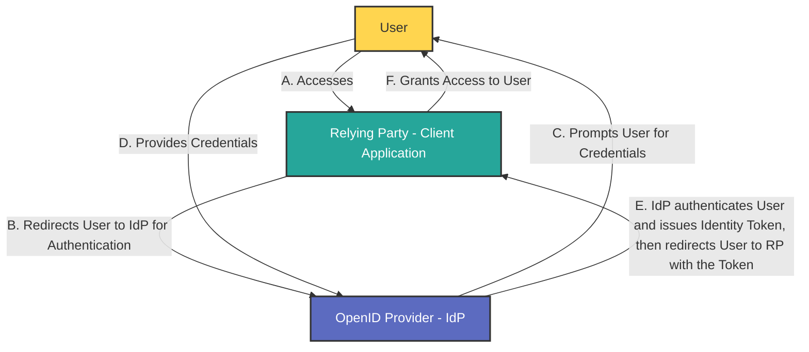

**OpenID Connect (OIDC)** is an authentication protocol that builds on the OAuth 2.0 framework, enabling secure and standardized user authentication across various applications and services: it utilizes the authorization and authentication mechanisms of OAuth 2.0.

While [OAuth 2.0 is an authorization protocol](oauth2-explanation.md), OIDC is an identity authentication protocol and may be used to verify the identity of a user to a client service, also called **Relying Party**. In addition, users' claims like, for example, name, email address, etc., may also be shared on request.

An OIDC provider (often referred to as an **OpenID Provider** or **Identity Provider**, **IdP**) is the entity responsible for authenticating users and issuing identity tokens that confirm their identity to client applications, also known as **Relying Parties** (**RPs**).

## Main Differences Between OAuth 2.0 and OIDC

| Feature | OAuth 2.0 | OpenID Connect |
| --- |  --- |  --- |
| **Purpose** | Authorization (access control) | Authentication (identity verification) |
| --- |  --- |  --- |
| **Token Types** | Issues access tokens for resource access | Issues ID tokens for user identity |
| **User Info Endpoint** | Not defined | Provides a standard endpoint for user info |
| **Scope Definition** | Customizable scopes for resource access | Predefined scopes like `openid` for authentication[1](https://www.ory.sh/docs/oauth2-oidc/overview/oauth2-concepts)[3](https://www.digitalocean.com/community/tutorials/an-introduction-to-oauth-2)[4](https://blog.postman.com/what-is-oauth-2-0/) |

In summary, OAuth 2.0 focuses on granting access to resources securely without exposing user credentials, while OpenID Connect extends this functionality by adding authentication features that allow applications to confirm user identities securely.

Refs: [Ory](https://www.ory.sh/docs/oauth2-oidc/overview/oauth2-concepts), [DigitalOcean](https://www.digitalocean.com/community/tutorials/an-introduction-to-oauth-2), [Postman](https://blog.postman.com/what-is-oauth-2-0/).

## Key Functions of an OIDC Provider

1.  **User Authentication**: The OIDC provider verifies the identity of users by handling their login credentials and performing the necessary authentication steps.
2.  **Token Issuance**: After successful authentication, the provider generates and sends back an ID token (in JSON Web Token format) to the Relying Party. This token contains claims about the user's identity, such as their name and email address
3.  **User Consent Management**: The OIDC provider often includes a consent mechanism, allowing users to control which personal information they share with Relying Parties during the authentication process.

[ref](https://auth0.com/intro-to-iam/what-is-openid-connect-oidc)

