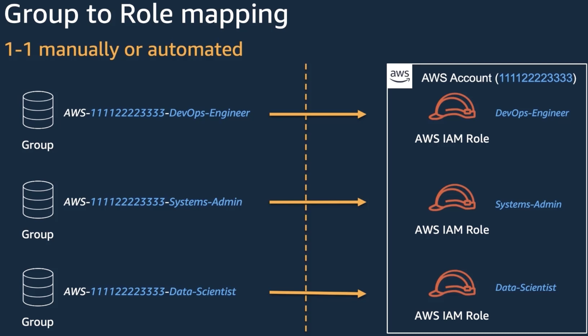

# References

* [AWS Documentation: IAM Identity Center](https://docs.aws.amazon.com/singlesignon/index.html)
* [JOB] Migrate existing accounts to AWS IAM Identity Center [Amazon Web Service - Replace IAM Users with AWS SSO](https://www.youtube.com/watch?v=L3xoiabmcO0)


# Prerequisite knowledge

* [IAM User Guide > Identities > Roles > Using IAM Roles](https://docs.aws.amazon.com/IAM/latest/UserGuide/id_roles_use.html) : how to configure IAM user, application, or service to allow them to switch to a role that you created.

AWS Security Token Service (STS): how to assigne *temporary credentials* in scenarios that involve identity federation, delegation, cross-account access, and IAM roles. 
* [IAM User Guide > Identities > Temporary security credentials in IAM](https://docs.aws.amazon.com/IAM/latest/UserGuide/id_credentials_temp.html)
* [AWS STS API Reference](https://docs.aws.amazon.com/STS/latest/APIReference/welcome.html)

# Intro

* [AWS DOC](https://docs.aws.amazon.com/singlesignon/latest/userguide/what-is.html)
* [AWS Intro Blog Post](https://aws.amazon.com/blogs/security/how-to-create-and-manage-users-within-aws-sso/#:~:text=AWS%20Single%20Sign%2DOn%20(AWS,set%20permissions%20across%20those%20groups.)
* Ref: [AWS IAM Identity Center launch blog](https://aws.amazon.com/blogs/security/scale-your-workforce-access-management-with-aws-iam-identity-center-previously-known-as-aws-sso/) 

>> WARNING: in june 2022 AWS SSO as been renamed into [AWS IAM Identity](https://aws.amazon.com/about-aws/whats-new/2022/07/aws-single-sign-on-aws-sso-now-aws-iam-identity-center/)

AWS IAM Identity Center (ex AWS SSO) makes it easy to centrally manage SSO access to all of your AWS accounts and cloud applications. Specifically:

* it helps you manage SSO access and user permissions across all your AWS accounts in AWS Organizations. 
* it helps you manage access and permissions to commonly used third-party software as a service (SaaS) applications, AWS IAM Identity Center integrated applications as well as custom applications that support Security Assertion Markup Language (SAML) 2.0.

> Since 2022 the AWS best practice suggest: "For customers who are new to IAM Identity Center, it is the recommended front door into AWS for your workforce. If you already use IAM, you can configure IAM Identity Center to run alongside it and gradually shift to the centralized sign-in and access management capabilities of IAM Identity Center."

IAM Identity Center builds on the per-account access management capabilities of IAM and the multi-account governance capabilities of AWS Organizations. This foundation enables IAM Identity Center to manage workforce sign-in and fine-grained access to all accounts in an AWS Organization, as well as the flexibility to be [administered safely from a member account in the AWS Organization](https://aws.amazon.com/blogs/security/getting-started-with-aws-sso-delegated-administration/).

IAM Identity Center supports various security standards and compliance certifications found [here](https://aws.amazon.com/compliance/services-in-scope/).

# CheatSheet

## [JOB] Assign a user or a group to an AWS Account 
[ref](https://docs.aws.amazon.com/singlesignon/latest/userguide/get-started-assign-account-access-admin-user.html)

* `Multi-account permissions -> AWS accounts`
* On the AWS accounts page, a tree view list of your organization appears. Select the check box next to the AWS account to which you want to assign administrative access. If you have multiple accounts in your organization, select the check box next to the management account.
* Choose Assign users or groups.

#  Getting Started

This is the official: [AWS getting started](https://docs.aws.amazon.com/singlesignon/latest/userguide/getting-started.html)

This is the Addictive SOP: [Aws New Customer Account Bootstrap SOP](https://gitlab.com/addictivedev/ad-internals/examples-and-wiki/-/wikis/Aws/Aws-New-Customer-Account-Bootstrap-SOP)

# Key Concepts
https://docs.aws.amazon.com/singlesignon/latest/userguide/understanding-key-concepts.html

## Users, groups, and provisioning

## Identity Center enabled applications

## SAML federation

## User authentications

## Permission sets


# CLI: Configuring the AWS CLI to use AWS IAM Identity Center


1) Configure a profile https://docs.aws.amazon.com/cli/latest/userguide/cli-configure-sso.html


```
aws configure sso
SSO session name (Recommended): ts-management-admin
SSO start URL [None]: https://ts-management.awsapps.com/start
SSO region [None]: eu-west-1
SSO registration scopes [sso:account:access]:
Attempting to automatically open the SSO authorization page in your default browser.
If the browser does not open or you wish to use a different device to authorize this request, open the following URL:

https://device.sso.eu-west-1.amazonaws.com/

Then enter the code:

ZZDZ-HNMF
The only AWS account available to you is: 894179527992
Using the account ID 894179527992
There are 2 roles available to you.
Using the role name "AdministratorAccess"
CLI default client Region [None]: eu-west-1
CLI default output format [None]: json
CLI profile name [AdministratorAccess-894179527992]:

To use this profile, specify the profile name using --profile, as shown:

aws s3 ls --profile AdministratorAccess-894179527992
```

2) Use with AWS-VAULT https://docs.google.com/document/d/1LaTnoM2hnoYcbxUZLB5zuC8M2ECVtXeZfxCRnYOjY8c/edit#

TODO: capire se ha ancora senso usare AWS-VAULT, lo avevamo scelto per mettere in sicurezza le chiavi sulle macchine dei dev ma ora con SSO le sessioni durano molto meno, le chiavi ruotano, quindi ci sono meno problemi di sicurezza.


# How it works (technically - internal)

* Once enabled, AWS SSO creates a service-linked role, named `AWSServiceRoleForSSO`, in all accounts within the organization in AWS Organizations. AWS SSO also creates the same service-linked role in every account that is subsequently added to your organization. This role allows AWS SSO to access each account's resources on your behalf [See the AWS Doc for more details](https://docs.aws.amazon.com/singlesignon/latest/userguide/using-service-linked-roles.html).

*  from `Multi-account permissions -> AWS accounts` You can grant to users and groups access to one or more AWS consoles for specific AWS accounts belonging to your AWS Organization. When you do, AWS SSO uses the `AWSServiceRoleForSSO` service-linked role to create additional roles in those AWS Accounts. For every permission set provisioned in the account: 1) A Role will be created; 2) The permission set policies will be associated with that role. Your end users can now access their AWS accounts using these new roles.

* A **provisioned profile** is a profile that has been associated with at least one AWS Account.

* When users connect to the `AWS access portal URL` they can choose the AWS Account and then choose which IAM role they want to use when signing in to the AWS Management Console for that AWS account.


TODO: permission sets
[Permission sets Documentation](https://docs.aws.amazon.com/singlesignon/latest/userguide/permissionsetsconcept.html)

A permission set is a **template** that you create and maintain that defines a collection of one or more IAM policies. Permission sets simplify the assignment of AWS account access for users and groups in your organization. 

> Q: is it a template for a role?
*  Permission sets define the level of access that users and groups have to an AWS account. Permission sets are stored in IAM Identity Center and can be provisioned to one or more AWS accounts. You can assign more than one permission set to a user. 

The table below there is an example of the roles created for the `AdministratorAccess` and `Billing` permission sets with the format `AWSReservedSSO_<PERMISSIONSET-NAME>_<RANDOM STRING>`.

| Role name                                           | Trusted entities                                                                                   |
|-----------------------------------------------------|----------------------------------------------------------------------------------------------------|
| AWSReservedSSO_AdministratorAccess_d385c2ee752af9f7 | Identity Provider: arn:aws:iam::894179527992:saml-provider/AWSSSO_f418c391a9481763_DO_NOT_DELETE	 |
| AWSReservedSSO_Billing_bc3fc8d8ef661a9f             | Identity Provider: arn:aws:iam::894179527992:saml-provider/AWSSSO_f418c391a9481763_DO_NOT_DELETE   |

# Setup

* This step is required: https://docs.aws.amazon.com/organizations/latest/userguide/orgs_manage_org_support-all-features.html
* Create a user:
    * NOTE: see "Setup Google IDP" if you want to create users that connect with Google

# How to create and manage users and permission sets within AWS Single Sign-On

https://aws.amazon.com/blogs/security/how-to-create-and-manage-users-within-aws-sso/#:~:text=AWS%20Single%20Sign%2DOn%20(AWS,set%20permissions%20across%20those%20groups.

* Create permissions sets that define permitted actions on an AWS resource, and assign them to your users and groups for a specific aws account.
* You can also add the users that you create in AWS SSO to groups you create in AWS SSO.

For example, you can grant the DevOps group permissions to your production AWS accounts. When you add users to the DevOps group, they get access to your production AWS accounts automatically.

What is a **Permission Set**? https://youtu.be/2xM11g3JhB0?t=1294
* 


you can create a permission set and
21:45
assign policies to that permission set
21:47
so in this case you can assign aws
21:48
manage policies and an inline policy


1. Use an existing job function policy : Use job function policies to apply predefined AWS managed policies to a permission set. The policies are based on common job functions in the IT industry. Learn more
2. Create a custom permission set: Use custom policies to select up to 10 AWS managed policies. You can also define a new policy document that best meets your needs.


A custom permissions policy is useful for granting access to specific resources, a specific set of actions, or permissions that cannot be expressed by any combination of AWS managed policies. You can use the IAM policy simulator to test the effects of this policy before applying your changes.


# Setup Google IDP

https://www.cloudquery.io/blog/aws-sso-tutorial-with-google-workspace-as-an-idp

WARNIGN: 
* se usiamo il vecchio account di playgowar non si possono usare le mail pitchtarget.com ma dobbiamo usare le mail playgowar.com
* a occhio l'integrazione SAML con google funziona solo con il primary domain (che in questo caso è playgowar.com e non è possibile cambiarlo)


To create users manually:
* Use the primary Google Workplace email address as the Username as well as the Email address, and fill the other fields accordingly.

# [ADVANCED] AWS Access Patterns for Your Workforce

This talk [How to Build it Right: Common AWS Access Patterns for Your Workforce - AWS Online Tech Talks](https://www.youtube.com/watch?v=2xM11g3JhB0) compares common patterns common patterns for provisioning access into aws accounts. Some of this pattern are outdate but they 

Glossary:
* Cloud Builders: are developers, sysadm, etc that will acccess your accounts.

There are many benefit to create a multi-account structure for your Organization, and it's a best practice:

* maybe you need to isolate workloads based off of security and compliance requirements
* you want to isolate different teams into different aws accounts. Many organizations use different AWS accounts for testing and production, for example.
* The most secure option to isolate workloads from each other is to use multiple AWS accounts.
* you can get different service limits per each account
* you have different business units or products that need their own aws accounts (and AWS account is the best isolation alternative)
* AWS accounts are the only solution isolate billing
* ....


One challenge with a multi-account structure is provisioning access into those accounts. With tradition approach you end up having to create users and groups in every single aws account.

>> The more AWS accounts you use, the more complicated it gets to manage users and grant them access.

**The traditional approach** has been to use aws IAM users, where you:

* would create a youth and unique identity in that aws account for each one of your cloud builders.
* You'd generate standalone credentials
* and then you put that user in different aws IAM groups to provide more fine-grained access control into the services and resources in that aws account.

Each user would essentially have a separate identity in each aws account, you'd end up with credential sprawl, where each user has a credential per each aws account:

* they'd probably end up using long term credentials so if they needed programmatic access they would essentially be using static access keys and then as it relates to compliance.

* the user experience ends up being incredibly poor so each user has to maintain like a list of sign-in urls for each one of their aws accounts, has to actually remember passwords for each one of those accounts as well.

* deprovisioning or provisioning users or doing any sort of entitlement auditing becomes a huge pain where you'd actually have to build a lot of automation to do all of those things and then lastly 

> **This is something that's still available but it's really not the recommended pattern anymore. AWS suggests that you use Federation to access AWS accounts.**

So the primary access pattern has really shifted from using standalone aws im users to using identity federation which essentially means you're linking a single identity to all of your aws accounts so you can access them with that single identity or that single credential so that identity is typically an existing corporate identity. By using federation you're really moving towards a model of centrally managing your users credentials and their entitlements those credentials are now short-lived based on a customized duration and then compliance becomes more unified so you're able to leverage existing investments into some of your processes and tooling so you can you know leverage existing de-provisioning and provisioning processes you already had in place for your corporate identities and the user experience is significantly improved since it provides single sign-on to aws accounts for users.


The learning objectives of this talk is:  "Learn how to use federation into aws". Federation is what you should use for getting your cloud builders access into aws accounts.

The three most common patterns we'll be covering under that federation umbrella will be: 
1. Pattern "AWS IAM Federation - Externl IdP" (you connect your own identity provider)
2. Pattern "AWS SSO federation - AWS SSO IdP" (you are leveraging the native aws SSO service as your identity provider [AWS IAM Identity Center Doc](https://aws.amazon.com/iam/identity-center/))
3. Pattern "AWS SSO federation - External IdP" (leveraging a combination of both of those together)

### Pattern - AWS IAM Federation - Externl IdP
  [5:50](https://youtu.be/2xM11g3JhB0?t=356)

This was the most common patterns before AWS IAM Identity Center was introduced.
The steps to **configure the IdP** in this architecture are:


1. Configure the relying party

The idp side for the service provider as well as set any sort of specific configurations such as: claims transformations, the addition of any sorts of saml attributes that we want added into the actual saml assertion.

2. Create Matching groups

We would then create groups in the directory for that external identity provider. For example if we're using Okta as our IdP maybe we're using their built-in universal directory. 

Whatever our directory source is that's where we'll be creating these **matching groups** (we'll get into what that actually means here in a second).

3. Lastly you would add users to those groups 

The steps to **configure AWS** in this architecture are:

4. Create an AWS [IAM identity provider](https://docs.aws.amazon.com/IAM/latest/UserGuide/id_roles_providers_create.html) which essentially is just informing aws about that external identity provider and its configuration. **It's the other side of the trust** and so after we set this up we have now established the trust on both sides between the identity provider and the service provider which is the aws account.

5. After that we would essentially create the **aws IAM roles with a trust relationship between aws IAM and the external identity provider** 

> This is something that we're going to have to end up doing in every one of our aws accounts 



**matching group** : we've mentioned before about creating groups on the directory side and the aws roles on the aws side. The most common pattern today for entitlement mapping is really the one-to-one mapping where you'd essentially create a group within your directory source with a certain nomenclature that maps directly to an aws IaM role in a specific aws account. 

So the creation of the the groups and roles can be created or automated, depending on the business processes and tooling that you have in place. But this really allows you to control the course grain entitlement mapping within your own directory. Users can have access to only a subset of the available aws accounts and possibly different roles in those accounts  and as the number of accounts and roles grows so does the amount of matching groups.


So in this case you can see we have two different aws accounts where you have essentially the same roles in each one of those aws accounts: we have six different groups that we need to create in our directory source and so you can see the actual nomenclature of the groups themselves.

We actually include information about both the aws accounts and the name of the role: `AWS-ACCOUNTID-ROLENAME`

> NOTE: this is just an example of a nomenclature for a group. 

With certain identity providers you can configure claims transformations that essentially will pull in a bunch of groups that start with a  particular prefix.

> Using the `AWS-` prefix makes a lot easier to see that these groups are essentially being used for aws entitlement mapping 


6. Trust Relationship

In the role's trust policy we set a **trust relationship** between the `aws access management` and the external identity provider (details below). This is essentially just a resource-based policy that you would apply to the role to define the principles who are able to assume this role.

* under `principle` we're allowing federated principles from this external idp.
* under `action` we have the [sts:AssumeRoleWithSAML](https://docs.aws.amazon.com/STS/latest/APIReference/API_AssumeRoleWithSAML.html).  Wssentially we're able to pass a `saml assertion` to assume this role. 
* then finally we have a `condition` that requires this saml audience which basically just makes sure that the role is assumed only for signing to the aws management console.

To grant permissions to switch to a role you must attach a trust policy to one of an IAM user's groups or to the user itself to grant the necessary permissions. 
[Using IAM Roles](https://docs.aws.amazon.com/IAM/latest/UserGuide/id_roles_use.html) section describes how to grant users permission to use a role using the AWS Console, 
 [AssumeRole API](https://docs.aws.amazon.com/STS/latest/APIReference/API_AssumeRole.html), [assume-role-with-saml](https://docs.aws.amazon.com/cli/latest/reference/sts/assume-role-with-saml.html) CLI or AssumeRoleWithSAML API operation, etc

[This doc](https://docs.aws.amazon.com/IAM/latest/UserGuide/id_roles_providers_create_saml_assertions.html#saml-attribute-mapping) describes how to map SAML attributes to AWS trust policy context keys.

[This AWS doc](https://docs.aws.amazon.com/IAM/latest/UserGuide/id_roles_providers_saml.html) is specific to AWS SAML 2.0-based federation and describe in more details the whole configutation procedure.

The diagram below describe the interaction of a client app with our software:  
 

1. A user in your organization uses a client app to request authentication from your organization's IdP.
2. The IdP authenticates the user against your organization's identity store.
3. The IdP constructs a SAML assertion with information about the user and sends the assertion to the client app.
4. The client app calls the AWS STS AssumeRoleWithSAML API, passing the ARN of the SAML provider, the ARN of the role to assume, and the SAML assertion from IdP.
5. The API response to the client app includes temporary security credentials.
6. The client app uses the temporary security credentials to call Amazon S3 API operations.

[Comparing the AWS STS API operations](https://docs.aws.amazon.com/IAM/latest/UserGuide/id_credentials_temp_request.html#stsapi_comparison)


You can further extend this trust relationship to require session tags. Aws session tags are extra attributes that an IdP like octa can add to saml sessions and they are appended into your session token so they're constrained to the returning set of temporary aws credentials
10:47
you can see we've added a new action so we've added sts tagged session as well as a new
10:53
condition so in this condition we're requiring two specific tags
10:58
the user can be part of any division to assume this role but they require that
11:03
you know division attribute to be passed in as a tag but they have to be part of the blueberry team which happens to be a
11:10
cross-functional team across multiple divisions and these tags can be used for a variety
11:16
of different things one of the the primary use cases for these tags would be for attribute based
11:22
access control where you can set access based on matching principle and resource tags
11:27
or you could just set additional attribution context for a federated principle
11:32
so when you're doing any sorts of audits through your cloudtrail events you'd be able to identify some of the
11:38
you know additional context around that particular user so let's walk through the user flow in
11:46
orange we're going to basically outline the user actions and then in gray we'll have the transparent actions
11:52
that kind of happen behind the scenes so first we have a cloud builder that would browse to a url
11:59
and authenticate the external identity provider in this case it's octa would generate a saml response it would
12:07
send that back to the browser the browser would relay that response to aws and then aws
12:14
would present the user with a menu of roles that they could select
12:19
if we take a closer look at the actual saml insertion we're going to outline a number of the attributes that are really
12:25
important here the first one is going to be uh the attribute for you know the role attribute and this is
12:32
going to include as you can see the kind of pair matching of the aws am identity provider
12:38
and the associated aws i am role um so when we talked about claims transformations or those kind of the
12:44
nomenclature for those groups essentially what your identity provider is going to do is take that information
12:50
so that account id and that role name and automatically construct these amazon
12:56
resource names and then it's going to put them into this role attribute so if you have access to
13:05
25 rolls across a bunch of different aws accounts it's going to take all of those roles

