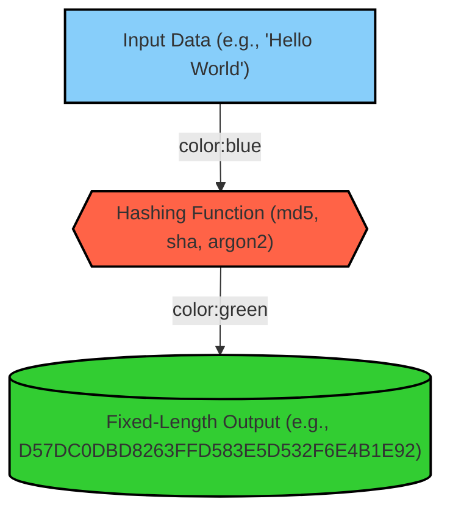

# Cryptography, passwords, hashing, salting, encryption

## Introduction

In this section, we will explore some of the foundational concepts in cryptography that are essential for developers to understand. Hash functions and salting are critical techniques used in securing sensitive data, such as passwords. By gaining a solid understanding of these concepts, developers can build more secure systems and defend against common attacks, such as rainbow table attacks.

## Basic Concepts

### Hash

A hash function is a one-way function that transforms input data, such as a password, into a fixed-length output, typically in the form of a string of characters. It is computationally infeasible to reverse this transformation to get the original input from the hash. Hash functions are widely used in many areas of software security, including password storage.

[Video overview of hash functions](https://youtu.be/NuyzuNBFWxQ?t=100)

### Salt

In cryptography, a salt is random data that is used as additional input to a one-way function that hashes data like a password. Salting helps defend against precomputed attacks that involve using large precomputed tables of possible hashes to crack passwords.

[Video overview of salt](https://youtu.be/NuyzuNBFWxQ?t=247)

[Wikipedia on Salt (Cryptography)](https://en.wikipedia.org/wiki/Salt_\(cryptography\))

#### Salting Process

The core idea of salting is to make each user's password unique, even if multiple users have the same password. Here is how it works:

1. A new salt is randomly generated for each password.
2. The salt is concatenated with the password (or its version after key stretching).
3. This combined input is then fed into a cryptographic hash function.
4. The resulting hash value, along with the salt, is then stored in a database.

This means that every user has a unique salt and therefore a unique hash for their password, even if their passwords are identical.

The salt is stored alongside the hash value in the database. It need not be kept secret, because knowing the salt alone is not enough to derive the original password.

If a completely random salt is created, it is typically stored in the hash itself, either by prepending or appending it, or by integrating it in some manner. This allows the system to later extract the salt when needed during the password verification process.

#### Rainbow Table Attacks

Rainbow table attacks involve using precomputed tables of hashed passwords to easily identify a password. Salting mitigates this risk by making each password hash unique. An attacker would need to generate a new table for each user, which makes such attacks impractical.

No, systems like Django do not typically use the same salt for all users. Instead, Django generates a unique salt for each user’s password when hashing. This approach enhances security by ensuring that even if two users have the same password, their hashed values will differ due to the unique salts. This method mitigates risks such as rainbow table attacks.

For more details, you can refer to the [Django documentation](https://docs.djangoproject.com/en/5.1/topics/auth/passwords/#password-management).

#### Example Passwords and Hashes

| Password   | Hash Value                                      |
|------------|------------------------------------------------|
| 123456     | e10adc3949ba59abbe56e057f20f883e               |
| password   | 5f4dcc3b5aa765d61d8327deb882cf99               |
| 12345      | 827ccb0eea8a706c4c34a16891f84e7b               |
| 12345678   | 25d55ad283aa400af464c76d713c07ad               |
| football   | 37b4e2d82900d5e94b8da524fbeb33c0               |
| qwerty     | d8578edf8458ce06fbc5bb76a58c5ca4               |

Reference: Rosulek, Mike (January 3, 2021). "Chapter 11: Hash Functions" (PDF). *The Joy of Cryptography*, pp. 204–205.

