# SSH


## Related Documents {#related-documents}

[GPG - PGP](cryptography-pgp-gpg.md)  

[\[GUIDE\] Sops - editor of encrypted files](https://docs.google.com/document/d/1Z7hGLmjbeMN-k3_hfFATVr1Z9E3sLojerbKH6GObpW0/edit)

[HOWTO: basic usage of SSH](cryptography-ssh-basic-howto.md)

## Overview of what SSH is

SSH, also known as Secure Shell, is a popular protocol used to securely access computers over an unsecured network. SSH is widely used by system administrators and developers to securely log into remote computers.

**SSH Protocol** and **SSH Keys** are two distinct concepts, though they are closely related and often used together in secure communications:

- **SSH Protocol**: The protocol is the set of rules that governs how the two parties (client and server) communicate with each other. It defines the handshake, the encryption and decryption of messages, and the authentication process. It works based on two concepts:
  - [public-key cryptography](https://en.wikipedia.org/wiki/Public-key_cryptography)
  - [challenge-response authentication](https://en.wikipedia.org/wiki/Challenge%E2%80%93response_authentication)

- **SSH Keys**: The keys are the cryptographic keys used for encrypting and decrypting messages exchanged between the two parties. Each key pair consists of a public key and a private key. Every user has a pair of keys.

### How do SSH keys work?

Public-key cryptography, also known as asymmetric cryptography, employs the use of a pair of keys. Each pair consists of a *public key* and a *private key*. The private key should be secured and known only to the user who generates the keys. The public key is safe to be shared publicly and will be shared with the SSH server the user wants to connect to.

In public-key cryptography, each person has these two special keys. To get a sense of how they work, consider the following metaphor:

1. Public Key: This key is like a mailbox that anyone can drop letters into. It’s safe to share with everyone.
2. Private Key: This key is like the key to your mailbox. Only you should have it, and it keeps your letters safe.

How It Works:

- Special Math Tricks: The magic behind these keys comes from math tricks that make it easy to create the public key from the private key, but very hard, practically impossible, to figure out the private key from the public key. This is the first math property that makes public-key cryptography possible and secure.
- Sending Messages encrypted with public key: When someone wants to send you a secret message, they can use your public key (the mailbox) to lock up the message. Only you can unlock it with your private key (the mailbox key). If someone intercepts the message, they won't be able to decrypt it with your public key. The roles of the public and private keys can indeed be inverted when it comes to sending messages securely:
  - Sender encrypts the message using your public key (lock).
  - The encrypted message can only be decrypted using your private key (key).

```mermaid
graph TD
    Sender -->|Uses Receiver's Public Key| EncryptedMessage
    EncryptedMessage -->|Sent over Public Network| PublicNetwork
    PublicNetwork -->|Recieved by| Receiver
    PublicNetwork -->|Intercepted by| Interceptor
    Interceptor -->|Cannot decrypt| FailedDecryption[🛑 Failed Decryption]
    Receiver -->|Uses Private Key| DecryptedMessage[🟢 Success: Decrypted Message]

    style Sender fill:#87CEFA,stroke:#000,stroke-width:2px, color:#000
    style EncryptedMessage fill:#32CD32,stroke:#000,stroke-width:2px, color:#000
    style PublicNetwork fill:#FFD700,stroke:#000,stroke-width:2px, color:#000
    style Interceptor fill:#FF6347,stroke:#000,stroke-width:2px, color:#000
    style Receiver fill:#87CEFA,stroke:#000,stroke-width:2px, color:#000
```



This explanation helps illustrate how public and private keys work together and highlights the security properties that ensure only the intended recipient can read the messages. This is the basis of the SSH protocol that we will illustrate next.

The SSH protocol is commonly used via the [OpenSSH](https://www.openssh.com/) implementation, which supports and uses a large number of cryptography systems. There are two broad classifications of the systems in use, based on their mathematical properties:

* [Integer factorization](https://en.wikipedia.org/wiki/Integer_factorization), such as [Rivest, Shamir, and Adleman (RSA)](https://en.wikipedia.org/wiki/RSA_\(cryptosystem\)) and [Digital Signature Algorithm (DSA)](https://en.wikipedia.org/wiki/Digital_Signature_Algorithm), relies on the fact that it’s easy to multiply two very large prime numbers but practically difficult to factorize the result back to recover the primes. 3072-bit RSA is the default key type and size produced by ssh-keygen.  
* [Elliptic curve cryptography](https://en.wikipedia.org/wiki/Elliptic-curve_cryptography), such as [Elliptic Curve Digital Signature Algorithm (ECDSA)](https://en.wikipedia.org/wiki/Elliptic_Curve_Digital_Signature_Algorithm) and [Ed25519](https://en.wikipedia.org/wiki/EdDSA), relies on certain [elliptic curves](https://en.wikipedia.org/wiki/Elliptic_curve) and their [discrete logarithm problem](https://www.doc.ic.ac.uk/~mrh/330tutor/ch06s02.html) being hard. Where supported, elliptic curve keys often provide improved performance and simpler usage than integer factorization keys. [Many modern configurations](https://infosec.mozilla.org/guidelines/openssh#modern) standardize on Ed25519 keys.


### The SSH protocol: How SSH keys are used

Imagine you need to securely connect to a remote server over the internet, perhaps to manage files or run commands. The SSH (Secure Shell) protocol is designed to do just that, using a system of keys to verify the identity of both parties. 

When a developer requests access to a server, the system administrator typically asks for the developer's public key or retrieves it from a company database and places it on the server:


With the developer’s public key on the server, let’s see what happens during the SSH connection process:

1. **Sends Public Key ID**: The client sends the ID of the key pair it wishes to authenticate to the server.
2. **Checks authorized_keys (internal)**: The server checks its .ssh/authorized_keys file for a matching public key associated with the received ID.
3. **Sends Challenge encrypted with Public Key**: If a matching public key is found, the server generates a challenge and sends it to the client, encrypted with the user’s public key.
4. **Decrypts Challenge and calculates MD5 hash (internal)**: The client decrypts the challenge using its private key and calculates the MD5 hash of the result.
5. **Sends MD5 hash as response**: The client sends the calculated MD5 hash back to the server as the response.
6. **Validates response by calculating MD5 hash (internal)**: The server independently calculates the MD5 hash and compares it with the received hash. If they match, the client is authenticated.


### Impersonation Prevention

- **Identity Verification**: Because only the legitimate user possesses the private key, the server can be confident that the response came from the actual user and not an imposter. If someone were to attempt to impersonate the user without having access to the private key, they would be unable to correctly decrypt the challenge or generate a valid response.
- **Unique Challenge for Each Session**: By using a unique challenge for each connection attempt, the SSH protocol further enhances security. Even if an attacker were to intercept a previous response, they could not reuse it because the challenge would be different for each session.


### Shared secret: optimizing the connection
Once the server is verified, both parties use algorithms like [Diffie-Hellman key exchange](https://en.wikipedia.org/wiki/Diffie%E2%80%93Hellman_key_exchange) and [elliptic-curve Diffie-Hellman key exchange](https://en.wikipedia.org/wiki/Elliptic-curve_Diffie%E2%80%93Hellman) to create a **shared secret** that is used to encrypt subsequent communication.

### A real-world example

When you connect with a SSH client to a remote server, the SSH client will show a fingerprint of the server’s public host key:

```
$ ssh pi@192.168.0.4  
The authenticity of host '192.168.0.4 (192.168.0.4)' can't be established.  
ED25519 key fingerprint is SHA256:5lkC61T+vQ7mR4INcwBktQaolmAswQx9bws/cT+A/Kc.  
This key is not known by any other names  
Are you sure you want to continue connecting (yes/no/\[fingerprint\])? 
```

The message `The authenticity of host '192.168.0.4 (192.168.0.4)' can't be established` typically appears when you attempt to connect to an SSH server for the first time. This warning indicates that the SSH client does not recognize the host’s public key, which is a security feature to prevent man-in-the-middle attacks. Here’s a breakdown of what this means and how to handle it:

1. First Connection: When you connect to an SSH server for the first time, your SSH client checks its list of known hosts (stored in ~/.ssh/known_hosts) to see if it recognizes the server’s public key. If the key is not found, it cannot verify the authenticity of the server.
2. Potential Risks: This warning is important because it protects you from connecting to a potentially malicious server that could be impersonating the legitimate one. An attacker could be trying to intercept your connection.
3. Accept the Host Key:
	* If you are confident that you are connecting to the correct server and the key is legitimate, you can proceed to accept the key. This is usually done by typing “yes” when prompted.
	* Once you accept the key, it will be stored in your ~/.ssh/known_hosts file, and you won’t receive the warning again for that server.
4. If Unsure, Cancel the Connection:
	* If you are not sure about the authenticity of the server or its public key, it’s best to cancel the connection to avoid potential security risks.

* `ED25519 key fingerprint is SHA256:5lkC61T+vQ7mR4INcwBktQaolmAswQx9bws/cT+A/Kc.` : The fingerprint of the server’s public host key.
* `This key is not known by any other names` : The server’s public host key is not known by any other names.


Once the client verifies and accepts the fingerprint, it is stored in the \~/.ssh/known\_hosts file and will be automatically verified when used again.


## SSH host keys

A discussion about SSH keys is incomplete without mentioning SSH host keys. While SSH keys are used to verify a client’s identity, host keys are used to verify the identity of the server, ensuring that the client is connecting to the correct remote machine.

Host keys are also generated as public and private key pairs and are automatically created when OpenSSH is installed. These keys are typically stored in /etc/ssh with filenames such as `ssh_host_rsa_key`, `ssh_host_dsa_key`, `ssh_host_ecdsa_key`, and `ssh_host_ed25519_key`. The corresponding public keys have the `.pub` extension.

Each server can have a host key for every supported algorithm, and these keys are usually stored in:

* `/etc/ssh/ssh_host_dsa_key`
* `/etc/ssh/ssh_host_ecdsa_key`
* `/etc/ssh/ssh_host_ed25519_key`
* `/etc/ssh/ssh_host_rsa_key`


### Algorithms

ref: [https://medium.com/risan/upgrade-your-ssh-key-to-ed25519-c6e8d60d3c54](https://medium.com/risan/upgrade-your-ssh-key-to-ed25519-c6e8d60d3c54)	

The most common algorithms used in 2023:

* 🚨 DSA: It’s unsafe and even no longer supported since OpenSSH version 7, you need to upgrade it\!  
* ⚠️ RSA: It depends on key size. If it has 3072 or 4096-bit length, then you’re good. Less than that, you probably want to upgrade it. The 1024-bit length is even considered unsafe.  
* 👀 ECDSA: It depends on how well your machine can generate a random number that will be used to create a signature. There’s also a [trustworthiness concern](https://www.hyperelliptic.org/tanja/vortraege/20130531.pdf) on the NIST curves that being used by ECDSA.  
* ✅ Ed25519: It’s the most recommended public-key algorithm available today\!

#### Ed25519

By default the keypair name is:

* **id_ed25519**  
* **id_ed25519.pub**

Benefits:

* The Ed25519 was introduced on OpenSSH version 6.5. It’s the EdDSA implementation using the Twisted Edwards curve. It’s using elliptic curve cryptography that offers a better security with faster performance compared to DSA or ECDSA.  
* Today, the RSA is the most widely used public-key algorithm for SSH key. But compared to Ed25519, it’s slower and even considered not safe if it’s generated with the key smaller than 2048-bit length.  
* **The Ed25519 public-key is compact.** It only contains 68 characters, compared to RSA 3072 that has 544 characters. Generating the key is also almost as fast as the signing process. It’s also fast to perform batch signature verification with Ed25519. It’s built to be collision resilence. Hash-function collision won’t break the system.


## Best practices for SSH keys {#best-practices-for-ssh-keys}

Although SSH keys offer excellent security and ease of use, they can be compromised if not used correctly. Following are some best practices that can help.

### Keep private keys private

Keeping private keys secure is crucial, yet private SSH keys are often leaked online due to user carelessness. Common causes include accidentally committing keys to public repositories, emailing them, or sharing them with third parties.

Tips to Protect Your Private Keys:

* **Use an SSH agent**: An SSH agent can manage your keys and allow you to use them without exposing the private key directly. This keeps the key secure in memory while you work.
* **Always set a passphrase**: This adds an extra layer of security, preventing unauthorized access even if the key is stolen.
* **Use a password manager**: Tools like 1Password can securely store your SSH keys and passphrases, making it easier to manage them safely.
* **Set proper file permissions**: Ensure your private key has permissions of 600 (readable and writable only by the owner) or 400 (readable only). Use the command: `chmod 600 ~/.ssh/id_rsa`
* **Keep keys out of public repositories**: Use `.gitignore` or similar methods to prevent accidental commits.

SSH will refuse to run if permissions are too open, displaying an error like: `Permissions 0644 for 'id_rsa' are too open.`

By following these practices, including using an SSH agent and a password manager, you can significantly enhance the security of your private keys.


#### Use 1Password to protect your private key

Using 1Password to manage your SSH keys can greatly enhance your security and streamline your workflow. Here are some steps to help you get started:

1. **Store your private key in 1Password**: 
   - Open 1Password and navigate to the vault where you want to store your SSH key.
   - Click on the "+" button to add a new item and select "Secure Note".
   - Paste your private key into the secure note and save it.

2. **Access your private key from 1Password**:
   - When you need to use your private key, open 1Password and navigate to the secure note containing your key.
   - Copy the private key to your clipboard.

3. **Add the private key to your SSH agent**:
   - Open your terminal.
   - Use the `ssh-add` command to add the private key to your SSH agent. For example:
     ```sh
     ssh-add - <<< "$(pbpaste)"
     ```
     This command assumes you are using macOS and have copied the private key to your clipboard using 1Password. For other operating systems, you may need to adjust the command accordingly.
   - See more about the ssh agent [here](#ssh-agent).

4. **Automate the process**:
   - To make this process even more seamless, you can create a script that retrieves the private key from 1Password and adds it to your SSH agent automatically. This can be done using the 1Password command-line tool (`op`).

By following these steps, you can ensure that your private key is securely stored and easily accessible whenever you need it.


#### Use a passphrase and add the key to your ssh-agent

Then add it to your ssh-agent ⇒ [\[JOB\] Add a key to your ssh-agent](https://docs.google.com/document/d/1gYceTgjYjYrVqRJZ-uHItOifQKCfACuyJmvNLtOWwHM/edit#heading=h.ot1b1xtl5uap)

**🔥⚠️⚠️usa a PASSPHRASE \!\!,  use the strong one \!\!\!🔥⚠️⚠️**

You can also use the same passphrase like any of your old SSH keys.

* `-o` : Save the private-key using the new OpenSSH format rather than the PEM format. Actually, this option is implied when you specify the key type as `ed25519`.  
* `-a`: It’s the numbers of KDF (Key Derivation Function) rounds. Higher numbers result in slower passphrase verification, increasing the resistance to brute-force password cracking should the private-key be stolen.  
* `-t`: Specifies the type of key to create, in our case the Ed25519.  
* `-f`: Specify the filename of the generated key file. If you want it to be discovered automatically by the SSH agent, it must be stored in the default \`.ssh\` directory within your home directory.  
* `-C`: An option to specify a comment. It’s purely informational and can be anything. But it’s usually filled with `<login>@<hostname>` who generated the key.


### Keep track of actively used SSH keys

A 2017 study of over 400 IT security professionals revealed that [90% of the respondents didn’t have a complete and accurate inventory of all SSH keys being used](https://www.businesswire.com/news/home/20171017005080/en/Study-61-Percent-Organizations-Minimal-Control-SSH). The repercussions of this could be dire — for example, if a user leaves or is terminated but an inaccurate inventory prevents their SSH keys from being revoked, [that user would still have the ability to access the company’s infrastructure](https://tailscale.com/blog/rotate-ssh-keys/).

### Rotate SSH keys

You’re probably familiar with the best practice of changing passwords every six months. SSH key rotation is based on this same concept: Rotating SSH keys essentially means regenerating and replacing the key pairs. By rotating your keys, you can invalidate your old keys and safeguard your infrastructure in case the old keys are compromised.

However, this is a very tedious process and can quickly become unwieldy. If you have your private keys on multiple computers, you must copy the new key to each of them, and if your public key is on multiple servers, you must also replace those.

While there are [ways to make this process easier](https://www.linuxjournal.com/content/ssh-key-rotation-posix-shell-sunset-nears-elderly-keys), it can still be daunting, and the alternatives, like [U2F hardware keys](https://duo.com/decipher/openssh-adds-support-for-u2f-hardware-keys) or [SSH jump hosts](https://www.techrepublic.com/article/how-to-use-ssh-to-proxy-through-a-linux-jump-host/), come with their own downsides and risks.

### Verify host keys

As mentioned before, you are prompted to verify the server’s fingerprint when connecting to a server for the first time. If the fingerprint doesn’t match, that could mean the server is malicious, the public key is outdated, or you’re falling victim to a [man-in-the-middle attack](https://www.ssh.com/academy/attack/man-in-the-middle). If you’re a user, you should get the correct fingerprint from the SSH server administrator and must verify the host key fingerprint before connecting to the server. If you’re an administrator, you can generate the [fingerprint from the host key](https://docs.bmc.com/docs/display/itda27/About+the+SSH+host+key+fingerprint).

If the server’s host key has changed, you’ll be greeted with an error when you try to SSH to the server:  
```
@@@@@@@@@@@@@@@@@@@@@@@@@@@@@@@@@@@@@@@@@@@@@@@@@@@@@@@@@@@  
@    WARNING: REMOTE HOST IDENTIFICATION HAS CHANGED\!     @  
@@@@@@@@@@@@@@@@@@@@@@@@@@@@@@@@@@@@@@@@@@@@@@@@@@@@@@@@@@@  
IT IS POSSIBLE THAT SOMEONE IS DOING SOMETHING NASTY\!  
Someone could be eavesdropping on you right now (man-in-the-middle attack)\!  
It is also possible that a host key has just been changed.  
The fingerprint for the RSA key sent by the remote host is  
xx:xx:xx.  
Please contact your system administrator.  
Add correct host key in /home/hostname /.ssh/known\_hosts to get rid of this message.  
Offending RSA key in /var/lib/sss/pubconf/known\_hosts:4  
RSA host key for pong has changed and you have requested strict checking.  
Host key verification failed.
```

If you can verify that the host key change is legitimate, you can remove the offending entry from the `known_hosts` file with `ssh-keygen -R <hostname_of_the_server>`, or you can remove it manually.


### Generating Ed25519 Key

You can have multiple SSH keys on your machine. So you can keep your old SSH keys and generate a new one that uses Ed25519. This way you can still log in to any of your remote servers. Then slowly replace the authorized key on your remote servers one by one with the newly generated Ed25519 public-key.

| ssh-keygen \-o \-a 100 \-t ed25519 \-f \~/.ssh/id\_ed25519 \-C "john@example.com" |
| :---- |

### Organize a ssh keys and config in subfolder `~/.ssh/my_project`

Keeping your SSH keys and configuration files organized by project is a practical approach, especially if you work with multiple projects that require different access credentials. Here are some steps and considerations to help you set this up effectively:

Directory Structure:

* create a Project-Specific folder in your .ssh directory. For example, .ssh/my\_project/.  
* Inside each project-specific directory, store the relevant SSH keys and a config file.

Configuring SSH:

* SSH Config File: In each project-specific directory, create a **.ssh/my\_project/`config`** file. This file can specify Host, User, IdentityFile, and other SSH options specific to that project.  
  Example:

| Host myprojecthost    HostName example.com    User myusername    IdentityFile \~/.ssh/my\_project/id\_rsa    IdentitiesOnly yes |
| :---- |

* Global SSH Config: In your main `.ssh/config` file, you can include the project-specific config files using the `Include` directive:

| Include \~/.ssh/my\_project/config |
| :---- |

OR IN ALTERNATIVE SSH allows you to specify a different configuration file than the default \~/.ssh/config. You can use the \-F option followed by the path to your custom configuration file when executing SSH commands. This can be particularly useful when you're managing project-specific SSH configurations.

Here's how you can use it: `ssh -F ~/.ssh/pdb/config [other_ssh_options] hostname`

Permissions:

* Ensure that the permissions for your project-specific SSH keys and config files are correctly set. SSH keys usually require strict permissions (like `600` for private keys).

Example project ⇒ PDB [⭐ Produzioni Dal Basso - Overview and Getting Started ⭐ ](https://docs.google.com/document/d/1HjYJOvBUw2tGkBklx3sKuLDIY1a7sYeD8AbVuM5hb8s/edit)

## HOWTO Get SSH Key Fingerprint

`ssh-keygen -E md5 -lf ~/.ssh/id_rsa.pub`

## HOWTO use a specific private-key to SSH into a remote server

The SSH protocol already allows the client to offer multiple keys on which the server will pick the one it needs for authentication. However, we can also specify a specific private-key to use like so: `ssh -i ~/.ssh/id_ed25519 john@198.222.111.33`

Or you can even add an entry to the `~/.ssh/config` file to configure these options:

```
Host awesome
  HostName 198.222.111.33
  User john
  IdentityFile ~/.ssh/id_ed25519
  IdentitiesOnly yes
```


Once it’s saved, later you can SSH to your target host like this: `ssh awesome`

## SSH-Agent

> [!WARNING]
> These part about the ssh-agent are not yet completed. It could be moved to a separate page.


### HOWTO Add a key to your ssh-agent


You can find your private key at `~/.ssh`  (ie  `~/.ssh/id_ed25519` ). Always remember that your public key is the one that you copy to the target host for authentication.

Before adding your new private key to the SSH agent, make sure that the SSH agent is running by executing the following command:

`eval "$(ssh-agent -s)"`

Then run the following command to add your newly generated Ed25519 key to SSH agent:

`ssh-add ~/.ssh/id_ed25519`

Or if you want to add all of the available keys under the default `.ssh` directory, simply run:

`ssh-add`

### What is an SSH-Agent? {#what-is-an-ssh-agent?}

Scenario:

* As a security measure, people protect their private keys with a passphrase, so any authentication attempt would require you to enter this passphrase.  
* This can be undesirable, so the ssh-agent caches the key for you and you only need to enter the password once, when the agent wants to decrypt it.  
* The benefit to ssh-agent is that **you only need to enter your passphrase once**. If your private RSA key is not encrypted with a passphrase, then ssh-agent is not necessary. The ssh command would be an example of a client.

ssh-agent is a program to hold private keys used for public key authentication (RSA, DSA). 

**Security**: ssh-agent creates a **socket** and then checks the connections from ssh. Everyone who is able to connect to this socket also has access to the ssh-agent. The permissions are set as in a usual Linux or Unix system. When the agent starts, it creates a new directory in /tmp with restrictive permissions. The socket is located in the folder.

When you connect to an SSH deamon, the verification to the server is based on **challenge-response authentication**.

* ssh connects to the server with a user name and the request for a key.   
* The ssh daemon gets the request and sends back a challenge based on the public key stored in the authentication file.  
* ssh uses the private key to construct a key response, and sends it to the waiting sshd on the other end of the connection. It does not send the private key itself.   
* The ssh daemon validates the key response, and if valid, grants access to the system.  
* ssh-agent simplifies this by creating a socket that listens for SSH connections. The user simply starts ssh-agent, telling it how to find their keys (if they are not in the default location), enters the passphrase for each key to be used, on a one-time basis, and then ssh-agent handles the rest every time the user connects to a remote server.  
* The SSH agent never hands the private keys to client programs, but merely presents a socket over which clients can send it data and over which it responds with data signed with the private keys ( A side benefit of this is that you can use your private key even with programs you don't fully trust).

### SSH-Agent and multiple keys {#ssh-agent-and-multiple-keys}

Using a key agent also allows using multiple keys easily.   
Instead of having to specify the path to the key, when using a key agent ssh will try every key in it.

NOTE: 

* try too many invalid keys on a server and it will close the connection before you got to the valid key.   
* Of course, that's what \~/.ssh/config's IdentityFile option is good for, with or without the agent  
* you can have multiple keys without an agent, but you can also specify in your \~/.ssh/config which key to use for which remote host, so that it knows exactly which one it needs

### SSH-Agent Forwarding {#ssh-agent-forwarding}

SSH agent can be forwarded over SSH. So when you ssh to host A, while forwarding your agent, you can then ssh from A to another host B without needing your key present (not even in encrypted form) on host A.

[Using SSH agent forwarding \- GitHub Docs](https://docs.github.com/en/authentication/connecting-to-github-with-ssh/using-ssh-agent-forwarding)  
[An Illustrated Guide to SSH Agent Forwarding](http://www.unixwiz.net/techtips/ssh-agent-forwarding.html) 

## Use SSH-Agent with AWS SSM {#use-ssh-agent-with-aws-ssm}

[https://alestic.com/2018/12/aws-ssm-parameter-store-git-key/](https://alestic.com/2018/12/aws-ssm-parameter-store-git-key/)

TODO: how can we inject AWS credential in a git build?

# GIT

> [!WARNING]
> These part about the git are not yet completed. It should be moved to a separate page. We reverse the information in the Addictive Slack and add both here in my doc and in the Addictive Doc.

## HOWTO tell git which private key to use

[http://superuser.com/questions/232373/how-to-tell-git-which-private-key-to-use](http://superuser.com/questions/232373/how-to-tell-git-which-private-key-to-use) 

ssh-agent  
     If a command line is given, this is executed as a subprocess of the agent.  When the command dies, so does the agent.

# TailScale (WIP)

> [!WARNING]
> These part about the git are not yet completed and may be we don't need it. It should be moved to a separate page.

### How to generate an SSH key with Tailscale

⇒ [How to generate SSH keys · Tailscale](https://tailscale.com/learn/generate-ssh-keys/#how-to-generate-an-ssh-key-with-tailscale) 