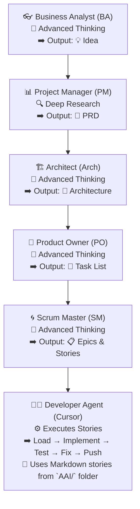

## Inbox

### How to Force your Cursor AI Agent to student Always follow your Rules using Auto-Rule Generation Techniques

How to Force your Cursor AI Agent to student Always follow your Rules using Auto-Rule Generation Techniques:
https://forum.cursor.com/t/how-to-force-your-cursor-ai-agent-to-always-follow-your-rules-using-auto-rule-generation-techniques/80199

- Based on https://github.com/bmadcode/cursor-custom-agents-rules-generator/tree/main

### Agile Development with Cursor AI

Intro: Better Than Vibe Coding: Agile AI Driven Development for Complex Apps

Original Videos:
- Part1: https://www.youtube.com/watch?v=JbhiLUY_V2U Intro, high level overview

What I outlined in the video and update can be found in more details here: https://github.com/bmadcode/BMAD-METHOD 

### 🧠 AIADD Method: Agile-AI Driven Development (Part 1 Summary)

**Source**: BMAD Code – YouTube  
- **Part1**: https://www.youtube.com/watch?v=JbhiLUY_V2U — *Intro, high-level overview*

**Speaker**: Brian (20+ years experience in software development)  
**Goal**: Use structured Agile-style roles with modern LLMs (like GPT-4, Gemini) to control AI agents (e.g., Cursor) and build scalable, maintainable applications.

#### Part1

**Why "Vibe Coding" Fails**

- Great for experimentation, bad for production.
- Lacks structure → leads to:
  - Broken logic
  - Infinite fix loops
  - Burned Cursor credits
  - Unscalable mess

---

**Solution: AIADD = Agile + AI Personas**

A structured development method assigning traditional Agile roles to AI agents. Most of the planning is done **outside Cursor** to reduce cost and improve reliability.

---

**AI Personas Workflow (with Model Suggestions)**

- **👓 Business Analyst (BA)**  
  Refines idea through high-level conversation.  
  *Model*: GPT-4 / Gemini (Advanced Thinking)  
  *Output*: Clear, refined concept ready for planning.

- **📊 Project Manager (PM)**  
  Researches technologies and competitors.  
  *Model*: OpenAI / Gemini (Deep Research)  
  *Output*: PRD (Product Requirements Document), MVP roadmap.

- **🏗️ Architect**  
  Designs the technical structure and stack.  
  *Model*: GPT-4 / Gemini Pro  
  *Output*: Architecture doc including tech stack, pages, security, infrastructure, DB schema.

- **🧭 Product Owner (PO)**  
  Creates detailed, sequenced task list.  
  *Model*: GPT-4 / Gemini (Advanced Reasoning)  
  *Output*: Tasks for junior devs, covering all steps (including setup and config).

- **🌀 Scrum Master**  
  Organizes tasks into Epics and Stories.  
  *Model*: GPT-4 / Gemini  
  *Output*: Markdown stories with full context, ready for agent execution.

- **👨‍💻 Developer Agent (inside Cursor)**  
  Implements stories one-by-one using Cursor.  
  *Model*: Cursor agent (likely GPT-4 or Claude)  
  *Process*: Load → Implement → Test → Fix → Push  
  *Docs*: All stories and docs in Markdown, stored in `AAI/` folder.

---

**Testing Strategy**

- Test every story during implementation.
- Target 80–90% test coverage.
- Use AI to assist with test generation.
- Prevent regressions as functionality grows.

---

**Benefits of AIADD**

- Saves time and money  
- Avoids agent confusion and retry loops  
- Builds scalable, maintainable apps  
- Beginner-friendly  
- Works for solo and team projects

---

**Bonus Tips**

- Plan everything before opening Cursor.
- Use structured Markdown docs in a dedicated `AAI/` folder.
- Each Cursor thread should handle just one story for isolation and clarity.

---

**What’s Next**

In the next video, Brian will:
- Demonstrate how to create these documents using Gemini and OpenAI.
- Show how to load and use them inside Cursor for actual development.

> Try this method yourself — no fancy prompts needed. Just structure, flow, and clarity.

#### Part2

## Cursor AI Rules

https://www.youtube.com/watch?v=JbhiLUY_V2U

https://notes.switchdimension.com/cursor-ai-rules

https://forum.cursor.com/t/using-the-project-rules-in-0-45-2/44447

A comprehensive system for managing AI interactions through memory management, lessons learned tracking, and dual-mode operation (Plan/Agent). This system ensures consistent, high-quality development while maintaining detailed project documentation and knowledge retention:
https://forum.cursor.com/t/rules-for-ultra-context-memories-lessons-scratchpad-with-plan-and-act-modes/48792

