# DevOps And DevSecOps Culture Explanation

## Scope of this document

This document is a high-level explanation of DevOps and DevSecOps. It is not a how-to guide.

Here are the main topics:

1. Introduction & Scope
2. What is DevOps?
3. Glossary
4. Methodology vs Process vs Tooling
5. Key Components
6. Benefits
7. Common Myths
8. Team Organization
9. Adoption Strategy

The document follows a logical flow from definition to implementation, covering both theoretical and practical aspects of DevOps culture.

## What is DevOps?

DevOps is a cultural and professional movement that integrates **development (Dev)** and **operations (Ops)** teams to enhance the software development lifecycle. 

The main GOAL of the DevOps movement is: **improve an organization's ability to deliver applications and services at high velocity**.

It promotes a collaborative environment between traditionally siloed teams, enabling them to work together more effectively throughout the software development process.

DevOps is a **holistic business practice** that combines people, technologies, cultural practices, and processes. 

Successful DevOps implementations are viewed as an **🌟 organizational change 🌟**.

There’s one word that perfectly describes successful DevOps: **🌟 flow 🌟**. 

As individuals, we experience a state of flow when everything in our work comes together naturally and at the right time. DevOps enables that kind of flow at the organizational level through a combination of culture, process and tooling.

Refs:

* [Atlassian](https://www.atlassian.com/devops)
* [Dynatrace](https://www.dynatrace.com/news/blog/what-is-devops/)
* [AWS](https://aws.amazon.com/devops/what-is-devops/)

```mermaid
mindmap
    root((DevOps is 🌟 Flow 🌟))
        (Culture and People)
            (Breaking Silos)
            (Collaboration)
            (Organizational Change)
        
        (Core Practices)
            (Security)
                (Shift Left)
                (Continuous Testing)
            (CI/CD Pipeline)
            (Infrastructure as Code)
            (Monitoring and Feedback)
        
        (Business Outcomes)
            (High Velocity Delivery)
            (Quality Software)
            (Reduced Risk)
        
        (Integration Points)
            (Code Management)
                (PROCESS 12Factor Configuration)
                    (TOOL Docker Compose, Django Settings, env vars)
                (PROCESS Version Control)
                    (TOOL Git, GitHub)
                (PROCESS Code Quality)
                    (TOOL SonarQube)
                (PROCESS Code Review)
                    (TOOL PR review)
            
            (Pipeline Automation)
                (PROCESS CI/CD)
                    (TOOL GitHub Actions)
                (PROCESS Testing)
                    (TOOL JUnit, Cypress)
                (PROCESS Deployment)
                    (TOOL Docker, Kubernetes, ArgoCD)
            
            (Team Collaboration)
                (PROCESS Project Management)
                    (TOOL Jira)
                (PROCESS Documentation)
                    (TOOL Mkdocs)
                (PROCESS Communication)
                    (TOOL Slack)
            
            (Observability)
                (PROCESS Monitoring)
                    (TOOL Prometheus, Grafana)
                (PROCESS Logging)
                    (TOOL ELK Stack)
                (PROCESS Tracing)
                    (TOOL Jaeger)
```

## Glossary

* **DevOps**: A cultural and professional movement that integrates development (Dev) and operations (Ops) teams to enhance the software development lifecycle.
* **DevOps Engineer**: A role that combines development and operations expertise, focusing on automating processes, improving collaboration, and ensuring efficient software delivery.
* **Software Development Life Cycle (SDLC)**: A structured process that guides the development of software through a series of stages.

## Methodology VS process VS tooling

Understanding the distinctions between methodology, process, and tooling is essential before diving into DevOps because DevOps integrates these elements to create seamless workflows, ensuring that teams can effectively collaborate, automate, and optimize development and operational practices.

In software development and project management, **methodology**, **process**, and **tooling** are three interconnected elements that together structure how projects are executed and managed. Each plays a distinct role:

* methodology offers the guiding philosophy,
* process translates that philosophy into specific actions,
* tooling provides the means to carry out those actions efficiently. 

Here’s how they differ and work together:

- **Methodology**:
  - The overarching framework or philosophy behind project execution.
  - Establishes principles, best practices, and roles to guide work.
  - Examples: Agile, Waterfall, Lean.
  - Defines the *why* and *what* of managing work, setting goals, and adapting to change.

- **Process**:
  - The specific, repeatable steps or actions within the chosen methodology.
  - Transforms the methodology’s guidelines into operational steps.
  - Examples: sprint planning, code review, deployment.
  - Focuses on the *howto*, making the methodology actionable.

- **Tooling**:
  - The software and digital tools that support processes and methodologies.
  - Facilitates automation, tracking, and collaboration for project tasks.
  - Examples: JIRA (task management), Git (version control), Jenkins (CI/CD).
  - Provides the *means* to execute both methodology and process effectively.

In short, methodology defines the *why*, process clarifies the *how*, and tooling empowers these elements to function effectively and consistently.

## Key Components of DevOps Methodology

There are a few key concepts and principles that every successful DevOps program shares. Combining these with the right tooling, process, and culture will help teams find DevOps success. While DevOps will look different for each organization and team, here are a few starting pointers:

-   **Shared ownership:** [Effective collaboration](https://resources.github.com/whitepapers/Best-practices-collaborative-software-development/) relies on shared ownership --- understanding and embracing that everyone is responsible and contributes to the work in some way. Each person involved, whether building the application, maintaining it, or contributing in another capacity, knows that they have a stake in the outcome. The old process of tossing work over the wall at the other team is broken down in the DevOps paradigm.

-   **Collaboration**: DevOps promotes a culture where development, operations, quality assurance, and security teams work closely together. This collaboration helps break down barriers that typically slow down the software delivery process ([Microsoft](https://learn.microsoft.com/en-us/devops/what-is-devops?WT.mc_id=devops-9472-jagord), [GitHub](https://github.com/resources/articles/devops/what-is-devops)).

-   **Workflow Automation**: A significant aspect of DevOps is the automation of repetitive tasks such as code integration, testing, deployment, and monitoring. This automation not only speeds up processes but also reduces the risk of human error.

-   **Continuous Integration and Continuous Delivery (CI/CD)**: These practices involve regularly integrating code changes into a shared repository and automating the deployment process. CI/CD allows teams to release updates quickly and reliably, ensuring that software is always in a deployable state ([AWS](https://aws.amazon.com/devops/what-is-devops/), [Reddit](https://www.reddit.com/r/devops/comments/812527/can_someone_explain_what_devops_is/)).

-   **Rapid feedback:** Automating repetitive tasks like reporting and testing provides rapid feedback so teams can quickly understand the impact of their changes throughout the software lifecycle. That understanding helps teams work together more efficiently, as passing changes from coders to builders, builders to testers, and testers back to coders creates a long loop of dependencies and blockers. Rapid feedback allows the developers and operations teams to make decisions together, and implement changes based on shared data.

## Benefits of DevOps

1.  **Faster Time to Market**: By streamlining processes and improving collaboration, organizations can accelerate their product release cycles.
2.  **Increased Efficiency**: Automation reduces manual work, enabling teams to focus on higher-value tasks.
3.  **Improved Quality**: Continuous testing and integration help catch issues earlier in the development process, leading to higher-quality software.
4.  **Enhanced Customer Satisfaction**: With faster delivery and improved product quality, organizations can better meet customer needs and adapt to market changes ([Dynatrace](https://www.dynatrace.com/news/blog/what-is-devops/), [Microsoft](https://learn.microsoft.com/en-us/devops/what-is-devops?WT.mc_id=devops-9472-jagord), [AWS](https://aws.amazon.com/devops/what-is-devops/)).
5.  **Automation reduces uncertainty**: DevOps encourages automation wherever possible. This allows people to spend more time focusing on building and improving the software and infrastructure it runs on. It also facilitates a faster delivery pipeline via core practices such as CI/CD, which enable DevOps practitioners to automate the integration and delivery of code changes.
6.  **Continuous measurement drives continuous improvement**: In a DevOps environment, tools are often used to measure and monitor each stage of the SDLC to provide rapid feedback on system health, real-time demand, and the impact of individual changes. DevOps practitioners use that insight to improve process and make changes based on data.

## Common DevOps myths

Once we understand what DevOps is, it's easier to identify what it isn't. 

Let's look at a few misconceptions you may have heard before.

### Myth: Having DevOps tools equals doing DevOps

Sometimes we hear teams say, "We use \[tool X\] or automate \[X process\], so now we're doing DevOps!" But as noted above, tooling and automation are part of how you implement DevOps (the means), not DevOps itself. It's a collaborative human endeavor, and our tooling---and the automation it supports---is how we get this work done. There are many tools in this space; while it's tempting to immediately adopt a specific set of DevOps tools or a prescribed toolchain to try to shortcut your DevOps journey, choosing the right tooling for your organization is key to your success.

### Myth: DevOps is Agile development - How DevOps differs from agile and friends

One of the most common myths we hear is that Agile and DevOps are the same. While it's easy to confuse the two, **processes like Agile are part of how to do DevOps, not what DevOps is**. 
Agile, Lean, Extreme Programming, and other "work fast, ship often" models are just a few of the many ways teams can make DevOps successful. 

Agile ships software faster, but it **doesn't ensure collaboration with other teams in the software lifecycle**, and can overwhelm test, QA, and operations teams if they're in a siloed organization.

The creators of agile software development principles recognized that over-planning stifled the creativity of software developers---and without working code no one could know if the plans even worked. [The Agile Manifesto](https://agilemanifesto.org/), for example, said that working software was more important than excessive documentation. Being responsive to change was more valuable than sticking to a plan.

In practice, the concepts behind the Agile Manifesto were revolutionary. It recognized that working code was the best way to understand and serve customer needs. But that focus on code also meant it had less to say about the rest of the SDLC.

If agile was a reaction against the old ways, DevOps builds upon agile's core ideas and applies it to the entire software development life cycle. In fact, some people in the early 2010s [called DevOps the second decade of agile](https://vslive.com/events/austin-2022/tracks/devops-and-beyond.aspx#:~:text=DevOps%20has%20been%20called%20the,can%20make%20all%20the%20difference.).

To understand the difference between DevOps and Agile, it helps to compare their core tenets:

-   **Fail fast vs. continuous improvement:** Agile centers on small, fast iterations where failure is embraced because it shows the process is working. In DevOps, the emphasis is on iteration, automation, and deep collaboration across the entire SDLC to improve delivery speeds and software quality.

-   **Developer-centric vs. team-centric:** Agile looks at how software developers can best serve customers, but has little to say about how code is tested, deployed, or maintained. In contrast, DevOps brings everyone in the SDLC together under a shared responsibility for delivering value to end users.

-   **Features vs. systems thinking:** Agile focuses on the here and now of a particular feature, whereas DevOps looks holistically at software as a system.

-   **Project-centric vs. product-centric:** Agile takes a more project-centric approach to software development by breaking large releases into small pieces of executable work. In contrast, DevOps takes a more product-centric view of software and resets the focus from individual projects to holistic products where every decision comes back to how it affects the long-term system as a whole.

### Myth: There's only one "right" version of DevOps

In practice, DevOps is different for every organization, as each brings its own unique constraints, strengths, talent, and goals; the tools and processes that worked in one company won't necessarily translate into success for another. Although there are common practices and principles for successful DevOps transformations, it's not pre-packaged in a box, and there are many ways that companies can successfully implement their own.

### Myth: DevOps is only about delivering value

While it's true that DevOps delivers value for organizations, helping them develop and deliver innovation to their end users with speed, stability, and reliability, there's so much more to it. DevOps started, in part, as a way to make software more humane. By automating our workflows, people can focus more on the task at hand. This brings more joy to our work and decreases burnout.

## Organizing your team for DevOps

DevOps programs are built on shared principles, and organizations will implement DevOps in different ways. At our company **we prefer the "one team for Dev and Ops" 🌟🌟🌟** approach.

**There isn't one "perfect way" of approaching DevOps** that's better than another, but there are tendencies and common pitfalls that can make particular approaches more challenging than others.

-   **Dedicated DevOps team for the company**. DevOps tools are numerous, complex, and often require specialized knowledge. By dedicating a specific team to bridging the gap between development and operations, you have a team that specializes in these tools and processes. A challenge with this approach is that it creates yet another silo, and is a bottleneck for approvals. Rather than breaking down the barriers between development teams and operations teams, DevOps teams themselves become the broker. If the DevOps team is small, they can end up being a blocker as numerous teams attempt to onboard and contribute to the established processes.

-   **Dedicated DevOps engineers on each team**. Assigning a DevOps engineer to each development team is another approach that can be successful. Having a DevOps engineer who spans development and operations teams for a given feature or product has the benefit of having a dedicated expert for certain tasks. Ideally, this expert can then guide and support the rest of the team on using tools and best practices. But this approach also risks treating this role as a funnel for automation work, sometimes even turning DevOps engineers into the lone gatekeeper for deploying code to production. Without carefully watching team practices, this can become overwhelming and lead to burnout for DevOps engineers, leaving the rest of the team unable to fill their shoes.

-   **One team for Dev and Ops**.  This third approach, the “one team for Dev and Ops” approach, involves creating integrated teams where **members handle both development and operational tasks**. Instead of separating roles or dedicating specific teams solely to operational functions (like deployments or infrastructure management), each team member takes on responsibilities across both areas for designated parts of the application. This approach helps avoid the pitfalls of the other two, but has the added challenge of a steeper learning curve. When this approach is done well, we often see specialists within the team taking on various responsibilities. The team shares the overall responsibilities, but individuals can support the rest of the team by picking up different pieces that match their interests or background. Key points of this approach:

    -   **Shared responsibility**: Each team member contributes to both development and operations, meaning the team collectively manages the entire lifecycle of features, including testing, release, and ongoing production support.
    -   **Seamless progression across environments**: Deployment and environment promotion (e.g., from testing to staging and production) become integrated into the development workflow, reducing reliance on external teams to progress a release.
    -   **Reduced silos**: By sharing responsibility, this model minimizes communication bottlenecks and intermediate steps, fostering efficiency and team autonomy while eliminating operational silos.
    -   **Learning curve challenges**: Since all team members are expected to possess skills in both development and operations, there can be a steeper learning curve, particularly for those less familiar with operational tasks.

When executed effectively, this model naturally encourages specialization within the team. Individual members may focus on particular tasks (such as infrastructure monitoring or deployment cycles), allowing them to support the team without creating rigid roles or isolated responsibilities.

### Conclusion

DevOps starts with your people, then is put into practice by building with your team’s culture, goals, strengths, and constraints in mind. Understanding these will drive how you design your specific processes, guide how you choose your DevOps tools, and shape which DevOps best practices you adopt—all leading your organization to its own definition of success.

There’s no one “right” way to implement DevOps. And like everything else in technology—and anything involving humans—DevOps tooling and practices will change. 

**🌟🌟🌟 By standardizing and automating**  your infrastructure, application delivery, and policies as code, you’ll be ready to adapt quickly—helping your team do their best work faster, while staying competitive.

## How an organization can adopt DevOps

Successfully adopting DevOps can require some big changes. But rather than reworking all of your processes and tooling overnight, you can take relatively small steps to get started. This might entail making cultural changes to how often your development team integrates their code or automating small pieces of the SDLC in your organization.

No matter where you are on your DevOps journey, there are six key steps you should take to successfully adopt DevOps:

1.  **Change the culture:** Success in DevOps starts with deep collaboration between everyone responsible for building, testing, operating, and shipping a product. And that starts with making sure everyone is unified and working together across all stages of the SDLC. This can be a big change for organizations that have role-based siloes between different teams. In a DevOps practice, everyone comes together to deliver higher-quality software faster to customers---and that requires deep collaboration between different people to ensure code is optimized to operate in production environments and production environments are optimized to run the software.

2.  **Focus on incremental builds:** DevOps favors small changes that can be quickly delivered to customers and that means breaking features into small chunks that are easier to test, minimize the impact of bugs, and can be shipped to production as fast as possible. There are no hard-and-fast rules in DevOps about how many times a day developers should be integrating new code changes---but the most successful DevOps practices integrate and ship multiple code changes a day.

3.  **Adopt the right tools:** In DevOps, there's no one-size-fits-all approach to tooling. In fact, "DevOps tools" is a bit of an umbrella term with plenty of products and platforms that fall into this category. Picking the right tools and building the right DevOps toolchain starts with identifying what problems you're trying to solve and what DevOps capabilities you need to invest in. But there are a number of common areas where you'll need tooling. Speaking of which ...

4.  **Automate everything you can:** The best DevOps environments think critically about their SDLC and look for places where automation can be applied to remove the need for human intervention---like repetitive tasks such as integrating, testing, and packaging code. By automating repetitive tasks, DevOps helps people make better use of their time and reduces the risk of human error (or people forgetting to run tests, import the right libraries, and so on). As a general rule of thumb, anything that can be automated should be automated in a DevOps practice.

1.  **Build a CI/CD pipeline:** One of the most common examples of DevOps automation, CI/CD applies automation to each step of the SDLC to facilitate a faster delivery of higher-quality software to end users. For example, a developer making a pull request might trigger a series of automated tests to avoid introducing problems into the main branch. And if the pull request is merged, a CI/CD pipeline might leverage automation to initiative the build process of the new software version. Every CI/CD pipeline will look different depending on the needs of the organization in question. But the goal is to apply as much automation as possible to the SDLC to improve software quality and increase the time to [deployment](https://resources.github.com/devops/fundamentals/ci-cd/deployment).

2.  **Measure and adjust:** A successful DevOps culture seeks out opportunities for improvement. Monitoring both application and system performance as well as the speed of SDLC is crucial to find inefficient processes. Good metrics help everyone working on a product get a view of their work as part of a larger whole, making it easier to visualize how the changes they make impact elsewhere.

### Common challenges organizations experience when adopting DevOps

Before beginning your move to DevOps, you should take note of some of the common challenges that organizations face when making the change. These include:

-   **Tools without the culture:** Tooling is often the most visible aspect of DevOps. But tools can have a limited impact without adopting a culture that emphasizes collaboration, shared accountability, and continuous improvement.

-   **Replace old siloes with new siloes:** The most successful DevOps environments replace role-based teams with deep, multidisciplinary collaboration. A common misstep is to create a dedicated DevOps team that acts as custodian of DevOps tools, practices, and processes. This approach risks replacing old barriers with new barriers.

-   **Legacy systems resist DevOps [models](https://resources.github.com/devops/model/):** Integrating older systems and architectures with newer tooling can be costly. The build time for a legacy monolith system, for example, could make it impractical for a CI/CD system where it will be built many times a day.

Adopting DevOps begins with a few small changes, growing until each stage of your SDLC follows the DevOps framework. Even then, there are always opportunities to improve.