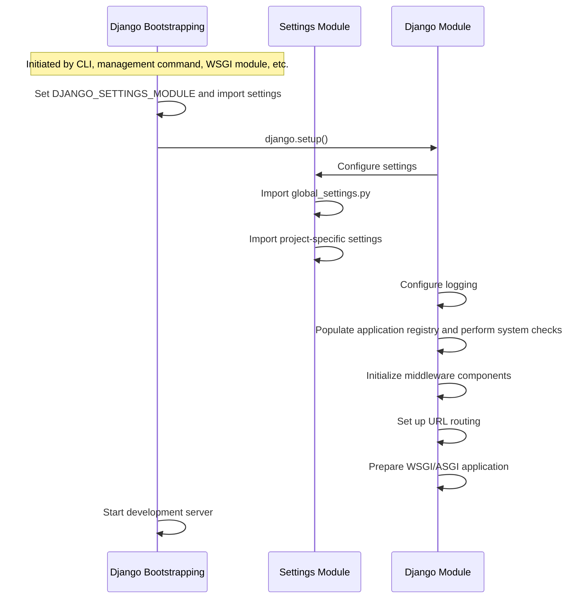
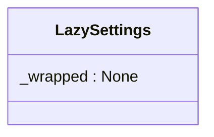
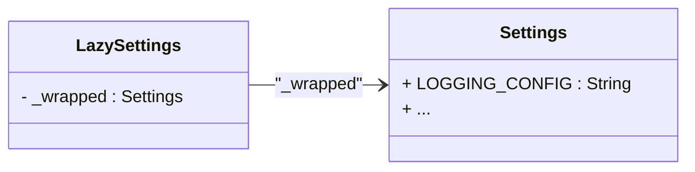
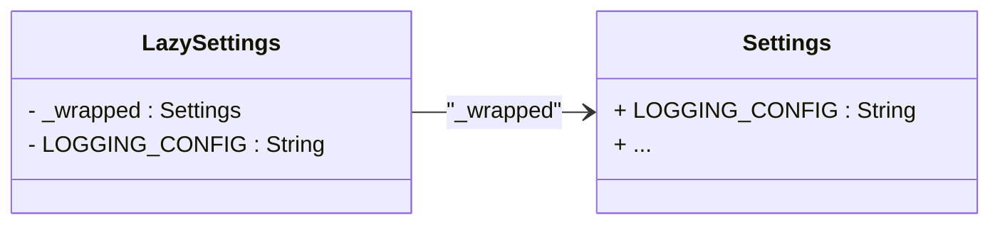

# TODO


## Appunti per confronto interno
* Minuto 20:00 del video - `Django Settings 2024-11-15 09-25-32.mkv` ipotizzavi che le app scrivessero nei Django Settings i loro valori di default. Questo è complesso perché:
* o lo dovresti fare prima che i settings vengano caricati 
* o devi evitare di sovrascrivere i valori già definiti nel settings.py principale
* cmq devi trovare un modo di far caricare settings della app in modo "automatico" (forse si potrebbe fare nel file di __init__.py dell'app? Questo rispecchierebbe il meccanismo di importazione delle app in Django)

In generale ho visto che l'ecosistema Django è invece molto più orientato a leggere i settings in un punto solo.

[django-storages](https://github.com/jschneier/django-storages),  Django rest framework ecc ecc sono esempi di come è fatto l'ecosistema Django.


* Per la questione del problema  di avere degli env file da caricare quando fai development nativo e non usi docker compose, non so se è davvero un problema. Ti puoi caricare gli env file dal tuo file settings.dev.py. Ci sono librerie che lo fanno automaticamente. Da capire se danno predecedenza all'env definito già nella shell o se sovrascrivono...

Environs read_env()
https://github.com/sloria/environs/blob/815a4773419a7e8496fabe970fc1eef556e0f0d9/src/environs/__init__.py#L452

che sotto usa https://pypi.org/project/python-dotenv/

By default, load_dotenv doesn't override existing environment variables. quindi non è un problema.


### Appunti PDB

Settings: da sistemare:
- https://bitbucket.org/folkfunding/produzionidalbasso/src/02ddbb54c9dfc8b74ea686ad9194b116428e4f94/produzioni-dal-basso/payment/settings.py#produzioni-dal-basso/payment/settings.py-83:89

Non è chiarissimo a livello di settings dei payment cosa è di lemonway, cosa è generico di payment:


#### Altra cosetta sui test che non ha a che fare con le settings

Dove mettere le fixture per i test?


### django-configurations
Altro tema:
https://django-configurations.readthedocs.io/en/stable/
Questo non pensoci serva

## Guidelines per creare delle Django App veramente indipendenti

If application are not independent becouse they import modules from other apps you should refactor your code to avoid this dependency. Otherwise you can end with a monolithic application with the added complexity of managing the dependencies between the apps.

For example in PDB:
- the payment app imports models.py from the accounts app. This is bad, it means that the payment app is not independent from the accounts app.
- Payment has it's own clear domain. The issue at architecture level is that other parts of the should import payment and be responsible to to handle the intergration in the Django Project.


NOTE:
- Many developers create different apps just to have separate models.py files and visualize them in the different areas of the django admin. 


## django-appconf

TEST: ~/tmp/myproject 

Questa sembra interessante per fare un po' di ordine nelle settings.
* abbiamo parlato di spostare tutti i settings di payment nel file di settings della main app ma a me non sembra una buona idea. Credo che sia meglio definire i default values nel file di settings della app e poi modificarli in settings.dev.py o settings.prod.py o settings.py del progetto se serve.


https://pypi.org/project/django-appconf/


- Create a new Django project and create a new app:

```bash
django-admin startproject myproject
cd myproject
#  Create a new Django application
python manage.py startapp myapp
```

Configure the project to use the new app:

```python
# myproject/settings.py
INSTALLED_APPS = [
    ...
    'myapp',
    ...
]
```

- Within your myapp directory, create a file named conf.py and define your settings using AppConf:
```python
# myapp/conf.py
from appconf import AppConf

class MyAppConf(AppConf):
    SETTING_1 = "default_value"
    SETTING_2 = 42

    class Meta:
        prefix = 'myapp'
```

This setup establishes default values for `MYAPP_SETTING_1` and `MYAPP_SETTING_2`.

- Add setting documentation 

```python
class MyAppConf(AppConf):
    """
    Configuration settings for MyApp.
    """

    SETTING_1 = "default_value"
    """
    SETTING_1: This setting controls the first configuration option.
    Default value is 'default_value'.
    """

    SETTING_2 = 42
    """
    SETTING_2: This setting controls the second configuration option.
    Default value is 42.
    """

    class Meta:
        prefix = 'myapp'
```

This will automatically generate a documentation page for the settings (ex: using mkdocs):
```markdown
# MyApp Configuration Settings

This page provides an overview of the configuration settings available in `MyAppConf`.

## Configuration Settings

### SETTING_1
- **Type**: String
- **Default Value**: `default_value`
- **Description**: This setting controls the first configuration option.

### SETTING_2
- **Type**: Integer
- **Default Value**: `42`
- **Description**: This setting controls the second configuration option.

## Automatic Documentation

::: myapp.conf.MyAppConf
```


- Ensure AppConf is Loaded at Startup

To guarantee that the AppConf subclass is imported during Django's startup, add the following import statement to your models.py file:

```python
# myapp/models.py
from .conf import MyAppConf
```

This practice ensures that the settings are initialized appropriately:

```python
❯ python manage.py diffsettings | grep MYAPP
MYAPP_SETTING_1 = 'myapp_setting_1_default_value'  ###
MYAPP_SETTING_2 = 42  ###
```

- OPTIONAL: Write Tests to Verify Settings

To test the behavior of your application with different settings configurations, use Django's override_settings decorator or context manager:

```python
# myapp/tests.py
from django.test import TestCase, override_settings
from django.conf import settings

class MyAppConfTests(TestCase):

    @override_settings(MYAPP_SETTING_1='test_value')
    def test_setting_override(self):
        self.assertEqual(settings.MYAPP_SETTING_1, 'test_value')

    def test_default_setting(self):
        self.assertEqual(settings.MYAPP_SETTING_1, 'default_value')
```

In this example:

test_setting_override temporarily overrides MYAPP_SETTING_1 with 'test_value' and verifies the change.

test_default_setting checks that the default value of MYAPP_SETTING_1 is 'default_value'.


- Now you use your app settings in your code:

```
mkdir -p myapp/management/commands
touch myapp/management/__init__.py
touch myapp/management/commands/__init__.py
```

and create a management command:

```python
# myapp/management/commands/read_config.py
from django.core.management.base import BaseCommand
from django.conf import settings

class Command(BaseCommand):
    help = 'Reads and displays the MYAPP_SETTING_1 configuration setting'

    def handle(self, *args, **kwargs):
        self.stdout.write(f'MYAPP_SETTING_1: {settings.MYAPP_SETTING_1}')
```

```bash
❯ python manage.py read_config
MYAPP_SETTING_1: myapp_setting_1_default_value
```


### Run Your Tests

Now that your app is configured read from django settings, you can easly write tests to verify how your application behaves under different configurations.

To test how your application behaves under different configurations, Django provides the `@override_settings` decorator and context manager. These tools allow you to temporarily modify settings during test execution, facilitating the verification of specific behaviors when settings change.

Writing Tests with `@override_settings`:

```python
# myapp/tests.py
from django.test import TestCase, override_settings
from django.conf import settings

class MyAppConfTests(TestCase):

    @override_settings(MYAPP_SETTING_1='test_value')
    def test_setting_override(self):
        self.assertEqual(settings.MYAPP_SETTING_1, 'test_value')

    def test_default_setting(self):
        self.assertEqual(settings.MYAPP_SETTING_1, 'default_value')
```

By employing @override_settings, you can write concise and effective tests that assess your application's response to different configurations, ensuring robust and reliable behavior across various settings.


# Django Settings Overview and Company Best Practices

Django settings are the **configuration parameters** for a Django project. They define how your Django application behaves, including settings for database connections, allowed hosts, installed apps, middleware, templates, static files, and more.

You can add custom settings for additional configurations.

Additionally, third-party applications typically adhere to the convention of reading their configuration from Django settings. For example:
* ....TODO add a simpler example https://github.com/pennersr/django-allauth ? not so easy but ok....
* the [django-rest-framework](https://github.com/encode/django-rest-framework/tree/master?tab=readme-ov-file#example) uses the Django Settings Mechanism to read its configuration but uses a more complex mechanism to access the settings.

More in detail the Django community convention is:

* Keep all configuration in one place, the Django Settings Mechanism. To do this a Django project should set all the configurable setting using the **Django Settings Mechanism**.
* To adhere to the convention all your code and 3rd party code should read the configuration from the Django Settings Mechanism directly or indirectly with some helper functions or wrapper class (Example:[django-rest-framework-example](#django-rest-framework-example),... ).
* DevOps team and Developers should be able to define all the configuration without changing the code using Django Settings Mechanism. When needed they can **read environment variables** but this should be made from the settings files.


Our company convention is:

* For a Django App or a package that needs to be configurable, keep all the settings and defaults in a single file (called `àpp_settings.py` or similar).
* Read environment variables only from the settings files.
* Minimize the usage of environment variables when possible.
* Minimize the proliferation of undocumentated `settings.py` files in apps, expecially when they do not follow the convention of reading the configuration from the Django Settings Mechanism (see example below).

In the next section we will explain in details howt to put in practice this convention with some example.

The official documentation do not document this conventions and this document aim to explain:

* how to avoid repetition of default values, expecially when we use env variables to configure our apps
* how to create documentation for these configuration
* explain some example of 3rd party convention and define our company convetions
* illustrate some common anti patterns and how to avoid them
* Expand the explanation of the Django Settings Mechanism

Always refer to the official [Django Documentation](https://docs.djangoproject.com/en/5.1/topics/settings/) for more details about:

- **DJANGO_SETTINGS_MODULE**: Defines the settings module path
- **DEFAULT_FROM_EMAIL**: Default sender email address
- **python manage.py diffsettings**: Displays settings that differ from defaults
- **django.conf.settings**: API for accessing Django settings
- **settings.configure()**: Configures settings manually
- **django.setup()**: Sets up application registry for standalone scripts
- **global_settings.py**: File containing Django's default settings
- .... 


## Guidelines for Modes and Environments - settings files and environment variables

Every Django project should be capable of being executed in multiple **modes** and **environments** without repeating configuration settings, and with minimal use of environment variables.

In our company we distinguish between **modes** and **environments**:

* **Mode**: describes the execution context of the application that serves a specific purpose. Complex application we can have different development modes like `development-docker` (ie: allow easly serve the application using docker compose), `development-k8s` (ie: allow to easly develop a service and execute it in a kubernetes cluster when you need to end to end test), `development-native` (ie: allow to develop using your local machine machine, maximiziong the performance and the speed of the development cycle). All this modes can be very different from each other.
* **Environment**: provide the execution context of the application in a selected mode: different developers could run the application in production mode by using different environment variables or a minimal configuration file. A real use case is running performance test without impacting each others or the application instance that is serving the customer.

All the configurations that are needed for a specific `mode` and are not sensitive (ie: secrets) and are not environment specific should be committed in the codebase. 

Every mode must describe its purpose and the configuration that are needed to run the application in that mode. This configuration can be provided:

* by defining environment variables
* or by adding an additional settings file that loads the main `settings.py` file and adds or overrides some configurations. This file is typically named `settings.<mode>.py` and the Django Project can be configured to load this alternative settings file instead of the main `settings.py` file (see [Designating the settings](https://docs.djangoproject.com/en/5.1/topics/settings/#designating-the-settings)).
* or by a mix of both approach

The reccommendation is to create a main settings.py file that works seamlessly in both development and production modes. This means:

* The same `settings.py` file should be flexible enough to adapt to both environments.
* It should support running the application in production with different environment variable configurations to easily enable deployment to staging servers or for different customers.

Ideally every project should be very easy to run `python manage.py runserver` in development mode without requiring tons of environment variables.

At our company, a Django project should have a central `settings.py` file that contains all shared configurations, ensuring consistency and reducing redundancy.

Every Django Project must be capable of being executed in different mode and different environment without the need repeating the same configuration and minimizing the usage of environment variables.

How can we write a main `settings.py` that can be used both in development mode and in production mode? Even more how can this production mode be executed with different set of environment variables and allow us to deploy the same application in a staging server or deployed in prod for different custumers?

There are some guidelines that we can follow to achieve this goal.

### Guidelines for the main settings.py file

TODO

### Guidelines for the settings.MODE.py

TODO

### Guidelines environment variables

TODO

### Criteria to distinguish Sensitive and non Sensitive configurations

This criterias can be not so obvious, as company we decided to make them clear, developers **must adhere to these criterias to avoid inconsistencies and security issues**.

* **Sensitive configurations**: are those that contains secrets or that if disclosed could impact the security of the application or the security of the users (ie: credentials to access a database service even in **development mode**).
* **Non Sensitive configurations**: are those that does not contains secrets and that does not impact the security of the application or the security of the users (ie: DEBUG=True or the URL of a local mailtrap service).

> [!NOTE] Someone could argue that the password of the development database is not so sensitive. Instead we belive that it is because it can lead to a security breach and it can impact the security of the users. Suppose for example that a developer mistaenly expose the development database cointaining real users data to an unsecure network, this could lead to a security breach and impact the security of the users.
> ![WARNING] Security is security, is the sum of all the security measures that we take, even in development mode.


For example, in development mode, we need to:

* set DEBUG=True
* avoid sending transactional emails through production services and instead use a local mail trap service for debugging purposes.


## Generic Settings Management Pattern with a Config class

This section propose a generic settings management pattern with a configuration class that can be used to manage the configuration for an app. 


> [!NOTE] For most use case you should use this pattern to manage the configuration for your apps and you can read later the other sections.


### Explanation of the pattern
The architectural pattern used in [django-storages](https://github.com/jschneier/django-storages) is a good example of how to manage settings in a Django project, as it represents a well-structured approach that can be adopted by other Django projects and is not too complex. The core idea is to create a utility function that will be used to retrieve the settings from the Django Settings Mechanism and a configuration class that will be used to encapsulate the configuration for an app.


We created a more generic example inspired by [django-storages](https://github.com/jschneier/django-storages), we simplified it to make it easier to understand and adopt.

Your project structure should look like this:

```python
myproject/
├── config/
│   ├── __init__.py
│   ├── get_setting.py     # Utility function for retrieving settings
├── settings.py            # Django settings with FIRSTAPP_* and SECONDAPP_* settings
├── first_app/
│   ├── __init__.py
│   └── app_config.py      # Defines FirstAppConfig and related logic
└── second_app/
    ├── __init__.py
    └── app_config.py      # Defines SecondAppConfig and related logic
```


### Implementation of `get_setting.py` 

The fist thing we need is a utility function that will be used to retrieve the settings from the Django Settings Mechanism:

```python
from django.core.exceptions import ImproperlyConfigured
from django.conf import settings

def get_setting(name, default=None, required=False):
    """Retrieve settings from Django settings.

    Args:
        name (str): The name of the setting to retrieve.
        default (any, optional): The default value to return if the setting is not found. Defaults to None.
        required (bool, optional): If True, raises ImproperlyConfigured if the setting is not found. Defaults to False.

    Raises:
        ImproperlyConfigured: If the required setting is not found.

    Returns:
        any: The value of the setting, or the default value if not found.
    """
    value = getattr(settings, name, default)
    if required and value is None:
        raise ImproperlyConfigured(f"Missing required setting: {name}")
    return value
```

Benefits of This Structure:
1. **Modularity**: The get_setting function is separated into its own module, making it reusable across different parts of the application.
2. **Organization**: The project structure is cleaner, with utility functions grouped logically.
3. **Maintainability**: Changes to the get_setting function can be made in one place, and all parts of the application that use it will benefit from those changes.


### Application Config Class

Every application should have its own configuration class that uses the `get_setting` function to retrieve the settings.

Example: `FirstAppConfig` class encapsulates the configuration for the first app, allowing you to access app-specific settings, constants, and other configurations in a namespaced manner:

```python
# myproject/first_app/app_config.py
from myproject.config.get_setting import get_setting

class FirstAppConfig:
    """Configuration for FirstApp settings."""

    # Constants for setting names
    
    """API_KEY_SETTING: str
    The name of the setting that holds the API key for the application."""
    API_KEY_SETTING: str = "FIRSTAPP_API_KEY"
    
    """TIMEOUT_SETTING: str
    The name of the setting that defines the timeout duration for API requests."""
    TIMEOUT_SETTING: str = "FIRSTAPP_TIMEOUT"
    
    """DEFAULT_TIMEOUT: int
    The default timeout value (in seconds) for API requests if not specified."""
    DEFAULT_TIMEOUT: int = 30

    def api_key(self) -> str:
        """Required: API key for authentication."""
        return get_setting(self.API_KEY_SETTING, required=True)

    def timeout(self) -> int:
        """Optional: Request timeout in seconds."""
        return get_setting(self.TIMEOUT_SETTING, self.DEFAULT_TIMEOUT)

# Create a single instance of FirstAppConfig
config = FirstAppConfig()
```

By organizing the configuration in this way, all logic related to defining required values, default values, and mapping Django settings to app settings is centralized for each app. 

Using type annotations for constants and methods enhances code clarity and maintainability. For instance, by specifying types for constants like `API_KEY_SETTING`, `TIMEOUT_SETTING`, and `DEFAULT_TIMEOUT`, developers can easily understand the expected data types at a glance. This practice also aids in static type checking, allowing tools like `mypy` to catch potential type errors before runtime.

Additionally, namespacing constants within the configuration class (e.g., `FirstAppConfig`) helps avoid naming collisions and makes it clear which settings belong to which application. This organization is particularly beneficial in larger projects with multiple apps, as it promotes better structure and readability.

It's also important to highlight the use of the `required` parameter in the `get_setting` function. By setting `required=True` for the `api_key` method, we ensure that the application will raise an error if the API key is not provided in the settings. This enforces the necessity of critical configuration values, preventing runtime issues that could arise from missing settings. Overall, this approach leads to a more robust and error-resistant configuration management system.


### Usage for the configuration class - FirstAppConfig
Here we will demonstrate how to use the `FirstAppConfig` class. 
You can freely access the app configuration from anywhere in your application. Additionally, if you need to access Django settings directly, you can still do so without any issues. See example below:

```python
# myproject/another_module.py
from myproject.first_app.app_config import config
from django.conf import settings

def make_api_request(endpoint: str):
    """Function to make an API request using the configured API key and timeout."""
    import requests

    # Access the API key and timeout settings from the config instance
    api_key = config.api_key()  # This will raise an error if the API key is not set
    timeout = config.timeout()   # This will return the default timeout if not specified

    # Access a setting directly from Django settings
    allowed_hosts = settings.ALLOWED_HOSTS  # Retrieve the list of allowed hosts from Django settings

    # Check if the endpoint is in the allowed hosts
    if not any(host in endpoint for host in allowed_hosts):
        raise ValueError("The endpoint is not in the allowed hosts.")

    # Make the API request
    try:
        response = requests.get(endpoint, headers={"Authorization": f"Bearer {api_key}"}, timeout=timeout)
        response.raise_for_status()  # Raise an error for bad responses
        return response.json()        # Return the JSON response
    except requests.exceptions.RequestException as e:
        print(f"An error occurred while making the API request: {e}")
        return None

# Example of using the function to make an API request
if __name__ == "__main__":
    endpoint = "https://api.example.com/data"
    data = make_api_request(endpoint)
    if data:
        print("API Response:", data)
```

## Explanation of the Django Settings Loading Mechanism and conventions

Before moving on to the next section we need to understand how Django settings are loaded and how the Django Settings Mechanism works.

### Django Settings Loading Mechanism

Having an high level understanding of the Django Settings Loading Mechanism helps a lot to understand how Django works and how to use it effectively.

This sequence diagram illustrates the initialization process of a Django application, highlighting the interactions between the bootstrapping mechanism (which can be initiated by the CLI, management commands, WSGI modules, etc.), the settings module and the Django setup process:




* `Django Module` is a semplified representation of the django setup process.
* `global_settings.py` is imported first, it has the same structure and syntax as a typical `settings.py` but it scope it to define the default values for the settings.
* then the project-specific settings are imported and merged with the global settings.


The django setup process is defined in the Django package init file where the `Django.setup()` function is implemented:
https://github.com/django/django/blob/857b1048d53ebf5fc5581c110e85c212b81ca83a/django/__init__.py


```python

def setup(set_prefix=True):
    """
    Configure the settings (this happens as a side effect of accessing the
    first setting), configure logging and populate the app registry.
    Set the thread-local urlresolvers script prefix if `set_prefix` is True.
    """
    from django.apps import apps
    from django.conf import settings
    from django.urls import set_script_prefix
    from django.utils.log import configure_logging

    configure_logging(settings.LOGGING_CONFIG, settings.LOGGING)
    if set_prefix:
        set_script_prefix(
            "/" if settings.FORCE_SCRIPT_NAME is None else settings.FORCE_SCRIPT_NAME
        )
    apps.populate(settings.INSTALLED_APPS)
```

Each import line in the setup function corresponds to a piece of plumbing that makes the django setup process work. `Django.setup()` is the function that triggers the setup process and is usually invoked, behind the scenes, when you start the server or execute a management command. Only if you write a custom script you need to call `django.setup()` explicitly.

For example this is the [function that return a WSGIHandler](https://github.com/django/django/blob/857b1048d53ebf5fc5581c110e85c212b81ca83a/django/core/wsgi.py#L12):

```python
def get_wsgi_application():
    django.setup(set_prefix=False)
    return WSGIHandler()
```

Within the `/django/django/conf/__init__.py` file, there are two lines of code that we care about for the current topic.

```python
from django.conf import settings
...
configure_logging(settings.LOGGING_CONFIG, settings.LOGGING)
```

1. The first line imports settings from Django’s conf package (i.e. config), 
2. the second passes two of that object’s attributes to the configure_logging function.

At first this looks simple:

* surely settings is just some simple object pulled from a settings or config file, 
* and now Django is looking up some pre-existing attributes.

Not quite.... here starts the magic of the Django Settings Mechanism. I encourage you to take a moment and look at the code briefly, as it’s surprisingly involved see [ADVANCED: deep dive into django settings code](#advanced-deep-dive-into-django-settings-code). But don't worry, you don't need to understand the details, just try to understand the big picture:

* The Django `settings` object is a wrapper around the actual settings object (`LazySettings`).
* When you access a setting for the first time, the `LazySettings` wrapper initializes the actual settings object and caches it.
* In most common case this happens in the `Django.setup()` function.
* Subsequent accesses to the setting will return the cached value, avoiding the need to re-initialize the actual settings object.
* Django define it's defaults in `global_settings.py`. It has the same structure and syntax as a typical `settings.py` but it scope it to define the default values for the settings. Django imports `global_settings.py` first, then it imports the project settings and merge them with the defaults.

In some less common case you need to initialize the Django `settings` object manually, for example when you write a custom script that need to access Django settings and use `LazySettings.configure()`. Reading [ADVANCED: deep dive into django settings code](#advanced-deep-dive-into-django-settings-code) can help you to understand this case in more detail.


### Django Naming Convention: Djiango Project VS Django Apps VS Python Packages

In Django development, it’s also important to understand the distinctions and naming conventions for **projects**, **apps**, and **Python packages** to maintain a well-organized and scalable codebase.

**Django Project**: A Django project is the overarching web application that encompasses various configurations and a collection of apps.
Example: An entire web application.

**Python Package**: A Python package is a collection of modules that can be imported and used in other Python projects. In Django, **both projects and apps are implemented as Python packages**, which are directories containing an __init__.py file. But they are not the same thing, on top of being a package apps and projects have additional capabilities and conventions that differentiate them.

Example: a collection of reusable python functions that can be used in other projects but not as a django app. Typically they are used when you don't need the additional capabilities and conventions of a django app (separate Django Models, Views, Templates, etc.).


**Django App**: A Django app is a Python Package that handles specific functionality. It handles things like user authentication or blog management. The main difference between a Django App and a Python Package is that a Django App contains additional files and directories that are used by Django to handle the specific functionality (Models, Views, Templates, etc.).
Basically it has the same structure of a Django Project but it is intended to be reused in different projects.

Naming Conventions:

* Prefer plural names, especially when the app manages a collection of similar objects.
* Ensure the name is descriptive of the app’s functionality.

Example: Payments App (a django app that manages payments) that contains Models, Views, Templates, etc. and has its own section in the admin panel.


> [!WARNING] In many apps you will see the presence of a `settings.py` file in a the root of the apps, but most of the time this not related to the Django Settings Mechanism and can be confusing. You could think that this file is somehow loaded by the Django Settings Mechanism but it's not true, it's just a naming convention that could be misleading.


## Anti Patterns

### Anti Pattern: Redefining defaults when you define an env variable for a setting and custom parsing the value of the environment variable

```python
# SECURITY WARNING: don't run with debug turned on in production!
DJANGO_DEBUG = os.environ.get('DJANGO_DEBUG', False)
if isinstance(DJANGO_DEBUG, str) and DJANGO_DEBUG.lower() == 'true':
    DEBUG = True
else:
    DEBUG = False
```

Why is this an anti-pattern?

- DEBUG has already a default and is defined in `global_settings.py` and here we are redefining it at line 1.
- The first raw define an addictional setting that will be printed in the `python manage.py diffsettings`. 
- `DJANGO_DEBUG` is redundant it will be the same of `DEBUG` but developers could be confused by this, leading to a codebase that alternates between `DEBUG` and `DJANGO_DEBUG` without a real reason.
- the value of the environment variable is parsed with a custom code that could be error prone. We don't want to end up with a codebase that has many different ways to parse environment variables (for this we can use libraries like `environs` that streamlines this process).

### Anti Pattern: import the settings file in the application code 

Nothing prevents you from importing the settings file in the application code, but this is an anti-pattern and should be avoided because it lead to unexpected behavior:

A common pattern in the Django world is to define a custom settings file that imports the main settings file and overrides some settings. However, doing this directly in application code can lead to confusion and unintended consequences.

For instance, suppose you have a custom settings file named `settings.dev.py` that looks like this:

```python
# myproject/settings/dev.py
from .settings import *  # Import all settings from the main settings file

# Override the DEBUG setting
DEBUG = True
```

and you have defined DEBUG also in you `settings.py` file:

```python
# myproject/settings.py
DEBUG = False
```

Now, if you import the settings directly in your application code like this:

```python
# myproject/first_app/views.py
from myproject.settings import DEBUG

print(DEBUG)
```

Here, the value of `DEBUG` will be `False`. This is because the import statement from `myproject.settings import *` in `views.py` will import the `DEBUG` setting from `settings.py`, not from the Django Settings mechanism, which could lead to unexpected behavior and confusion about which settings are actually being applied in the application.

This expecially bad because it not an easy to notice bug, it can be silently ignored for a long time becasuse the code will run anyway untill you try to ovverride the setting in the custom settings file. `DEBUG` will have the same value if you use `from myproject.settings import DEBUG` or you use:

```python
from django.conf import settings
DEBUG = settings.DEBUG

print(DEBUG)
```

> [!WARNING] Defining a custom settings file is a common pattern in Django, you need to be aware of this anti-pattern and avoid it.


### Anti Pattern: Add a [settings.py](http://settings.py) to apps

Example: `produzioni-dal-basso/payment/settings.py`

Explanation: [`settings.py`](http://settings.py) has a specific meaning in Django. Ideally we should have only one for each project.

It's better use a different name for the settings file of an app, for example:
*  `app_config.py`

## Advantages of libraries like environs

Avoid 


## ADVANCED: deep dive into django settings code

The entire Django Setting Mechanism consists of 4 separate class definitions in the `/django/django/conf/__init__.py` file:

* `LazySettings`
* `Settings`
* `UserSettingsHolder`
* `SettingsReference`

The actual settings variable isn’t defined until the very last line of the file, where we find the following.

```python
settings = LazySettings()
```

As breiefly stated in the [Django Settings Loading Mechanism](#django-settings-loading-mechanism) this last line defines the Django `settings` object that you commonly use in your Django project.

> [!NOTE] This a pattern we will see often in Django, in which an import object is actually just a variable set to the value of some object from the relevant package, and not necessarily the name of an actual class.


In this section we will deep dive into the code to understand how the settings loading mechanism works.


Within the `Django.setup()` function, there are two lines of code that we care about for the current topic.

```python
from django.conf import settings
...
configure_logging(settings.LOGGING_CONFIG, settings.LOGGING)
```

1. The first line imports settings from Django’s conf package (i.e. config), 
2. the second passes two of that object’s attributes to the configure_logging function.


### LazySettings Object

The LazySettings class inherits form `LazyObject` class and has the following profile (I’ve removed comments and replaced some areas we won’t be focusing on with ‘...‘).

```python
ENVIRONMENT_VARIABLE = "DJANGO_SETTINGS_MODULE"
class LazySettings(LazyObject):
    def _setup(self, name=None):
        settings_module = os.environ.get(ENVIRONMENT_VARIABLE)
        ...
        self._wrapped = Settings(settings_module)
    def __repr__(self):
        ...
    def __getattr__(self, name):
        if self._wrapped is empty:
            self._setup(name)
        val = getattr(self._wrapped, name)
        self.__dict__[name] = val
        return val
    def __setattr__(self, name, value):
        ...
    def __delattr__(self, name):
        ...
    def configure(self, default_settings=global_settings, **options):
        if self._wrapped is not empty:
            raise RuntimeError('Settings already configured.')
        holder = UserSettingsHolder(default_settings)
        for name, value in options.items():
            setattr(holder, name, value)
        self._wrapped = holder
    @property
    def configured(self):
        return self._wrapped is not empty
```

High level observations:

1. There’s no __init__ function, as it’s getting inherited from LazyObject .
2. Of the seven methods, four are magic methods, one is considered private (via the preceding underscore in _setup), 
3. the `configured` method has the `@property` decorator, and only one is a non-magic, public method.

What we don’t see are any attributes getting set. That makes sense if it’s inheriting the `__init__` function from `LazyObject`, so let’s take a look there and see if it’s setting the `settings.LOGGING_CONFIG` and `settings.LOGGING` attributes that get addressed in init.py.

```python
_wrapped = None
def __init__(self):
    self._wrapped = empty
```

Nothing, except for the `_wrapped` private attribute.

What’s going on?

In short, `LazySettings` isn’t actually the main settings object. It’s just a wrapper around another object that holds the actual settings. If that’s confusing, we’ll first look at how this interaction works, and then discuss why it’s designed this way.

**Get an attribute**:  The key method for understanding how setup works within Django is `LazySettings.__getattr__` and how caching works.

```python
def __getattr__(self, name):
    if self._wrapped is empty:
        self._setup(name)
    val = getattr(self._wrapped, name)
    self.__dict__[name] = val
    return val
```

This method is called when an attribute that **has not yet been defined** gets accessed. This is exactly what happens with the `settings.LOGGING_CONFIG` attribute. When accessed within `init.py`, it hasn’t yet been set ([Learn more about attribute access in python](../python-language-reference-nicola.md#managing-attribute-access-in-python-special-methods-vs-decorators)).

Accessing it results in a call to `LazySettings.__getattr__`, which checks if `LazySettings._wrapped` is empty. If so, it calls `LazySettings._setup`, causing all settings to get initialized.

Once `LazySettings._wrapped` has been defined, the value is looked up from the `LazySettings._wrapped` object, assigned to the internal `LazySettings.__dict__` attribute, and returned to the client. The `__dict__` attribute is the dictionary that holds object-level attributes ([See the official documentation](https://docs.python.org/3/reference/datamodel.html#custom-classes)), which makes the following lines of code functionally equivalent.

```python
self.x = 5
self.__dict__[x] = 5
```

Django is looking up an attribute from whatever object is stored at `self._wrapped`, then saving that value as an attribute of the `LazySettings` object. Future lookups will then be able to access the `LazySettings` attribute directly, and won’t go through the `LazySettings.__getattr__` method.


The `LazySettings._setup` method does the following: It looks up the `DJANGO_SETTINGS_MODULE` environment variable, then passes this path into the `__init__` method of the new `Settings` object. This object is then assigned to the `LazySettings._wrapped` attribute referenced earlier.

```python
def _setup(self, name=None):
    settings_module = os.environ.get(ENVIRONMENT_VARIABLE)
    ...
    self._wrapped = Settings(settings_module)
```

> [!NOTE] The `_setup` is designed to be called only once, specifically when the settings are accessed for the first time and the settings have not been configured manually. 

This whole flow is a bit confusing, so let’s take a look at it visually.


1. After the initial import, we have an empty LazySettings object.



2. During the first lookup, after `self._setup(name)` has been run, but before `self.__dict__[name] = val` is executed.



3. After `self.__dict__[name] = val` has been executed.



So after the first lookup the `LazySettings` object has the `Settings` object as `_wrapped` attribute and all the attributes of the `Settings` object are available as attributes of the `LazySettings` object.

We now have a LazySettings object that acts as a wrapper around a Settings object, which isn’t instantiated until one of the settings is actually accessed. Let’s take a look at the inner Settings object, to complete the picture of how settings get stored.

### Settings Object
The `Settings` object is defined in the `/django/django/conf/__init__.py` file and has the following profile:

```python
class Settings(object):
    ...
```

1. it iterate over the `global_settings` and set the attributes of the `Settings` object with the values of the `global_settings` attributes.
2. it then import the settings module passed in the `settings_module` argument. It uses the `importlib.import_module()` function is a built-in Python function that allows you to import a module programmatically using its name as a string. This is useful when the module name is not known until runtime.


These may override settings previously set via the global_settings module, and each one is added to the `Settings._explicit_settings` set, to **keep a record of all user-defined settings**.

### Accessible Settings

Now that `Settings.__init__` has run, the individual settings are accessible within the rest of the project and framework. In fact, if we return to the initial two lines of code where we first encountered settings, this entire process takes place while `settings.LOGGING_CONFIG` is first being looked up. When `settings.LOGGING` is accessed, the `LazySettings` object simply grabs the attribute from an already-populated `Settings` object, stores it as an attribute of its own, and returns the value to the user.

If `LOGGING` is accessed a second time, the `__getattr__` method **will be skipped entirely**, and the attribute will be pulled from the `LazySettings` object just like any other attribute.


### Why this design?

We’ve covered how the settings are accessed, but we haven’t taken a look at why they work this way. It isn’t the most simple method for accessing settings. Why not just create a Settings object without a wrapper, which can be accessed directly?

Additionally, why was the UserSettingsHolder class defined in this file if it wasn’t used for anything thus far? The answers are related.

Django supports the ability of different modules to configure settings manually when they are run separately from the rest of the Django app. The documentation gives the example of using Django’s template system by itself. In this case, the module could include from django.conf import settings and access settings.{attribute} directly, thereby initiating the same configuration process described above in the `__init__.py` file. The problem is that the separate module might not want this group of settings, and it may not want to rely on `DJANGO_SETTINGS_MODULE` environment variable.

Enter `LazySettings.configure`. This method allows custom, manual configuration of the settings. As shown below, the configure method receives the settings as parameters and passes them to the `UserSettingsHolder` object. In this case the `self._wrapped` attribute is stored as a `UserSettingsHolder` object rather than an instance of `Settings`, simply because the methods of retrieving and accessing settings are different in the two cases, and are best served by distinct classes.

```python
def configure(self, default_settings=global_settings, **options):
    if self._wrapped is not empty:
        raise RuntimeError('Settings already configured.')
    holder = UserSettingsHolder(default_settings)
    for name, value in options.items():
        setattr(holder, name, value)
    self._wrapped = holder
```

This capability is why the LazySettings class is necessary (or at least a useful solution). Django only allows the settings to be configured one time. If the settings were configured by default every time, then specific modules would be unable to custom-configure their settings. The existing solution may seem overly-complicated, but it allows a somewhat unique set of rules to be enforced with minimal overhead for the user:

1. Settings are guaranteed to only be configured one time.
2. Settings can be set manually if the developer would like.
3. Otherwise, the default configuration process takes place, and the developer doesn’t need to manually configure anything.


## Other Settings management examples

### Django Allauth Example - Intermediate level - probably too complex

[django-allauth](https://github.com/pennersr/django-allauth/tree/main) is an integrated set of Django applications addressing authentication, registration, account management as well as 3rd party (social) account authentication.

The code architecture for managing settings follows a modular and extensible approach, primarily leveraging Django's settings management system along with custom application settings. Here’s a breakdown of the key choices and patterns used:

- **Modular Settings Management**
  Each application (like `allauth`, `mfa`, `socialaccount`, etc.) has its own settings file (e.g., `app_settings.py`). This encapsulation allows each app to manage its own configuration independently, promoting separation of concerns.


- **Dynamic Settings Retrieval**
  The `_setting` method in the `AppSettings` class retrieves settings dynamically using `get_setting`. This allows for default values to be specified while still enabling overrides through Django's settings module. This pattern is repeated across various apps, ensuring consistency. It

- **Property Decorators for Lazy Loading**
  Properties are used to define settings attributes. This means that the actual value is only computed when accessed, which can help with performance and allows for more complex logic to be executed when retrieving a setting.

- **Fallback Mechanism**
  The settings retrieval method includes a fallback to default values if the specified setting is not found. This is crucial for ensuring that applications can run with sensible defaults without requiring every setting to be explicitly defined.

- **Integration with Django's Settings**
  The architecture integrates seamlessly with Django's settings system, allowing for easy configuration through the standard `settings.py` file. This is evident in how settings are imported and used across different apps.

- **Checks for Configuration Validity**
  The use of checks (e.g., in `allauth/account/checks.py` and `allauth/mfa/checks.py`) ensures that the settings are validated at startup. This helps catch misconfigurations early in the development or deployment process.

- **Support for Multiple Authentication Methods**
  The architecture supports various authentication methods (like email, username, social accounts, MFA) through configurable settings. This flexibility is essential for modern applications that require diverse authentication strategies.

- **Customizable Adapters**
  The use of adapters (e.g., `DefaultAccountAdapter`, `DefaultMFAAdapter`) allows developers to customize the behavior of the authentication process without modifying the core library. This is a powerful design pattern that enhances extensibility.

#### Example of AppSettings Class
Here’s a simplified example of how an `AppSettings` class might look:

```python
class AppSettings:
    def __init__(self, prefix):
        self.prefix = prefix

    def _setting(self, name, dflt):
        from allauth.utils import get_setting
        return get_setting(self.prefix + name, dflt)

    @property
    def AUTHENTICATION_METHOD(self):
        return self._setting("AUTHENTICATION_METHOD", "username")
```

### Django Rest Framework Example  - Intermediate level - probably too complex

`Django REST Framework (DRF)` is a good example:

1. It defines all its settings in a single file [rest_framework/settings.py](https://github.com/encode/django-rest-framework/blob/dbac145638758413b966c3418fa5f3f651e3e02a/rest_framework/settings.py). These settings and the defaults are merged when a custom object, the `api_settings` object is created.

2. When it needs to access a setting it:
* imports the `api_settings` object from `rest_framework.settings` for DRF specific settings
* accesses the attribute of the `api_settings` object that we need.

See a concrete example [rest_framework/parsers.py](https://github.com/encode/django-rest-framework/blob/dbac145638758413b966c3418fa5f3f651e3e02a/rest_framework/parsers.py)


#### The APISettings class

The `APISettings` class defined [rest_framework/settings.py](https://github.com/encode/django-rest-framework/blob/dbac145638758413b966c3418fa5f3f651e3e02a/rest_framework/settings.py) implements the logic to:

* define default values for the settings
* merge the user-defined settings with the defaults
* resolve import strings into actual classes or functions
* cache the resolved settings for efficiency

```
# Create a single instance of FirstAppConfig
config = FirstAppConfig()