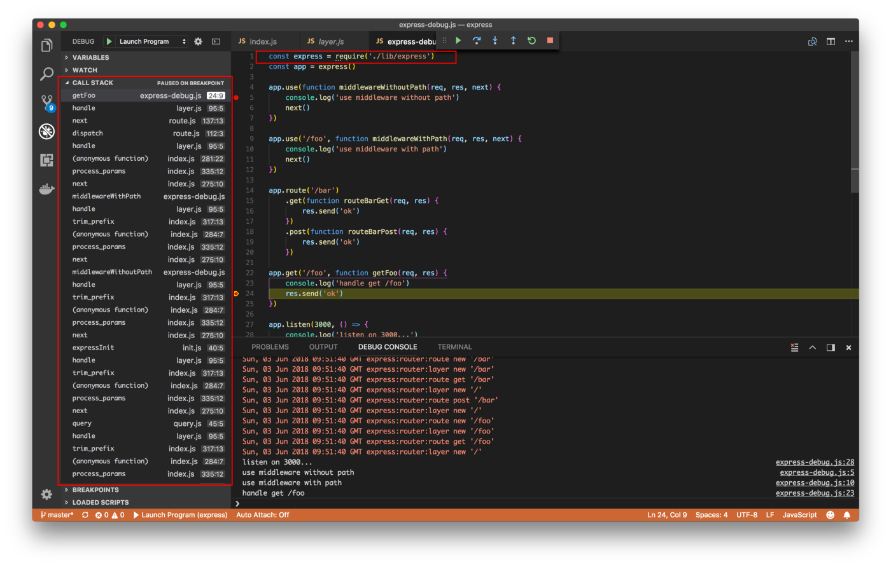
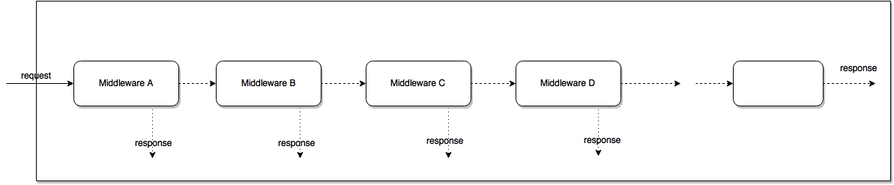

# Contents

{:.no_toc}

- Will be replaced with the ToC, excluding the "Contents" header
  {:toc}

# TODO

Build RESTful API using NodeJS, ExpressJS and MongoDB:

- https://medium.com/datadriveninvestor/build-restful-api-using-nodejs-expressjs-and-mongodb-df99e18666f6
- https://www.robinwieruch.de/node-express-server-rest-api

Deploy an Express.js app to AWS Lambda using the Serverless Framework:

- https://bitbucket.org/blog/deploy-an-express-js-app-to-aws-lambda-using-the-serverless-framework

# Tools

## VSCode

"ExpressJs 4 Snippet" Extension:

- Complete list of snippets: https://marketplace.visualstudio.com/items?itemName=gurayyarar.expressjs-4-snippets

Example, write `e4-app-post` you will get

```js
app.post("path", (req, res) => {});
```

## Postman

- `brew cask install postman`
- https://www.postman.com/
- Open the app and click "Skip signing in and take me straight to the app"

# Intro

Books:

- [Vasan Subramanian - Pro MERN Stack\_ Full Stack Web App Development with Mongo, Express, React, and Node (2019, Apress) - libgen.lc]()

- [Mindmap](https://drive.mindmup.com/map/1pi8cLcLNOy-iRY9X6_DdyH9_AB2L9_qC)

# Express Getting Started

## [BEGINNER Level] Express Getting Started - Without Scaffolding - In Memory DB

[ExpressJS Official Getting Started](https://expressjs.com/en/starter/installing.html)

```bash
mkdir myapp
cd myapp
npm init
npm install express --save
```

NOTE: `index.js` will be your default entry point

Tutorial REST API only [How to build a REST API with Node js & Express](https://www.youtube.com/watch?v=pKd0Rpw7O48&t=2587s)

- Very basic tutorial, it explain also what REST and HTTP are (very high level), good for absolute code beginner but also for somebody that need a refresh.
- Don't use a Database, use a global variable: see https://github.com/techstationspace/expressjs-Intro/blob/master/index.js#L4
- 00:00 - 07:00 Rest Conventions, Show an example of API built without a framework, Callback - Route Handler
- 14:41 Compare the router syntax with and without a framework
- 15:00 Nodemon
- 16:37 Env Variables
- 19:46
  - Route Parameters `req.params`, see [Route Parameters](#route-parameters). Ex: GET /api/courses/:id
  - Query Parameters. `req.query`Ex: GET /api/courses?sortBy=name
  - https://expressjs.com/en/api.html#req.query
- 23:16 Marketing del corso completo ESEMPIO SIMPATICO
- 25:28 GET a single resource
- 30:28 POST method - Create a resource
  - parse JSON body with the JSON parser middleware.
  - Intro to middleware.
  - POST convention (return the object JUST Created): many time the client need to know the id of the new object
  - Enable JSON parsing of the body of a POST request `app.use(express.json())`
  - example: https://github.com/techstationspace/expressjs-Intro/blob/master/index.js#L4
- 33:54 https://youtu.be/pKd0Rpw7O48?t=2034
  - Postman
- 36:00 https://youtu.be/pKd0Rpw7O48?t=2165
  - input validation -> you must always validate input!
  - On error return status 400
  - JOI npm lib: https://joi.dev/
- 44:00 PUT Method - Update a resource
  - Look up the resource, validate the resource
  - Refactor: validation logic is duplicated in the POST and PUT routes (https://youtu.be/pKd0Rpw7O48?t=2861)
- 52:30 DELETE Method https://youtu.be/pKd0Rpw7O48?t=3155
  - Look up the resource
  - Convention: return the object just deleted

## TODO Express Getting Started - With Scaffolding

IDEAS:

- NX
- express-generator https://expressjs.com/en/starter/generator.html

## Express Getting Started - ExpressJS Generator - FreeCodeCamp

Tutorial:

- [FreeCodeCamp](https://www.youtube.com/watch?v=G8uL0lFFoN0)
  - Use `express-generator`
  - 04:00 `express --view=pug myapp-express-generator`
  - Run the app: `DEBUG=myapp-express-generator:* npm start`
  - 36:00 migration
  - 43:00 save leads into the database
  - 45:30 get leads, fetch them from the database
  - 50:40 show one lead
  - 55:44 edit leads (Non mi piace molto lo stile che hanno seguito: POST /lead/:id/edit avrei usato una PUT)
  - 01:05:00 delete routes

Dirs:

- routes: routing logic
- views: one per page
- bin/www is the initialization script (the one that start your app when you run `npm start`)
- app.js is the main entrypoint for the express app ()

## Express Getting Started - NX

Nx is an open source toolkit for enterprise applications that is created and maintained by the team at Nrwl. It's based on their experience working at Google and helping the Fortune 500 build ambitious Angular applications.

# Middleware

Ref:

- [ExpressJS Using Middleware Doc](https://expressjs.com/en/guide/using-middleware.html)

Middleware functions are functions that have access to:

- the request object (req),
- the response object (res),
  and the next middleware function in the application’s request-response cycle. The next middleware function is commonly denoted by a variable named `next`.

An Express application is essentially a series of middleware function calls.

Middleware functions can perform the following tasks:

- Execute any code.
- Make changes to the request and the response objects.
- End the request-response cycle.
- Call the next middleware function in the stack.

If the current middleware function does not end the request-response cycle, it must call next() to pass control to the next middleware function. Otherwise, the request will be left hanging.

An Express application can use the following types of middleware:

- Application-level middleware
- Router-level middleware
- Error-handling middleware
- Built-in middleware
- Third-party middleware

You can load application-level and router-level middleware with an optional mount path. You can also load a series of middleware functions together, which creates a sub-stack of the middleware system at a mount point.

## Application-level middleware

# Param Validation

Param Validation:

- JOI npm https://joi.dev/
  - example https://youtu.be/pKd0Rpw7O48?t=2391

# Routing

## Cheatsheet

### Basic routing

```js
app.METHOD(PATH, CALLBACK);
```

### Using app.route()

```js
app.route(PATH).METHOD(CALLBACK).METHOD(CALLBACK);
//can chain more HTTP methods by adding '.METHOD(CALLBACK)'
```

### Using express.Router()

```js
router - example.js;
const Router = express.Router();
router.METHOD(PATH, CALLBACK); //more handlers and routes defined
module.exports = Router;
```

in main.js

```js
const routerExample = require("./router-example");
app.use("/", routerExample); //handle route '/' + PATH
app.use("/birds", routerExample); //handle route /birds/PATH'
```

## Intro

Ref:

- [ExpressJS Guide Basic routing](https://expressjs.com/en/starter/basic-routing.html)

Routing refers to determining how an application responds to a client request to a particular endpoint, which is a URI (or path) and a specific HTTP request method (GET, POST, and so on).

Each route can have one or more handler functions, which are executed when the route is matched.

In express you can configure the routing with three different approach:

- app.METHOD(PATH, CALLBACK);
- app.route()
- express.Router()

The basic route definition takes the following structure:

```js
app.METHOD(PATH, HANDLER);
```

Where:

- app is an instance of express.
- METHOD is an HTTP request method, in lowercase (get, post, etc.).
- PATH is a path on the server.
- HANDLER is the function executed when the route is matched.

NOTE:This tutorial assumes that an instance of express named app is created and the server is running. If you are not familiar with creating an app and starting it, see the Hello world example.

The handler is passed in a request object and a response object:

- The request object can be inspected to get the various details of the request,
- and the response object’s methods can be used to send the response to the client.

## Basic Examples

Respond with Hello World! on the homepage:

```js
app.get("/", function (req, res) {
  res.send("Hello World!");
});
```

Respond to POST request on the root route (/), the application’s home page:

```js
app.post("/", function (req, res) {
  res.send("Got a POST request");
});
```

Respond to a PUT request to the /user route:

```js
app.put("/user", function (req, res) {
  res.send("Got a PUT request at /user");
});
```

Respond to a DELETE request to the /user route:

```js
app.delete("/user", function (req, res) {
  res.send("Got a DELETE request at /user");
});
```

## Route Parameters

Ref:

- [Express Guide](https://expressjs.com/en/guide/routing.html)
- [Request Reference](https://expressjs.com/en/api.html#req.params)
- See Also [Query Parameters](#query-parameters)

Route parameters are named **URL segments** that are used to capture the values specified at their position in the URL. The captured values are populated in the req.params object, with the name of the route parameter specified in the path as their respective keys.

- Route path: `/users/:userId/books/:bookId`
- Request URL: `http://localhost:3000/users/34/books/8989`
- req.params: `{ "userId": "34", "bookId": "8989" }`

To define routes with route parameters, simply specify the route parameters in the path of the route as shown below.

```js
app.get("/users/:userId/books/:bookId", function (req, res) {
  res.send(req.params);
});
```

The name of route parameters must be made up of “word characters” `[A-Za-z0-9_]`.

Since the hyphen (-) and the dot (.) are interpreted literally, they can be used along with route parameters for useful purposes.

- Route path: /flights/:from-:to
- Request URL: http://localhost:3000/flights/LAX-SFO
- req.params: { "from": "LAX", "to": "SFO" }

OR:

- Route path: /plantae/:genus.:species
- Request URL: http://localhost:3000/plantae/Prunus.persica
- req.params: { "genus": "Prunus", "species": "persica" }

# Query Parameters

[ExpressJS Reference](https://expressjs.com/en/api.html#req.query)

Examples:

- Encode a space:

```js
// GET /search?q=tobi+ferret
console.dir(req.query.q);
// => 'tobi ferret'
```

- Encode an object:

```js
// GET /shoes?order=desc&shoe[color]=blue&shoe[type]=converse
console.dir(req.query.order);
// => 'desc'
console.dir(req.query.shoe.color);
// => 'blue'
console.dir(req.query.shoe.type);
// => 'converse'
```

- Encode an Array:

```js
// GET /shoes?color[]=blue&color[]=black&color[]=red
console.dir(req.query.color);
// => ['blue', 'black', 'red']
```

# ExpressJS Internals

WARNING: All the internals of this section are base on version 4.18:
https://github.com/expressjs/express/tree/4.18

Ref:

- https://medium.com/@viral_shah/express-middlewares-demystified-f0c2c37ea6a1
- https://www.sohamkamani.com/blog/2018/05/30/understanding-how-expressjs-works/
- https://dzone.com/articles/design-patterns-in-expressjs
- THE BEST: https://blog.laputa.io/understanding-expressjs-d5ef4f4646c8

## Create a new express application and the integration with NodeJS HTTP module

To understand the EspressJS internals the approach I used is to generate a sample source code. To generate a simple express prooject just run `express myapp` and `cd myapp`. Then I can debug through it in vscode, this helped a lot to understand the call stack and reasoning about the structure of the code, especially when going through the `next()` chain function calls. Like below:



In a simple app created with the `express` command the main file is `app.js`:

```js
const express = require("express");
const app = express();

app.get("/", (req, res) => res.send("Hello World!")); /// Add this route
```

Here you require express and configure the router. The code above sends a “hello world” text response when we hit the GET / route.

The script that initialize the http server is `bin/www`

```js
var http = require("http"); //(A)

var server = http.createServer(app);
server.listen(port);
server.on("error", onError);
server.on("listening", onListening);
```

This code starts a new HTTP server on port 3000.

Broadly speaking, there are four stages that we can analyze:

- Creating a new express application
- Creating a new route
- Starting an HTTP server on a given port number
- Handling a request once it comes in

the line `(A)` requires the `http` nodejs standard module ( small guide here https://www.w3schools.com/nodejs/nodejs_http.asp ). `http.createServer(app);` sets `app` as the handler of the http request, every request to the http server will invoke the `app.handle(req, res)` function with req and res parameter. At this point the express logic will handle the request as we will see below.

Express uses the Factory design pattern, is a creational design pattern allowing us to abstract away object creation implementation details from the outside world. Express does this by only exporting the factory `createApplication()` in [lib/express.js](https://github.com/expressjs/express/blob/4.18/lib/express.js#L37).

```js
// ...
var mixin = require("merge-descriptors")
var proto = require("./application")
// ...

// Expose `createApplication()`.
exports = module.exports = createApplication;
function createApplication() {
  var app = function(req, res, next) {
    app.handle(req, res, next); // (A)
  };

  // (B)
  mixin(app, EventEmitter.prototype, false);
  mixin(app, proto, false);
  ...
  return app;
}
```

NOTE: How is it possible that we can refere the `app` variable? Thanks to the Hoisting mechanism the `app` variable is declared before the function definition. At line `(A)` closure will keep the that variable alive.

At line `(B)` express is using the `merge()` function of the `merge-descriptor` package. This pattern is called "mixin" patter in JS, it's an alternative to prototypal inheritance.

https://github.com/component/merge-descriptors/blob/master/index.js

And, using the factory to create an express application is as simple as this:

```js
import express from "express";
const app = express();
```

The `app` object returned from `createApplication()` is one that we use in our application code.
The `app.get` method is added by using the `merge-descriptors` libraries mixin function, which assigns the methods defined in proto. `proto` itself is imported from `lib/application.js`.

## Router and Middlewares - APP == Router

Before we start, let’s have a quick review of express’s apis. Expressjs has mainly two kind of apis:

- middleware
- routing

As we saw previously the routing API is this:

```js
// (A)
app.METHOD(PATH, HANDLER);

// (B) Using app.route()
app.route(PATH).METHOD(CALLBACK).METHOD(CALLBACK);
//....can chain more HTTP methods by adding '.METHOD(CALLBACK)'

// (C) creating a new instance of a router  (mini-express app)
const routerExample = express.Router();
router.METHOD(PATH, CALLBACK); //more handlers and routes defined
app.use("/", routerExample); //handle route '/' + PATH
// OR app.use("/birds", routerExample); //handle route /birds/PATH'
```

`App == Router` : every Express app at it’s core is a Router. When we create an app using `express()`, we are essentially creating a root level Router. The reverse is true as well. Every Router is like a mini-app in itself. In fact, that is why, the `.use()` method of both Router and App looks so similar.

So then it begs the question, what is really there in this Router? Well a Router mainly consists of a two things:

- `handle()` function: It is the function that processes all the requests received by the Router
- `Layer-stack`: It is a stack of Layers registered on the Router. I will soon get into the details of a Layer, but for now just understand that every Layer has a path and its own handle function. Every time we call the `.use()` method on an Express app or Router, we are basically creating a new Layer in the Router’s stack.

Now we proceed to the second step to simplify our understanding, we can notice that many APIs are mostly syntactic sugar. First of all:

- `app.all()`
- `app.METHOD()`
- `app.param()`
- `app.route()`
- `app.use()`

are proxies for the default this functions of the default router:

- `router.all()`
- `router.METHOD()`
- `router.param()`
- `router.route()`
- `router.use()`

Internally the default Router is accessed with `this._router` and initialized with `this.lazyrouter();`
In the paragraph below "Deep dive into lib/application.js" we are going to see all the details of this proxy mechanism.

STEP 2: So to simplify we can focus out attention only to the `Router` API.

**TODO spostare sotto**

When you look at the internals of express you discover that all the above API instatiate a Layer:

- All these API: `router.METHOD()`, `router.all()`, `router.route()`, `router.use()` creates a Layer
- for every additional method of a Route a Layer is instantiated
- TODO: non sono sicurissimo, sta cosa è da controllare.....

**END TODO**

Now let's look to a simplfied version of the get version of the `router.METHOD` api:

```js
// Original source code https://github.com/expressjs/express/blob/4.18/lib/router/index.js#L513
router.get = function (path, handler) {
  var route = this._router.route(path); // create a new route
  route.get(handler);
  return this;
};
```

It just stores the route in the applications router using its route method, then passes on the handler to `route.<method>`

STEP 3:

TODO: how does different Router interect with each other?

After creating an express app, the first thing we do is adding some useful middleware by calling `app.use()`, like this:

```js
var app = express();
var bodyParser = require("body-parser");

// third party middleware
// parse application/json
app.use(bodyParser.json());

// user defined middleware
app.use(function (req, res, next) {
  console.log("Time:", Date.now());
  next();
});

// use middleware for specific url path
app.use("/user/:id", function (req, res, next) {
  checkUser(req.params.id);
  next();
});
```

Long story short:

- Each express app has a `_router`, it is an instance of the Router object, app.use and app.route are just proxied to the same function of \_router
- app.<method> delegate to the default application Router.

The routers route() method is defined in lib/router/index.js:
https://github.com/expressjs/express/blob/4.18/lib/router/index.js

## How To Create a Web Server in Node.js with the HTTP Module

Everything that express.js provides can be summed up as just a really smart handler function for the HTTP module.
If you want to better understand ExpressJS internals you can:

- follow this tutorial: https://www.digitalocean.com/community/tutorials/how-to-create-a-web-server-in-node-js-with-the-http-module which guides you into creating a basic website with 2 routes
- Then read: https://nodejs.org/en/docs/guides/anatomy-of-an-http-transaction/

```js
const http = require("http");

const host = "localhost";
const port = 8000;

const requestListener = function (req, res) {
  // url is the full URL without the server, protocol or port.
  // method here will always be a normal HTTP method/verb.
  // headers are represented in lower-case only, regardless of how the client actually sent them
  const { method, url, headers } = req;
  console.log(`method: ${method}`);
  console.log(`url: ${url}`);
  console.log(`headers: ${JSON.stringify(headers, null, 1)}`);
  res.writeHead(200); // sets the HTTP status code of the response.
  res.end("My first server!"); //writes the HTTP response back to the client who requested it. This function returns any data the server has to return. In this case, it’s returning text data.
};

//create our server and make use of our request listener: This server accepts HTTP requests and passes them on to our requestListener() function.
const server = http.createServer(requestListener);

// After we create our server, we must bind it to a network address. The 3rd args is a callback function that fires when the server begins to listen.
server.listen(port, host, () => {
  console.log(`Server is running on http://${host}:${port}`);
});
```

- The function that's passed in to `createServer` is called once for every HTTP request that's made against that server, so it's called the request handler.

- All request listener functions in Node.js accept two arguments: req and res (we can name them differently if we want).

- The HTTP request the user sends is captured in a Request object, which corresponds to the first argument, req. You can easly access; method, url, headers.
- The HTTP response that we return to the user is formed by interacting with the Response object in second argument, res.

The Server object returned by [createServer](https://nodejs.org/api/http.html#http_http_createserver_requestlistener) is an [EventEmitter](https://nodejs.org/api/events.html#events_class_eventemitter), and what we have here is just shorthand for creating a server object and then adding the listener later.

```js
const server = http.createServer();
server.on("request", (request, response) => {
  // the same kind of magic happens here!
});
```

The request object is an instance of [IncomingMessage](https://nodejs.org/api/http.html#http_class_http_incomingmessage) which extends [stream.Readable](https://nodejs.org/api/stream.html#stream_class_stream_readable).
When receiving a POST or PUT request you can read the body of the request listening to the stream events, See: https://nodejs.org/en/docs/guides/anatomy-of-an-http-transaction/#request-body

Naive example:

```js
let body = [];
request
  .on("data", (chunk) => {
    body.push(chunk);
  })
  .on("end", () => {
    body = Buffer.concat(body).toString();
    // at this point, `body` has the entire request body stored in it as a string
  });
```

NOTE: there are modules like concat-stream and body on npm which can help hide away some of this logic.

The response object is an instance of ServerResponse, which is a WritableStream. It contains many useful methods for sending data back to the client.

## Deep dive into index.js

Every ExpressJS app starts by requiring this file: `var express = require("express");`

It is a very simple entry point that requires `./lib/express/index.js`

```js
...
module.exports = require('./lib/express');
```

It exports `createApplication()`, the ExpressJS application factory and assign:

```js
exports = module.exports = createApplication;

exports.application = proto;
exports.request = req;
exports.response = res;

//Expose
exports.Route = Route;
exports.Router = Router;

exports.json = bodyParser.json;
exports.query = require("./middleware/query");
exports.static = require("serve-static");
exports.urlencoded = bodyParser.urlencoded;
```

Ref: https://github.com/expressjs/express/blob/3ed5090ca91f6a387e66370d57ead94d886275e1/lib/express.js

NOTE: When require is given the path of a folder, it'll look for an index.js file in that folder; if there is one, it uses that, and if there isn't, it fails. https://stackoverflow.com/questions/5364928/node-js-require-all-files-in-a-folder

## Deep dive into lib/application.js

`app.use`: https://github.com/expressjs/express/blob/4.x/lib/application.js#L187

c'è un po' di logica che non ho capito benissimo.... gestisce il fatto che il primo argomento possa essere una array.

`app.route`: https://github.com/expressjs/express/blob/dc538f6e810bd462c98ee7e6aae24c64d4b1da93/lib/application.js#L254

It's really a simple proxy:

```js
app.route = function route(path) {
  this.lazyrouter();
  return this._router.route(path);
};
```

`app.METHOD()` https://github.com/expressjs/express/blob/dc538f6e810bd462c98ee7e6aae24c64d4b1da93/lib/application.js#L472

It allow us to creae a new route. Let’s now take a brief look at the code that creates the app.get method that we use in the example:

```js
var slice = Array.prototype.slice;

// ...
/**
 * Delegate `.VERB(...)` calls to `router.VERB(...)`.
 */

// `methods` is an array of HTTP methods, (something like ['get','post',...])
methods.forEach(function (method) {
  // This would be the app.get method signature
  app[method] = function (path) {
    // some initialization code

    // create a route for the path inside the applications router
    var route = this._router.route(path);

    // call the handler with the second argument provided
    route[method].apply(route, slice.call(arguments, 1));

    // returns the `app` instance, so that methods can be chained
    return this;
  };
});
```

It’s interesting to note that besides the semantics, all the HTTP verb methods, like app.get, app.post, app.put, and the like, are essentially the same in terms of functionality. If we were to simplify the above code only for the get method, it would look like this:

```js
app.get = function (path, handler) {
  // ...
  var route = this._router.route(path);
  route.get(handler);
  return this;
};
```

Although the above function has 2 arguments, it’s similar to the `app[method] = function(path){...}` definition. The second handler argument is obtained by calling `slice.call(arguments, 1)`.

Long story short, `app.<method>` just stores the route in the applications router using its route method, then passes on the handler to `route.<method>`.

## Deep dive into lib/router/index.js

https://stackoverflow.com/questions/5364928/node-js-require-all-files-in-a-folder

## Design Pattern in Express JS

- [Doc](https://dzone.com/articles/design-patterns-in-expressjs)

### Factory Pattern

This is a simple and common design pattern in JavaScript. Factory is a creational design pattern allowing us to abstract away object creation implementation details from the outside world. Express does this by only exporting the factory.

```js​
exports = module.exports = createApplication;
​
function createApplication() {
  var app = function(req, res, next) {
    app.handle(req, res, next);
  };
  ...
  return app;
}
```

And, using the factory to create an express application is as simple as this:

```js
import express from "express";
const app = express();
```

### Middleware

Doc:

- https://dzone.com/articles/understanding-middleware-pattern-in-expressjs

Middleware is the term popularized by Express.js. In fact, we can consider this design pattern a variant of [Intercepting Filter](https://www.oracle.com/java/technologies/intercepting-filter.html) and [Chain of Responsibility](https://sourcemaking.com/design_patterns/chain_of_responsibility)

Problem:

- There is a potentially variable number of "handler" or "processing element" or "node" objects, and a stream of requests that must be handled.
- Need to efficiently process the requests without hard-wiring handler relationships and precedence, or request-to-handler mappings.

A middleware function has the following signature:

```js
function(req, res, next) { ... }
```

There is a special kind of middleware named error-handling. This kind of middleware is special because it takes four arguments instead of three allowing Express to recognize this middleware as error-handling:

```js
function(err, req, res, next) {...}
```

Middleware functions can perform the following tasks:

- Logging requests
- Authenticating/authorizing requests
- Parsing the body of requests
- End a request – response lifecycle
- Call the next middleware function in the stack.

These tasks are not core concerns (business logic) of an application. Instead, they are cross cutting concerns applicable throughout the application and affecting the entire application.

Request-response lifecycle through a middleware is as follows:



- The first middleware function (A) in the pipeline will be invoked to process the request
- Each middleware function may end the request by sending response to client
- or invoke the next middleware function (B) by calling next()
- or hand over the request to an error-handling middleware by calling next(err) with an error argument
- Each middleware function receives input as the result of previous middleware function
- If the request reaches the last middleware in the pipeline, we can assume a 404 error

# Serverless

- Good app example: https://serverless-stack.com/

## Install

https://www.serverless.com/framework/docs/providers/aws/guide/installation/

## Debug and local development

- https://codeworkshop.io/blog/ServerlessDebug/
- https://github.com/dherault/serverless-offline

Install locally serverless: `npm install --save-dev serverless`

Install plugins:
https://www.serverless.com/framework/docs/providers/aws/cli-reference/plugin-install/

- serverless plugin install --name serverless-webpack
- serverless plugin install --name serverless-offline

TODO:

- https://dev.to/duomly/serverless-course-lesson-1-how-to-get-started-tutorial-for-beginners-2p6h
-
