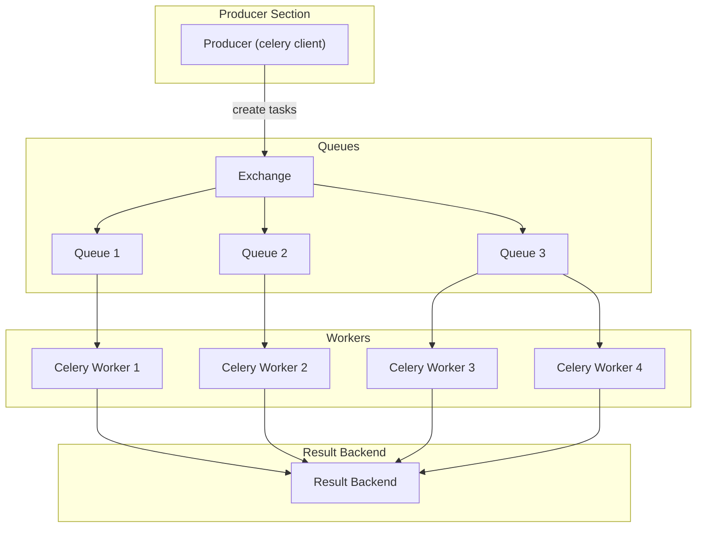

# Celery
## TODO

* what is the difference between `celery` and `django-celery`?
* what is the difference between `celery` and `flower`?
* what is the difference between `celery` and `beat`?
* what is the difference between `celery` and `worker`? 
* result backend


## Why Use Celery?

There are two main reasons why most developers want to start using Celery:

1.  **Offloading work** from your app to distributed processes that can run independently of your app
2.  **Scheduling task execution** at a specific time, sometimes as recurring events

Celery is an excellent choice for both of these use cases. It defines itself as "a task queue with focus on real-time processing, while also supporting task scheduling" ([Source](https://docs.celeryq.dev/en/stable/index.html)).

Even though both of these functionalities are part of Celery, they're often addressed separately:

1.  **Celery workers** are worker processes that run tasks independently from one another and outside the context of your main service.
2.  **Celery beat** is a scheduler that orchestrates when to run tasks. You can use it to schedule periodic tasks as well.

Celery workers are the backbone of Celery. Even if you aim to schedule recurring tasks using Celery beat, a Celery worker will pick up your instructions and handle them at the scheduled time. What Celery beat adds to the mix is a time-based scheduler for Celery workers.

In this tutorial, you'll learn how to integrate Celery with Django to perform operations asynchronously from the main execution thread of your app using Celery workers.

You won't tackle task scheduling with Celery beat in this tutorial, but once you understand the basics of Celery tasks, you'll be well equipped to set up [periodic tasks](https://docs.celeryq.dev/en/stable/userguide/periodic-tasks.html) with Celery beat.

#### First Overview of the Celery Architecture

Celery:
- is an asynchronous task queue/job queue based on distributed message passing. It is focused on real-time operation, but supports scheduling as well. **The execution units**, called **tasks**, are executed concurrently on a single or more worker servers using multiprocessing ([Eventlet](http://eventlet.net/), or [gevent](http://gevent.org/)).

- communicates via messages, usually using a **broker to mediate between clients and workers**. To initiate a task the client adds a message to the queue, the broker then delivers that message to a worker. The RabbitMQ and Redis broker transports are feature complete. [RabbitMQ](https://docs.celeryq.dev/en/stable/getting-started/backends-and-brokers/rabbitmq.html#broker-rabbitmq), [Redis](https://docs.celeryq.dev/en/stable/getting-started/backends-and-brokers/redis.html#broker-redis), [Amazon SQS](https://docs.celeryq.dev/en/stable/getting-started/backends-and-brokers/sqs.html#broker-sqs), 

- is written in Python, but the protocol can be implemented in any language. In addition to Python there's [node-celery](https://github.com/mher/node-celery) and [node-celery-ts](https://github.com/IBM/node-celery-ts) for Node.js




#### How Can You Leverage Celery for Your App?

Celery excels at offloading time- and resource-intensive tasks to the background, keeping your Django app responsive. Key use cases:

1. **Email Sending**: Verification, password reset, or confirmation emails.

2. **Image Processing**: Resizing or encoding user-uploaded images.

3. **Text Processing**: Profanity checks, translations, or data validation.

4. **API Calls**: Rate-limited API requests or [web scraping](https://realpython.com/beautiful-soup-web-scraper-python/).

5. **Data Analysis**: Heavy computations or crunching large datasets.

6. **ML Model Runs**: Offload slow machine learning predictions or training.

7. **Report Generation**: Background creation of PDFs or reports.

**Core Idea**: Free Django's HTTP request-response cycle by offloading heavy tasks to Celery workers.


## Random Notes
### Tasks

[Celery Tasks](https://docs.celeryq.dev/en/stable/userguide/tasks.html)


TODO: understand better what `bind=True` does, the decorator.... and the magic of delay() 

#### Bind True

In **Celery**, setting `bind=True` in the `@app.task` decorator binds the task instance to the first argument of the task function, typically named `self`.
This binding allows access to the task's context and methods within the task function.

## Django Celery

Usually the Django Celery integration is very straightforward. Usually you just import models inside the task and that's it:

```python
@app.task(bind=True)
def payment_gateway_check_moneyintask(self, token, **kwargs):
    # Models are imported inside the task
    from projects.models.models import Contribution
    from payment.models import PaymentGateway
```

> [!NOTE] - Notice how models are imported inside the task functions, not at the module level
> This is a best practice to avoid circular imports and ensure Django is properly configured when the imports happen

> The `bind=True` argument is optional but recommended. It allows the task to have access to the current worker instance and other context-specific information.


You can tell Celery to get its configuration from Django's settings:

```python
# Tells Celery to get its configuration from Django's settings
# will look for Celery-specific settings in your Django settings file (like CELERY_BROKER_URL, CELERY_RESULT_BACKEND, etc.)
app.config_from_object("django.conf:settings")
```

### Database Connections in Django with Celery

## Tutorials

### First Steps with Celery - Official Tutorial
https://docs.celeryq.dev/en/stable/getting-started/first-steps-with-celery.html

Learn about:

-   Choosing and installing a message transport (broker).
-   Installing Celery and creating your first task.
-   Starting the worker and calling tasks.
-   Keeping track of tasks as they transition through different states, and inspecting return values.


### Asynchronous Tasks with Django and Celery
https://realpython.com/asynchronous-tasks-with-django-and-celery/
