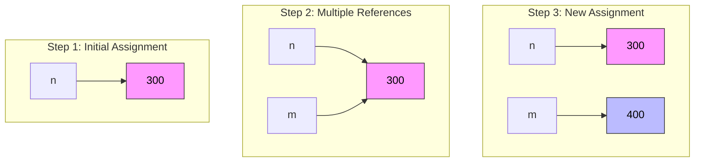
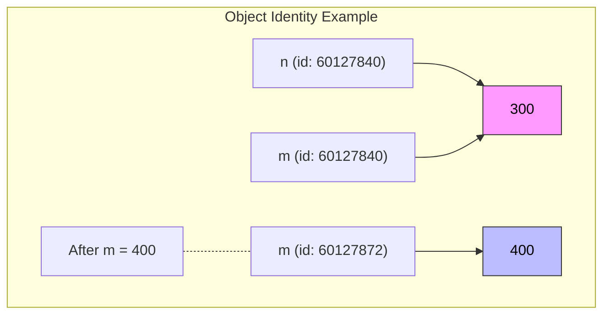
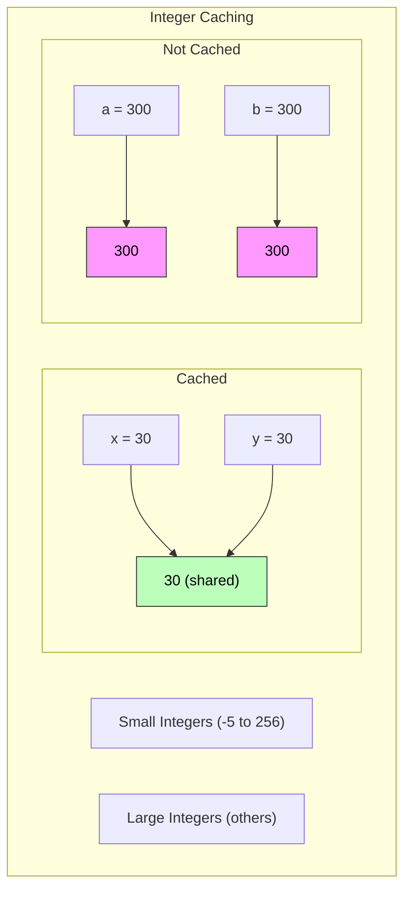

## Python Variables and Constants Reference

### 1. Variables

#### Definition
A variable is a name that refers to a value stored in memory, allowing you to manipulate and access that value throughout your code.

#### Naming Rules
- **Must Start With**: A letter (A-Z, a-z) or an underscore (_).
- **Allowed Characters**: Letters, digits (0-9), and underscores.
- **Case Sensitivity**: `age`, `Age`, and `AGE` are different variables.
- **Cannot Use Keywords**: Avoid using Python reserved keywords (e.g., `if`, `for`, `while`).

#### Example
```python
my_variable = 10
user_age = 25
_total_price = 99.99
```

### 2. Constants

#### Definition
Constants are variables that are intended to remain unchanged throughout the program. While Python does not enforce immutability, naming conventions help indicate their intended use.

#### Naming Conventions
- **Uppercase Letters**: Use all uppercase letters with underscores separating words.
  
#### Example
```python
MAX_CONNECTIONS = 100
PI = 3.14159
DEFAULT_TIMEOUT = 30
```

### 3. Best Practices for Naming

- **Descriptive Names**: Choose names that clearly describe the purpose of the variable or constant.
  
  ```python
  user_name = "Alice"  # Good
  n = "Alice"          # Poor
  ```

- **Avoid Short Names**: Avoid single-letter names unless in specific contexts (e.g., loop counters).
  
- **Global vs Local Variables**:
  - Use descriptive names for global variables.
  - Keep local variable names concise but meaningful.

- **Consistency**: Stick to one naming convention throughout your codebase.

### 4. Common Naming Conventions

| Convention   | Description                          | Example                  |
|--------------|--------------------------------------|--------------------------|
| snake_case   | Preferred for variables              | `my_variable_name`       |
| camelCase    | Occasionally used                   | `myVariableName`         |
| PascalCase   | Typically for class names            | `MyClass`                |
| UPPERCASE    | For constants                        | `MAX_VALUE`, `PI`        |

### 5. Variable Assignment and Object References

#### Object References
In Python, everything is an object. When you create a variable, you're creating a reference (or pointer) to an object, not a traditional "container" for the value.

```python
n = 300  # Creates an integer object and points 'n' to it
print(type(n))  # Output: <class 'int'>
```

A more detailed example of **Object Creation and Reference**:
```python
n = 300  # Creates int object and references it
m = n    # Creates new reference to same object
m = 400  # Creates new object, changes m's reference
```




#### Object Lifetime
   - Objects exist as long as there's at least one reference to them
   - When no references remain, object becomes eligible for garbage collection
   ```python
   x = 300     # Object created, referenced by x
   y = x       # Same object now has two references
   x = "foo"   # Original 300 object loses one reference
   y = None    # Original 300 object becomes eligible for garbage collection
   ```

Memory Management:
   ```mermaid
   graph LR
       subgraph "Memory Management Example"
           A[x] --> B["foo"]
           C[y] --> D[None]
           F[❌] -.- |"Garbage Collected"| E["300"]
       end
       style E fill:#ddd,stroke:#999,color:#000
       style F fill:#fdd,stroke:#933,color:#000
   ```

#### Reference vs Value
   - Variables are references to objects
   - Assignment creates or updates references
   - Multiple variables can reference the same object
   ```python
   # Same object referenced by multiple names
   a = [1, 2, 3]
   b = a  # Both a and b reference the same list
   
   # Modifying through either reference affects the object
   b.append(4)
   print(a)  # Output: [1, 2, 3, 4]
   ```

### 6. Object Identity

#### Understanding Object IDs
Every Python object has a unique identifier during its lifetime. The `id()` function returns this identifier, which can be used to verify if two variables reference the same object.

```python
n = 300
m = n
print(id(n) == id(m))  # True: same object
m = 400
print(id(n) == id(m))  # False: different objects
```



#### Integer Caching
Python optimizes memory by caching small integers in the range [-5, 256].

```python
# Same object (cached)
x = 30
y = 30
print(id(x) == id(y))  # True

# Different objects (outside cache range)
a = 300
b = 300
print(id(a) == id(b))  # False
```



#### Key Points
1. **Unique Identifiers**
   - Every object has a unique ID during its lifetime
   - IDs may be reused after object garbage collection
   - Use `id()` to check object identity

2. **Integer Caching**
   - Small integers (-5 to 256) are pre-cached
   - Cached integers share the same identity
   - Large integers get unique objects even if values are equal

3. **Identity vs Equality**
   ```python
   # Identity comparison (is)
   x = 30
   y = 30
   print(x is y)      # True (cached)
   
   # Value equality comparison (==)
   a = 300
   b = 300
   print(a == b)      # True (same value)
   print(a is b)      # False (different objects)
   ```

### Summary

By following these guidelines and conventions, you can write Python code that is clear, maintainable, and easy to understand for both yourself and others. This reference serves as a quick guide to help you remember the key aspects of variables and constants in Python.
