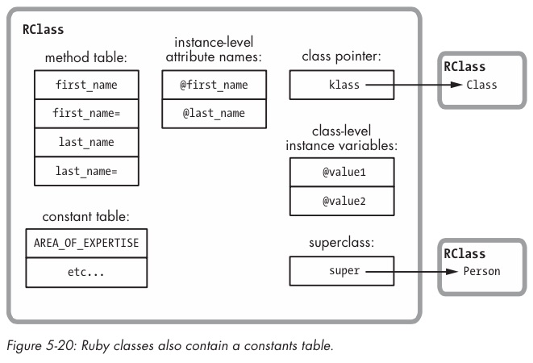
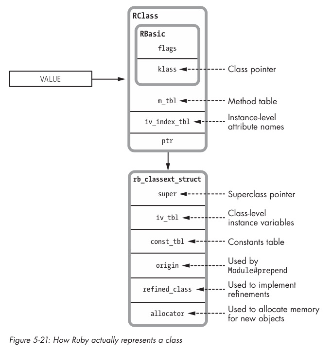
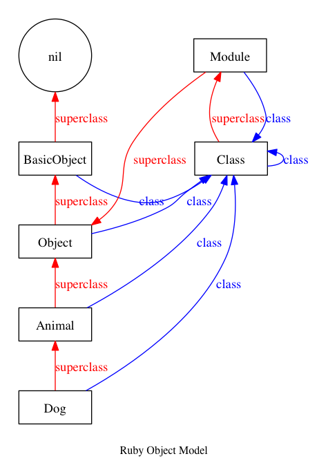
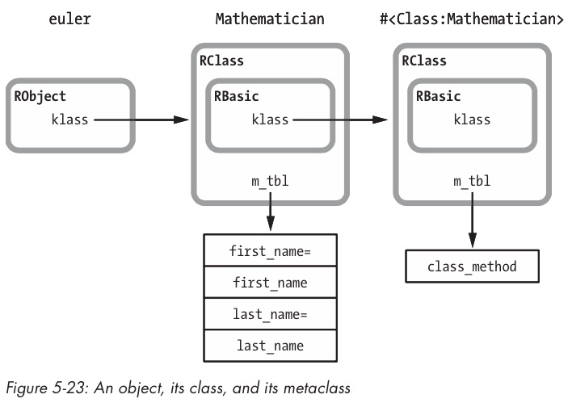
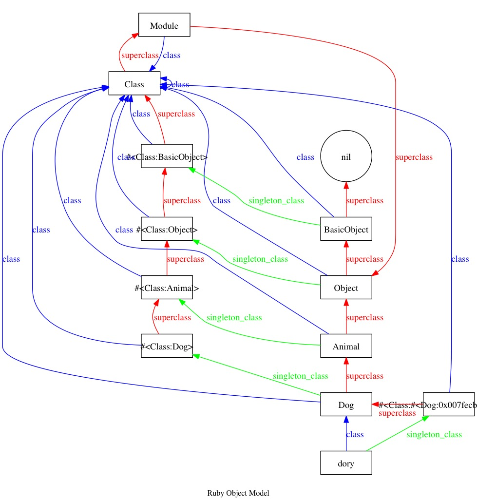
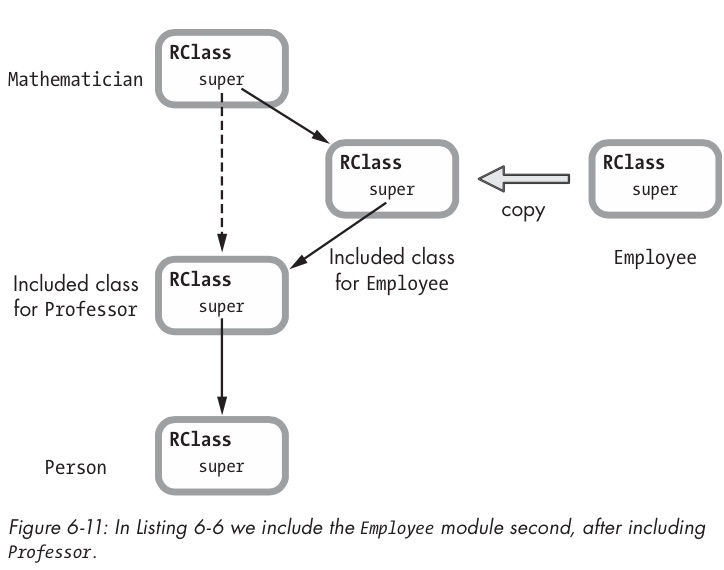
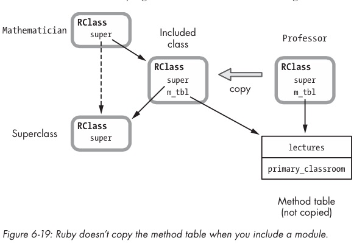
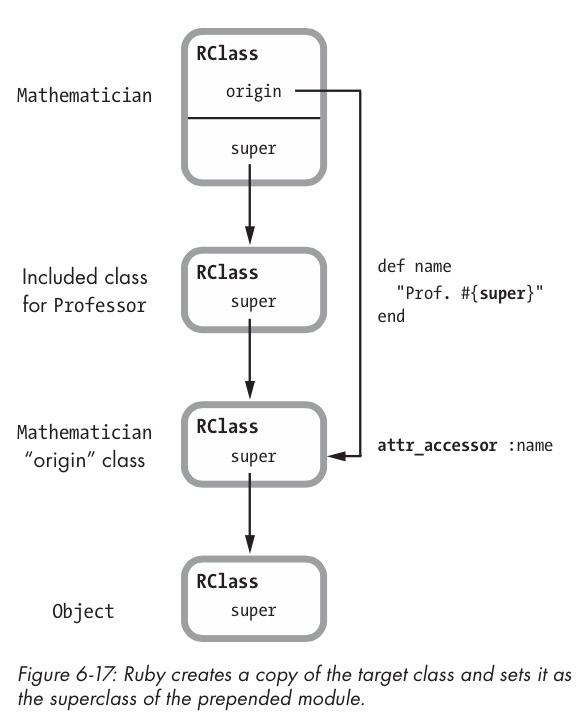
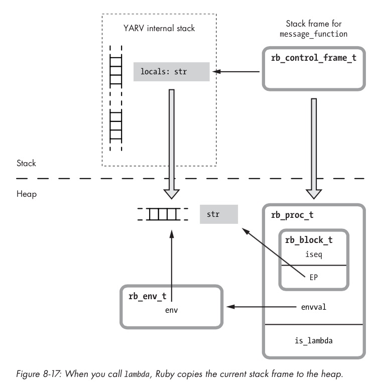

# Contents
{:.no_toc}

* Will be replaced with the ToC, excluding the "Contents" header
{:toc}

# References

* [Ruby Hacking Guide](http://ruby-hacking-guide.github.io) This book explores several themes with the following goals in mind:
  * To have knowledge of the structure of ruby
  * To gain knowledge about language processing systems in general
  * To acquire skills in reading source code
  * use **ruby 1.7.3**
* [Ruby under a microscope](/Volumes/ArchiveDisk/Archive/Misc/ebook/ruby/RubyUnderaMicroscope.pdf)
  * user **ruby 2.0**

# TODO

## Cosa fa Module.new { extend OthenModule }
~~~ruby
Module.new { extend OthenModule }
~~~
http://ruby-doc.org/core-2.2.0/Module.html#method-c-new

example: https://github.com/aws/aws-sdk-core-ruby/blob/v2.0.14/aws-sdk-core/lib/aws-sdk-core.rb#L248
The AWS sdk uses this trick

# The Ruby Object model

## References

* **Metaprogramming Ruby Chapter 2** is clear with a lot of example. You MUST read it. /Volumes/ArchiveDisk/Archive/Misc/ebook/ruby/metaprogramming-ruby-2_p1_0.pdf
* https://github.com/rubyconfindia/conference/blob/master/2011/presentations/karthikS-DecipheringtheROM.pdf

## Overview

The object model is the set of rules and definition that create the ruby language. These are the main concepts that we need:

* object instances, Metaclass, Class, Module are the structures that ruby uses to encapsulate data and to define which data a method can access. They are organized using `class` and `superclass` relationship. 
* Method lookup and Constant lookup algorithms are the way ruby uses those structures at runtime.
* Scopes
*

## Ruby Objects

An Object is a data structure that encapsulate other data structures; three conditions are truly indispensable for objects to be objects:

* The ability to differentiate itself from other objects (an identity)
  * we will see how MRI uses `VALUE` as identity
* The ability to respond to messages (methods)
  * ruby uses classes and modules to implement this mechanism
  * every object is an instance of a class
* The ability to store internal state (instance variables)
  * we will see how MRI stores the internal state of objects

When we say that an object `x` is an instance of class `Y` it means that:

* the object is created with `Y.new()`
* its `klass` variable is set to `Y` or to a singleton class related to `Y`.

We will see in the next paragraphs that the `klass` variable is the entry point of every method look-up and what is a singleton class.

### Object reference in MRI: the VALUE pointer

In MRI VALUE is defined as `typedef unsigned long VALUE;`, it's used like a void pointer in the MRI source code

Each time ruby creates an instance of an object an `RObject` is created, if you store a reference to that object it will be of type `VALUE`.

In practice, when using a `VALUE`, we cast it to the pointer to each object struct. To cast there are helper macros, `Rxxxx()` that return a pointer:

~~~c
  VALUE str = ....;
  VALUE arr = ....;
  RSTRING(str)->len;   /* ((struct RString*)str)->len */
  RARRAY(arr)->len;    /* ((struct RArray*)arr)->len */
~~~






### Object implementation in MRI

To better understand how ruby uses objects we will look at how MRI implements them.

All object structs start with a member `basic` of type `struct RBasic`.
As a result, if you cast this `VALUE` to `struct RBasic*`, you will be able to access the content of `basic`, regardless of the type of struct pointed to by `VALUE`.

* `RObject` contains
  * `numiv`: is the number of `ivars`
  * `ivptr`: poiter to an array of instance variables (called `ivars`)
  * `iv_index_tbl`: pointer to the hash table of the Class that maps between the name, or ID, of each instance variable and its location in the ivptr array. This pointer is here to get a faster instance variable access time.
  * `RBasic`:
    * `flags` a set of Boolean that store a variety of internal technical
      value (type of the object, etc)
    * `klass` indicates which class an object is an instance of. It is a pointer to an instance of `RClass`

NOTE: this member is named `klass` so as not to conflict with the reserved word `class` when the file is processed by a C++ compiler.






For built-in classes MRI Ruby have have several RObject variations. This allow to optimize the code execution.
A different struct is used based on the class of the object:

* `struct RObject`	 all things for which none of the following applies
* `struct RClass`	 class object
* `struct RFloat`	 small numbers
* `struct RString`	 string
* `struct RArray`	 array
* `struct RRegexp`	 regular expression
* `struct RHash`	 hash table
* `struct RFile`	 `IO`, `File`, `Socket`, etc…
* `struct RData`	 all the classes defined at C level, except the ones mentioned above
* `struct RStruct`	 Ruby’s `Struct` class
* `struct RBignum`	 big integers

## Ruby Classes and Modules

Everything in Ruby is an Object, also classes and modules. Ruby uses Classes and Modules to assign method and instance variables to object.

A Ruby class is a **Ruby object** that:

* has an hash that maps symbols to method definitions ( each method is a sequence of instructions )
* has an hash that maps instance variables name to position to array index (TODO: capire meglio come funziona questo meccanismo perchè non mi torna molto... dovrebbe implementare le instance varibables)
* has a superclass pointer
* has a constants table
* its `klass` references `Class`
  * this is important because only `Class` has the `new` method that create ruby objects.

It's very important to note that also `Class` is an object, it's an instance of `Class`. This could look strange but it doesn't create any problem as we will see when we will dig into the method lookup algorithm.

A ruby Module is a **Ruby object** very similar to Class. You can create a module just as you create a class. But they are handled differently by Ruby in three important ways:

* Ruby doesn’t allow you to create objects directly from modules. In practice this means that you can’t call the `new` method on a module because new is a method of Class, not of Module.
* Ruby doesn’t allow you to specify a superclass for a module.
* In addition, you can include a module into a class using the include keyword.
* has `class` Module

### MRI implementation of the Class and Module object

REF: Ruby Under a Microscope pag 149: "The Actual RClass Structure"

RClass is the structure that represent a ruby Class and Modules:

* when RClass represent a Class the `type flag` is set to `T_CLASS`
* when RClass represent a Module the `type flag` is set to `T_MODULE`

The picture below is a simplified diagram of an RClass:

[Here the source code](https://github.com/ruby/ruby/blob/v2_2_0_preview2/include/ruby/ruby.h#L815)

The RClass struct has these fields:

* `m_tbl` is an `st_table`, it keeps the correspondence between the name (`ID`) of the methods possessed by this class and the methods entity itself.
* `super` keeps, like its name suggests, the superclass.

* In Ruby there is only one class that has no superclass (the root class): `Object`.
* All `Object` methods are defined in the `Kernel` module, `Object` just includes it.

* The `m_tbl` of the object’s class is searched, and if the method was not found, the `m_tbl` of `super` is searched, and so on. If there is no more `super`, that is to say the method was not found even in `Object`, then it must not be defined.
* The sequential search process in `m_tbl` is done by `search_method()`.
* CACHE: once called, a method is cached. So starting from the second time it will be found without following `super` one by one.

Hash table in Ruby:

* `struct st_table` is an **hashtable** used everywhere in `ruby`. Its details will be explained in the next chapter “Names and name tables”, but basically, it is a table mapping names to objects.

### Define a Class 

To define a class in ruby you have two alternative

* you use the `class` keyword
* use the `Class.new` method

In Ruby, there is no real distinction between code that defines a class and code of any other kind. You can put any code you want in a class definition.

~~~ruby
class Mathematician
end
~~~

The `class` block will assign the new class to the `Mathematician` constant.

Every value in Ruby is an object and has a class. This is true also for classes, too:

~~~ruby
Mathematician.class => Class
~~~

Ruby support single inheritance, which measn that an object instance of `Class` has a `superclass` reference to another class:

~~~ruby
class Mathematician < Person
end
~~~

Mathematician.superclass => Person

You can inherit only from objects instance of Class

~~~ruby
class MyClass < String.new
  def self.to_s
     puts “Class method”
  end
end

TypeError: superclass must be a Class (String given)
~~~

If we don’t specify a superclass, Ruby assigns the Object class as the superclass:

~~~ruby
Mathematician.superclass => Object
~~~

### Reopen a Class: OpenClasses

In the following example, when you call `class D` two times ruby don't define two different classes but it reopen the class D definition.

~~~ruby
class D
  def x; 'x'; end
end

class D
  def y; 'y'; end
end
~~~

In a sense, the `class` keyword in Ruby is more like a scope operator than a class declaration.

When ruby execute `class D`:

* if the `D` constant doesn't exist in the lexical scope:
  * It create a new instance of the Class class.
  * It create the `D` constant, in the current scope, that references the new Class instance.
* it set `self` to `D` 

You can call this technique `Open Class` or `MonkeyPatching`.

### Class#new : allocate new objects

The `Class#new` method is an instance method of the class Class. So every ruby class object has this method. When you inkvoke it on a class, it will instatiate a new object instance of a that class:

~~~ruby
vivalabamba = KaraokeSong.new
~~~

When you call `Class.new` on a class, ruby creates an uninitialized object and
then calls that object's `initialize` method, passing in any parameters
that were passed to new. 

From the `initialize` method you can call the superclass initialize method with the `super` keyword:

~~~ruby
class KaraokeSong < Song
   def initialize(name, artist, duration, lyrics)
     super(name, artist, duration)
     @lyrics = lyrics
   end
end
~~~

## Method Lookup algorithm

http://tiagodev.wordpress.com/tag/ruby-object-model/

A method invokation in ruby:

* require a receiver (the object that receive the message)
* require a the method name
* optionally accepts some arguments
* always return something

The receiver can be implicit: `my_method`, or explicit: `my_obj.my_method`, `MyClass.my_method`.

When you write code that calls a method, Ruby looks through the graph defined by class and superclass relationship in a very precise manner to find the method:

* Ruby get a reference to the reciver object's class.
* Ruby looks for the method into the object's class method table. If it's not found, ruby will look into the class's superclass method table until it find the method or it reach the end of the superclass chain. In the latter case ruby invoke `#method_missing` on the original receiver, which default implementation `BasicObject#method_missing` will raise the `NoMethodError` exception.

This algorithm is remarkably simple, Ruby simply follows the super pointers until it finds the class or module that contains the target method.
You might imagine that Ruby would have to distinguish between modules and classes using some special logic that it would have to handle the case where there are multiple included modules, for example. But no, it’s just a simple loop on the super pointer linked list because Ruby implements module inclusion using class inheritance.

Essentially, **there is no difference between including a module and specifying a superclass**.

Both procedures make new methods available to the target class, and both use the class’s super pointer internally. Including multiple modules into a Ruby class is equivalent to specifying multiple superclasses.

The look-up algorithm is simple, it loops through the ancestor chain. Now you need to understand how the ancerstor chain can be manipulated, you need these concepts:

* Inclusion of modules
* Singleton classes

### The Global Method Cache
Depending on the number of superclasses in the chain, method lookup can be time consuming. To alleviate this, Ruby caches the result of a lookup for later use.

Ruby uses another type of cache, called an `inline method cache`, to
speed up method lookup even more. The inline cache saves information
alongside the compiled YARV instructions that Ruby executes.

## Class and Superclass relationship

### A simplified model

* **Everything in Ruby is an object**  and these objects are organized in a graph.
* Every object has a class 
* Every class has a superclass, except `BasicObject` which superclass is nil.
* all classes are instances of the class `Class`
  * also Class.class return Class: this could seem strange but when we will look at how the method lookup works it will make sense.
* if you don’t explicitly inherit, the superclass is Object

In this example a class Dog ineherits from Animal:

~~~ruby
class Animal; end
class Dog < Animal; end
dory = Dog.new
~~~

The relationship of class and super class is quite complicated:

~~~ruby
dory.class #=> Dog
Dog.superclass #=> Animal
Animal.superclass #=> Object
BasicObject.superclass #=> nil

Class.superclass #=> Module
Module.superclass #=> Object 
Object.superclass #=> BasicObject

Dog.class #=> Class
Class.class #=> Class
Module.class #=> Class

Dog.class.superclass #=> Module
Dog.class.superclass.superclass #=> Object
Dog.class.superclass.superclass.superclass #=> BasicObject
Dog.class.superclass.superclass.superclass.superclass #=> nil

Dog.superclass #=> Animal
Dog.superclass.superclass #=> Object
Dog.superclass.superclass.superclass #=> BasicObject
Dog.superclass.superclass.superclass.superclass #=> nil
~~~

When you write code that calls a method ruby will use these graph to find the method definition.

### Singleton Class (aka Metaclass or EigenClass): class methods and singleton methods

Ref:

* Metaprogramming Ruby 2 pag 114: The Truth about Class Methods.
* See RubyUnderAMicroscope Experiment 5-2 for more details

In Ruby `class methods` are methods that you can invoke on classes and module.

Because classes and modules are objects, calling a method on a class is the same as calling a method on an object:

~~~ruby
an_object.a_method
AClass.a_class_method
~~~

The look-up algorithm is exactly the same, it will look in the ancerstor chain of the object.

So, why there is this distinction between instance and class methods ? Because they are meant to be callable on different object.

* `instance methods` of a class are methods that will be callable on every object instances of the class. They are stored in the RClass struct and available through the `ancestor chain`.
* `class methods` are meant to be callable only on one class (an object instance of Class).

How does ruby handle class method definition? A class method is nothing fancy, it's simply a method that we can invoke on an object that is an instance of `Class`.

Mathematician is a class and this syntax define a class method called `my_class_method`:

~~~ruby
class Mathematician
  class << self
    def class_method
      puts "This is a class method."
    end
  end
end
~~~

The method can be invoked with:

~~~ruby
Mathematician.class_method
~~~

In the previous paragraph we learned that ruby will look for the `class_method` in the `Mathematician` class, which is `Class`, and its ancestors chain. But every class in ruby is an instance of `Class`, if the methods was defined in that chain this would mean that every ruby class should have the `class_method`, which is not true:

~~~ruby
class AnotherClass; end
AnotherClass.class_method 
=> undefined method 'class_method' for AnotherClass:Class (NoMethodError)
~~~

A class method are obviously not saved in the RClass method table along with normal methods, because instances of Mathematician cannot call them, as demonstrated here:

~~~
obj = Mathematician.new > obj.class_method
 => undefined method 'class_method' for #< Mathematician:0x007fdd8384d1c8 (NoMethodError)
~~~

We are missing something the **Singleton Class**!

It turns out that whenever ruby create a new class, internally Ruby creates two classes:

~~~
ObjectSpace.count_objects[:T_CLASS] v => 859
class Mathematician; end
ObjectSpace.count_objects[:T_CLASS] w => 861
~~~

The second class is a `Singleton Class` that ruby uses to store class methods.

Where is the singleton class stored in the ancestors chain? It's the class of Mathematician!

But why `Mathematician.class` returns `Class`? Because `Object#class` method hides some complexity, it passes over sigleton classes and instead returns the first 'real' class it finds in the inheritance hierarchy.

~~~
class Mathematician
end

p Mathematician
 => Mathematician

 p Mathematician.singleton_class
 => #<Class:Mathematician>       #The metaclass of Mathematician

 p obj.singleton_class.methods
 => [ ... :class_method, ...  ]
~~~

We understood that a class method is only a method of a class object.

[Object.singleton_class ruby doc](http://ruby-doc.org/core-2.1.0/Object.html#method-i-singleton_class)

NOTE: some old post call singleton_class with other names: `metaclass`, `eigenclass`, ....

### The real model with singleton classes

* The superclass of the singleton class of an object is the object’s class.
* The superclass of the singleton class of a class is the singleton class of the class’s superclass.
  * The reason is that thanks to this arrangement, you can call a class method on a subclass:

Singleton classes:

* have only a single instance (that’s where their name comes from)
* they can’t be inherited

**IMPORTANT: The look-up algorithm uses the chain that start at the singleton_class**: When you call a method, Ruby goes “right” in the receiver’s real class and then “up” the ancestors chain. That’s all there is to know about the way Ruby finds methods.

~~~ruby
D.a_class_method # => "C.a_class_method()"
~~~

### The complete model: how ruby include a Module in a class

REF: ch6 of ruby under a microscope

A module can't have instances, because a module isn't a class. However, you can include a module within a class definition. When this happens, all the module's instance methods are suddenly available as methods in the class as well. They get mixed in.

In fact, mixed-in modules effectively behave as superclasses. Behind the scenes MRI implements mixed-in modules as an update of the superclasses chain.

When you include a module into a class, MRI creates a copy of the RClass structure of the Module and uses it as the new superclass for class that includes that module.

NOTE: I suppose that ruby needs to create a copy of the RClass because
it need to change the value of the `super` pointer.

~~~ruby
class Mathematician < Person
  include Professor
end
~~~

#### Including two modules into a class

~~~ruby
class Mathematician < Person
  include Professor
  include Employee
end
~~~

Because Employee appears above Professor in the superclass chain, as shown along the left side of Figure 6-11, methods from Employee override methods from Professor, which in turn override methods from Person, the actual superclass.

#### Including One Module into Another

We can include one module into another:

~~~ruby
module Professor < Employee
end

module Professor
  include Employee
end
~~~

Implementation: Modules can’t have a superclass in your code, but they can inside Ruby because Ruby represents modules with classes internally!
When we include Professor into Mathematician, Ruby iterates over the two
modules and inserts them both as superclasses of Mathematician.

#### Classes See Methods Added to a Module Later

Lets define and include a module:

~~~ruby
module Professor
  def lectures; end
end

class Mathematician
  attr_accessor :first_name
  attr_accessor :last_name
  include Professor
end
~~~

Now add a new method to the Professor Module, it will be add also to the Mathematician class:

~~~ruby
module Professor
     def primary_classroom; end
end

p fermat.methods.sort
 => [ ... :first_name, :first_name=, ... :last_name, :last_name=, :lectures,
   ... :primary_classroom, ... ]
~~~

This happens because ruby make a copy of the class module but the included classes share the method table with the original module.

Ruby doesn’t copy the method table for Professor. Instead, it simply sets `m_tbl` in the new copy of Professor, the “included class,” to point to the same method table.

#### Classes Don’t See Submodules Included Later

Including a module into a module already included into a class does not affect that class.

~~~ruby
module Professor            ### Professor module defined
  def lectures; end
end

class Mathematician
  attr_accessor :first_name
  attr_accessor :last_name
  include Professor         ### Include Professor
end

module Employee
  def hire_date; end
end

module Professor
  include Employee          ### Include Employee module into Professor
end
~~~

Instances of Mathematician don't include the `hire_date` method:

~~~ruby
Mathematician.new.methods.grep(/hire_date/)
=> []
~~~

Why? Including Employee into Professor changes the Professor module. The
chain that ruby creates when you included the module Professor into the
Mathematician class was based on the previous status of the module, the
RClass of the module referred by Mathematician is a copy that share only
the method hash with the original RClass.

#### Prepend a Module, the origin class

Sometime you want to override a class method including a module but you
cannot because ruby handle `included` module as a superclass.

In this example we want to add "Prof" to the name method:

~~~ruby
module Professor
  def name
    "Prof. #{super}"
  end
end

class Mathematician
  attr_accessor :name
  include Professor
end

poincaré = Mathematician.new
poincaré.name = "Henri Poincaré"

p poincaré.name
=> "Henri Poincaré"
~~~

The solution is to use `prepend`. When you prepend a module:

* Ruby creates a copy of the target class (called the `origin class` internally)
* sets `origin class` as the superclass of the prepended module
* moves all of the methods from the original class to the origin class, which means that those methods may now be overridden by methods with the same name in the prepended module.

## Current Object (self) and current class

In Ruby there there are always:

* a current object that is bound to the `self` variable
* a current class.

They change during the execution of a ruby program and they are very important because they are involved in the method definition and in the method invocation:

* the current object is the receiver of any method invocation performed without an explicit receiver.
* the current class it the class on which the `def my_method` will define a method

On the top level, a special instance of Object named "main" is the self.

### When self and current class will change

Refs:

* http://www.slideshare.net/burkelibbey/ruby-internals
* http://yehudakatz.com/2009/11/15/metaprogramming-in-ruby-its-all-about-the-self/

Given that:

* `C` is an instance of Class
* `M` is an instance of Module
* `obj` is a generic object

This is a list of keyword and methods that change the current object and/or the current class and/or the current scope:

* `class C`
  * current class: change in `C` 
  * current object: change in `C`
  * scope: new

* `module M`
  * current class: change in  ???????
  * current object: change in ???????
  * scope: new

* `C.class_eval`
  * current class: change in `C`
  * current object: change in `C`
  * scope: same of before
  * NOTE: it's a method of module, it's not available to every object (`Module#class_eval`)

* `C.instance_eval` or `obj.instance_eval`
  * current class: change in `C.singleton_class` or `obj.singleton_class`
  * current object: change in `C` or `obj`
  * scope: same
  * NOTE: it's a method of BasicObject, it's available to every Object (`BasicObject#instance_eval`)

* `class << obj` or `class << C`
  * current class: change in `obj.singleton_class` or `C.singleton_class` 
  * current object: change in `obj.singleton_class` or  `C.singleton_class` 
  * scope: new

* (in C) `def foo` 
  * current class:  `obj_reciver.singleton_class` 
  * current object: `obj_receiver` 
  * scope: new

* `obj.send :eval`      .... questo era qua ma non lo capisco tanto... 
  * current class: don't change 
  * current object: `obj` 

## Method definition

Refs:

* http://yugui.jp/articles/846
* http://yehudakatz.com/2009/11/15/metaprogramming-in-ruby-its-all-about-the-self/
* http://www.slideshare.net/burkelibbey/ruby-internals slides 57-70

In Ruby a method can be defined in multiple ways:

* the `def` keyword
  * `def my_method` define a method on the current class. See  http://yugui.jp/articles/846
  * `def target.my_method` define a method on the `target.singleton_class`
* the private method `Module#define_method`
  * defines an instance method in the receiver.
* the public `Kernel#define_singleton_method` 
  * defines a singleton method in the receiver

All the other syntax that you can find on books and online are syntax to change the current class on which the method is defined.

NOTE: target can be a generic ruby object it's not required to be instance of Class
NOTE: `current class` != `self`

### Examples

Define an instance method of class `C` with `define_method`:

class C
  define_method :id do
    @id
  end
end

Class methods can be defined using different syntaxes:

~~~ruby
class Foo
  def self.bar # MOST READABLE
end
~~~

~~~ruby
class Foo
  class << self
     def bar
  end
end
~~~

~~~ruby
class Foo; end
def Foo.bar
~~~

To call a class method:

~~~ruby
  Foo.bar
~~~

## Invoke method

### Ambiguity between local variables and methods

Ref: http://stackoverflow.com/questions/44715/why-do-ruby-setters-need-self-qualification-within-the-class

`qwerty = 4` is ambiguous, are you defining a new variable called qwerty or calling the setter? Ruby resolves this ambiguity by saying it will create a new variable, thus the `self.` is required if you want to call the method.

Here is another case where you need `self.`:

~~~ruby
class A
  def test
    4
  end
  def use_variable
    test = 5
    test
  end
  def use_method
    test = 5
    self.test
  end
end
a = A.new
a.use_variable # returns 5
a.use_method   # returns 4
~~~
## Declaring Methods Visibility

http://en.wikibooks.org/wiki/Ruby_Programming/Syntax/Classes#Declaring_Visibility

`public`:

* its the default

`private`:

* In Ruby, “private” visibility is similar to what “protected” is in Java. Private methods in Ruby are accessible from children. You can’t have truly private methods in Ruby; you can’t completely hide a method.
* in C++, “private” means “private to this class”, while in Ruby it
    means “private to this instance”. What this means, in C++ from code in class A, you can access any private method for any other object of type A. In Ruby, you cannot: you can only access private methods for your instance of object, and not for any other object instance (of class A).
* Only accessible within the scope of a single object in which it is defined (truly private)
* Rule of thumb: private methods can only be called with implicit receiver
* for class methods (those that are declared using def
    ClassName.method_name), you need to use another function:
    `private_class_method`

~~~ruby
class Speaker
  def talk
    self.confident? ? "lecture..." : "Abscond!"
  end
private   # all methods that follow will be made private
  def confident?
    true
  end
end
~~~

~~~ruby
Speaker.new.talk
NoMethodError: private method 'confident?' called for #<Speaker:0x007fbcc484f430>
~~~

`protected`:

* [tender love post about protected methods](http://tenderlovemaking.com/2012/09/07/protected-methods-and-ruby-2-0.html)

[Method Visiblity Example](../ruby_examples/visibility.rb)

### Syntax

For instance methods:

~~~ruby
private   # all methods that follow will be made private
  def confident?
~~~

~~~ruby
  def methodP
  end

   private :methodP   # Only this method is private
~~~

For private class methods:

~~~ruby
class SingletonLike
  private_class_method :new

  def SingletonLike.create(*args, &block)
    @@inst = new(*args, &block) unless @@inst
    return @@inst
  end
end
~~~

### Use Case: Make new private for singleton

~~~ruby
 class SingletonLike
    private_class_method :new
 
    def SingletonLike.create(*args, &block)
      @@inst = new(*args, &block) unless @@inst
      return @@inst
    end
  end
~~~

## Accessors Methods

[Accessor](http://www.rubyist.net/~slagell/ruby/accessors.html)

ruby has shortcut:

* `attr_reader :v` expands to: `def v; @v; end`
* `attr_writer :v` expands to: `def v=(value); @v=value; end`
* `attr_accessor :v` expands to: `attr_reader :v; attr_writer :v`
* `attr_accessor :v, :w` expands to `attr_accessor :v; attr_accessor :w` 

## Scope

REF:

* Metaprogamming Ruby 2 pag 78: Scope
* RubyUnderAMicorscope pag 158: Lexical Scope

What is scope? Scope controls which variables and methods can be seen by which lines of code:

* local variables
* current object instance variables (there is always a current object, also at top scope)
* the tree of constants 

* Some languages, such as Java and C#, allow “inner scopes” to see variables from “outer scopes.” That kind of nested visibility doesn’t happen in Ruby
* as soon as you enter a new scope, the previous bindings are replaced by a new set of bindings.
* if a method calls another method on the same object, instance variables stay in scope through the call.
* In general, though, bindings tend to fall out of scope when the scope changes.
* In particular, local variables change at every new scope.

### Scope gates

Scope gates are exactly three places where a program leaves the previous scope behind and opens a new one:

* Class definitions
* Module definitions
* Methods

There is a subtle difference between class and module on one side and def on the other. The code in a class or module definition is executed immediately.Conversely, the code in a method definition is executed later, when you eventually call the method. 

~~~ruby 
v1 = 1
class MyClass          # SCOPE GATE: entering class
  v2 = 2 
  local_variables      # => ["v2"]
  def my_method        # SCOPE GATE: entering def
    v3 = 3
    local_variables
  end                  # SCOPE GATE: leaving def
  local_variables      # => ["v2"]
end                    # SCOPE GATE: leaving class

obj = MyClass.new
obj.my_method          # => [:v3]
local_variables        # => [:v1, :obj]
~~~

this program opens three separate scopes:

* the top level scope,
* one new scope when it enters MyClass, 
* and one new scope when it calls my_method.

### Flatening the scope

Scope Gates are quite a formidable barrier. As soon as you walk through one of them, local variables fall out of scope. So, how can you carry my_var across not one but two Scope Gates?

You could capture my_var in a closure and pass that closure to the method: see metaprogamming ruby 2 pag 82

### Lexical Scope and Costant Lookup

Note: See
[Here](languages_analogies_and_differences.md#scope-and-binding)
for the definition of lexical scope

Ruby use `Lexical scope`.

### Why Constants are really important

Constant Lookup is very important because constants, like modules and
classes, are central to the way Ruby works internally and to the way we
use Ruby:

* Whenever you define a module or class, you also define a constant.
* And whenever you refer to or use a module or class, Ruby has to look up the corresponding constant.

Ruby can find a Constant defined in a Superclass:

~~~ruby
class MyClass
  SOME_CONSTANT = "Some value..."
end

class Subclass < MyClass
  p SOME_CONSTANT
end

=> "Some value..."
~~~

or in a parent Class or Module:

~~~ruby
module Namespace
  SOME_CONSTANT = "Some value..."
  class Subclass
    p SOME_CONSTANT
  end
end

=> "Some value..."
~~~

### How the costant Lookup works: mapping between code and scopes

A `syntactical section` in Ruby defines a scope. Think of your Ruby
program as a series `syntactical section` that defines a scope:

* one for each module or class that you create
  * `class X; <<<<---- This is a synthactical section ------>>>> end`
  * `module X; <<<<---- This is a syntactical section ------>>>> end`
* and another for the default, top-level lexical scope.

Ruby compiles the code within the `syntactical section` into a YARV
instruction snippet and then attaches to it a couple of pointers to keep
track of the scope:

* `nd_next` pointer is set to the parent or surrounding lexical scope.
* `nd_clss` pointer indicates which Ruby class or module corresponds to this scope.

Scope is the set of all constant that are are visible within the
`syntactical section`. When ruby looks for a constant it will:

* iterates over the linked list formed by the nd_next pointers in each lexical scope (nd_next)
  * for each scope’s class check for `autoload`
* iterates through superclass chain (`nd_clss`)
  * for each superclass check for `autoload`

If the constant is found the iteation will end, otherwise
`const_missing` is called.

If Ruby loops through the entire lexical scope chain without finding the given constant or a corresponding autoload keyword, it then iterates
up the superclass chain. This allows you to load constants defined in a superclass. Ruby once again honors any autoload key- word that might exist in any of those superclasses, loading an additional file if necessary.
Finally, if all else fails and the constant still isn’t found, Ruby
calls the `const_missing` method on your module if you provided one

Scope Example: define MyClass using the class
keyword. Ruby sets the `nd_clss` pointer to the RClass structure
corresponding to MyClass and `nd_next` to the top level scope:

~~~ruby
class MyClass
  SOME_CONSTANT = "Some value..."
end
~~~

Summary:

* Ruby uses both the lexical scope tree and the superclass hierarchy to find constants that your code refers to.
* Ruby uses the class tree to find the methods that your code (and Ruby’s own internal code) calls

### Load, Require, Autoload

**TODO**:

* forse l'autoload è morto: https://www.ruby-forum.com/topic/3036681
* http://www.slideshare.net/DonSchado/ruby-require-autoloadload

refs:

* http://ruby-doc.org/core-2.1.0/Kernel.html#method-i-require
* http://ruby-doc.org/core-2.1.0/Kernel.html#method-i-autoload
* http://ruby-doc.org/core-2.1.0/Kernel.html#method-i-auto

`autoload` works in a similar way to `require`, but it only loads the file specified when a constant of your choosing is accessed/used for the first time.

If you use `require` the `thin/command` file is evaluated immediadly,
the execution is synchronous and the `Command` class will be available
in the current lexical scope.

~~~ruby
require 'thin/command'
~~~

If you use `autoload` the `thin/command` file will be evauated only when
another piece of code will look for the `Command` constant:

~~~ruby
autoload :Command, 'thin/command'
~~~

## Variables

### Local variables

Note: local variable defined in required files don't pollutes the scope from which the require is invoked. 

### Instance Variables: @

* Instance variables: a name preceded by an `@` sign
  * created only when initializated

example:

~~~ruby
class Planet
  @@planets_count = 0

  def initialize(name)
    @name = name
    @@planets_count += 1
  end

  def self.planets_count
    @@planets_count
  end
end

Planet.new("earth"); Planet.new("uranus")
p Planet.planets_count
~~~

#### List instance variables

`Object#instance_variables` return a list of the object instance variables.

But in Ruby there is no connection between an object’s class and its instance variables. Instance variables just spring into existence when you assign them a value, so you can have objects of the same class that carry different instance variables. See this example:

~~~ruby
class A
  attr_accessor :counter
end

a = A.new
a.instance_variables => []

a.counter = 1
a.instance_variables => [:@counter]  ## The setter create the @counter ivar
~~~

### Class Variables: @@

* Class variables: a name preceded by an `@@` sign
  *  shared among all objects of a class, there's only one copy
  *  are private to a class and its instances

~~~ruby
class B; @@y; end
NameError: uninitialized class variable @@y in B

class B; @@y=1; end
OK
~~~

### Class Instance Variables

Instance variables of the class are different from instance variables of that class’s objects.

This simple example has a `@name` instance variable, each time we define an instance variable it's added to the current object's:

~~~ruby
class Dog
  def name=(name)
    @name=name
  end
end
~~~

But in next example we define another `@race` variable outside the method definition, where the current object is the Dog class not an instance of the Dog class.

~~~ruby
class Dog
  @race="Dog"    ## Here self is the Dog class
  def name=(name)
    @name=name    ## Here the current object is the method reveicer, an instance Dog
  end
end

Dog.instance_variables
=> [:@race]

dory = Dog.new
dory.name="Dory"
dory.instance_variables
=>[:@name] 
~~~

How could we access the `@race` variable ?

NOTE: cannot be accessed by a subclass

#### Example: Loan in Metaprogamming

pag 111 

~~~ruby
def self.time_class 
  @time_class || Time
end
~~~

### Global Variables

`$my_variable`

## Making Copies of Objects

Ruby is pass by reference, To duplicate any object, simply call the
`some_object.dup` method. A new object will be allocated and all of the object's instance variables will be copied over. However, copying instance variables is what this was supposed to avoid: this is what's called a "shallow copy." If you were to hold a file in an instance variable, both of the duplicated objects would now be referring to the same file.

## Modules

You can create a module just as you create a class—by typing the module keyword followed by a series of method definitions.

But while modules are similar to classes, they are handled differently by Ruby in three important ways:

* Ruby doesn’t allow you to create objects directly from modules. In practice this means that you can’t call the new method on a module because new is a method of Class, not of Module.
* Ruby doesn’t allow you to specify a superclass for a module.
* In addition, you can include a module into a class using the include keyword.
* you cannot create instance level variable of a Module

### Include

TODO: http://stackoverflow.com/questions/17552915/ruby-mixins-extend-and-include

When you include a module in a class all the module method will become
instances method. See the MRI implementation below for more details.

### Extend

Ruby implements extend in exactly the same way of `include`, except the included class becomes the superclass of the target class’s class, or metaclass. Thus, extend allows you to add class methods to a class.

### Rails concerns

/Volumes/ArchiveDisk/Archive/Misc/ebook/ruby/concern.pdf

## Object Model Hooks

The object model is an eventful place. Lots of methods are invoked as your code runs as a feedback to other event in the code: classes are inherited, modules are mixed into classes, and methods are defined, undefined, and removed. For example:

* `Class#inherited`
* `Module#prepended`
* `Module#included`
* ....

SEE Ruby Metaprogramming pag 157

## Blocks

## Proc and lambda

Lambda example:

~~~ruby
def message_function
  str = "The quick brown fox"
  lambda do |animal|
    puts "#{str} jumps over the lazy #{animal}."
  end
end
function_value = message_function
function_value.call('dog')
~~~

The `function_value` is an is an example of "treating a function as a first-class citizen":

* a reference to the block is stored in the Proc object.
* we can invoke it with the `Proc#call` method.

NOTE: `Kernel#lambda` and `Kernel#proc` are methods of the [Kernel module](http://www.ruby-doc.org/core-2.1.5/Kernel.html#method-i-lambda).

`lambda` returns an instance of `Proc`, called a lambda. Also `proc` or `Proc.new` return an instance of `Proc`, but there are some important differences:

* `Proc#is_lambda?` return `true` if the object is created with lambda
* Arity check: a Proc object created with `lamba` check the number of parameters passed when called.
* In a lambda, return just returns from the lambda.
* a proc, return behaves differently. Rather than return from the proc, it returns from the scope where the proc itself was defined.

The return behavior of Proc can cause strange errrors:

~~~ruby
def double(callable_object) 
  callable_object.call * 2
end

p = Proc.new { return 10 }
double(p) # => LocalJumpError
~~~

The previous program tries to return from the scope where p is defined. Because you can’t return from the top-level scope, the program fails.

**You can avoid this kind of mistake if you avoid using explicit returns**: `p = Proc.new { 10 }`

## Metaprogramming

Some of the meta-programming features of ruby are:

* query informations about methods, instance variables, and superclasses.
* define classes
* define methods
* define constants
* write new Ruby code from scratch, calling the parser and compiler at run time
*

### Binding
`Binding` is a whole scope packaged as an object. You can execute code in that scope by using the Binding object in conjunction with eval.

`TOPLEVEL_BINDING` is the binding of the top level scope

### The eval family

All variations of `{instance|module|class}_{eval|exec}` change the current object and/or the current class.

The `eval` version evaluates a string containing Ruby source code:

~~~ruby
String.class_eval("def foo; end")
String.instance_methods.grep(/foo/)
~~~

or the given block:

~~~ruby
String.class_eval{def foo; end}
String.instance_methods.grep(/foo/)
~~~

While the `exec` versions requires a block and allow you to pass parameters to it:

~~~ruby
42.instance_exec("Hello"){|mess| puts "#{mess} world"; puts self}
~~~

`Kernel#eval` evaluates strings of code.

Ref: Ruby Metaprogamming ch6 for more

#### class_eval and class_exec

* `C.class_eval`
  * current class: change in `C`
  * current object: change in `C`
  * scope: same of before
  * NOTE: it's a method of module, it's not available to every object (`Module#class_eval`)

Use case: add an instance method to a class

~~~ruby
String.class_eval("def foo; end")
String.instance_methods.grep(/foo/)
String.method_defined?(:foo) => true
~~~

#### instance_eval and instance_exec

* `C.instance_eval` or `obj.instance_eval`
  * current class: change in `C.singleton_class` or `obj.singleton_class`
  * current object: change in `C` or `obj`
  * scope: same
  * NOTE: it's a method of BasicObject, it's available to every Object (`BasicObject#instance_eval`)

`instance_eval` has a slightly more flexible twin brother named `instance_exec` that allows you to pass arguments to the block.

~~~ruby
class C
  def initialize
    @x = 1
    end
  end

class D
  def twisted_method
    @y = 2
    C.new.instance_eval { "@x: #{@x}, @y: #{@y}" } 
  end
end

D.new.twisted_method # => "@x: 1, @y: "
~~~

The code inside the block interprets @y as an instance variable of C that hasn’t been initialized, and as such is nil (and prints out as an empty string).

To merge @x and @y in the same scope, you can use instance_exec to pass @y’s value to the block:

~~~ruby
class D
  def twisted_method
    @y = 2
    C.new.instance_exec(@y) {|y| "@x: #{@x}, @y: #{y}" } 
  end
end

D.new.twisted_method # => "@x: 1, @y: 2"
~~~

### List methods

* `Module#instance_methods` return all instance method of a **class or module**
* `Module#instance_methods(false)` return only instance method defined by the class and not by its superclass

~~~ruby
   module A
     def method1()  end
   end
   class B
     def method2()  end
   end
   class C < B
     def method3()  end
   end

   A.instance_methods                #=> [:method1]
   B.instance_methods(false)         #=> [:method2]
   C.instance_methods(false)         #=> [:method3]
   C.instance_methods(true).length   #=> 43
~~~

Instead to get all the method that we can invoke on an object:

* `Kernel#methods(true)`
* `Kernel#methods(true)`

~~~ruby
class C
end

c = C.new

puts C.methods(true).count     #=> 99 
puts C.methods(false).count    #=> 0

puts c.methods(true).count     #=> 55
puts c.methods(false).count    #=> 0

class C
  def instance_method
  end
end

puts C.methods(true).count     #=> 99
puts C.methods(false).count    #=> 0

puts c.methods(true).count     #=> 56
puts c.methods(false).count    #=> 0

class C
  def self.class_method
  end
end

puts C.methods(true).count     #=> 100
puts C.methods(false).count    #=> 1

puts c.methods(true).count     #=> 56
puts c.methods(false).count    #=> 0
~~~

* `Kernel#singleton_methods` to get only singleton methods
* `Kernel#protected_methods`
* `Kernel#private_methods`
* `Kernel#public_methods`

### List instance variable

* `Object`

### Manipulate instance variables

`Object#instance_variable_get` and `Object#instance_variable_set`

# MRI Internals

This chapter is summary of [Ruby Hack Guide](http://ruby-hacking-guide.github.io/object.html)
and Ruby under a Microscope

## Ruby code interpretation
To execute your code MRI ruby will go through 3 steps:

* `tokenizes` your code, which means it reads the text characters in your code file and converts them into `tokens`
* `parses` these tokens; that is, it groups the tokens into meaningful Ruby `statements` just as one might group words into sentences.
* `compiles` these statements into `low-level instructions` that it can execute later using a virtual machine.

### Code Tokenization and Parsing

REF: Ch1 of Ruby Under a microscope.

If you don't understand how a snippet of ruby works, you can use the parser and print s-exp or the AST. Rubinius tools print a better output.

Ruby MRI don't use Lex, the core team wrote the Ruby tokenization code by hand, whether for performance reasons or because Ruby’s tokenization rules required spe- cial logic that Lex couldn’t provide. For parsing Ruby uses an LALR parser generator called `Bison`.

As Ruby parses your code, matching one grammar rule after another, it converts the tokens in your code file into a complex internal data structure called an `abstract syntax tree (AST)`

#### MRI: Ripper
`Ripper` makes it very easy to see what tokens Ruby creates for
different code files. Ripper is a library introduced in MRI Ruby 1.9 that hooks directly into Ruby 1.9's parser and which can provide you with abstract syntax trees or simple lexical analysis of the code that you provide

Ripper is not well documented, here you can find some doc:

* http://ruby-doc.org/stdlib-2.0/libdoc/ripper/rdoc/Ripper.html
* http://www.rubyinside.com/using-ripper-to-see-how-ruby-is-parsing-your-code-5270.html

~~~ruby
Ripper.sexp("your ruby code")

[
    [0] :program,
    [1] [...]
]
~~~

The `sexp` method parses src and create S-exp tree. It always return an
array of size 2, where the first element is the `:program` symbol and
the second is an array that contains one element for each statement of
the code. For example:

~~~ruby
require 'ripper'
require 'pp'

code = <<STR
puts "Hello"   ## one statements
STR

ast = Ripper.sexp(code)
puts ast[1].size
=> 1

code = <<STR
puts "Hello "  ## two statements
puts "World!";
STR

ast = Ripper.sexp(code)
puts ast[1].size
=> 2
~~~

This example defines a class

~~~ruby
require 'ripper'
require 'pp'

code = <<STR
class A < Array; end;
STR

pp Ripper.sexp(code)
~~~

~~~ruby
[
    [0] :program,
    [1] [
        [0] [
            [0] :class,
            [1] [
                [0] :const_ref,
                [1] [
                    [0] :@const,
                    [1] "A",
                    [2] [
                        [0] 1,
                        [1] 6
                    ]
                ]
            ],
            [2] [
                [0] :var_ref,
                [1] [
                    [0] :@const,
                    [1] "Array",
                    [2] [
                        [0] 1,
                        [1] 10
                    ]
                ]
            ],
            [3] [
                [0] :bodystmt,
                [1] [
                    [0] [           #### In this example the Class has no method, so the array has size 1 with and empty statement
                        [0] :void_stmt
                    ]
                ],
                [2] nil,
                [3] nil,
                [4] nil
            ]
        ]
    ]
]
~~~

If we add a couple of method the `:bodystmt` will contain 2 elements,
one for each method:

~~~ruby
require 'ripper'
require 'pp'

code = <<STR
class A < Array;
  def first
  end

  def second
  end
end;
STR

pp Ripper.sexp(code)
~~~

~~~ruby
.....
            [3] [
                [0] :bodystmt,
                [1] [
                    [0] [                 #### FIRST METHOD
                        [0] :def,         #### the :def symbol will tell you that this statement is a method definition
                        [1] [
                            [0] :@ident,  #### this t
                            [1] "first",
                            [2] [
                                [0] 2,
                                [1] 6
                            ]
                        ],
                        [2] [
                            [0] :params,  #### method parames
                            [1] nil,
                            [2] nil,
                            [3] nil,
                            [4] nil,
                            [5] nil,
                            [6] nil,
                            [7] nil
                        ],
                        [3] [
                            [0] :bodystmt, #### method body
                            [1] [
                                [0] [
                                    [0] :void_stmt
                                ]
                            ],
                            [2] nil,
                            [3] nil,
                            [4] nil
                        ]
                    ],
                    [1] [                 #### SECOND METHOD
                        [0] :def,
                        [1] [
                            [0] :@ident,
                            [1] "second",
.....
~~~

#### MRI: ruby --dump parsetree

`ruby --dump parsetree /tmp/class.rb` this command will dump the AST

This command will show the same information of Ripper but instead of
showing symbols it will show the actual AST Nodes names from the C code.

#### Rubinius compiler: AST, bytecode, S-expressions

test.rb:
~~~ruby
def increment(a)
  a + 1
end

puts increment 2
~~~

`rbx compile -S /tmp/test.rb`:

~~~
[:script,
 [:block,
  [:defn,
   :increment,
   [:args, :a],
   [:scope, [:block, [:call, [:lvar, :a], :+, [:arglist, [:lit, 1]]]]]],
  [:call,
   nil,
   :puts,
   [:arglist, [:call, nil, :increment, [:arglist, [:lit, 2]]]]]]]
~~~

`rbx compile -A  /tmp/test.rb`

~~~
Script
  @name: :__script__
  @pre_exe: []
  @file: "/tmp/test.rb"
  @body: \
    Block
      @line: 1
      @locals: nil
      @array: [
        Define [0]
          @line: 1
          @name: :increment
          @arguments: \
            Parameters
              @names: [
.....
~~~

`rbx compile -B /tmp/test.rb`:

~~~
============= :__script__ ==============
Arguments:   0 required, 0 post, 0 total
Arity:       0
Locals:      0
Stack size:  5
Literals:    5: :increment, <compiled code>, :method_visibility, :add_defn_method, :puts
Lines to IP: 1: 0..13, 5: 14..27

0000:  push_rubinius              
0001:  push_literal               :increment
0003:  push_literal               #<Rubinius::CompiledCode increment file=/tmp/test.rb>
0005:  push_scope                 
0006:  push_variables             
0007:  send_stack                 :method_visibility, 0
0010:  send_stack                 :add_defn_metho
~~~

### YARV: Code Compilation and Execution
See the [YARV Guide](ruby_yarv.md)

### VM Internals
When YARV execute the  `class`, `module` and `def` keyword, it uses this
API to define classes, modules and methods:

* `rb_define_class()`
* `rb_define_class_under()`
* `rb_define_module()`
* `rb_define_module_under()`
* `rb_define_method()`
* `rb_define_singleton_method()`

## Closures

REF: Ruby under a microscope ch8

* Why don't ruby methods have lexical scope? http://stackoverflow.com/questions/9089414/why-dont-ruby-methods-have-lexical-scope
* http://joshcheek.com/blog/1_lambda_proc_and_proc_new






Closure is a the computer science concept introduced in Lisp long before
Ruby was created in the 1990s. Here’s how Sussman and Steele defined the
term closure in 1975:

* A “lambda expression” that is, a function that takes a set of arguments
* An environment to be used when calling that lambda or function

Ruby’s rb_block_t structure contains two important values that maps to
the same concepts:

* A pointer to a snippet of YARV code instructions the `iseq pointer`. iseq is a pointer to a lambda expression
* A pointer to a location on YARV’s internal stack, the location that was at the top of the stack when the block was created the EP pointer. EP is a pointer to the environment to be used when calling that lambda or function—that is, a pointer to the surrounding stack frame.

### Blocks implementation

Ruby represents each block using a C structure called `rb_block_t`.

The behavior of blocks is that they can access variables in the
surrounding or parent Ruby scope. To implment this behavior YARV tracks
the location of variables using the EP, or environment pointer, located
in the `rb_control_frame_t` of the code that call a method with a block.

When you call a method with a block argument:

* ruby initializes a new `rb_block_t` structure to represent the block.
* copies the current value of the EP into the new `rb_block_t` structure (saving the location of the current stack frame in the new block.)
* create a new `rb_control_frame_t` frame for the method
* Each time the method invoke `yield`:
  * Ruby’s internal yield code copies the EP from the block into the new stack frame
  * the ruby bloa

Thanks to this ruby can dynamically access variables from blocks, see:
[Local and Dynamic Access of Ruby Variables](ruby_yarv.md#local-and-dynamic-access-of-ruby-variables)

### Lambda and Proc

With the `lambda` method or the equivalent `proc` Ruby allows you to convert a block into a data value in this way.

When you call lambda, Ruby copies the entire contents of the current
YARV stack frame into the heap.

In fact, along with the copy of the stack frame, Ruby creates two other new objects in the heap:

* An internal environment object, represented by the rb_env_t C structure at the lower left of the figure. It’s essentially a wrapper for the heap copy of the stack. As we’ll see in Chapter 9, you can access this environment object indirectly in your programs using the Binding class.
* A Ruby proc object, represented by the rb_proc_t structure. This is the actual return value from the lambda keyword; it’s what the message_function function returns.

#### How a Proc is intenally stored

Ruby saves your data in two places:

*  on the stack
*  in the heap

When you create a Proc with lamba ruby:

* create an internal environment object represented by a `rb_env_t` C structure. It's essentially a wrapper of a copy of the stack.
* the current stack 
* a ruby `Proc` object represented by the `rb_proc_t` structure, which contains:
  * a `rb_block_t` with the `EP` pointer set to the heap copy of the stack.

Think of a proc as a kind of Ruby object that wraps up a block.

#### How ruby call a Proc

When Ruby executes the `Proc#call` method on the proc object, it executes
its block as well:

* new stack frame and sets the EP to the block’s referencing environment.
* that environment is a copy of a stack frame previously copied into the heap; the new stack frame contains an EP that points to the heap.
* now the block code has access to all the variables it had access when it was created.

Example:

~~~ruby
def message_function
   str = "The quick brown fox"
   lambda do |animal|
     puts "#{str} jumps over the lazy #{animal}."
   end
end
function_value = message_function
function_value.call('dog')

=> The quick brown fox jumps over the lazy dog.  ### The block executed by the lambda still have access to the str variable
~~~

#### Changing Local Variables After Calling lambda

When you create a proc Ruby should have copied the stack frame to the
heap but Ruby allow us to modify the new persistent copy of the stack
once it’s been created.

~~~ruby
def message_function
  str = "The quick brown fox"
  func = lambda do |animal|
    puts "#{str} jumps over the lazy #{animal}."
  end
  str = "The sly brown fox"                     ##### update str after Proc is istantiated
  func
end
function_value = message_function
function_value.call('dog')

=> "The sly brown fox jumps over the lazy dog." #####  the Proc's block uses the updated version of the str variable
~~~

How it is possible? We should work on the copy of the stack...

This is beacause the new copy of the stack is meant to persist on the
heap not to be different for each Proc.
Once Ruby creates the new heap copy of the stack (the new rb_env_t
structure or internal environment object), it resets the EP in the
rb_control_frame_t structure to point to the copy, so the current ISEQ
will work on the same stack copy of the Proc.

But how many copies of the stack does ruby create if we create multiple
Proc?

Only one!

Let's experiment a little bit:

~~~ruby
i= 0
increment_function = lambda do
  puts "Incrementing from #{i} to #{i+1}"
  i += 1
end

decrement_function = lambda do
  i -= 1
  puts "Decrementing from #{i+1} to #{i}"
end
~~~

If Ruby made a separate copy of the stack frame for each call to lambda, each function would operate on a separate copy of i.

Instead the exact opposite happens:

~~~ruby
increment_function.call
=> Incrementing from 0 to 1

decrement_function.call
=> Decrementing from 1 to 0

increment_function.call
=> Incrementing from 0 to 1

increment_function.call
=> Incrementing from 1 to 2

decrement_function.call
=> Decrementing from 2 to 1
~~~

#### Summary

* `blocks` implement the computer science concept of closure in Ruby
* Ruby allows you to treat functions or code as first- class citizens using the `lambda` keyword, which converts a block into a data value that you can pass, save, and reuse.

## Advanced Object management

**TODO** : move this chapter somewhere else

[Object Space](http://www.ruby-doc.org/core-2.1.5/ObjectSpace.html)
contains routines that interact with the garbage collection facility and allow you to traverse all living objects with an iterator.

`ObjectSpace.count_objects` returns the number of objects of a given type that exist.

