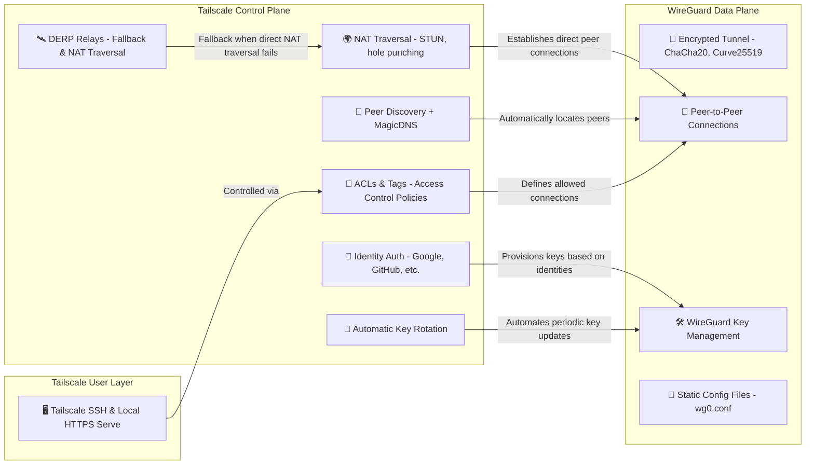

# Tailscale


## Table of Contents

- [What is Tailscale?](#what-is-tailscale)
- [What tailscale adds to WireGuard](#what-tailscale-adds-to-wireguard)
- [Install Tailscale](#install-tailscale)
- [Getting Started](#getting-started)


## What is Tailscale?


- a WireGuard®-based VPN that eliminates single points of failure.


## What tailscale adds to WireGuard

Here's a detailed breakdown of which benefits are **inherent to WireGuard** itself vs. what **Tailscale adds on top** of WireGuard.

🧱 Who Does What?

| Feature / Benefit                         | Provided by **WireGuard** | Added by **Tailscale** |
| ----------------------------------------- | :-----------------------: | :--------------------: |
| 🔐 End-to-end encryption (ChaCha20)       |             ✅             |   ➖ (uses WireGuard)   |
| 📦 Minimal, efficient protocol stack      |             ✅             |            ➖           |
| 💨 High-speed performance (low latency)   |             ✅             |            ➖           |
| 🧠 Automatic key exchange/rotation        |             ❌             |            ✅           |
| 🔁 NAT traversal (hole punching, STUN)    |             ❌             |            ✅           |
| 🌍 Peer discovery                         |             ❌             |            ✅           |
| 🌐 Private IP assignment (`100.x.x.x`)    |             ❌             |            ✅           |
| 🔗 Identity-based access (OAuth, SSO)     |             ❌             |            ✅           |
| 📜 ACLs (per-user, per-device policies)   |             ❌             |            ✅           |
| 🧭 MagicDNS (internal DNS + hostnames)    |             ❌             |            ✅           |
| 🚪 Firewall traversal (relays / DERP)     |             ❌             |            ✅           |
| ⚡ Instant tunnel setup                    |             ✅             |            ➖           |
| 🔑 Authentication with Google, GitHub...  |             ❌             |            ✅           |
| 🔐 Tailscale SSH (identity-based access)  |             ❌             |            ✅           |
| 🔌 Local HTTPS server (`tailscale serve`) |             ❌             |            ✅           |
| 🌉 Mesh networking (P2P by default)       |      ❌ (manual only)      |            ✅           |
| 🧪 Configuration management               |             ❌             |            ✅           |
| 💻 Cross-platform clients & GUI           |             ❌             |            ✅           |


### ✅ **What WireGuard provides** (by itself):

* Fast, modern **point-to-point encrypted tunnels**
* Minimal codebase (secure and efficient)
* Works at the **network layer (Layer 3)** with IP-level routing
* Requires manual:

  * Key generation & distribution
  * Peer configuration (static)
  * NAT traversal setup (if possible)

> Think of WireGuard like a powerful **engine**, but **you have to build the car yourself**.

### 🚀 **Explanation: What Tailscale adds on top of WireGuard**:

* **Control plane**: user/device identity, access control, automatic key management
* **Zero-config networking**: no firewall setup, port forwarding, or manual routing
* **Peer discovery and NAT traversal**: works behind most home/work routers
* **Mesh overlay network**: every node talks directly when possible
* **DNS and HTTPS tooling**: MagicDNS, `tailscale serve`, `tailscale funnel`
* **SSO authentication and access control lists (ACLs)** per user/group
* Optional relays (DERP) for unreachable nodes

> Tailscale makes WireGuard **turn-key**, scalable, and usable without being a networking expert.


Below there is a visual “Tailscale = WireGuard + Control Plane” diagram or an example config comparison (`wg0.conf` vs Tailscale auto-setup).





Here's a detailed breakdown of each component and their interactions based on the improved diagram:

---

#### 🛠 **1. WireGuard Data Plane**

This is the foundational layer, responsible purely for secure data transport between peers. It uses WireGuard, a fast and secure VPN protocol, for encrypted communication.

Components:

##### 🔐 **WG1: Encrypted Tunnel**

* **ChaCha20:** A high-performance encryption algorithm.
* **Curve25519:** A cryptographic algorithm for key exchange, ensuring secure connections.
* **Role:** Encrypts data traveling between peers, providing confidentiality and integrity.

##### 🔗 **WG2: Peer-to-Peer Connections**

* Manages connections directly between peers using their IP addresses and ports.
* WireGuard by default requires manual configuration (IP addresses and ports) but Tailscale automates this.

##### 🛠 **WG3: WireGuard Key Management**

* Handles cryptographic keys (public/private) that secure the tunnels.
* Keys authenticate and encrypt sessions.

##### 📄 **WG4: Static Config Files (wg0.conf)**

* Standard WireGuard setup requires manual configuration through a text file (`wg0.conf`) that specifies peers, keys, IP addresses, etc.
* **Note:** Tailscale automates this configuration dynamically.


#### 🛰 **2. Tailscale Control Plane**

Tailscale adds a sophisticated management layer on top of WireGuard to automate and secure network connections, significantly enhancing usability.

Components:

##### 🔑 **TS1: Identity Auth (Google, GitHub, etc.)**

* Allows users/devices to authenticate via trusted identity providers (e.g., Google, GitHub, Azure AD).
* Simplifies key management by associating cryptographic identities with user identities rather than manual key distribution.

**Interaction:**

* TS1 → WG3: Authenticated identities automatically provision and manage WireGuard keys.

##### 🔁 **TS2: Automatic Key Rotation**

* Automatically generates, distributes, and rotates WireGuard cryptographic keys periodically or after key changes (e.g., device re-authentication).
* Enhances security without manual intervention.

**Interaction:**

* TS2 → WG3: Controls WireGuard key lifecycle (creation, rotation, revocation).

##### 🌍 **TS3: NAT Traversal (STUN, hole punching)**

* Techniques (STUN, UDP hole punching) that enable devices behind NATs (firewalls/router) to directly establish peer-to-peer connections without manual port forwarding.

**Interaction:**

* TS3 → WG2: Automatically establishes peer connections through complex network scenarios, enabling direct peer-to-peer tunnels.

##### 🛰 **TS7: DERP Relays**

* Distributed servers operated by Tailscale for situations where direct P2P connections fail due to restrictive NAT/firewall settings.
* Ensures connectivity fallback by relaying traffic through cloud-hosted servers.

**Interaction:**

* TS7 → TS3: DERP assists NAT traversal when direct connections fail, ensuring reliable network connectivity.

##### 🧠 **TS4: Peer Discovery + MagicDNS**

* Dynamically maintains a registry of peer devices within a Tailscale network.
* MagicDNS provides automatic, user-friendly DNS resolution for device hostnames instead of static IP addresses.

**Interaction:**

* TS4 → WG2: Removes need for manual IP/port management, automating peer location discovery and connectivity.

##### 📜 **TS5: ACLs & Tags - Access Control Policies**

* Defines granular access policies, restricting connections based on users, groups, devices, or tags.
* Secures the network at the connectivity level.

**Interaction:**

* TS5 → WG2: Controls which peers are allowed to connect, significantly enhancing security by restricting unauthorized peer connections.


#### 🖥 **3. Tailscale User Layer**

This user-facing layer provides user-level applications built on top of the secure and automated Tailscale network.

Components:

##### 🖥 **TS6: Tailscale SSH & Local HTTPS Serve**

* Enables easy and secure access to SSH and internal HTTP(S) services within the Tailscale network without complex firewall or NAT configurations.
* Simplifies secure remote management and application access for users.

**Interaction:**

* TS6 → TS5: User-level services respect ACLs defined by administrators, ensuring secure and controlled access to internal resources.

---

## 🎯 **Summary of Interactions**

* **Identity Auth & Key Rotation (TS1, TS2)** automate cryptographic key management (**WG3**).
* **Peer Discovery & NAT Traversal (TS3, TS4)** automate connection establishment and discovery (**WG2**).
* **DERP (TS7)** provides a fallback for difficult network environments, complementing NAT traversal (**TS3**).
* **ACLs & Tags (TS5)** enforce connection-level security, managing access policies on connections (**WG2**).
* **User Applications (TS6)** leverage network security and accessibility defined by ACLs (**TS5**).

---

## 🗺 **Logical Layers**

The overall architecture can be understood in layers:

```
User Layer (TS6: SSH, HTTPS) 
       ↓
Control Plane (TS1-TS5, TS7: Auth, ACLs, Discovery, Relays, NAT Traversal)
       ↓
Data Plane (WG1-WG4: WireGuard Encrypted Tunnels, Key Management)
```

This clear separation simplifies administration, enhances usability, and ensures security.

---

## 🛡 **Benefits of this structure**

* **Automated security:** Key management, rotation, and identity-based authentication.
* **Reduced complexity:** No manual IP or firewall configurations needed.
* **Resilience:** Automatic fallback relays (DERP) ensure connectivity.
* **Controlled access:** Fine-grained access control policies (ACLs).
* **Enhanced usability:** Peer discovery, MagicDNS, and built-in user applications simplify daily use.

---

This breakdown provides a clear understanding of each component, their roles, and how they collectively build the secure, user-friendly network experience offered by Tailscale on top of WireGuard.


## Solutions

- [Tailscale Solutions](https://tailscale.com/kb/1355/solutions)


## Install Tailscale

### Nix

- [NixOS](https://maulana.id/soft-dev/2023--01--30--00--using-tailscale-with-nix/#for-now-the-installation-of-tailscale-on-nixos)

- [OSX](https://maulana.id/soft-dev/2023--01--30--00--using-tailscale-with-nix/#installation-of-tailscale-on-macos)


### OSX

#### with nix-darwin

Create a module (example `tailscale.nix`) and include it in your system configuration:

```nix
{ config, lib, pkgs, ... }:

with lib;

{
  # System-level packages
  environment.systemPackages = with pkgs; [
    tailscale # Tailscale CLI
  ];

  # Configure Tailscale service and tailscaled daemon
  services.tailscale = {
    enable = true;
  };
}
```


#### with homebrew 🖥️ 


🖥️  The Nix packages do not include the official Tailscale macOS GUI.

To install it manually:

```bash
brew install --cask tailscale
```


## Getting started

Sure! Here's an expanded **"Getting started"** section for using Tailscale after installation — especially useful if you're using it via **Nix-Darwin** or **Home Manager**:

---

## 🚀 Getting Started with Tailscale

Once you've installed Tailscale and the CLI is available (`tailscale` and `tailscaled`), follow these steps to get connected:

---

### ✅ Step 1: Authenticate & Connect to the Tailscale Network

```bash
tailscale up
```

This command:

* Starts the connection process.
* Opens a browser window to authenticate with your identity provider (e.g., Google, GitHub, Microsoft).
* Registers your machine with your Tailscale network.
* Brings up a WireGuard-based encrypted tunnel.

You’ll only need to do this once per device (unless you sign out or remove the machine).

---

### 📊 Step 2: Check Your Connection Status

```bash
tailscale status
```

This displays:

* Your current Tailscale IP (e.g., `100.x.x.x`)
* List of connected peers (other devices in your tailnet)
* Connection status and relay path (direct, DERP relay, etc.)
* Any subnet routes or exit nodes in use

Example output:

```bash
100.101.102.103   my-laptop     idle        -
100.201.202.203   home-server   active      direct
```

---

### 🧪 Bonus: Useful CLI Commands

| Command                 | Description                                              |
| ----------------------- | -------------------------------------------------------- |
| `tailscale ip`          | Print your current Tailscale IP address                  |
| `tailscale logout`      | Disconnect and remove device from your network           |
| `tailscale ping <peer>` | Test connectivity to another Tailscale device            |
| `tailscale version`     | Show version info of both CLI and daemon                 |
| `tailscale web`         | Open the admin dashboard in the browser                  |
| `tailscale serve`       | Start a local HTTPS server over Tailscale (beta feature) |


Absolutely — here's an expanded version of the **Advanced Networking Features** section, now including **practical examples** for **homelabs**, **small offices**, and **web apps**.

---

## 🌐 Advanced Networking Features — Practical Use Cases

These Tailscale features let you build powerful private networks ideal for **homelabs**, **small office setups**, and **secure web app access**.

---

### 🛫 Exit Nodes

**Exit Nodes** are useful when you're on untrusted networks and want to route *all your internet traffic* through a trusted machine, like your home server.

#### 🏠 Homelab Example

You're traveling with a laptop and want your connection to route through your Raspberry Pi at home:

On the **Raspberry Pi** at home:

```bash
sudo tailscale up --advertise-exit-node
```

On your **laptop**:

```bash
tailscale up --exit-node=raspberrypi
```

Now your laptop’s traffic exits through your home’s public IP, giving you access to home-only services (e.g., NAS) and protecting you on public Wi-Fi.

---

### 🛜 Subnet Routing

**Subnet routing** exposes an entire internal network (like `192.168.1.0/24`) to other Tailscale peers, so you can access LAN devices that don’t run Tailscale.

#### 🏢 Small Office Example

You want to access office printers and internal tools on `192.168.100.0/24`.

On a Linux box in the office:

```bash
sudo tailscale up --advertise-routes=192.168.100.0/24
```

From home or mobile devices, after approving the route via the [Admin Console](https://login.tailscale.com/admin/routes), you can now:

```bash
ssh user@192.168.100.25  # internal server
lpstat -p                # network printer
```

#### 🧑‍💻 Dev Environment Sharing

Let’s say your dev laptop runs local Docker containers on `172.18.0.0/16`. You can expose those to your teammates like so:

```bash
sudo tailscale up --advertise-routes=172.18.0.0/16
```

They can then test your local services even if you’re on NAT.

---

### 🧙‍♂️ MagicDNS

**MagicDNS** replaces numeric IPs and complex `.ts.net` hostnames with short, meaningful names.

#### 💻 Web App Access in Homelab

You host several internal services at home:

* Grafana on your Pi (`192.168.1.10:3000`)
* Jellyfin on your NAS (`192.168.1.20:8096`)

With subnet routing + MagicDNS enabled, from your laptop you can simply:

```bash
open http://raspberrypi:3000    # Grafana
open http://nas:8096           # Jellyfin
```

No VPN clients, no port forwarding, no IP memorization.

---

### 🌍 Web App Deployment for Remote Teams

Your startup runs a staging app on a VM, not exposed publicly.

On the VM:

```bash
sudo tailscale up
tailscale serve https / 'http://localhost:3000'
```

This starts a **zero-config HTTPS tunnel** via Tailscale, accessible at:

```
https://<vm-hostname>.ts.net
```

Team members can visit that URL directly, with TLS enabled, and access the staging app securely — no nginx, no DNS config, no certificates.

---

## 🔐 Bonus: Combine ACLs for Fine-Grained Access

Use [Tailscale ACLs](https://tailscale.com/kb/1018/acls/) to define:

* Who can access production vs. staging servers
* Which exit nodes are available
* Which devices can reach subnet routers

Example rule:

```json
{
  "Action": "accept",
  "Users": ["devs@example.com"],
  "Ports": ["staging-server:22", "staging-server:443"]
}
```

---

Would you like me to provide a **Home Manager or Nix-Darwin config example** that enables any of these features?


